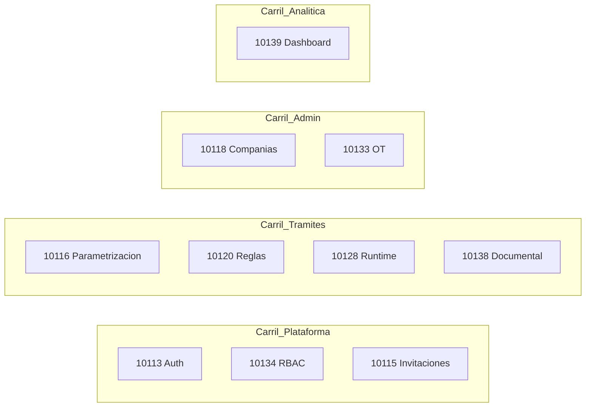

# Artefacto de estrategia de trabajo paralelo — Fase 1

## Contexto verificado en ADO

Estado actual de los 10 Features (todos `New`, tag `DOR`, proyecto **FLIT - EVOLUTION**):

| ID | Título (abrev.) | Responsable ADO |
|---|---|---|
| [#10113](https://dev.azure.com/FlitDevOps/_workitems/edit/10113) | Autenticación y credenciales | David Chica |
| [#10115](https://dev.azure.com/FlitDevOps/_workitems/edit/10115) | Invitaciones y onboarding | David Chica |
| [#10134](https://dev.azure.com/FlitDevOps/_workitems/edit/10134) | RBAC permisos y roles | David Chica |
| [#10116](https://dev.azure.com/FlitDevOps/_workitems/edit/10116) | Motor dinámico de trámites | Samuel Cardenas |
| [#10120](https://dev.azure.com/FlitDevOps/_workitems/edit/10120) | Motor de reglas de negocio | Samuel Cardenas |
| [#10128](https://dev.azure.com/FlitDevOps/_workitems/edit/10128) | Motor trámites parametrizables | Samuel Cardenas |
| [#10118](https://dev.azure.com/FlitDevOps/_workitems/edit/10118) | Admin compañías multi-tenant | Abraham Cañon |
| [#10138](https://dev.azure.com/FlitDevOps/_workitems/edit/10138) | Admin documental por trámite | Abraham Cañon |
| [#10133](https://dev.azure.com/FlitDevOps/_workitems/edit/10133) | Admin OT e inteligencia documental | **Juan Felipe Montoya** (cambió desde Héctor Rivera) |
| [#10139](https://dev.azure.com/FlitDevOps/_workitems/edit/10139) | Dashboard analítico | Juan Felipe Montoya |

**Cambio relevante:** Juan Felipe concentra dos Features (#10133 y #10139). El artefacto incluirá secuencia interna recomendada para ese carril sin bloquear a los demás.

---

## Ubicación acordada

Todo el artefacto vive bajo el repositorio de aplicación, en [`flit/.cursor/`](flit/.cursor/) — junto a agents, skills, workflows y rules ya existentes en ese árbol.

## Archivos a crear

### 1. Índice de documentación — [`flit/.cursor/docs/README.md`](flit/.cursor/docs/README.md)

Breve índice que liste los artefactos de planificación/ejecución del equipo. Primera entrada: estrategia de trabajo paralelo fase-1.

### 2. Documento principal — [`flit/.cursor/docs/planificacion/estrategia-trabajo-paralelo-fase-1.md`](flit/.cursor/docs/planificacion/estrategia-trabajo-paralelo-fase-1.md)

Documento canónico (~250–350 líneas) estructurado en secciones fijas. El foco es el **protocolo de trabajo** aplicable a cualquier Feature del lote; dependencias y responsables aparecen como **anexos de referencia**, no como prerequisito para entender el método.

#### Secciones del documento

**A. Metadatos y alcance**
- Versión, fecha, proyecto ADO, lista de IDs cubiertos
- Objetivo: maximizar paralelismo en monorepo [`flit/`](flit/) sin colisiones en git, BD ni contratos

**B. Principios de trabajo paralelo (independientes de quién implementa)**
- Contract-first: cambios en [`flit/contracts/openapi/core-api.v1.yaml`](flit/contracts/openapi/core-api.v1.yaml) antes de consumo cross-módulo
- Aislamiento por schema PostgreSQL: `security`, `tramites`, `admin`, `analytics`
- Ramas por Feature: `feature/AB-{id}-descripcion` → target `develop`
- PRs ≤ 800 líneas; una HU activa por persona cuando sea posible
- Mocks/OpenAPI stubs para desacoplar frontend de backend incompleto
- Coordinador rotativo de migraciones EF Core por sprint (evita conflictos en `Flit.Infrastructure/Migrations/`)

**C. Carriles funcionales (4 lanes)**

Tabla de ownership técnico por carril (namespaces backend, rutas frontend, schemas BD) alineada con Clean Architecture en [`flit/services/core-api/`](flit/services/core-api/).

**D. Olas de ejecución**

| Ola | Duración orientativa | Entregables transversales | Qué puede arrancar en paralelo |
|---|---|---|---|
| **Ola 0** | 3–5 días | ADR JWT+tenant, ADR parametrización trámites, ADR separación reglas (#10120 vs #10133), convención schemas | Ninguna HU de integración cross-carril |
| **Ola 1** | Sprint 1 | Contratos OpenAPI stubs mergeados en `develop` | 5 carriles simultáneos con mocks |
| **Ola 2** | Sprint 2+ | Integración real entre carriles | HUs que consumen contratos ya en `develop` |

**E. Protocolo por Feature (plantilla repetible)**

Para cada uno de los 10 Features, una subsección homogénea con:
- ID ADO + enlace
- Carril asignado
- Fase Ola 1 vs Ola 2
- Áreas de código permitidas / prohibidas (evitar pisar otros carriles)
- Criterio de “listo para integrar” (contrato OpenAPI versionado, tests unitarios, sin placeholders)
- Checklist pre-activación HU (DoR, tag `DOR`, SP Fibonacci, sprint **siguiente** al activo)

**F. Anexo — Registro de responsables ADO** (snapshot con fecha de consulta)

Tabla con assignees actuales. Nota explícita: **#10133 → Juan Felipe Montoya** (rev 4). Secuencia interna sugerida para Juan: #10139 (read-only, mocks) en paralelo con #10133 fase 1 (QX/webhooks/DnD); #10133 fase 2 (reglas OT) después de ADR con Samuel.

**G. Anexo — Matriz de dependencias** (referencia, no bloqueante para el protocolo)

| Feature | Depende de (mínimo) | Puede avanzar en Ola 1 con mocks |
|---|---|---|
| 10113, 10134 | Ola 0 JWT | Sí (carril plataforma) |
| 10115 | 10113 + 10134 en develop | Parcial (UI + contratos) |
| 10116 | Ola 0 parametrización | Sí |
| 10120, 10128 | 10116 API congelada | Parcial |
| 10138 | 10116 (RF05-08) | Parcial (catálogo RF01-04) |
| 10118 | JWT SuperAdmin | Sí |
| 10133 | JWT; reglas OT tras ADR | Sí (fase 1) |
| 10139 | API read trámites | Sí (100% con seed) |

**H. Anexo — Puntos de conflicto y ADRs pendientes**
- Solapamiento reglas: #10120 (trámite) vs #10133 RF06 (operativo OT)
- Solapamiento documental: #10138 vs #10133 RF09-10
- Solapamiento conceptual: #10116 vs #10128 (Samuel: secuencia interna #10116 → #10128/#10120)

**I. Ritual de sincronización semanal (15 min)**
- Cambios OpenAPI → comentario en Discussion del Feature afectado
- Rotación coordinador migraciones
- Demo por carril sin integración completa

**J. Referencias FLIT** (rutas relativas al repo `flit/`)
- [`flit/.cursor/rules/00-flit-conventions.mdc`](flit/.cursor/rules/00-flit-conventions.mdc)
- [`flit/.cursor/workflows/implement-story.md`](flit/.cursor/workflows/implement-story.md)
- [`flit/.cursor/skills/db-schema-validator/checklist-validacion-schema.md`](flit/.cursor/skills/db-schema-validator/checklist-validacion-schema.md)
- [`flit/.cursor/skills/flit-adr-generator/references/plantilla-adr-flit.md`](flit/.cursor/skills/flit-adr-generator/references/plantilla-adr-flit.md)

---

## Integración mínima con el ecosistema Cursor

Sin crear reglas nuevas (fuera de alcance). Solo:

- Entrada en [`flit/.cursor/docs/README.md`](flit/.cursor/docs/README.md)
- Una línea en [`flit/.cursor/workflows/README.md`](flit/.cursor/workflows/README.md) bajo una fila “Documentación de planificación” apuntando al artefacto, para que orquestador y tech-lead lo descubran al iniciar flujos multi-feature

No se duplica en `.cursor/` de la raíz del workspace (`flit2.0/.cursor/`).

---

## Lo que NO se hará en esta tarea

- No se publicará en Wiki ADO (publicación wiki queda como paso manual opcional posterior vía `@planification-wiki`)
- No se descomponen Features en HUs (tarea separada, modo B tech-lead)
- No se crean los ADRs de Ola 0 (solo se referencian como pendientes)
- No se modifican work items en ADO

---

## Validación post-creación

- Verificar que los 10 IDs y assignees coinciden con ADO (especialmente #10133)
- Verificar enlaces internos a rutas existentes en `flit/` y `flit/.cursor/`
- Confirmar que el documento es autocontenido: un desarrollador nuevo puede seguir el protocolo sin leer el chat previo
