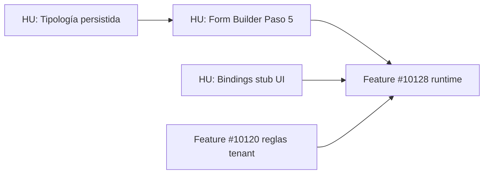

# Feature #10116 — Deuda UI / backlog post-MVP

> **Estado:** Pendiente de implementación futura  
> **Origen:** Cierre MVP #10116 (4 HUs commiteadas en `feature/scardenas-tramites`)  
> **Registrado:** 2026-06-18 — solicitud Samuel Cardenas (orquestador)  
> **Relacionado:** [#10116](https://dev.azure.com/FlitDevOps/FLIT%20-%20EVOLUTION/_workitems/edit/10116), [#10128](https://dev.azure.com/FlitDevOps/FLIT%20-%20EVOLUTION/_workitems/edit/10128) runtime, [#10120](https://dev.azure.com/FlitDevOps/FLIT%20-%20EVOLUTION/_workitems/edit/10120) reglas tenant

---

## Contexto

El MVP #10116 entregó el **catálogo global de parametrización** (DDL, API SuperAdmin, wizard 8 pasos, contrato OpenAPI). Varios pasos del wizard son **estructura visual** o **MVP mínimo**, no el producto completo que el mockup sugería.

**Lo que SÍ quedó operativo:**

- Identidad, aristas, pasos operario, apply plantilla RUNT vehículo, validar, guardar draft, publicar desde listado
- Validador: `VIN_PLATE_RULE`, `NIT_PERSON_TYPE`, `INCOMPLETE_CONSULTATION_FIELDS`
- Lectura runtime: `GET /api/v1/procedure-types/{code}/configuration`

**Lo que el usuario esperaba y aún NO está en UI:**

- Editor completo de campos (Form Builder SuperAdmin)
- Bindings campo → fuente externa
- Tipología persistida
- Tab Operación conectada (eso es #10128, no #10116)

---

## 1. Paso 5 — Campos (prioridad alta)

### Implementado hoy

| Capacidad | UI | API |
|-----------|----|-----|
| Ver árbol paso → sección → campo | Solo lectura | `GET .../steps` |
| Aplicar plantilla RUNT vehículo | Botón único si arista VEHICLE | `POST .../consultation-templates/{id}/apply-fields` |
| Campos locked sembrados | Badge LOCKED en lista | `form_fields.is_locked` + `consultation_template_id` |
| Continuar paso | Recarga steps, no guarda campos nuevos | — |

**Archivos clave:**

- `frontend/components/superadmin/wizard/Step5Campos.tsx`
- `frontend/hooks/useParametrizationWizard.ts` → `applyVehicleTemplate`, `saveCamposAndProceed`
- `services/core-api/.../ApplyConsultationTemplateFieldsCommand.cs`
- `services/core-api/.../ProcedureTypeValidator.cs`

### Pendiente (Form Builder SuperAdmin)

1. **CRUD de campos custom (no locked)**
   - Agregar campo: `fieldKey`, `label`, `fieldType` (text, select, date, …), `isRequired`, `options`, `validationSchema`
   - Editar campo existente (solo si `!isLocked`)
   - Eliminar campo (solo si `!isLocked`; locked → mensaje de `lockReason`)
   - Reordenar campos dentro de sección (`sortOrder`)

2. **Múltiples plantillas de consulta en UI**
   - Catálogo ya tiene seeds: `RUNT_VEHICLE`, `RUNT_ACTOR_NATURAL`, RUES jurídica, etc. (`04-HU10151-seeds-minimos.sql`)
   - Hoy solo hay botón RUNT vehículo; falta UI para elegir sección destino + aplicar cualquier plantilla activa
   - Endpoint ya existe: `GET /consultation-templates`, `POST .../apply-fields`

3. **Persistencia desde Paso 5**
   - `saveCamposAndProceed` debe guardar cambios (hoy solo `refreshSteps`)
   - Opción A: `PUT .../steps` con árbol completo incluyendo `formFields` (backend ya lo soporta en upsert)
   - Opción B: endpoints dedicados CRUD por campo (no existen hoy — evaluar si hace falta)

4. **Secciones editables**
   - Crear/renombrar secciones por paso (hoy se auto-crean en Paso 4: `vehicle_data` o `Datos generales`)
   - Mapper: `frontend/lib/api/procedure-parametrization-mappers.ts` → `defaultSectionsForStep`

5. **UX alineada al mockup**
   - Editor inline por paso/sección (no solo lista + un botón)
   - Indicador visual de campos exigidos por consulta vs custom
   - Feedback al aplicar plantilla (campos añadidos, duplicados ignorados)

### Backend ya listo (reutilizar)

- `PUT /api/v1/superadmin/procedure-types/{id}/steps` — payload con `sections[].formFields[]`
- `POST /api/v1/superadmin/consultation-templates/{id}/apply-fields` — `{ procedureTypeId, sectionId }`
- Validador rechaza publicación si faltan campos mínimos de plantillas en uso

### Criterios de aceptación sugeridos (futura HU)

```gherkin
Scenario: SuperAdmin agrega campo custom editable
  Dado un procedure_type en draft con sección existente
  Cuando agrego un campo text no locked en Paso 5
  Y guardo
  Entonces el campo persiste en form_fields
  Y validate no reporta error por ese campo

Scenario: SuperAdmin no puede eliminar campo locked
  Dado un campo plate_or_vin con is_locked true
  Cuando intento eliminarlo en UI
  Entonces la acción está deshabilitada o muestra lockReason

Scenario: Aplicar plantilla RUNT actor natural
  Dado arista OWNER activa y sección de actor
  Cuando aplico plantilla RUNT_ACTOR_NATURAL
  Entonces se siembran campos required_field_keys de la plantilla
```

---

## 2. Paso 2 — Tipología (prioridad media)

### Implementado hoy

- UI: descripción, versión `1.0`, checkbox activo
- **No persiste** — Continuar solo avanza de paso

### Pendiente

- Mapear a campos reales de `procedure_types` (`description` si existe en DDL, `external_refs`, flags) o eliminar paso si no hay modelo
- Archivo: `frontend/components/superadmin/wizard/Step2Tipologia.tsx`

---

## 3. Paso 6 — Bindings API (prioridad media — ligado a #10128)

### Implementado hoy

- Placeholder “Próximamente — Feature #10128”
- Tabla DDL `field_api_bindings` existe; sin UI ni API SuperAdmin en MVP

### Pendiente

- UI mapeo campo formulario → parámetro request de `external_data_sources` / plantilla
- Documentar en OpenAPI cuando exista
- **Sin ejecutar HTTP externo** en parametrización; ejecución en runtime #10128
- Archivo: `frontend/components/superadmin/wizard/Step6Bindings.tsx`

---

## 4. Wizard — otras mejoras

| Item | Estado MVP | Pendiente |
|------|------------|-----------|
| Editar borrador existente | Parcial (`editingId` prop; hook no carga identidad/aristas/steps al abrir) | Cargar estado completo al editar |
| Paso 7 sin validación OK | Permite continuar | Opcional: bloquear Continuar si `!isValid` |
| Publicar dentro del wizard | No — solo barra listado | Decisión producto: ¿mover a Paso 8? |
| Tab Operación en Tramites.tsx | Mock estático | Feature #10128 |

---

## 5. Barra superior Parametrización (mock vs wired)

| Control mock | Estado |
|--------------|--------|
| Nuevo flujo | ✅ Wired |
| Publicar versión | ✅ Wired (requiere fila draft seleccionada) |
| Nueva regla | ❌ Decoración / Próximamente (#10120) |
| Select OT | ❌ Decoración |
| Cards reglas / documental / config OT | ❌ Badge “Próximamente” |

---

## 6. Orden sugerido de implementación futura



1. **Form Builder Paso 5** — desbloquea parametrizaciones reales sin depender solo de RUNT vehículo  
2. **Editar borrador** — completar flujo SuperAdmin  
3. **Bindings UI** (sin HTTP) — prepara #10128  
4. **#10128** — consumir `configuration` + ejecutar trámites y consultas  
5. **#10120** — reglas If/Else tenant + botón “Nueva regla”

---

## 7. Referencias

| Documento | Uso |
|-----------|-----|
| `feature_10116_diseno_tecnico.md` §3.1 wizard completo | Diseño objetivo |
| `feature_10116_hus_propuesta.md` HU-3 AC | Lo que certificó auditoría MVP |
| `feature_10116_motor_tramites.plan.md` | Alcance MVP acordado |
| `ADR-0019` | Catálogos globales SuperAdmin |
| `contracts/openapi/core-api.v1.yaml` | Contrato paths/schemas |

---

## Nota para orquestador / agentes

Al planificar la **siguiente HU** tras merge de #10116, leer este archivo antes de asumir que Paso 5 es un editor completo. El MVP certificó **plantilla + validación + publicación**, no Form Builder.
