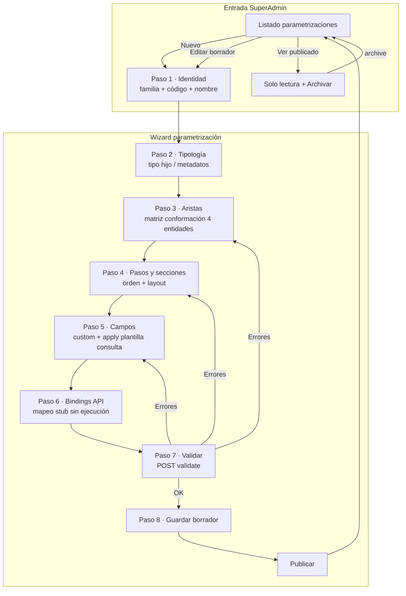
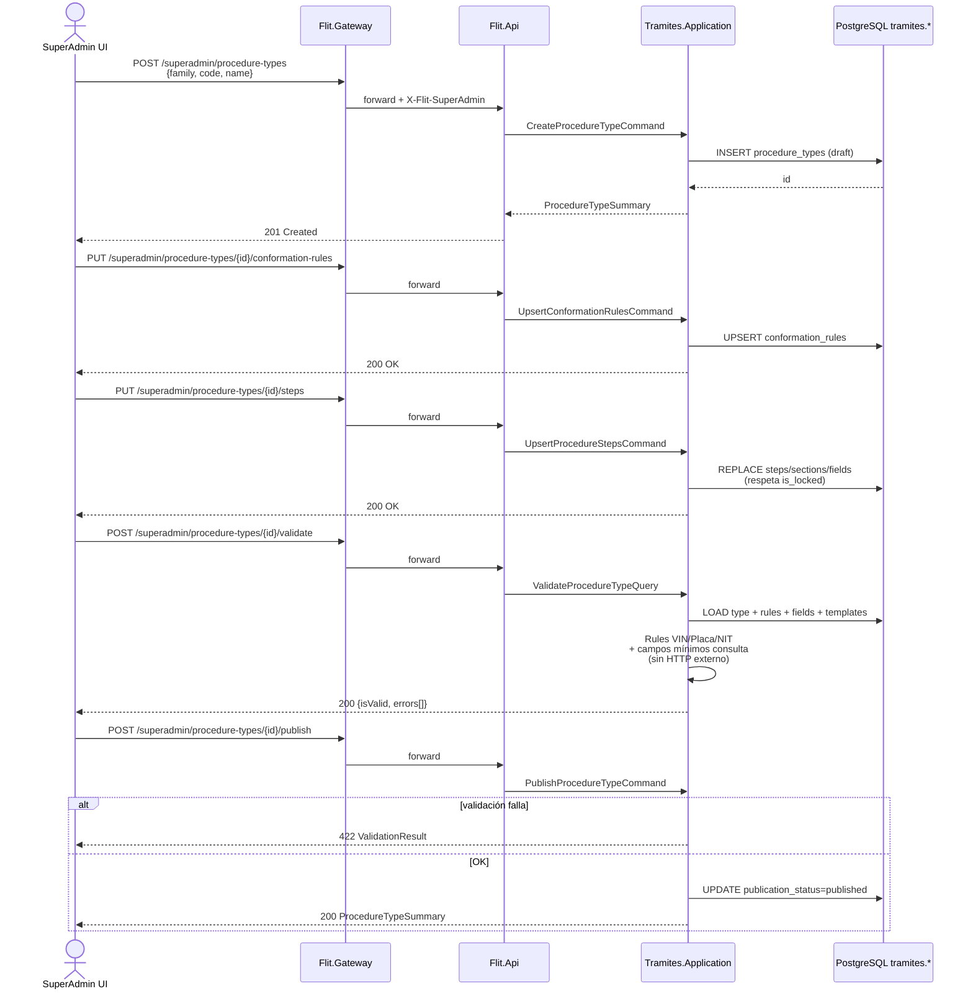
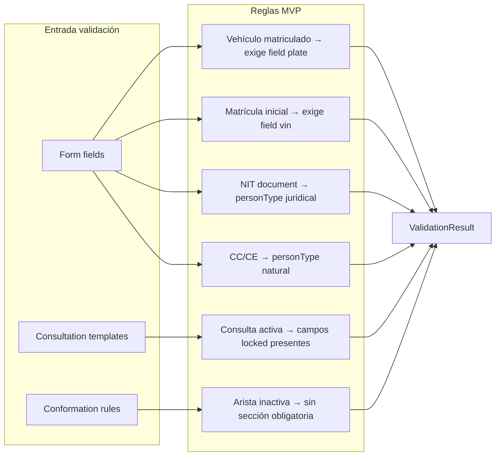

# Diseño técnico — Feature #10116 Motor Dinámico de Parametrización

> **Estado:** Propuesto — pendiente revisión Líder Técnico  
> **Fecha:** 2026-06-18  
> **Autor:** architecture-agent  
> **ADO:** [#10116](https://dev.azure.com/FlitDevOps/FLIT%20-%20EVOLUTION/_workitems/edit/10116)  
> **Plan orquestado:** [feature_10116_motor_tramites.plan.md](./feature_10116_motor_tramites.plan.md)  
> **ADR referencia:** [ADR-0018](../../services/core-api/docs/adr/ADR-0018-modelo-datos-fase1-evolution.md)  
> **ADR nuevo (Propuesto):** [ADR-0019](../../services/core-api/docs/adr/ADR-0019-motor-parametrizacion-global-superadmin.md)

---

## Contexto

Feature **#10116** implementa el **catálogo global de parametrización** del motor de trámites FLIT 2.0: tipologías (14 tipos en 3 familias), matriz de conformación (4 aristas), wizard de pasos/secciones/campos, bindings a fuentes externas y validador de campos mínimos por consulta. Solo **SuperAdmin FLIT** puede editar; la parametrización publicada aplica a **todos los tenants**.

**Estado repo hoy:**

| Área | Estado |
|------|--------|
| DDL base | `04-HU10151-tramites-parametrizacion.sql` aplicable vía migración EF |
| Entidades EF | Ninguna del módulo `tramites` |
| API | `Flit.Api` sin controladores |
| OpenAPI | `contracts/` no existe (CI referencia paths futuros) |
| Frontend | `Tramites.tsx` con vista Parametrización **mock** |
| Auth | JWT bypass; stub SuperAdmin acordado hasta #10134 |

**Decisiones acordadas (no reabrir):**

- MVP **sin** ejecutar APIs externas reales (#10128).
- Stub SuperAdmin en API + frontend hasta RBAC #10134.
- Seed mínimo: 3 familias + 2–3 tipos ejemplo + 4 aristas + catálogo consultas.
- **Revisar migración HU10151** antes de implementar (no asumir DDL congelado).

**Fuera de scope MVP:** motor If/Else (#10120), runtime instancias (#10128), documentos adjuntos (#10138), RBAC real (#10134).

---

## 1. Gaps DDL — alternativas evaluadas

El DDL actual (`procedure_types`, `procedure_entities`, `conformation_rules`, `procedure_steps`, `procedure_sections`, `form_fields`, `external_data_sources`, `field_api_bindings`) cubre ~80 % del PRD. Faltan tres capacidades transversales:

| Gap | Necesidad de negocio |
|-----|---------------------|
| **G1 — Campos mínimos por consulta** | Antes de “ejecutar” RUNT/RNMC/SIMIT, validar que los campos de entrada requeridos existen y están completos (PRD §3 + criterios ADO “Validador de peticiones”). |
| **G2 — Ciclo de vida parametrización** | Borrador → Publicado → Archivado; solo `published` consumible por #10128; edición bloqueada en publicado. |
| **G3 — Campos bloqueados (locked)** | Campos sembrados por plantilla de consulta no eliminables por SuperAdmin; visibles como obligatorios del sistema. |

Además, el DDL actual incumple parcialmente el checklist FLIT (A5–A6, A16): faltan `row_version`, soft delete y triggers en tablas de parametrización. Se corrigen en la revisión HU10151 documentada como **excepción catálogo global** (sin `tenant_id`, checklist A20).

---

### Opción 1 — Modelo relacional explícito (recomendada)

**Descripción:** Tres artefactos nuevos/alterados en schema `tramites`:

1. Tabla catálogo `consultation_templates` (plantillas de consulta por fuente + contexto).
2. Columnas de publicación en `procedure_types`.
3. Flags de bloqueo en `form_fields` con FK opcional a plantilla.

**DDL de referencia (borrador):**

```sql
-- G2: ciclo de vida en tipos de trámite
ALTER TABLE tramites.procedure_types
  ADD COLUMN publication_status varchar(20) NOT NULL DEFAULT 'draft',
  ADD COLUMN published_at timestamptz,
  ADD COLUMN published_by uuid,
  ADD COLUMN row_version bigint NOT NULL DEFAULT 0;
ALTER TABLE tramites.procedure_types
  ADD CONSTRAINT ck_procedure_types_publication_status
  CHECK (publication_status IN ('draft', 'published', 'archived'));

-- G1: plantillas de consulta (catálogo global A20)
CREATE TABLE tramites.consultation_templates (
    id uuid NOT NULL DEFAULT uuidv7(),
    CONSTRAINT pk_consultation_templates PRIMARY KEY (id),
    external_data_source_id uuid NOT NULL
      REFERENCES tramites.external_data_sources(id) ON DELETE RESTRICT ON UPDATE CASCADE,
    code varchar(50) NOT NULL,
    name varchar(150) NOT NULL,
    entity_scope varchar(30) NOT NULL,          -- vehicle | actor
    person_type varchar(20),                    -- natural | juridical | null (vehículo)
    required_field_keys jsonb NOT NULL DEFAULT '[]',
    request_schema jsonb NOT NULL DEFAULT '{}',
    is_active boolean NOT NULL DEFAULT true,
    external_refs jsonb NOT NULL DEFAULT '{}',
    created_at timestamptz NOT NULL DEFAULT now(),
    created_by uuid,
    updated_at timestamptz,
    updated_by uuid,
    CONSTRAINT uq_consultation_templates_code UNIQUE (code),
    CONSTRAINT ck_consultation_templates_entity_scope
      CHECK (entity_scope IN ('vehicle', 'actor')),
    CONSTRAINT ck_consultation_templates_person_type
      CHECK (person_type IS NULL OR person_type IN ('natural', 'juridical'))
);
CREATE INDEX ix_consultation_templates_external_data_source_id
  ON tramites.consultation_templates(external_data_source_id);

-- G3: campos bloqueados / sembrados por plantilla
ALTER TABLE tramites.form_fields
  ADD COLUMN is_locked boolean NOT NULL DEFAULT false,
  ADD COLUMN lock_reason varchar(200),
  ADD COLUMN consultation_template_id uuid
    REFERENCES tramites.consultation_templates(id) ON DELETE SET NULL ON UPDATE CASCADE;
CREATE INDEX ix_form_fields_consultation_template_id
  ON tramites.form_fields(consultation_template_id);
```

**Pros:**

- Integridad referencial clara; seeds y validaciones queryables en SQL y EF.
- `consultation_templates` reutilizable en #10128 sin duplicar reglas en código.
- `is_locked` + FK permite trazabilidad UI (“campo exigido por consulta RUNT Persona Natural”).
- Alineado con checklist A20 (catálogo global sin `tenant_id`).

**Contras:**

- Requiere migración de revisión + seeds coordinados.
- Más tablas que mantener en EF (8 tablas del bounded context parametrización).
- Publicación exige reglas de negocio en API (no solo CHECK constraints).

**Esfuerzo:** M  
**Riesgos:** Migración compartida con FKs de #10149/#10150 — validar orden y rollback.

---

### Opción 2 — JSONB embebido en tablas existentes

**Descripción:** Sin tabla `consultation_templates`. Requisitos mínimos en `external_data_sources.external_refs` o `request_mapping` de `field_api_bindings`. Estado `draft/published` en `procedure_types.external_refs`. Bloqueo vía `form_fields.validation_schema->>'locked'`.

**Pros:**

- Cambio mínimo al DDL actual; entrega más rápida de HU-1.
- Menos entidades EF.

**Contras:**

- Sin FK ni índices semánticos; difícil validar en SQL y auditar.
- Mezcla metadatos de catálogo con configuración por trámite (drift).
- Viola espíritu del checklist (reglas de negocio opacas en JSONB).
- Frontend y #10128 deben parsear convenciones ad hoc.

**Esfuerzo:** S  
**Riesgos:** Deuda técnica alta; refactor obligatorio antes de #10128.

---

### Opción 3 — Validación 100 % en capa aplicación (sin DDL de plantillas)

**Descripción:** DDL solo agrega `publication_status` e `is_locked`. Las reglas de campos mínimos viven en código C# (`ConsultationMinimumFieldsRegistry`) o archivo YAML versionado en repo, no en BD.

**Pros:**

- DDL más pequeño; reglas versionadas en Git con code review.
- Tests unitarios directos sobre el registry.

**Contras:**

- Contradice PRD: “parametrización administrable sin cambio de código”.
- SuperAdmin no puede ajustar campos mínimos sin redeploy.
- Desalineación con visión Producto para agentes IA / QA.

**Esfuerzo:** M  
**Riesgos:** Rechazo funcional; re-trabajo al integrar #10128.

---

### Decisión DDL

**Elegir Opción 1 — Modelo relacional explícito**, con revisión incremental de HU10151 vía **nueva migración** `HU10151_RevisionParametrizacion` (no editar migración ya aplicada en ambientes compartidos).

**Correcciones adicionales obligatorias en la misma revisión:**

| Tabla | Corrección |
|-------|------------|
| `procedure_types` | `publication_status`, `published_at/by`, `row_version`; soft delete opcional documentado (catálogo global: solo `archived`, no `deleted_at`) |
| `procedure_steps`, `procedure_sections`, `form_fields` | `row_version` donde aplique edición concurrente |
| Todas las tablas parametrización | Triggers A16 vía `11-schema-conformance-patch` o extensión del parche |
| `external_data_sources` | Seed MVP: SIMIT, RUNT, RNMC, RESOLUCIONES, RUES, FASECOLDA (`base_url` stub, sin secretos) |
| `procedure_entities` | Seed 4 aristas: `VEHICLE`, `OWNER`, `BUYER`, `LESSEE` |

**Seed mínimo acordado:**

| Familia | Tipos ejemplo | Aristas activas (ejemplo) |
|---------|---------------|---------------------------|
| MATRICULAS | Matrícula Estándar, Matrícula Leasing | Estándar: V+O; Leasing: V+O+L |
| TRASPASO | Traspaso Estándar | V+O+C |
| OTROS | Cambio de Color | V+O |

**Plantillas de consulta seed (ejemplo):**

| code | Fuente | entity_scope | person_type | required_field_keys |
|------|--------|--------------|-------------|---------------------|
| `RUNT_VEHICLE` | RUNT | vehicle | — | `["plate_or_vin"]` |
| `RUNT_ACTOR_NATURAL` | RUNT | actor | natural | `["document_type", "document_number"]` |
| `RUES_ACTOR_JURIDICAL` | RUES | actor | juridical | `["nit"]` |
| `SIMIT_ACTOR` | SIMIT | actor | — | `["document_type", "document_number"]` |

---

## 2. Contrato API — OpenAPI borrador `/api/v1/superadmin/*`

Archivo canónico: `contracts/openapi/core-api.v1.yaml` (nuevo). Prefijo vía gateway: `https://api.orca.flitsas.com/api/v1/superadmin/...`

**Autenticación MVP:** Policy `SuperAdminStub` — header `X-Flit-SuperAdmin: true` aceptado mientras JWT/RBAC (#10134) esté en bypass. Documentar deuda en ADR-0019.

**Tags OpenAPI:** `SuperAdmin — Procedure Types`, `SuperAdmin — Catalogs`, `SuperAdmin — Validation`

### Recursos principales

| Método | Ruta | Descripción |
|--------|------|-------------|
| GET | `/procedure-types` | Listar parametrizaciones (filtros: `family`, `publicationStatus`, `isActive`) |
| POST | `/procedure-types` | Crear borrador (familia + código + nombre) |
| GET | `/procedure-types/{id}` | Detalle agregado (conformation + steps tree) |
| PUT | `/procedure-types/{id}` | Actualizar metadatos (solo `draft`) |
| DELETE | `/procedure-types/{id}` | Archivar lógico / eliminar borrador sin instancias |
| POST | `/procedure-types/{id}/publish` | Transición `draft → published` tras validación |
| POST | `/procedure-types/{id}/archive` | Transición `published → archived` |
| GET | `/procedure-types/{id}/conformation-rules` | Matriz aristas del tipo |
| PUT | `/procedure-types/{id}/conformation-rules` | Reemplazar matriz (bulk upsert) |
| GET | `/procedure-types/{id}/steps` | Árbol pasos → secciones → campos |
| PUT | `/procedure-types/{id}/steps` | Reemplazar árbol wizard (bulk) |
| POST | `/procedure-types/{id}/validate` | Validar reglas negocio + campos mínimos (sin HTTP externo) |
| GET | `/procedure-entities` | Catálogo 4 aristas |
| GET | `/external-data-sources` | Catálogo fuentes externas |
| GET | `/consultation-templates` | Plantillas campos mínimos |
| POST | `/consultation-templates/{id}/apply-fields` | Sembrar campos locked en sección destino |

### Esquemas clave (resumen)

```yaml
ProcedureTypeSummary:
  type: object
  required: [id, code, name, family, publicationStatus, isActive]
  properties:
    id: { type: string, format: uuid }
    code: { type: string, maxLength: 50 }
    name: { type: string, maxLength: 150 }
    family: { type: string, enum: [MATRICULAS, TRASPASO, OTROS] }
    publicationStatus: { type: string, enum: [draft, published, archived] }
    isActive: { type: boolean }
    publishedAt: { type: string, format: date-time, nullable: true }

ConformationRuleItem:
  type: object
  required: [procedureEntityCode, isActive, sortOrder]
  properties:
    procedureEntityCode: { type: string, enum: [VEHICLE, OWNER, BUYER, LESSEE] }
    isActive: { type: boolean }
    sortOrder: { type: integer }
    validationProfile: { type: object, additionalProperties: true }

FormFieldItem:
  type: object
  required: [fieldKey, label, fieldType, isRequired, sortOrder]
  properties:
    fieldKey: { type: string }
    label: { type: string }
    fieldType: { type: string, enum: [text, number, select, radio, checkbox, date] }
    isRequired: { type: boolean }
    isLocked: { type: boolean, readOnly: true }
    lockReason: { type: string, nullable: true }
    consultationTemplateId: { type: string, format: uuid, nullable: true }
    validationSchema: { type: object }
    options: { type: array, items: { type: object } }

ValidationResult:
  type: object
  required: [isValid, errors]
  properties:
    isValid: { type: boolean }
    errors:
      type: array
      items:
        type: object
        required: [code, message, path]
        properties:
          code: { type: string, enum: [MISSING_CONFORMATION, MISSING_REQUIRED_FIELD, LOCKED_FIELD_REMOVED, VIN_PLATE_RULE, NIT_PERSON_TYPE, INCOMPLETE_CONSULTATION_FIELDS] }
          message: { type: string }
          path: { type: string }

PublishProcedureTypeRequest:
  type: object
  properties:
    force: { type: boolean, default: false, description: "Reservado; MVP siempre valida antes de publicar" }
```

### Respuestas de error estándar

```yaml
ProblemDetails:
  type: object
  properties:
    type: { type: string }
    title: { type: string }
    status: { type: integer }
    detail: { type: string }
    traceId: { type: string }
```

Códigos HTTP: `400` validación, `403` no SuperAdmin, `404` no encontrado, `409` conflicto publicación / concurrencia `row_version`, `422` reglas de negocio.

### Endpoint de lectura para #10128 (contrato forward-compatible)

| Método | Ruta | Notas |
|--------|------|-------|
| GET | `/api/v1/procedure-types/{code}/configuration` | Solo `published`; **fuera de `/superadmin`**; implementación mínima en HU-2 o HU-4 |

---

## 3. Diagramas Mermaid

### 3.1 Wizard SuperAdmin (flujo UI)



### 3.2 Secuencia CRUD — crear y publicar parametrización



### 3.3 Validaciones de negocio (capa aplicación)



---

## 4. Arquitectura de solución

### Bounded context

`Tramites.Parametrizacion` — catálogo **global** (sin `tenant_id`). Runtime (#10128) y reglas tenant (#10120) consumen `procedure_types` por FK/reference.

### Capas Clean Architecture (nuevo)

```
services/core-api/src/
├── Flit.Tramites.Domain/           # Entidades + reglas puras + interfaces repo
├── Flit.Tramites.Application/      # Commands/Queries + validators
├── Flit.Infrastructure/            # EF configs + repos (existente, extender)
└── Flit.Api/                       # Minimal APIs /api/v1/superadmin/*
```

### Stub SuperAdmin

| Capa | Mecanismo |
|------|-----------|
| Gateway | Sin cambio MVP; bypass JWT existente |
| API | `SuperAdminStubAuthorizationHandler` — exige header `X-Flit-SuperAdmin: true` + policy name `SuperAdminOnly` |
| Frontend | Enviar header desde módulo Parametrización; gate UI con flag local hasta #10134 |

---

## 5. Lista exacta de archivos a crear/modificar

### 5.1 Documentación y contratos

| Acción | Archivo |
|--------|---------|
| **Crear** | `.cursor/docs/plans/feature_10116_diseno_tecnico.md` (este documento) |
| **Crear** | `services/core-api/docs/adr/ADR-0019-motor-parametrizacion-global-superadmin.md` |
| **Modificar** | `services/core-api/docs/schema/ddl/04-HU10151-tramites-parametrizacion.sql` |
| **Crear** | `services/core-api/docs/schema/ddl/04-HU10151-revision-parametrizacion.sql` |
| **Crear** | `services/core-api/docs/schema/ddl/04-HU10151-seeds-minimos.sql` |
| **Modificar** | `services/core-api/docs/schema/README.md` (entrada revisión + seeds) |
| **Crear** | `contracts/openapi/core-api.v1.yaml` |
| **Crear** | `contracts/openapi/python-ml.v1.yaml` (stub mínimo para CI existente) |

### 5.2 Infrastructure / migraciones

| Acción | Archivo |
|--------|---------|
| **Modificar** | `services/core-api/src/Flit.Infrastructure/Persistence/Sql/Ddl/04-HU10151-tramites-parametrizacion.sql` |
| **Crear** | `services/core-api/src/Flit.Infrastructure/Persistence/Sql/Ddl/04-HU10151-revision-parametrizacion.sql` |
| **Crear** | `services/core-api/src/Flit.Infrastructure/Persistence/Sql/Ddl/04-HU10151-seeds-minimos.sql` |
| **Modificar** | `services/core-api/src/Flit.Infrastructure/Persistence/Sql/EmbeddedDdl.cs` |
| **Modificar** | `services/core-api/src/Flit.Infrastructure/Persistence/Sql/Phase1DdlDown.cs` |
| **Crear** | `services/core-api/src/Flit.Infrastructure/Migrations/20260618XXXXXX_HU10151_RevisionParametrizacion.cs` |
| **Crear** | `services/core-api/src/Flit.Infrastructure/Migrations/20260618XXXXXX_HU10151_RevisionParametrizacion.Designer.cs` |
| **Modificar** | `services/core-api/src/Flit.Infrastructure/Migrations/FlitDbContextModelSnapshot.cs` |

### 5.3 Domain + Application (nuevo)

| Acción | Archivo |
|--------|---------|
| **Crear** | `services/core-api/src/Flit.Tramites.Domain/Flit.Tramites.Domain.csproj` |
| **Crear** | `services/core-api/src/Flit.Tramites.Application/Flit.Tramites.Application.csproj` |
| **Crear** | `services/core-api/src/Flit.Tramites.Domain/Entities/ProcedureType.cs` |
| **Crear** | `services/core-api/src/Flit.Tramites.Domain/Entities/ProcedureEntity.cs` |
| **Crear** | `services/core-api/src/Flit.Tramites.Domain/Entities/ConformationRule.cs` |
| **Crear** | `services/core-api/src/Flit.Tramites.Domain/Entities/ProcedureStep.cs` |
| **Crear** | `services/core-api/src/Flit.Tramites.Domain/Entities/ProcedureSection.cs` |
| **Crear** | `services/core-api/src/Flit.Tramites.Domain/Entities/FormField.cs` |
| **Crear** | `services/core-api/src/Flit.Tramites.Domain/Entities/ExternalDataSource.cs` |
| **Crear** | `services/core-api/src/Flit.Tramites.Domain/Entities/ConsultationTemplate.cs` |
| **Crear** | `services/core-api/src/Flit.Tramites.Domain/Entities/FieldApiBinding.cs` |
| **Crear** | `services/core-api/src/Flit.Tramites.Domain/Enums/PublicationStatus.cs` |
| **Crear** | `services/core-api/src/Flit.Tramites.Domain/Enums/ProcedureFamily.cs` |
| **Crear** | `services/core-api/src/Flit.Tramites.Domain/ValueObjects/ValidationResult.cs` |
| **Crear** | `services/core-api/src/Flit.Tramites.Domain/Services/IProcedureTypeValidator.cs` |
| **Crear** | `services/core-api/src/Flit.Tramites.Domain/Services/ProcedureTypeValidator.cs` |
| **Crear** | `services/core-api/src/Flit.Tramites.Domain/Repositories/IProcedureTypeRepository.cs` |
| **Crear** | `services/core-api/src/Flit.Tramites.Domain/Repositories/ICatalogRepository.cs` |
| **Crear** | `services/core-api/src/Flit.Tramites.Application/DependencyInjection.cs` |
| **Crear** | `services/core-api/src/Flit.Tramites.Application/UseCases/ProcedureTypes/*` (Create, Get, List, Update, Publish, Archive, Validate, UpsertConformation, UpsertSteps) |
| **Crear** | `services/core-api/src/Flit.Tramites.Application/UseCases/Catalogs/*` (ListEntities, ListSources, ListTemplates, ApplyTemplateFields) |

### 5.4 Infrastructure — persistencia

| Acción | Archivo |
|--------|---------|
| **Modificar** | `services/core-api/src/Flit.Infrastructure/Persistence/FlitDbContext.cs` |
| **Modificar** | `services/core-api/src/Flit.Infrastructure/InfrastructureExtensions.cs` |
| **Crear** | `services/core-api/src/Flit.Infrastructure/Persistence/Configurations/Tramites/*.cs` (9 configurations) |
| **Crear** | `services/core-api/src/Flit.Infrastructure/Persistence/Repositories/ProcedureTypeRepository.cs` |
| **Crear** | `services/core-api/src/Flit.Infrastructure/Persistence/Repositories/CatalogRepository.cs` |

### 5.5 API

| Acción | Archivo |
|--------|---------|
| **Modificar** | `services/core-api/src/Flit.Api/Program.cs` |
| **Modificar** | `services/core-api/src/Flit.Api/Flit.Api.csproj` |
| **Modificar** | `services/core-api/Flit.slnx` |
| **Crear** | `services/core-api/src/Flit.Api/Authorization/SuperAdminStubAuthorizationHandler.cs` |
| **Crear** | `services/core-api/src/Flit.Api/Endpoints/SuperAdmin/ProcedureTypeEndpoints.cs` |
| **Crear** | `services/core-api/src/Flit.Api/Endpoints/SuperAdmin/CatalogEndpoints.cs` |
| **Crear** | `services/core-api/src/Flit.Api/Endpoints/SuperAdmin/SuperAdminEndpointExtensions.cs` |
| **Crear** | `services/core-api/src/Flit.Api/Endpoints/Public/ProcedureConfigurationEndpoints.cs` |
| **Crear** | `services/core-api/tests/Flit.Tramites.Application.Tests/` (proyecto + tests validator) |

### 5.6 Frontend

| Acción | Archivo |
|--------|---------|
| **Crear** | `frontend/lib/api/superadmin-client.ts` |
| **Crear** | `frontend/lib/api/types/procedure-parametrization.ts` |
| **Crear** | `frontend/hooks/useProcedureTypes.ts` |
| **Crear** | `frontend/hooks/useParametrizationWizard.ts` |
| **Crear** | `frontend/components/superadmin/ProcedureTypeList.tsx` |
| **Crear** | `frontend/components/superadmin/ParametrizationWizard.tsx` |
| **Crear** | `frontend/components/superadmin/wizard/*.tsx` (8 pasos) |
| **Crear** | `frontend/components/superadmin/states/EmptyState.tsx` |
| **Crear** | `frontend/components/superadmin/states/LoadingState.tsx` |
| **Crear** | `frontend/components/superadmin/states/ErrorState.tsx` |
| **Modificar** | `frontend/components/atom/modules/Tramites.tsx` (integrar módulo real Parametrización) |
| **Crear** | `frontend/tests/e2e/superadmin-parametrization.spec.ts` |

### 5.7 ADO / planificación

| Acción | Archivo / artefacto |
|--------|---------------------|
| **Actualizar** | HU #10151 AC en ADO (tech-lead-agent) — alinear con HU-1 de este diseño |
| **Crear** | 3 HUs hijas adicionales bajo Feature #10116 (tech-lead-agent) |
| **Publicar** | Wiki ADO vía `@planification-wiki` post-aprobación |

---

## 6. Propuesta final — 4 Historias de Usuario

> Story Points Fibonacci. Sprint: **siguiente al activo** (regla FLIT). Tag `DOR` antes de Active. AssignedTo: humano.

---

### HU-1 — `[BACKEND] Revisión DDL motor parametrización + seeds mínimos`

**ADO sugerido:** redefinir [#10151](https://dev.azure.com/FlitDevOps/FLIT%20-%20EVOLUTION/_workitems/edit/10151)  
**SP:** 5 · **Feature parent:** #10116

**Descripción:**  
Revisar migración HU10151 aplicando decisión DDL Opción 1: `consultation_templates`, `publication_status`, `is_locked`, conformidad checklist (triggers/`row_version` donde aplique), seeds mínimos (3 familias, 2–3 tipos, 4 aristas, 6 fuentes externas, plantillas consulta). Validar con `@db-schema-validator`.

**Acceptance Criteria (Gherkin):**

```gherkin
Feature: Revisión DDL motor parametrización global

  Scenario: Migración revisión aplica sin error en base limpia
    Given una base PostgreSQL con migraciones previas hasta HU10151 original
    When ejecuto la migración HU10151_RevisionParametrizacion
    Then existen las tablas tramites.consultation_templates
    And tramites.procedure_types tiene columna publication_status con default draft
    And tramites.form_fields tiene columnas is_locked y consultation_template_id

  Scenario: Seeds mínimos de catálogo global
    Given la migración de seeds mínimos aplicada
    Then existen 4 registros activos en tramites.procedure_entities
    And existen al menos 6 registros en tramites.external_data_sources
    And existen al menos 3 familias representadas en tramites.procedure_types
    And existen al menos 2 procedure_types en estado draft sembrados

  Scenario: Plantillas de consulta con campos mínimos
    Given la plantilla RUNT_VEHICLE activa
    Then required_field_keys contiene plate_or_vin
    And la plantilla está asociada a external_data_source RUNT

  Scenario: Validación db-schema-validator
    Given el DDL revisado en docs/schema/ddl/
    When ejecuto la skill db-schema-validator sobre la migración
    Then no hay violaciones BLOCKED en checklist §A
    And las FKs hacia procedure_types y form_fields siguen compatibles con HU10149 y HU10150
```

---

### HU-2 — `[BACKEND] API SuperAdmin parametrización + validaciones negocio`

**SP:** 8 · **Feature parent:** #10116 · **Depende de:** HU-1

**Descripción:**  
Implementar endpoints `/api/v1/superadmin/*` con Clean Architecture: CRUD `procedure_types`, upsert conformación y wizard, validador VIN/Placa/NIT, validador campos mínimos por `consultation_templates`, publicación/archivado, stub SuperAdmin. **Sin** llamadas HTTP a proveedores externos.

**Acceptance Criteria (Gherkin):**

```gherkin
Feature: API SuperAdmin parametrización trámites

  Background:
    Given el header X-Flit-SuperAdmin es true
    And la API core-api está disponible

  Scenario: Crear parametrización en borrador
    When POST /api/v1/superadmin/procedure-types con family MATRICULAS y code MI_ESTANDAR
    Then el status HTTP es 201
    And publicationStatus es draft

  Scenario: Rechazar acceso sin stub SuperAdmin
    Given el header X-Flit-SuperAdmin está ausente
    When GET /api/v1/superadmin/procedure-types
    Then el status HTTP es 403

  Scenario: Configurar matriz de conformación
    Given un procedure_type en draft
    When PUT conformation-rules activando VEHICLE y OWNER
    Then GET conformation-rules retorna 2 aristas activas

  Scenario: Validación VIN vs Placa en campos de vehículo
    Given un tipo MATRICULAS con arista VEHICLE activa
    And no existe campo locked plate_or_vin
    When POST validate
    Then isValid es false
    And existe error code VIN_PLATE_RULE

  Scenario: Validación NIT clasifica persona jurídica
    Given sección OWNER con campo document_type valor NIT
    And no hay plantilla RUES aplicada para persona jurídica
    When POST validate
    Then isValid es false
    And existe error code NIT_PERSON_TYPE o INCOMPLETE_CONSULTATION_FIELDS

  Scenario: Campos locked no eliminables
    Given un form_field con is_locked true
    When PUT steps intentando omitir ese field_key
    Then el status HTTP es 409 o 422
    And el campo locked permanece

  Scenario: Publicar parametrización válida
    Given validate retorna isValid true
    When POST publish
    Then publicationStatus es published
    And publishedAt no es null

  Scenario: Bloquear edición de parametrización publicada
    Given un procedure_type published
    When PUT /procedure-types/{id} cambiando name
    Then el status HTTP es 409

  Scenario: Endpoint lectura publicada para consumo runtime
    Given un procedure_type published con code MI_ESTANDAR
    When GET /api/v1/procedure-types/MI_ESTANDAR/configuration
    Then el status HTTP es 200
    And el payload incluye conformationRules y steps
```

---

### HU-3 — `[FRONTEND] Módulo SuperAdmin parametrización trámites`

**SP:** 8 · **Feature parent:** #10116 · **Depende de:** HU-2

**Descripción:**  
Reemplazar mock de Parametrización en `Tramites.tsx` por wizard SuperAdmin conectado a API: listado, wizard 8 pasos, estados vacío/cargando/error/lleno, validación previa a publicar, `@flit-design-guardian`. Enviar header stub SuperAdmin.

**Acceptance Criteria (Gherkin):**

```gherkin
Feature: UI SuperAdmin parametrización trámites

  Background:
    Given el usuario accedió al módulo Trámites
    And seleccionó la vista Parametrización

  Scenario: Listado vacío
    Given la API retorna lista vacía
    Then se muestra estado vacío con CTA Nuevo flujo
    And no se muestran filas de parametrizaciones

  Scenario: Listado con parametrizaciones
    Given existen parametrizaciones draft y published
    Then cada fila muestra familia código estado y acciones
    And las publicadas no muestran acción editar estructura

  Scenario: Wizard crear flujo completo
    When clic en Nuevo flujo
    And completo pasos Identidad Aristas Pasos Campos
    And ejecuto Validar con éxito
    And guardo borrador
    Then la parametrización aparece en listado como draft

  Scenario: Validación con errores en UI
    Given el wizard en paso Validar
    And la API retorna isValid false con errores VIN_PLATE_RULE
    Then se muestran mensajes accesibles aria-live
    And se resalta el paso Aristas o Campos según path

  Scenario: Publicar desde UI
    Given validate exitoso
    When clic Publicar versión
    Then el estado cambia a published en listado
    And se muestra confirmación

  Scenario: Estados de carga y error
    Given la API demora o falla
    Then se muestra skeleton en carga
    And se muestra ErrorState con reintentar en fallo

  Scenario: Accesibilidad WCAG 2.1 AA
    Given el wizard abierto
    Then todos los inputs tienen label asociado
    And el orden de tabulación es lógico
    And los botones tienen nombre accesible
```

---

### HU-4 — `[BACKEND] Contrato OpenAPI v1 parametrización SuperAdmin`

**SP:** 3 · **Feature parent:** #10116 · **Depende de:** HU-2 (puede iniciarse en paralelo tras borrador de diseño)

**Descripción:**  
Materializar `contracts/openapi/core-api.v1.yaml` con paths `/api/v1/superadmin/*` y schema público de lectura; stub `python-ml.v1.yaml` para CI; pipeline `contracts.yml` en verde.

**Acceptance Criteria (Gherkin):**

```gherkin
Feature: Contrato OpenAPI parametrización

  Scenario: Lint OpenAPI en CI
    Given el archivo contracts/openapi/core-api.v1.yaml
    When ejecuto redocly lint
    Then no hay errores

  Scenario: Cobertura paths SuperAdmin
    Given el contrato core-api.v1.yaml
    Then existen paths para procedure-types CRUD publish archive validate
    And existen paths para conformation-rules y steps
    And existen schemas ProcedureTypeSummary FormFieldItem ValidationResult

  Scenario: Contrato alineado con implementación
    Given los endpoints implementados en HU-2
    When comparo responses reales con el contrato
    Then los status codes y campos obligatorios coinciden

  Scenario: Endpoint forward-compatible runtime
    Given GET /api/v1/procedure-types/{code}/configuration documentado
    Then el schema de respuesta incluye steps y conformationRules
    And está marcado como estable para Feature 10128
```

---

## 7. Notas operativas por agente

| Agente | Acción |
|--------|--------|
| **database-agent** | Materializar revisión HU10151 + seeds; ejecutar `@db-schema-validator`; no romper FKs #10149/#10150; documentar excepción catálogo global sin `tenant_id`. |
| **backend-agent** | Crear proyectos Domain/Application; implementar HU-2 siguiendo lista §5; tests validator ≥80 %; `@dev-tester` obligatorio. |
| **frontend-agent** | HU-3; 4 estados UI; `@flit-design-guardian`; E2E Playwright; consumir solo OpenAPI publicado. |
| **qa-agent** | Generar TCs desde AC Gherkin §6; regresión módulo Trámites. |
| **security-agent** | Auditar stub SuperAdmin (header spoofing); confirmar sin secretos en seeds `base_url`; PII en campos futuros. |
| **integration-agent** | PRs ≤800 líneas; target `develop`; registrar en ADO post-merge. |
| **tech-lead-agent** | Aprobar diseño; actualizar #10151; crear HUs 2–4; validar SP y sprint. |
| **Líder Técnico humano** | Aprobar ADR-0019 (`Aceptado`); gate diseño antes de Fase 2. |

---

## 8. Riesgos y mitigaciones

| Riesgo | Mitigación |
|--------|------------|
| Migración HU10151 ya aplicada en DEV | Nueva migración incremental `RevisionParametrizacion`, nunca editar la applied |
| Header stub falsificable | Documentar deuda #10134; limitar CORS prod; IP allowlist opcional en gateway |
| Tensión global vs tenant (#10120) | `business_rules.tenant_id` + FK a `procedure_types` global — sin duplicar tipos por tenant |
| `form_fields` FK en runtime #10150 | Publicación inmutable; `archived` no borra filas referenciadas |
| Contratos sin carpeta `contracts/` | HU-4 crea archivos; desbloquear CI contracts |

---

## 9. Gate humano — siguiente paso

1. **Revisión Líder Técnico** de este diseño + ADR-0019.  
2. Tras aprobación → **Fase 2** database-agent (HU-1).  
3. No iniciar código de API/UI hasta HU-1 validada en migración.

---

*Documento generado por architecture-agent · FLIT AI Agents v2.0*
