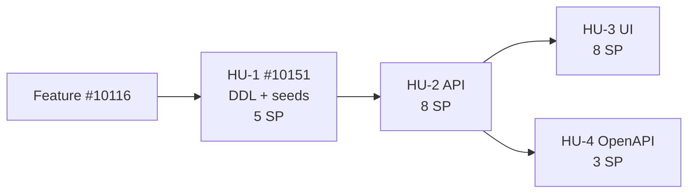

# Propuesta de Historias de Usuario — Feature #10116 Motor Dinámico de Parametrización

> **Estado:** Borrador para revisión humana  
> **Fecha:** 2026-06-18  
> **Autor:** tech-lead-agent (Modo B)  
> **Feature padre:** [#10116](https://dev.azure.com/FlitDevOps/FLIT%20-%20EVOLUTION/_workitems/edit/10116)  
> **Diseño técnico:** [feature_10116_diseno_tecnico.md](./feature_10116_diseno_tecnico.md) · **ADR:** [ADR-0019](../../services/core-api/docs/adr/ADR-0019-motor-parametrizacion-global-superadmin.md)  
> **Plan orquestado:** [feature_10116_motor_tramites.plan.md](./feature_10116_motor_tramites.plan.md)

**Alcance de este documento:** propuesta local de redacción. No crea ni modifica work items en Azure DevOps.

---

## 1. Tabla resumen

| HU | Acción ADO | Título | Capa | SP | Dependencias | Agente implementador |
|----|------------|--------|------|-----|--------------|----------------------|
| HU-1 | **Actualizar** [#10151](https://dev.azure.com/FlitDevOps/FLIT%20-%20EVOLUTION/_workitems/edit/10151) | `[BACKEND] – Trámites – Revisar DDL motor parametrización y seeds mínimos` | BACKEND (datos) | 5 | Ninguna | `database-agent` |
| HU-2 | **Crear** nueva bajo #10116 | `[BACKEND] – Trámites – Implementar API SuperAdmin parametrización y validaciones` | BACKEND | 8 | HU-1 (#10151) | `backend-agent` |
| HU-3 | **Crear** nueva bajo #10116 | `[FRONTEND] – Trámites – Implementar módulo SuperAdmin parametrización trámites` | FRONTEND | 8 | HU-2 | `frontend-agent` |
| HU-4 | **Crear** nueva bajo #10116 | `[BACKEND] – Trámites – Publicar contrato OpenAPI v1 parametrización` | BACKEND (contratos) | 3 | HU-2 (borrador en paralelo tras diseño aprobado) | `backend-agent` |

**Total:** 4 HUs · **24 SP** (Fibonacci)  
**AssignedTo sugerido:** Samuel Cardenas  
**Tags sugeridos:** `DOR`; `adopcion-ia`  
**Sprint sugerido:** siguiente al activo (regla FLIT)

---

## 2. Historias de Usuario

---

### HU-1 — Actualizar #10151

#### Metadatos

| Campo | Valor |
|-------|-------|
| **ADO** | Actualizar [#10151](https://dev.azure.com/FlitDevOps/FLIT%20-%20EVOLUTION/_workitems/edit/10151) (no duplicar) |
| **Story Points** | 5 |
| **Dependencias** | Ninguna |
| **Agente implementador** | `database-agent` |
| **AssignedTo sugerido** | Samuel Cardenas |
| **Tags sugeridos** | `DOR`; `adopcion-ia` |

#### Título FLIT

```
[BACKEND] – Trámites – Revisar DDL motor parametrización y seeds mínimos
```

#### Description (narrativa)

```
Como ingeniero de datos del equipo FLIT,
quiero revisar y completar el DDL del motor de parametrización global aplicando la Opción 1 relacional,
para habilitar el catálogo SuperAdmin con ciclo de vida, plantillas de consulta y campos bloqueados antes de la API y la UI.
```

#### Description (HTML listo para ADO)

```html
<p><strong>Como</strong> ingeniero de datos del equipo FLIT,<br><strong>quiero</strong> revisar y completar el DDL del motor de parametrización global aplicando la Opción 1 relacional (consultation_templates, publication_status, is_locked, row_version y triggers de conformidad),<br><strong>para</strong> habilitar el catálogo SuperAdmin con ciclo de vida, plantillas de consulta y campos bloqueados antes de la API y la UI.</p>
```

#### Acceptance Criteria

##### AC1 — Migración de revisión aplica sobre base existente

```gherkin
Feature: Revisión DDL motor parametrización global

  Scenario: Migración revisión aplica sin error en base con HU10151 original
    Dado una base PostgreSQL con migraciones previas hasta HU10151 original
    Cuando ejecuto la migración HU10151_RevisionParametrizacion
    Entonces existen las tablas tramites.consultation_templates
    Y tramites.procedure_types tiene columna publication_status con default draft
    Y tramites.form_fields tiene columnas is_locked y consultation_template_id
```

##### AC2 — Seeds mínimos de catálogo global

```gherkin
  Scenario: Seeds mínimos de catálogo global
    Dado la migración de seeds mínimos aplicada
    Entonces existen 4 registros activos en tramites.procedure_entities (VEHICLE, OWNER, BUYER, LESSEE)
    Y existen al menos 6 registros en tramites.external_data_sources (SIMIT, RUNT, RNMC, RESOLUCIONES, RUES, FASECOLDA)
    Y existen al menos 3 familias representadas en tramites.procedure_types (MATRICULAS, TRASPASO, OTROS)
    Y existen al menos 2 procedure_types en estado draft sembrados como ejemplo
```

##### AC3 — Plantillas de consulta con campos mínimos

```gherkin
  Scenario: Plantillas de consulta con campos mínimos
    Dado la plantilla RUNT_VEHICLE activa en tramites.consultation_templates
    Entonces required_field_keys contiene plate_or_vin
    Y la plantilla está asociada al external_data_source RUNT
```

##### AC4 — Validación db-schema-validator sin bloqueantes

```gherkin
  Scenario: Validación db-schema-validator
    Dado el DDL revisado en docs/schema/ddl/ y la migración EF correspondiente
    Cuando ejecuto la skill db-schema-validator sobre la migración
    Entonces no hay violaciones BLOCKED en checklist §A
    Y las FKs hacia procedure_types y form_fields siguen compatibles con HU10149 y HU10150
```

##### AC5 — Rollback de migración incremental (escenario negativo)

```gherkin
  Scenario: Rollback de revisión no rompe migraciones previas
    Dado la migración HU10151_RevisionParametrizacion aplicada
    Cuando ejecuto el rollback documentado en Phase1DdlDown
    Entonces las columnas publication_status, is_locked y la tabla consultation_templates dejan de existir
    Y las tablas del DDL HU10151 original permanecen intactas
```

#### Acceptance Criteria (HTML listo para ADO)

```html
<h3>AC1 — Migración de revisión aplica sobre base existente</h3><pre>Feature: Revisión DDL motor parametrización global

  Scenario: Migración revisión aplica sin error en base con HU10151 original
    Dado una base PostgreSQL con migraciones previas hasta HU10151 original
    Cuando ejecuto la migración HU10151_RevisionParametrizacion
    Entonces existen las tablas tramites.consultation_templates
    Y tramites.procedure_types tiene columna publication_status con default draft
    Y tramites.form_fields tiene columnas is_locked y consultation_template_id</pre><h3>AC2 — Seeds mínimos de catálogo global</h3><pre>  Scenario: Seeds mínimos de catálogo global
    Dado la migración de seeds mínimos aplicada
    Entonces existen 4 registros activos en tramites.procedure_entities (VEHICLE, OWNER, BUYER, LESSEE)
    Y existen al menos 6 registros en tramites.external_data_sources (SIMIT, RUNT, RNMC, RESOLUCIONES, RUES, FASECOLDA)
    Y existen al menos 3 familias representadas en tramites.procedure_types (MATRICULAS, TRASPASO, OTROS)
    Y existen al menos 2 procedure_types en estado draft sembrados como ejemplo</pre><h3>AC3 — Plantillas de consulta con campos mínimos</h3><pre>  Scenario: Plantillas de consulta con campos mínimos
    Dado la plantilla RUNT_VEHICLE activa en tramites.consultation_templates
    Entonces required_field_keys contiene plate_or_vin
    Y la plantilla está asociada al external_data_source RUNT</pre><h3>AC4 — Validación db-schema-validator sin bloqueantes</h3><pre>  Scenario: Validación db-schema-validator
    Dado el DDL revisado en docs/schema/ddl/ y la migración EF correspondiente
    Cuando ejecuto la skill db-schema-validator sobre la migración
    Entonces no hay violaciones BLOCKED en checklist §A
    Y las FKs hacia procedure_types y form_fields siguen compatibles con HU10149 y HU10150</pre><h3>AC5 — Rollback de migración incremental (escenario negativo)</h3><pre>  Scenario: Rollback de revisión no rompe migraciones previas
    Dado la migración HU10151_RevisionParametrizacion aplicada
    Cuando ejecuto el rollback documentado en Phase1DdlDown
    Entonces las columnas publication_status, is_locked y la tabla consultation_templates dejan de existir
    Y las tablas del DDL HU10151 original permanecen intactas</pre>
```

---

### HU-2 — Crear nueva bajo #10116

#### Metadatos

| Campo | Valor |
|-------|-------|
| **ADO** | Crear User Story hija de #10116 |
| **Story Points** | 8 |
| **Dependencias** | HU-1 (#10151) |
| **Agente implementador** | `backend-agent` |
| **AssignedTo sugerido** | Samuel Cardenas |
| **Tags sugeridos** | `DOR`; `adopcion-ia` |

#### Título FLIT

```
[BACKEND] – Trámites – Implementar API SuperAdmin parametrización y validaciones
```

#### Description (narrativa)

```
Como SuperAdmin FLIT,
quiero gestionar por API la parametrización global de trámites (CRUD, conformación, wizard, validación y publicación),
para definir tipologías y campos que consumirán todos los tenants sin ejecutar consultas externas reales en este MVP.
```

#### Description (HTML listo para ADO)

```html
<p><strong>Como</strong> SuperAdmin FLIT,<br><strong>quiero</strong> gestionar por API la parametrización global de trámites (CRUD de procedure_types, upsert de conformación y pasos del wizard, validación de reglas VIN/Placa/NIT, campos mínimos por consultation_templates, publicación y archivado),<br><strong>para</strong> definir tipologías y campos que consumirán todos los tenants sin ejecutar consultas externas reales en este MVP.</p>
```

#### Acceptance Criteria

##### AC1 — Crear parametrización en borrador

```gherkin
Feature: API SuperAdmin parametrización trámites

  Background:
    Dado el header X-Flit-SuperAdmin es true
    Y la API core-api está disponible

  Scenario: Crear parametrización en borrador
    Cuando envío POST /api/v1/superadmin/procedure-types con family MATRICULAS y code MI_ESTANDAR
    Entonces el status HTTP es 201
    Y publicationStatus es draft
```

##### AC2 — Rechazar acceso sin stub SuperAdmin (escenario negativo)

```gherkin
  Scenario: Rechazar acceso sin stub SuperAdmin
    Dado el header X-Flit-SuperAdmin está ausente
    Cuando envío GET /api/v1/superadmin/procedure-types
    Entonces el status HTTP es 403
```

##### AC3 — Configurar matriz de conformación

```gherkin
  Scenario: Configurar matriz de conformación
    Dado un procedure_type en estado draft
    Cuando envío PUT /api/v1/superadmin/procedure-types/{id}/conformation-rules activando VEHICLE y OWNER
    Entonces GET /api/v1/superadmin/procedure-types/{id}/conformation-rules retorna 2 aristas activas
```

##### AC4 — Validación VIN vs Placa en campos de vehículo (escenario negativo)

```gherkin
  Scenario: Validación VIN vs Placa en campos de vehículo
    Dado un tipo MATRICULAS con arista VEHICLE activa
    Y no existe campo locked plate_or_vin en el wizard
    Cuando envío POST /api/v1/superadmin/procedure-types/{id}/validate
    Entonces isValid es false
    Y existe un error con code VIN_PLATE_RULE
```

##### AC5 — Validación NIT clasifica persona jurídica (escenario negativo)

```gherkin
  Scenario: Validación NIT clasifica persona jurídica
    Dado una sección OWNER con campo document_type con valor NIT
    Y no hay plantilla RUES aplicada para persona jurídica
    Cuando envío POST /api/v1/superadmin/procedure-types/{id}/validate
    Entonces isValid es false
    Y existe un error con code NIT_PERSON_TYPE o INCOMPLETE_CONSULTATION_FIELDS
```

##### AC6 — Campos locked no eliminables (escenario negativo)

```gherkin
  Scenario: Campos locked no eliminables
    Dado un form_field con is_locked true
    Cuando envío PUT /api/v1/superadmin/procedure-types/{id}/steps omitiendo ese field_key
    Entonces el status HTTP es 409 o 422
    Y el campo locked permanece en base de datos
```

##### AC7 — Publicar parametrización válida

```gherkin
  Scenario: Publicar parametrización válida
    Dado POST validate retorna isValid true
    Cuando envío POST /api/v1/superadmin/procedure-types/{id}/publish
    Entonces publicationStatus es published
    Y publishedAt no es null
```

##### AC8 — Bloquear edición de parametrización publicada (escenario negativo)

```gherkin
  Scenario: Bloquear edición de parametrización publicada
    Dado un procedure_type en estado published
    Cuando envío PUT /api/v1/superadmin/procedure-types/{id} cambiando name
    Entonces el status HTTP es 409
```

##### AC9 — Endpoint lectura publicada para consumo runtime

```gherkin
  Scenario: Endpoint lectura publicada para consumo runtime
    Dado un procedure_type published con code MI_ESTANDAR
    Cuando envío GET /api/v1/procedure-types/MI_ESTANDAR/configuration
    Entonces el status HTTP es 200
    Y el payload incluye conformationRules y steps
```

#### Acceptance Criteria (HTML listo para ADO)

```html
<h3>AC1 — Crear parametrización en borrador</h3><pre>Feature: API SuperAdmin parametrización trámites

  Background:
    Dado el header X-Flit-SuperAdmin es true
    Y la API core-api está disponible

  Scenario: Crear parametrización en borrador
    Cuando envío POST /api/v1/superadmin/procedure-types con family MATRICULAS y code MI_ESTANDAR
    Entonces el status HTTP es 201
    Y publicationStatus es draft</pre><h3>AC2 — Rechazar acceso sin stub SuperAdmin (escenario negativo)</h3><pre>  Scenario: Rechazar acceso sin stub SuperAdmin
    Dado el header X-Flit-SuperAdmin está ausente
    Cuando envío GET /api/v1/superadmin/procedure-types
    Entonces el status HTTP es 403</pre><h3>AC3 — Configurar matriz de conformación</h3><pre>  Scenario: Configurar matriz de conformación
    Dado un procedure_type en estado draft
    Cuando envío PUT /api/v1/superadmin/procedure-types/{id}/conformation-rules activando VEHICLE y OWNER
    Entonces GET /api/v1/superadmin/procedure-types/{id}/conformation-rules retorna 2 aristas activas</pre><h3>AC4 — Validación VIN vs Placa (escenario negativo)</h3><pre>  Scenario: Validación VIN vs Placa en campos de vehículo
    Dado un tipo MATRICULAS con arista VEHICLE activa
    Y no existe campo locked plate_or_vin en el wizard
    Cuando envío POST /api/v1/superadmin/procedure-types/{id}/validate
    Entonces isValid es false
    Y existe un error con code VIN_PLATE_RULE</pre><h3>AC5 — Validación NIT persona jurídica (escenario negativo)</h3><pre>  Scenario: Validación NIT clasifica persona jurídica
    Dado una sección OWNER con campo document_type con valor NIT
    Y no hay plantilla RUES aplicada para persona jurídica
    Cuando envío POST /api/v1/superadmin/procedure-types/{id}/validate
    Entonces isValid es false
    Y existe un error con code NIT_PERSON_TYPE o INCOMPLETE_CONSULTATION_FIELDS</pre><h3>AC6 — Campos locked no eliminables (escenario negativo)</h3><pre>  Scenario: Campos locked no eliminables
    Dado un form_field con is_locked true
    Cuando envío PUT /api/v1/superadmin/procedure-types/{id}/steps omitiendo ese field_key
    Entonces el status HTTP es 409 o 422
    Y el campo locked permanece en base de datos</pre><h3>AC7 — Publicar parametrización válida</h3><pre>  Scenario: Publicar parametrización válida
    Dado POST validate retorna isValid true
    Cuando envío POST /api/v1/superadmin/procedure-types/{id}/publish
    Entonces publicationStatus es published
    Y publishedAt no es null</pre><h3>AC8 — Bloquear edición publicada (escenario negativo)</h3><pre>  Scenario: Bloquear edición de parametrización publicada
    Dado un procedure_type en estado published
    Cuando envío PUT /api/v1/superadmin/procedure-types/{id} cambiando name
    Entonces el status HTTP es 409</pre><h3>AC9 — Endpoint lectura publicada para runtime</h3><pre>  Scenario: Endpoint lectura publicada para consumo runtime
    Dado un procedure_type published con code MI_ESTANDAR
    Cuando envío GET /api/v1/procedure-types/MI_ESTANDAR/configuration
    Entonces el status HTTP es 200
    Y el payload incluye conformationRules y steps</pre>
```

---

### HU-3 — Crear nueva bajo #10116

#### Metadatos

| Campo | Valor |
|-------|-------|
| **ADO** | Crear User Story hija de #10116 |
| **Story Points** | 8 |
| **Dependencias** | HU-2 |
| **Agente implementador** | `frontend-agent` |
| **AssignedTo sugerido** | Samuel Cardenas |
| **Tags sugeridos** | `DOR`; `adopcion-ia` |

#### Título FLIT

```
[FRONTEND] – Trámites – Implementar módulo SuperAdmin parametrización trámites
```

#### Description (narrativa)

```
Como SuperAdmin FLIT,
quiero un wizard de parametrización de trámites con listado, pasos guiados y validación previa a publicar,
para administrar el catálogo global de flujos vehiculares desde la interfaz sin depender de mocks ni de RBAC completo en este MVP.
```

#### Description (HTML listo para ADO)

```html
<p><strong>Como</strong> SuperAdmin FLIT,<br><strong>quiero</strong> un wizard de parametrización de trámites con listado, ocho pasos guiados (identidad, tipología, aristas, pasos, campos, bindings stub, validación y guardado) y publicación tras validación exitosa,<br><strong>para</strong> administrar el catálogo global de flujos vehiculares desde la interfaz sin depender de mocks ni de RBAC completo en este MVP.</p>
```

#### Acceptance Criteria

##### AC1 — Listado vacío

```gherkin
Feature: UI SuperAdmin parametrización trámites

  Background:
    Dado el usuario accedió al módulo Trámites
    Y seleccionó la vista Parametrización
    Y el header X-Flit-SuperAdmin es true en las peticiones al API

  Scenario: Listado vacío
    Dado la API retorna lista vacía de procedure-types
    Entonces se muestra estado vacío con CTA "Nuevo flujo"
    Y no se muestran filas de parametrizaciones
```

##### AC2 — Listado con parametrizaciones

```gherkin
  Scenario: Listado con parametrizaciones draft y published
    Dado existen parametrizaciones en estado draft y published
    Entonces cada fila muestra familia, código, estado y acciones disponibles
    Y las publicadas no muestran acción de editar estructura del wizard
```

##### AC3 — Wizard crear flujo completo

```gherkin
  Scenario: Wizard crear flujo completo
    Cuando hago clic en "Nuevo flujo"
    Y completo los pasos Identidad, Aristas, Pasos y Campos
    Y ejecuto Validar con éxito
    Y guardo borrador
    Entonces la parametrización aparece en el listado como draft
```

##### AC4 — Validación con errores en UI (escenario negativo)

```gherkin
  Scenario: Validación con errores en UI
    Dado el wizard está en el paso Validar
    Y la API retorna isValid false con errores VIN_PLATE_RULE
    Entonces se muestran mensajes accesibles con aria-live
    Y se resalta el paso Aristas o Campos según el path del error
```

##### AC5 — Publicar desde UI

```gherkin
  Scenario: Publicar desde UI
    Dado la validación previa fue exitosa
    Cuando hago clic en "Publicar versión"
    Entonces el estado cambia a published en el listado
    Y se muestra confirmación al usuario
```

##### AC6 — Estados de carga y error (escenario negativo)

```gherkin
  Scenario: Estados de carga y error
    Dado la API demora o falla al cargar el listado
    Entonces se muestra skeleton durante la carga
    Y se muestra ErrorState con acción reintentar ante fallo
```

##### AC7 — Accesibilidad WCAG 2.1 AA

```gherkin
  Scenario: Accesibilidad WCAG 2.1 AA
    Dado el wizard está abierto
    Entonces todos los inputs tienen label asociado
    Y el orden de tabulación es lógico
    Y los botones tienen nombre accesible
```

#### Acceptance Criteria (HTML listo para ADO)

```html
<h3>AC1 — Listado vacío</h3><pre>Feature: UI SuperAdmin parametrización trámites

  Background:
    Dado el usuario accedió al módulo Trámites
    Y seleccionó la vista Parametrización
    Y el header X-Flit-SuperAdmin es true en las peticiones al API

  Scenario: Listado vacío
    Dado la API retorna lista vacía de procedure-types
    Entonces se muestra estado vacío con CTA "Nuevo flujo"
    Y no se muestran filas de parametrizaciones</pre><h3>AC2 — Listado con parametrizaciones</h3><pre>  Scenario: Listado con parametrizaciones draft y published
    Dado existen parametrizaciones en estado draft y published
    Entonces cada fila muestra familia, código, estado y acciones disponibles
    Y las publicadas no muestran acción de editar estructura del wizard</pre><h3>AC3 — Wizard crear flujo completo</h3><pre>  Scenario: Wizard crear flujo completo
    Cuando hago clic en "Nuevo flujo"
    Y completo los pasos Identidad, Aristas, Pasos y Campos
    Y ejecuto Validar con éxito
    Y guardo borrador
    Entonces la parametrización aparece en el listado como draft</pre><h3>AC4 — Validación con errores en UI (escenario negativo)</h3><pre>  Scenario: Validación con errores en UI
    Dado el wizard está en el paso Validar
    Y la API retorna isValid false con errores VIN_PLATE_RULE
    Entonces se muestran mensajes accesibles con aria-live
    Y se resalta el paso Aristas o Campos según el path del error</pre><h3>AC5 — Publicar desde UI</h3><pre>  Scenario: Publicar desde UI
    Dado la validación previa fue exitosa
    Cuando hago clic en "Publicar versión"
    Entonces el estado cambia a published en el listado
    Y se muestra confirmación al usuario</pre><h3>AC6 — Estados de carga y error (escenario negativo)</h3><pre>  Scenario: Estados de carga y error
    Dado la API demora o falla al cargar el listado
    Entonces se muestra skeleton durante la carga
    Y se muestra ErrorState con acción reintentar ante fallo</pre><h3>AC7 — Accesibilidad WCAG 2.1 AA</h3><pre>  Scenario: Accesibilidad WCAG 2.1 AA
    Dado el wizard está abierto
    Entonces todos los inputs tienen label asociado
    Y el orden de tabulación es lógico
    Y los botones tienen nombre accesible</pre>
```

---

### HU-4 — Crear nueva bajo #10116

#### Metadatos

| Campo | Valor |
|-------|-------|
| **ADO** | Crear User Story hija de #10116 |
| **Story Points** | 3 |
| **Dependencias** | HU-2 (borrador en paralelo tras diseño aprobado; alineación final tras implementación API) |
| **Agente implementador** | `backend-agent` |
| **AssignedTo sugerido** | Samuel Cardenas |
| **Tags sugeridos** | `DOR`; `adopcion-ia` |

#### Título FLIT

```
[BACKEND] – Trámites – Publicar contrato OpenAPI v1 parametrización
```

#### Description (narrativa)

```
Como desarrollador del ecosistema FLIT,
quiero el contrato OpenAPI v1 de la parametrización SuperAdmin versionado en el repositorio,
para que CI valide el esquema, el frontend consuma tipos estables y Feature #10128 integre lectura runtime sin ambigüedad.
```

#### Description (HTML listo para ADO)

```html
<p><strong>Como</strong> desarrollador del ecosistema FLIT,<br><strong>quiero</strong> el contrato OpenAPI v1 de la parametrización SuperAdmin versionado en el repositorio (paths /api/v1/superadmin/*, schema de lectura runtime y stub python-ml para CI),<br><strong>para</strong> que CI valide el esquema, el frontend consuma tipos estables y Feature #10128 integre lectura runtime sin ambigüedad.</p>
```

#### Acceptance Criteria

##### AC1 — Lint OpenAPI en CI

```gherkin
Feature: Contrato OpenAPI parametrización

  Scenario: Lint OpenAPI en CI
    Dado el archivo contracts/openapi/core-api.v1.yaml
    Cuando ejecuto redocly lint sobre el contrato
    Entonces no hay errores de lint
```

##### AC2 — Cobertura paths SuperAdmin

```gherkin
  Scenario: Cobertura paths SuperAdmin
    Dado el contrato core-api.v1.yaml
    Entonces existen paths para procedure-types CRUD, publish, archive y validate
    Y existen paths para conformation-rules y steps
    Y existen schemas ProcedureTypeSummary, FormFieldItem y ValidationResult
```

##### AC3 — Contrato alineado con implementación (escenario negativo si diverge)

```gherkin
  Scenario: Contrato alineado con implementación HU-2
    Dado los endpoints implementados en HU-2
    Cuando comparo responses reales con el contrato OpenAPI
    Entonces los status codes y campos obligatorios coinciden
    Y cualquier divergencia bloquea el merge hasta corregir contrato o implementación
```

##### AC4 — Endpoint forward-compatible runtime

```gherkin
  Scenario: Endpoint forward-compatible runtime
    Dado GET /api/v1/procedure-types/{code}/configuration documentado en el contrato
    Entonces el schema de respuesta incluye steps y conformationRules
    Y está marcado como estable para consumo de Feature #10128
```

##### AC5 — Pipeline contracts.yml en verde

```gherkin
  Scenario: Pipeline contracts.yml en verde
    Dado el stub contracts/openapi/python-ml.v1.yaml creado para CI existente
    Cuando se ejecuta el pipeline contracts.yml en la rama de la HU
    Entonces el job de validación de contratos termina en succeeded
```

#### Acceptance Criteria (HTML listo para ADO)

```html
<h3>AC1 — Lint OpenAPI en CI</h3><pre>Feature: Contrato OpenAPI parametrización

  Scenario: Lint OpenAPI en CI
    Dado el archivo contracts/openapi/core-api.v1.yaml
    Cuando ejecuto redocly lint sobre el contrato
    Entonces no hay errores de lint</pre><h3>AC2 — Cobertura paths SuperAdmin</h3><pre>  Scenario: Cobertura paths SuperAdmin
    Dado el contrato core-api.v1.yaml
    Entonces existen paths para procedure-types CRUD, publish, archive y validate
    Y existen paths para conformation-rules y steps
    Y existen schemas ProcedureTypeSummary, FormFieldItem y ValidationResult</pre><h3>AC3 — Contrato alineado con implementación</h3><pre>  Scenario: Contrato alineado con implementación HU-2
    Dado los endpoints implementados en HU-2
    Cuando comparo responses reales con el contrato OpenAPI
    Entonces los status codes y campos obligatorios coinciden
    Y cualquier divergencia bloquea el merge hasta corregir contrato o implementación</pre><h3>AC4 — Endpoint forward-compatible runtime</h3><pre>  Scenario: Endpoint forward-compatible runtime
    Dado GET /api/v1/procedure-types/{code}/configuration documentado en el contrato
    Entonces el schema de respuesta incluye steps y conformationRules
    Y está marcado como estable para consumo de Feature #10128</pre><h3>AC5 — Pipeline contracts.yml en verde</h3><pre>  Scenario: Pipeline contracts.yml en verde
    Dado el stub contracts/openapi/python-ml.v1.yaml creado para CI existente
    Cuando se ejecuta el pipeline contracts.yml en la rama de la HU
    Entonces el job de validación de contratos termina en succeeded</pre>
```

---

## 3. Notas de alineación con #10151

La HU [#10151](https://dev.azure.com/FlitDevOps/FLIT%20-%20EVOLUTION/_workitems/edit/10151) existe hoy con **8 SP**, estado **Active** y scope acotado a **migración DDL base** (`HU10151_TramitesParametrizacion`). Esta propuesta **redefine** #10151 como HU-1 del diseño aprobado, sin crear un duplicado.

| Aspecto | Scope anterior (#10151) | Scope propuesto (HU-1) |
|---------|-------------------------|------------------------|
| **Entrega principal** | Aplicar migración DDL original HU10151 | Migración **incremental** `HU10151_RevisionParametrizacion` (Opción 1 ADR-0019) |
| **Gaps DDL** | No cubiertos | `consultation_templates`, `publication_status`, `is_locked`, `row_version`, triggers A16 |
| **Seeds** | No explícitos en AC | Seeds mínimos: 3 familias, 2–3 tipos, 4 aristas, 6 fuentes externas, plantillas consulta |
| **Validación** | Migración aplica sin error | `@db-schema-validator` sin BLOCKED + compatibilidad FKs #10149/#10150 |
| **Entidades EF** | Fuera de scope | Fuera de scope HU-1 (pasan a HU-2 vía backend-agent) |
| **API / UI** | Fuera de scope | Fuera de scope (HU-2 y HU-3) |
| **Story Points** | 8 | **5** (revisión + seeds + validación; DDL base ya existe) |
| **Estado ADO** | Active | Requiere **actualizar título, Description, AC y SP** antes de continuar implementación; evaluar si permanece Active o regresa a New tras redefinición |

**Acciones ADO pendientes (post-aprobación humana, fuera de este documento):**

1. PATCH #10151: título, Description HTML, AC HTML, SP=5, dependencias=Ninguna.
2. POST 3 HUs nuevas (HU-2, HU-3, HU-4) bajo #10116 con vínculo Hierarchy-Reverse.
3. Verificar que #10116 pase a **Active** antes de activar HUs hijas (DoR-US criterio 1).

**Artefactos DDL asociados (referencia diseño §1 Opción 1):**

- `04-HU10151-revision-parametrizacion.sql` (nueva migración incremental)
- `04-HU10151-seeds-minimos.sql`
- Excepción documentada: catálogo global sin `tenant_id` (checklist A20)

---

## 4. Checklist DoR-US preliminar (10 criterios)

Evaluación **local** sobre el contenido de esta propuesta. No se ejecutó validación en Azure DevOps.

### Leyenda

| Estado | Significado |
|--------|-------------|
| **PASS** | Cumple según borrador propuesto |
| **FAIL** | Falta evidencia o acción en ADO |
| **NA** | No aplica en esta fase |

---

### HU-1 — #10151 (actualizar)

| # | Criterio DoR-US | Estado | Notas |
|---|-----------------|--------|-------|
| 1 | Parent Feature #10116 en Active o Resolved | **FAIL** | Feature #10116 está en `New`; debe activarse antes de implementar |
| 2 | Título formato `[BACKEND|FRONTEND] – Módulo – Verbo sustantivo` | **PASS** | Título propuesto cumple formato |
| 3 | ≥1 AC positivo + ≥1 AC negativo | **PASS** | AC1–AC4 positivos; AC5 rollback negativo |
| 4 | Story Points Fibonacci asignados | **PASS** | 5 SP propuestos (requiere PATCH en ADO desde 8) |
| 5 | `Custom.Refinement = true` | **FAIL** | Verificar en ADO al actualizar |
| 6 | Dependencias explícitas | **PASS** | Ninguna |
| 7 | Sprint = siguiente al activo | **FAIL** | Asignar al actualizar en ADO |
| 8 | AssignedTo = humano | **PASS** | Samuel Cardenas sugerido |
| 9 | Tag `DOR` presente | **FAIL** | Verificar tag `DOR; adopcion-ia` al PATCH |
| 10 | Sin placeholders en Description/AC | **PASS** | Borrador sin TODO/TBD/XXX |

**Veredicto preliminar HU-1:** `MISSING_4` — contenido listo; faltan acciones ADO y activación del Feature padre.

---

### HU-2 — Crear nueva

| # | Criterio DoR-US | Estado | Notas |
|---|-----------------|--------|-------|
| 1 | Parent Feature #10116 en Active o Resolved | **FAIL** | Feature #10116 en `New` |
| 2 | Título formato `[BACKEND|FRONTEND] – Módulo – Verbo sustantivo` | **PASS** | |
| 3 | ≥1 AC positivo + ≥1 AC negativo | **PASS** | AC2, AC4–AC6, AC8 negativos |
| 4 | Story Points Fibonacci asignados | **PASS** | 8 SP |
| 5 | `Custom.Refinement = true` | **FAIL** | Aplicar al crear en ADO |
| 6 | Dependencias explícitas | **PASS** | HU-1 (#10151) |
| 7 | Sprint = siguiente al activo | **FAIL** | Asignar al crear |
| 8 | AssignedTo = humano | **PASS** | Samuel Cardenas sugerido |
| 9 | Tag `DOR` presente | **FAIL** | Aplicar al crear |
| 10 | Sin placeholders en Description/AC | **PASS** | |

**Veredicto preliminar HU-2:** `MISSING_4` — no activar hasta HU-1 completada y Feature padre Active.

---

### HU-3 — Crear nueva

| # | Criterio DoR-US | Estado | Notas |
|---|-----------------|--------|-------|
| 1 | Parent Feature #10116 en Active o Resolved | **FAIL** | Feature #10116 en `New` |
| 2 | Título formato `[BACKEND|FRONTEND] – Módulo – Verbo sustantivo` | **PASS** | |
| 3 | ≥1 AC positivo + ≥1 AC negativo | **PASS** | AC4 y AC6 negativos |
| 4 | Story Points Fibonacci asignados | **PASS** | 8 SP |
| 5 | `Custom.Refinement = true` | **FAIL** | Aplicar al crear |
| 6 | Dependencias explícitas | **PASS** | HU-2 |
| 7 | Sprint = siguiente al activo | **FAIL** | Asignar al crear |
| 8 | AssignedTo = humano | **PASS** | Samuel Cardenas sugerido |
| 9 | Tag `DOR` presente | **FAIL** | Aplicar al crear |
| 10 | Sin placeholders en Description/AC | **PASS** | |

**Veredicto preliminar HU-3:** `MISSING_4` — no activar hasta HU-2 en DEV o al menos contrato API estable.

---

### HU-4 — Crear nueva

| # | Criterio DoR-US | Estado | Notas |
|---|-----------------|--------|-------|
| 1 | Parent Feature #10116 en Active o Resolved | **FAIL** | Feature #10116 en `New` |
| 2 | Título formato `[BACKEND|FRONTEND] – Módulo – Verbo sustantivo` | **PASS** | |
| 3 | ≥1 AC positivo + ≥1 AC negativo | **PASS** | AC3 incluye bloqueo por divergencia |
| 4 | Story Points Fibonacci asignados | **PASS** | 3 SP |
| 5 | `Custom.Refinement = true` | **FAIL** | Aplicar al crear |
| 6 | Dependencias explícitas | **PASS** | HU-2 (paralelo parcial tras diseño) |
| 7 | Sprint = siguiente al activo | **FAIL** | Asignar al crear |
| 8 | AssignedTo = humano | **PASS** | Samuel Cardenas sugerido |
| 9 | Tag `DOR` presente | **FAIL** | Aplicar al crear |
| 10 | Sin placeholders en Description/AC | **PASS** | |

**Veredicto preliminar HU-4:** `MISSING_4` — puede refinarse en paralelo; merge condicionado a HU-2.

---

## 5. Orden de implementación recomendado



---

*Documento generado por tech-lead-agent (Modo B) · FLIT AI Agents v2.0 · Sin cambios en Azure DevOps*
