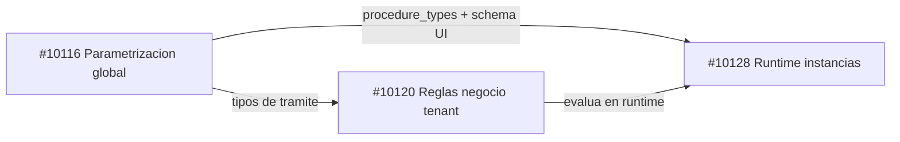

# Plan orquestado — Feature #10116 Motor Dinámico de Trámites

> **Estado:** Aprobado (2026-06-18)  
> **ADO:** [#10116](https://dev.azure.com/FlitDevOps/FLIT%20-%20EVOLUTION/_workitems/edit/10116)  
> **Orquestador:** este chat Cursor · **Implementación:** Claude Code + chats especializados

## Mi entendimiento (validado contigo)

**#10116** es el **catálogo global de parametrización** del motor de trámites, editable **solo por SuperAdmin FLIT**. No es por tenant: una parametrización publicada aplica a **todas las compañías**.

El flujo de negocio que describes:

```mermaid
flowchart TD
    subgraph superadmin [SuperAdmin FLIT]
        List[Listar parametrizaciones]
        Create[Crear nueva]
        Family[Elegir familia: Matricula / Traspaso / Otros]
        Child[Elegir tipo hijo ej. Matricula Estandar]
        Wizard[Wizard: pasos y secciones]
        Entities[Configurar aristas: Vehiculo / Actores]
        Fields[Campos por seccion + bindings API]
        Validate[Validar minimos por consulta]
        Save[Guardar parametrizacion global]
    end
    List --> Create --> Family --> Child --> Wizard
    Wizard --> Entities --> Fields --> Validate --> Save
```



**Capas del modelo (PRD + ADO + contexto de reuniones):**

| Concepto PRD | Tabla DDL actual ([`04-HU10151-tramites-parametrizacion.sql`](../../services/core-api/docs/schema/ddl/04-HU10151-tramites-parametrizacion.sql)) |
|---|---|
| Familia + tipo hijo (14 tipologías) | `tramites.procedure_types` (`family`, `code`, `name`) |
| 4 aristas (Vehículo, Propietario, Comprador, Locatario) | `tramites.procedure_entities` + `tramites.conformation_rules` |
| Pasos / secciones / campos del wizard | `tramites.procedure_steps` → `procedure_sections` → `form_fields` |
| Consultas externas (SIMIT, RUNT, RNMC…) | `tramites.external_data_sources` + `field_api_bindings` |
| VIN vs Placa, Natural vs Jurídica | Lógica de validación en backend (MVP acordado) |

**Lo que NO entra en este MVP (#10116):**
- Ejecutar consultas externas reales (RUNT/Verifik, etc.) → Feature [#10128](https://dev.azure.com/FlitDevOps/FLIT%20-%20EVOLUTION/_workitems/edit/10128)
- Motor If/Else de reglas de negocio → Feature [#10120](https://dev.azure.com/FlitDevOps/FLIT%20-%20EVOLUTION/_workitems/edit/10120)
- Documentos adjuntos por trámite → Feature #10138 (futuro)
- RBAC completo → Feature #10134; usaremos **stub superadmin** temporal

**Relación entre los 3 Features del carril:**



Orden recomendado: **#10116 → #10120 → #10128** (diseño de contratos de #10120 en paralelo mientras termina #10116).

---

## Estado actual en ADO y repo

| Item | Estado |
|------|--------|
| [#10116](https://dev.azure.com/FlitDevOps/FLIT%20-%20EVOLUTION/_workitems/edit/10116) Feature | `New`, tag `DOR`, asignado a Samuel Cardenas |
| [#10151](https://dev.azure.com/FlitDevOps/FLIT%20-%20EVOLUTION/_workitems/edit/10151) única HU hija | `Active`, 8 SP — **solo migración** |
| [#10120](https://dev.azure.com/FlitDevOps/FLIT%20-%20EVOLUTION/_workitems/edit/10120) | `New`, HU hija [#10149](https://dev.azure.com/FlitDevOps/FLIT%20-%20EVOLUTION/_workitems/edit/10149) migración reglas |
| [#10128](https://dev.azure.com/FlitDevOps/FLIT%20-%20EVOLUTION/_workitems/edit/10128) | `New`, HU hija [#10150](https://dev.azure.com/FlitDevOps/FLIT%20-%20EVOLUTION/_workitems/edit/10150) migración runtime |
| Migración en repo | `HU10151_TramitesParametrizacion` ya aplicable vía `pnpm migrate:core-api` |
| Código app | Sin controladores, sin UI SuperAdmin, auth JWT deshabilitado |

**Migraciones de apoyo a revisar (pueden cambiarse):**

- [`04-HU10151-tramites-parametrizacion.sql`](../../services/core-api/docs/schema/ddl/04-HU10151-tramites-parametrizacion.sql) — **núcleo #10116**
- [`05-HU10149-business-rules.sql`](../../services/core-api/docs/schema/ddl/05-HU10149-business-rules.sql) — #10120 (tenant-scoped; no tocar aún salvo FKs)
- [`06-HU10150-procedure-instances.sql`](../../services/core-api/docs/schema/ddl/06-HU10150-procedure-instances.sql) — #10128 (consume `form_fields`; no romper FKs)

---

## Decisiones acordadas

| Tema | Decisión |
|------|----------|
| MVP #10116 | CRUD SuperAdmin + validador campos mínimos + reglas VIN/Placa/NIT; **sin** APIs externas reales |
| HU #10151 | **Revisar/ajustar DDL** antes de implementar |
| Auth | Stub superadmin (frontend + policy API); JWT gateway sigue abierto |
| Seed | Mínimo: 3 familias + 2-3 tipos ejemplo; 4 aristas; consultas en catálogo |
| HUs por Feature | Máx. 5; objetivo **4 HUs** bien construidas |

---

## Gaps del DDL actual a resolver en la revisión

El esquema actual cubre ~80% del PRD pero faltan piezas para las reglas de negocio:

1. **Campos mínimos por consulta (RNMC, RUNT, etc.)** — propuesta: `tramites.consultation_templates` + flag `is_locked` en `form_fields` o validación en API.
2. **Estado de parametrización** — `draft` / `published` / `archived` en `procedure_types`.
3. **Catálogo de consultas** — seed de `external_data_sources` (SIMIT, RUNT, RNMC, RESOLUCIONES, RUES, FASECOLDA).
4. **Entidades EF** — mapear módulo `tramites.*` de parametrización.
5. **Capas Application/Domain** — estructura mínima Clean Architecture para este bounded context.

---

## Descomposición propuesta de HUs (4 historias)

| # | HU propuesta | SP | Entrega |
|---|-------------|-----|---------|
| 1 | `[BACKEND] – Revisión DDL motor parametrización + seeds mínimos` | 5 | Migración revisada, seeds, validación `@db-schema-validator` |
| 2 | `[BACKEND] – API SuperAdmin parametrización + validaciones` | 8 | CRUD completo + reglas VIN/Placa/NIT + campos mínimos + stub superadmin |
| 3 | `[FRONTEND] – Módulo SuperAdmin parametrización trámites` | 8 | Listado + wizard; 4 estados UI; `@flit-design-guardian` |
| 4 | `[BACKEND] – Contrato OpenAPI v1 parametrización` | 3 | `contracts/openapi/core-api.v1.yaml` — contract-first para #10128 |

**Total: 4 HUs, 24 SP.** La HU #10151 se redefine o cierra tras completar HU-1.

---

## Flujo de trabajo orquestado

### Fase 0 — Alineación ✅
- Plan aprobado 2026-06-18.

### Fase 1 — Diseño técnico (siguiente)
- **Agente:** `architecture-agent`
- **Entregables:** ADR Propuesto, diagrama secuencia, OpenAPI borrador, lista de archivos, 4 HUs con AC Gherkin.
- **Gate humano:** revisión y aprobación del diseño antes de migración.

### Fase 2 — Revisión migración + seeds
- **Agente:** `database-agent` + `@db-schema-validator`

### Fase 3 — API backend (HU-2)
- **Agente:** `backend-agent` + `@dev-tester`

### Fase 4 — UI SuperAdmin (HU-3)
- **Agente:** `frontend-agent` + `@flit-design-guardian`

### Fase 5 — Integración
- **Agente:** `integration-agent` Modo A + auditoría E2E

**No iniciar #10120 ni #10128** hasta API de lectura de parametrización estable (fin Fase 3).

---

## Riesgos a vigilar

- **Tensión #10120:** reglas tenant-scoped vs parametrización global solo SuperAdmin.
- **Auth stub:** deuda documentada hasta #10134.
- **Migraciones compartidas:** owner del schema `tramites` = Samuel.
- **HU #10151 Active:** actualizar AC en ADO al redefinir migración.

---

## Prompt Fase 1 (listo para copiar)

```
Actúa como architecture-agent del equipo FLIT.

Lee:
- Plan: .cursor/docs/plans/feature_10116_motor_tramites.plan.md
- Contexto repo: context/project-overview.md
- DDL actual: services/core-api/docs/schema/ddl/04-HU10151-tramites-parametrizacion.sql
- PRD: attachment en ADO Feature #10116 ("DOCUMENTO TÉCNICO DE REQUERIMIENTOS.md")
- ADR referencia: services/core-api/docs/adr/ADR-0018-modelo-datos-fase1-evolution.md

Produce diseño técnico para Feature #10116 con:
1. Gaps DDL (consultation_templates, draft/published, is_locked fields) — 2-3 alternativas con tradeoffs
2. OpenAPI borrador /api/v1/superadmin/*
3. Diagrama Mermaid del wizard SuperAdmin y secuencia CRUD
4. Lista exacta de archivos a crear/modificar
5. Propuesta final de 4 HUs con AC Gherkin listos para ADO

Decisiones ya acordadas (no re-preguntar):
- MVP sin ejecutar APIs externas reales
- Stub superadmin hasta RBAC #10134
- Seed mínimo (3 familias + 2-3 tipos)
- Revisar migración HU10151 antes de implementar

No escribas código todavía. Guarda el diseño en:
.cursor/docs/plans/feature_10116_diseno_tecnico.md
```
