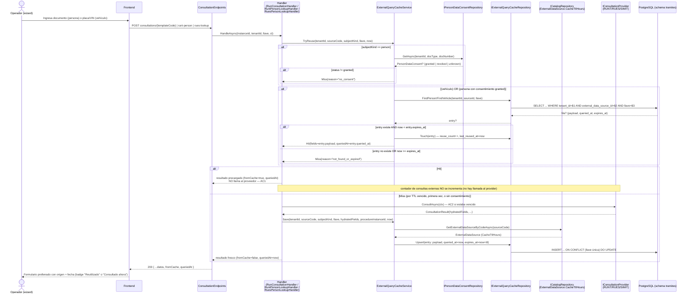

# Diseño: [BACKEND] Trámites – Reutilizar consultas externas previas con TTL por fuente

> **HU:** #10878 · **Feature:** #10862 (Reglas transversales del ciclo de vida del trámite) · **CF:** CF-04
> **Fecha:** 2026-07-23 · **Autor:** architecture-agent (diseño únicamente, sin código)
> **Estado:** Propuesto — ADRs en estado `Propuesto`; aceptación exclusiva del Líder Técnico humano.

---

## Contexto

Hoy **no existe** caché cross-trámite de consultas externas en `Flit.Tramites`. Cada vez que un
operador ingresa una persona (comprador/vendedor) o un vehículo, el sistema llama de nuevo al
proveedor externo (RUNT vía Kyverum/Verifik, RUES, SIMIT, FASECOLDA), aun si esa misma persona o
vehículo ya fue consultada en **otro trámite del mismo tenant** hace minutos. Esto genera:

- Costo/consumo repetido ante los proveedores externos.
- Latencia innecesaria para el operador.
- Inconsistencia con el patrón ya existente de reúso de **identidad** (`EnsureIdentityHandler`,
  ~30 días, ADR implícito en HU #10350), que sí evita revalidar pero es un dominio distinto
  (biometría, no datos de RUNT/SIMIT/RUES/FASECOLDA).

La HU pide: (AC1) reusar el dato vigente sin incrementar el "contador de consultas externas"; (AC2)
si el TTL de la fuente venció, reconsultar. La nota técnica de ADO exige además que la reutilización
de **datos personales** entre trámites tenga base legal/consentimiento (Habeas Data, Ley 1581,
regla FLIT #5) — esto es bloqueante y se modela como parte de esta HU.

**Aclaración sobre el "contador de consultas externas":** se revisó el código real y **no existe
hoy un contador persistido** de consultas externas en `core-api` (ni en `Flit.Tramites.Domain` ni
en `Flit.Admin.Domain`). Se interpreta el AC de forma operativa: "no incrementar el contador" =
**no invocar al proveedor externo** (que es lo que efectivamente genera costo/consumo de cupo)
cuando hay un dato cacheado vigente. Si existe un contador de facturación en un sistema externo al
repo, queda fuera del alcance de este diseño (ver §Riesgos).

### Puntos de entrada reales donde se "ingresa" una persona o vehículo (código investigado)

| Punto de entrada | Handler | Persiste? | Proveedor/fuente |
|---|---|---|---|
| Consulta de vehículo (paso 2, template `RUNT_VEHICLE`) | `RunConsultationHandler` (`POST /instances/{id}/consultations/{templateCode}`) | Sí — `field_values` con `Source="consultation"` | Resuelto vía `ConsultationTemplate.ExternalDataSourceId` → `IConsultationProviderRegistry` |
| Lookup de persona natural (RUNT conductor, autopoblar comprador/vendedor) | `RuntPersonLookupHandler` (`POST /instances/{id}/runt-person`) | No (front autopobla, luego `PUT actors` persiste) | `IConsultationProviderChainResolver` (Kyverum-first → Verifik), fuente **RUNT** |
| Lookup de persona jurídica (RUES por NIT) | `RuesPersonLookupHandler` (`POST /instances/{id}/rues-lookup`) | No (igual, `PUT actors` persiste después) | `verifik_rues`, fuente **RUES** |
| Multas del conductor (best-effort, anidado en el lookup RUNT) | `RuntPersonLookupHandler.TryConsultFinesDetailAsync` | No | `verifik_simit` / `flit_fines`, fuente **SIMIT** — **fuera de alcance** de esta HU (ver Riesgos) |

Catálogo de fuentes ya existente (`tramites.external_data_sources`, seed HU10151): `SIMIT`, `RUNT`,
`RNMC`, `RESOLUCIONES`, `RUES`, `FASECOLDA` — catálogo global sin `tenant_id` (excepción A20,
ADR-0019). `ConsultationTemplate.ExternalDataSourceId` ya da la FK directa fuente↔plantilla, así que
**no hace falta resolver por string** en `RunConsultationHandler`.

Patrón de TTL ya existente a replicar (no reinventar): `BiometricRules.VigenciaDias = 30` +
`EsAprobadaVigente(v, now)` — vigencia por **día calendario Colombia**, estampada en escritura
(`vigencia_hasta` calculado y persistido al aprobar, no recalculado dinámicamente cada vez). Y el
patrón de reúso por documento cross-trámite: `EnsureIdentityHandler` (outcome `Reusada`, referencia
por `FindVigenteApprovedByDocumentAsync`, sin clonar filas).

Patrón de consentimiento ya existente a replicar (no reinventar): `ProcedureInstanceParticipant`
(portal público) ya modela consentimiento **Ley 1581** con `Consent1581At`, `ConsentVersion`,
`ConsentIp`, `ConsentUserAgent` + `ParticipantRules.ConsentText` versionado. Es el precedente de
"consentimiento con prueba de auditoría" en este repo, pero está **anclado al trámite/participante
del portal**, no a la persona a nivel tenant — no sirve tal cual para CF-04 (que necesita saber, ANTES
de crear el trámite, si esa persona ya autorizó la reutilización cross-trámite). Se diseña una tabla
nueva, más pequeña, siguiendo el mismo espíritu (versión + IP + UA como prueba).

**Feature hermana (#10864, Prevalidación de Identidad) — no bloqueante:** ese feature propone una
futura entidad "persona/sujeto a nivel tenant" (CF-00, aún NO construida, es un borrador). Este
diseño **no depende** de esa entidad: usa una llave mínima `(tenant_id, document_type,
document_number)` directamente en sus propias tablas. Si `#10864` construye la entidad persona más
adelante, ambas tablas de esta HU podrán opcionalmente ganar un FK a `tramites.persons` en una
migración posterior — se deja anotado como evolución, no como prerrequisito.

---

## Alternativas evaluadas

### A. ¿Dónde vive la caché?

#### Opción 1 — Tabla de caché genérica `tramites.external_query_cache` (elegida)

Una tabla nueva, tenant-scoped, con llave `(tenant_id, external_data_source_id, subject_kind,
document_type/number | vehicle_identifier)`, TTL resuelto desde la fuente (`external_data_sources.cache_ttl_hours`,
columna nueva). Un servicio de aplicación (`ExternalQueryCacheService`) hace cache-aside: los 3
handlers de consulta lo consultan antes de llamar al proveedor.

**Pros:**
- Reutiliza el patrón ya validado en el repo (tabla de negocio tenant-scoped + RLS + triggers, igual
  que `admin.signature_vault` o `tramites.procedure_instance_participants`).
- Una sola tabla sirve tanto para persona como para vehículo (menos DDL, menos superficie de RLS).
- TTL por fuente ya resuelto por FK a un catálogo existente (`external_data_sources`), sin inventar
  otro catálogo (respeta checklist A18/A20).
- Payload normalizado como `HydratedField[]` — el mismo shape que ya usan `RunConsultationHandler`,
  `RuntPersonLookupHandler` y `RuesPersonLookupHandler` hoy (cero DTOs nuevos de serialización).

**Contras:**
- Tabla nueva con lógica de expiración manual (no hay TTL nativo en Postgres sin extensión); requiere
  job/cron opcional de limpieza (no bloqueante, ver Riesgos).
- Acopla 3 handlers heterogéneos (uno persistente, dos "lookup-only") a un mismo servicio compartido.

**Esfuerzo:** M
**Riesgos:** cache-aside mal ubicado podría servir datos vencidos si el reloj/TTL se calculan mal
(mitigado: mismo patrón de estampado en escritura que `BiometricRules`).

#### Opción 2 — Extender `procedure_instance_field_values` con un flag "reutilizable" y buscar por
join entre instancias

Cuando se hidrata un `field_value` con `Source="consultation"`, buscar en OTRAS instancias del mismo
tenant un `field_value` con la misma llave (documento/placa) y `Source="consultation"` reciente,
reutilizando esa fila directamente (sin tabla nueva).

**Pros:** cero tablas nuevas.
**Contras:** `field_values` es "loose" por diseño (no tiene índice único por documento/placa), la
búsqueda cruzada entre instancias sería un `LIKE`/join costoso sin llave normalizada; NO cubre los
lookups no-persistentes (`RuntPersonLookupHandler`, `RuesPersonLookupHandler`) porque estos NUNCA
escriben `field_values`; mezclar "dato de ESTE trámite" con "caché reutilizable" en la misma tabla
degrada la semántica de `field_values` y complica RLS/soft-delete de la instancia origen si se borra.
**Esfuerzo:** S (aparente) pero **L** en riesgo real por los lookups no cubiertos.
**Riesgos:** alto — no resuelve 2 de los 3 puntos de entrada reales (persona natural, persona
jurídica), que son justamente los de mayor volumen (todo comprador/vendedor pasa por ahí).

#### Opción 3 — Caché en memoria/Redis con TTL nativo (sin tabla Postgres)

**Pros:** TTL nativo, sin housekeeping manual, muy rápido.
**Contras:** el repo **no tiene** infraestructura de caché distribuida hoy (ni Redis ni similar en
`docker-compose`/infra); introducir una dependencia nueva de infraestructura solo para esta HU es
desproporcionado (regla FLIT: dependencias nuevas requieren justificación fuerte en ADR) y pierde
trazabilidad/auditoría (quién reutilizó qué dato, cuándo) que Habeas Data exige poder mostrar.
**Esfuerzo:** L (nueva pieza de infra + ADR de infraestructura + coordinación con `infra-agent`).
**Riesgos:** alto costo de infraestructura para un beneficio marginal (el volumen de trámites por
tenant no justifica hoy una caché distribuida; Postgres con índice único ya resuelve <10ms).

**Recomendación: Opción 1.** Es la que cubre los 3 puntos de entrada reales, reutiliza patrones
existentes del repo (tabla tenant-scoped + RLS + triggers ya usados en `signature_vault` y
`procedure_instance_participants`) y no introduce dependencias nuevas.

---

### B. ¿Cómo se modela el consentimiento/base legal (Habeas Data)?

#### Opción A — Consentimiento implícito (auto-otorgado al primer registro del actor)

Al guardar un actor en `PutActorsHandler` (cualquier trámite), se asume consentimiento de
reutilización automáticamente, sin captura explícita adicional.

**Pros:** cero fricción, cero UI nueva, se puede activar el reúso de inmediato.
**Contras:** **débil base legal** — el consentimiento informado de Ley 1581 exige finalidad
específica; "autorizo el trámite X" no necesariamente cubre "reutilizar mis datos en trámites
futuros de este mismo tenant". Riesgo de incumplimiento normativo.
**Esfuerzo:** S
**Riesgos:** ALTO (regla FLIT #4 — nunca diseñar bypasses de cumplimiento normativo). **Descartada.**

#### Opción B — Tabla dedicada `tramites.person_data_consents` + captura explícita ampliando el
contrato ya existente de `PUT actors` (elegida)

Nueva tabla, llave `(tenant_id, document_type, document_number)`, con `status`
(`granted|revoked|unknown`), versión de texto, IP/UA (mismo patrón de prueba que
`ProcedureInstanceParticipant.Consent1581At`). Se captura ampliando `ActorInput` con un campo
opcional `AutorizaReutilizacionDatos: bool` (default `false`); si viene `true`, `PutActorsHandler`
hace upsert de la fila de consentimiento. **Fail-safe:** sin fila de consentimiento = `unknown` =
NO se reutiliza (cae a consulta fresca); nunca bloquea el trámite, solo desactiva la optimización.

**Pros:**
- Reutiliza el patrón de prueba de auditoría ya validado (`ConsentVersion`/IP/UA).
- Fail-safe: desplegable en backend sin esperar la UI (el checkbox del front puede llegar en HU
  posterior sin romper nada — simplemente el reúso de personas queda inactivo hasta que exista).
- Reutiliza el endpoint ya existente (`PUT actors`) en vez de crear uno nuevo.
- Consentimiento a nivel PERSONA (no por trámite): una vez otorgado, sirve para todos los trámites
  futuros del tenant — coherente con CF-04 ("dentro de su vigencia... se precarga").

**Contras:**
- Requiere una HU de frontend NO cubierta hoy en la descomposición (`FE-04`/#10884 solo cubre
  prellenado + botón "Actualizar", no el checkbox de autorización) — **punto abierto, ver Riesgos**.
- Introduce una tabla nueva más (además de la caché) — dos tablas para una sola HU.

**Esfuerzo:** M
**Riesgos:** el checkbox de captura debe agregarse en un HU de frontend explícito (a coordinar).

#### Opción C — Reutilizar `ProcedureInstanceParticipant.Consent1581At` (portal) como fuente de
verdad del consentimiento cross-trámite

**Pros:** cero tabla nueva; ya existe.
**Contras:** solo cubre actores que pasan por el **portal público** (compradores/vendedores que
firman vía magic-link); NO cubre actores capturados/gestionados enteramente por el operador
(gran parte del volumen hoy). Semánticamente distinto: ese consentimiento autoriza el tratamiento
para LA firma/biométrica de ESE trámite, no la reutilización cross-trámite de datos consultados.
Mezclar ambos fines viola el principio de finalidad de Ley 1581.
**Esfuerzo:** S
**Riesgos:** ALTO — cobertura parcial + mezcla de finalidades. **Descartada.**

**Recomendación: Opción B**, con el punto abierto explícito de la captura UI escalado al Tech
Lead/PO (ver §Riesgos y puntos de decisión abiertos).

---

## Decisión

1. Tabla de caché genérica **`tramites.external_query_cache`** (persona y vehículo), con TTL resuelto
   por fuente vía una columna nueva `cache_ttl_hours` en el catálogo ya existente
   `tramites.external_data_sources` (sin catálogo nuevo).
2. Servicio de aplicación **`ExternalQueryCacheService`** (cache-aside), consumido por
   `RunConsultationHandler`, `RuntPersonLookupHandler` y `RuesPersonLookupHandler`.
3. Tabla dedicada **`tramites.person_data_consents`** como gate de Habeas Data para el reúso de datos
   de **personas** (los datos de **vehículo** no son datos personales — no llevan gate de
   consentimiento). Captura ampliando el contrato existente de `PUT actors` (fail-safe: sin
   consentimiento, nunca bloquea, solo desactiva el reúso).

Ambas decisiones se documentan como **ADR-0030** y **ADR-0031** (Michael Nygard, FLIT), estado
`Propuesto`.

---

## ADR-0030: Caché cross-trámite de consultas externas con TTL configurable por fuente

**Fecha**: 2026-07-23
**Status**: Propuesto
**Deciders**: Líder Técnico FLIT
**Tags**: arquitectura, backend, tramites, runtime, consultas, cache

### Contexto

CF-04 (Feature #10862, HU #10878) exige que al ingresar una persona o vehículo ya consultado en
otro trámite del mismo tenant dentro de su vigencia, el sistema precargue los datos **sin ejecutar
una nueva consulta externa**, con **TTL configurable por fuente** (RUNT/SIMIT/RUES/FASECOLDA...).
Hoy no existe ninguna caché cross-trámite: cada handler de consulta (`RunConsultationHandler`,
`RuntPersonLookupHandler`, `RuesPersonLookupHandler`) llama siempre al proveedor externo. La única
reutilización existente en el repo es la de **identidad** (`EnsureIdentityHandler`, dominio
biométrico, no aplica a datos de RUNT/RUES/SIMIT).

### Decisión

Introducir `tramites.external_query_cache` (tenant-scoped, RLS) + columna `cache_ttl_hours` en
`tramites.external_data_sources` + servicio `ExternalQueryCacheService` (cache-aside) consumido
por los 3 handlers de consulta existentes, sin modificar el contrato `IConsultationProvider` /
`IConsultationProviderRegistry` de ADR-0020 (la caché es una capa PREVIA a la resolución de
proveedor, no un provider más).

### Alternativas consideradas

Ver §A del documento de diseño (Opción 1 tabla Postgres tenant-scoped — elegida; Opción 2 reutilizar
`field_values` — descartada, no cubre lookups no-persistentes; Opción 3 Redis/caché distribuida —
descartada, dependencia nueva desproporcionada).

### Tradeoff aceptado

Se acepta añadir dos tablas nuevas (caché + consentimiento, ver ADR-0031) y acoplar 3 handlers
heterogéneos a un servicio compartido, a cambio de cubrir el 100% de los puntos de entrada reales
(vehículo, persona natural, persona jurídica) sin introducir infraestructura nueva (Redis) ni
degradar la semántica de `field_values`.

### Consecuencias

**Lo que se gana:**
- Menos llamadas a proveedores externos pagos/con cupo (RUNT/SIMIT/RUES/FASECOLDA).
- TTL configurable por fuente sin releases (columna de catálogo, editable por SuperAdmin — UI fuera
  de alcance de esta HU, se administra por ahora vía SQL/seed como el resto del catálogo HU10151).
- Trazabilidad: cada precarga queda registrada (`reuse_count`, `last_reused_at`,
  `source_procedure_instance_id`) para auditoría/soporte.

**Lo que se pierde:**
- Housekeeping manual: sin extensión Postgres de expiración automática, las filas vencidas
  permanecen hasta ser sobrescritas por una nueva consulta (no crecen sin límite porque el índice
  único hace upsert por llave, pero si una persona/vehículo nunca se vuelve a consultar, su fila
  vencida queda indefinidamente — aceptable, volumen bajo, ver Riesgos para housekeeping opcional).

**Cambios operacionales:**
- SuperAdmin/Tech Lead deben poder ajustar `cache_ttl_hours` por fuente sin deploy de código
  (columna en catálogo ya administrado por SQL/seed, igual que hoy `external_data_sources`).

### ADRs relacionados

- ADR-0020 — Capa multi-proveedor de consultas externas (no se modifica el contrato de provider).
- ADR-0019 — Catálogos globales sin `tenant_id` (excepción A20) — `external_data_sources` sigue
  siendo catálogo global; `cache_ttl_hours` es un valor GLOBAL por fuente, no por tenant (ver Riesgos
  para la posible evolución a override por tenant).
- ADR-0031 — Modelo mínimo de consentimiento Habeas Data (gate de reúso para personas).

### Notas para agentes

- **Database Agent**: crear migración EF con `[DbContext]`/`[Migration]` inline (lección conocida:
  sin esto no corre al arrancar) + DDL embebido en `Flit.Infrastructure/Persistence/Sql/Ddl/` (patrón
  `EmbeddedDdl.LoadUp`, ver ejemplo `32-HU10642-signature-vault.sql`). Validar checklist §A completo
  (RLS, triggers `row_version`+`audit_log`, `@pii` comments, índices `tenant_id` primero).
- **Backend Agent**: NO modificar el contrato `IConsultationProvider`/`ConsultationResult` core
  (Overall/Checks son contrato congelado del frontend); solo AGREGAR propiedades opcionales
  (`FromCache`, `QueriedAt`) por object-initializer, nunca cambiar la firma posicional. Los 3
  handlers deben inyectar `ExternalQueryCacheService` como dependencia adicional (no rediseñar su
  flujo actual).
- **QA Agent**: casos AC1 (reúso no llama provider, no incrementa nada observable en logs de
  llamada al provider) y AC2 (TTL vencido → sí llama provider) por CADA uno de los 3 puntos de
  entrada, no solo `RunConsultationHandler`.
- **Security Agent**: revisar que `payload jsonb` de la caché NO incluya campos de más alta
  sensibilidad de los que ya viajan hoy por `field_values`/`RuntPersonDto` (mismo shape, mismo
  riesgo — no amplía superficie PII). Confirmar RLS activo antes de aceptar el PR.
- **Infra Agent**: sin cambios de infraestructura (no se introduce Redis ni servicios nuevos).

### Referencias externas

- N/A (patrón interno, sin RFC externo).

---

## ADR-0031: Modelo mínimo de consentimiento/base legal (Habeas Data) para reúso cross-trámite de datos de persona

**Fecha**: 2026-07-23 · **Actualizado**: 2026-07-27 (cambio de decisión de producto — ver
§Actualización 2026-07-27; el ADR nunca llegó a `Aceptado`, por lo que se actualiza en el mismo
documento en vez de crear uno nuevo con `Supersedes`, conforme a la regla FLIT #7 aplicada en
sentido estricto: esa regla protege ADRs `Aceptados`, no `Propuestos`)
**Status**: Propuesto
**Deciders**: Líder Técnico FLIT, Security Agent (revisión Habeas Data obligatoria)
**Tags**: arquitectura, backend, frontend, seguridad, habeas-data, tramites, identidad, contacto

### Contexto (decisión original, 2026-07-23)

La regla FLIT #5 y la nota técnica de ADO de CF-04 exigen que la reutilización de **datos
personales** entre trámites tenga base legal/consentimiento explícito — no es opcional. El repo ya
tiene un precedente de consentimiento con prueba de auditoría
(`ProcedureInstanceParticipant.Consent1581At/ConsentVersion/ConsentIp/ConsentUserAgent`), pero está
anclado al **trámite/portal**, no a la persona a nivel tenant, y cubre una finalidad distinta (firma
electrónica de ESE trámite). CF-04 necesita saber, ANTES de decidir si se reutiliza un dato
cacheado, si esa persona (por documento) ya autorizó la reutilización cross-trámite.

**Nota de alcance (original):** los datos de **vehículo** (placa/VIN, estado registral) no son
datos personales de un individuo — el gate de consentimiento de este ADR aplica **solo** a
`subject_kind = 'person'` en `tramites.external_query_cache`.

### Actualización 2026-07-27 — cambio de decisión de producto

El 2026-07-27 el usuario (producto) cerró una decisión que **modifica sustancialmente** el gate
descrito arriba, ya implementada en backend y frontend (no es una intención, es la realidad del
código a la fecha de esta actualización):

1. La **identidad** de un actor (nombre, documento, estado registral tal como los certifica el
   proveedor oficial) debe consultarse **SIEMPRE en vivo contra el RUNT**. Se elimina por completo
   la reutilización de esa consulta — exista o no `PersonDataConsent` en estado `granted`. Esto
   **eleva** la calidad del dato de identidad respecto al esquema anterior (nunca se sirve una
   identidad potencialmente desactualizada desde caché).
2. A cambio, si la persona ya es conocida por ese mismo tenant (porque ya participó como actor en
   otro trámite de esa compañía), se precargan automáticamente sus datos de **CONTACTO** — ciudad,
   correo, dirección y teléfono — **sin gate de consentimiento**.
3. El checkbox/campo de autorización (`autorizaReutilizacionDatos`) desaparece del formulario de
   actores; el frontend deja de enviarlo.

**Justificación de producto:** los datos de contacto ya fueron capturados legítimamente por esa
misma compañía en un trámite previo; el lookup está acotado por tenant (nunca cruza de una
compañía a otra); y obligar a recapturar ciudad/correo/dirección/teléfono en cada trámite penaliza
al operador sin un beneficio de privacidad claro, dado que el dato nunca sale del control de quien
ya lo tenía. La identidad, en cambio, pasa a considerarse un dato demasiado sensible/crítico para
servirse desde caché — se prioriza frescura sobre reúso.

**Distinción explícita que introduce esta actualización (núcleo del ADR revisado):**

| | **Dato de IDENTIDAD** (nombre, documento, estado registral) | **Dato de CONTACTO** (ciudad, correo, dirección, teléfono) |
|---|---|---|
| Fuente | RUNT (persona natural) / RUES (persona jurídica — ver asunto abierto) | Actor más reciente de esa persona ya registrado en el mismo tenant |
| Reúso cross-trámite | **NO** — siempre fresco, siempre se llama al proveedor externo | **SÍ** — se precarga desde datos ya capturados por el propio tenant |
| Gate de consentimiento (`PersonDataConsent`) | Ya no aplica para RUNT (persona natural); **sigue aplicando para RUES**, ver asunto abierto | Nunca aplicó y sigue sin aplicar |
| Alcance/aislamiento | Proveedor externo, sin scoping adicional | Acotado estrictamente por `tenant_id` (nunca cruza de compañía) |
| Expone nombre/documento | Sí (es el propósito del lookup) | **No** — el endpoint de contacto nunca devuelve nombre ni documento |

### Decisión (vigente tras la actualización)

- `RuntPersonLookupHandler` deja de invocar `ExternalQueryCacheService.TryReusePersonAsync`:
  consulta el RUNT en vivo en el 100% de los casos. Se conserva `SavePersonResultAsync` (sigue
  cacheando el resultado fresco) porque otros consumidores del mecanismo (`RunConsultationHandler`)
  siguen usando la caché para el resto de su flujo — la caché de consulta externa NO se elimina
  como pieza de infraestructura, solo deja de leerse como fuente de reúso de identidad natural.
- Nuevo endpoint `GET /api/v1/tramites/actors/contact-lookup?tipoDocumento=..&numeroDocumento=..` →
  `{ ciudad, email, direccion, telefono }`. Resuelve el actor más reciente de esa persona dentro
  del mismo tenant (`IProcedureInstanceRepository.FindLatestActorContactAsync`), acotado por
  `TenantEnforcementMiddleware.IsRuntimeScoped` (tenant tomado del JWT, no de un parámetro
  manipulable). **Nunca** devuelve nombre ni documento. **Sin** gate de `PersonDataConsent`.
- `PUT /instances/{id}/actors` (`ActorInput.AutorizaReutilizacionDatos`) deja de recibirse desde el
  frontend; el backend, si el campo llega ausente o en `false`, sigue sin crear ni degradar
  consentimientos (comportamiento fail-safe original, sin cambios en esa ruta de código).
- La tabla `tramites.person_data_consents` **no se elimina** ni se trunca — ver
  §Consentimientos históricos.

### Alternativas consideradas (actualización 2026-07-27)

#### Opción 1 — Mantener el gate de consentimiento también para datos de CONTACTO (statu quo del ADR original, extendido al nuevo endpoint)

Aplicar `TryReusePersonAsync`/`PersonDataConsent` como gate también al nuevo `contact-lookup`, igual
que se hacía para identidad.

**Pros:** consistencia total con el ADR original; base legal explícita para cualquier reúso de dato
personal, sin excepciones.
**Contras:** el checkbox de autorización nunca llegó a implementarse en frontend en su forma
original (punto abierto #1 del diseño de HU #10878/#10885); mantener el gate habría dejado el
reúso de contacto inactivo indefinidamente — el mismo problema que ya bloqueaba el beneficio de
negocio de CF-04. No resuelve la fricción operativa que motivó el cambio.
**Esfuerzo:** S (es no hacer nada nuevo) pero **alto costo de oportunidad** (beneficio de negocio
nunca se materializa).
**Riesgos:** bajo en cumplimiento, alto en adopción/UX. **Descartada** por decisión de producto.

#### Opción 2 — Eliminar el mecanismo de consentimiento por completo (borrar `person_data_consents`, dejar de capturarlo en cualquier flujo)

**Pros:** simplifica el modelo de datos; cero ambigüedad sobre si el gate aplica o no.
**Contras:** rompe la trazabilidad/auditoría de los consentimientos ya otorgados bajo el esquema
anterior (regla de auditoría/Habeas Data — debe poder demostrarse qué autorizó cada persona en su
momento); y **RUES (persona jurídica) sigue necesitando el gate** porque `RuesPersonLookupHandler`
no fue tocado por HU #10955/#10956 — borrar la tabla habría roto ese flujo sin que nadie lo pidiera.
**Esfuerzo:** M (requiere migración de borrado + tocar `RuesPersonLookupHandler` fuera de alcance).
**Riesgos:** ALTO — pérdida de evidencia de auditoría histórica y regresión no solicitada en RUES.
**Descartada.**

#### Opción 3 — Distinguir IDENTIDAD (siempre fresca, sin reúso, sin gate porque no hay reúso que autorizar) de CONTACTO (precargado, sin gate, acotado por tenant); conservar `person_data_consents` solo como registro histórico + gate vigente para RUES (elegida, ya implementada)

**Pros:**
- Resuelve la fricción operativa (elimina el checkbox pendiente) sin sacrificar la calidad del dato
  más sensible (identidad siempre certificada por el proveedor oficial).
- El dato de contacto reutilizado nunca sale del tenant que lo capturó — el riesgo de exposición
  cross-compañía es null por diseño (`TenantEnforcementMiddleware.IsRuntimeScoped`).
- No requiere migración destructiva; los consentimientos históricos quedan disponibles para
  auditoría y RUES sigue funcionando sin cambios.
- Cierra el punto abierto #1 del diseño original (HU de frontend pendiente para el checkbox) porque
  ese checkbox deja de ser necesario.

**Contras (honestos, no maquillados — ver §Consecuencias):**
- La base legal para reutilizar el dato de CONTACTO deja de ser un consentimiento explícito e
  informado por finalidad (el estándar más alto de Ley 1581) y pasa a ser una interpretación de
  producto ("interés legítimo acotado por tenant"). Esto es un downgrade real del estándar de
  cumplimiento frente al diseño original, aceptado conscientemente por producto.
- Inconsistencia deliberada entre RUNT (persona natural, sin gate) y RUES (persona jurídica, con
  gate) — ver §Asunto abierto.
- Sin captura de evidencia (IP/UA/versión) para el nuevo flujo de contacto — si una autoridad de
  protección de datos audita, no hay prueba de autorización explícita, solo el argumento de
  tenant-scoping y captura legítima previa.

**Esfuerzo:** M (ya ejecutado: HU #10955 backend, HU #10956 frontend).
**Riesgos:** riesgo residual de Habeas Data no eliminado, solo mitigado — ver §Consecuencias.

**Recomendación:** Opción 3, ya implementada. Se documenta aquí para que el Líder Técnico evalúe el
riesgo residual con conocimiento completo antes de decidir si acepta el ADR.

### Tradeoff aceptado

Se acepta **reducir el estándar de base legal** para el reúso de datos de CONTACTO (de
"consentimiento explícito e informado" a "interés legítimo acotado por tenant, sin captura de
evidencia") a cambio de (a) eliminar la fricción operativa que mantenía el beneficio de CF-04
inactivo para personas, y (b) **elevar** el estándar de frescura para el dato de IDENTIDAD (que
pasa de "reutilizable con gate" a "siempre en vivo, sin excepción"). Es un tradeoff cruzado:
se sube el estándar en el dato más sensible (identidad) y se baja en el menos sensible (contacto),
justificado por severidad distinta del dato, no por conveniencia técnica.

### Consecuencias

**Lo que se gana:**
- Identidad de actor siempre fresca (RUNT), sin excepción — mejor calidad de dato que el esquema
  anterior, que sí permitía servir identidad desde caché con gate de consentimiento.
- El beneficio de negocio de CF-04 para el dato de contacto se materializa de inmediato, sin
  esperar una HU de frontend adicional (cierra el punto abierto #1 del diseño de HU #10878/#10885).
- Menor fricción operativa: el operador no debe pedir/marcar autorización para que el sistema
  precargue ciudad/correo/dirección/teléfono ya conocidos por su propia compañía.
- El endpoint de contacto está diseñado con superficie mínima (nunca expone nombre/documento) y
  aislado estrictamente por tenant — no hay riesgo de fuga cross-compañía.

**Lo que se pierde (con honestidad, sin maquillaje):**
- **Se elimina la base legal explícita (consentimiento informado por finalidad) para el reúso de
  datos de contacto.** La justificación pasa a ser una interpretación de producto ("el dato no sale
  del tenant que lo capturó legítimamente"), no una autorización expresa del titular para ESA
  finalidad específica (reutilización cross-trámite). Bajo una lectura estricta de Ley 1581/Decreto
  1377, esto es un **riesgo residual real**, no cosmético: un titular podría alegar que autorizó el
  tratamiento de sus datos para un trámite puntual, no para que se reutilicen automáticamente en
  trámites futuros de la misma compañía sin pedírselo de nuevo. Mitigantes existentes (no eliminan
  el riesgo, lo reducen): el dato nunca cruza de tenant, es de sensibilidad menor que identidad, y
  la finalidad (agilizar un trámite posterior sobre la misma persona, para el mismo tenant que ya la
  atendió) es razonablemente compatible con la finalidad original — pero es una interpretación de
  producto, no una garantía jurídica. **Se recomienda validación explícita del equipo legal/Líder
  Técnico antes de aceptar este ADR**, dado que la regla FLIT #4 (nunca diseñar bypasses de
  cumplimiento normativo) exige que esta interpretación quede escalada y no se dé por buena
  tácitamente.
- **Inconsistencia deliberada entre tipos de persona:** `RuesPersonLookupHandler` (persona jurídica,
  lookup por NIT) **no fue tocado** por HU #10955/#10956 y sigue invocando el gate antiguo
  (`TryReusePersonAsync` + `PersonDataConsent`). En un mismo formulario de actores, un comprador
  persona natural obtiene identidad siempre fresca y contacto sin gate, mientras un comprador
  persona jurídica sigue sujeto al esquema anterior completo (reúso de identidad con gate de
  consentimiento). Es una asimetría real, no documentada como intencional hasta este ADR — ver
  §Asunto abierto.
- Sin captura de evidencia (IP/UA/versión de consentimiento) para el nuevo flujo de contacto: si se
  requiere auditar "quién autorizó qué" para el reúso de contacto, no existe ese registro (a
  diferencia del gate anterior, que sí dejaba rastro en `person_data_consents`).
- Los consentimientos ya otorgados bajo el esquema anterior quedan "huérfanos" para el flujo de
  identidad natural (ya no se leen desde `RuntPersonLookupHandler`) aunque se conservan en la tabla
  — riesgo de confusión operativa/soporte si no se documenta que esa tabla ya no gobierna identidad
  natural, solo RUES.

**Cambios operacionales:**
- Ya desplegado: HU #10955 (commit `f6a0915b`, backend) y HU #10956 (commit `c7e7aaf9`, frontend).
  Este ADR describe la realidad del código a 2026-07-27, no una intención futura.
- Security Agent debe re-evaluar el riesgo residual de Habeas Data descrito arriba antes de que el
  Líder Técnico decida aceptar o rechazar este ADR actualizado.

### Asunto abierto: RUES / persona jurídica (no resuelto en este alcance)

`RuesPersonLookupHandler` no fue modificado por HU #10955 ni por HU #10956: sigue invocando
`ExternalQueryCacheService.TryReusePersonAsync` y respetando el gate de `PersonDataConsent` para
personas jurídicas (NIT). Esto es una **inconsistencia deliberada de alcance**, confirmada por el
usuario al describir esta actualización, que queda pendiente de decisión:

- ¿La identidad de persona jurídica (RUES) también debería consultarse siempre en vivo, por
  simetría con RUNT? o
- ¿El contacto de persona jurídica también debería precargarse sin gate, por el mismo argumento de
  tenant-scoping? o
- ¿Se mantiene intencionalmente el esquema anterior completo para persona jurídica (menor volumen,
  menor prioridad) y se documenta como decisión de negocio explícita?

Ninguna de las tres opciones fue decidida — se requiere una HU futura y una decisión explícita del
Líder Técnico/PO antes de que se pueda considerar "cerrado" el modelo de reúso de identidad para
todos los tipos de persona.

### Consentimientos históricos

Los registros existentes en `tramites.person_data_consents` (otorgados bajo el esquema original,
vía `PUT actors` con `AutorizaReutilizacionDatos = true`) **no se eliminan, no se truncan ni se
migran**. Se conservan íntegramente por dos razones: (1) auditoría — deben poder mostrarse ante un
requerimiento de Habeas Data sobre lo que un titular autorizó en su momento; (2) siguen siendo la
fuente de verdad activa para el gate de `RuesPersonLookupHandler` (persona jurídica, ver §Asunto
abierto). No hay migración de borrado en HU #10955 ni en HU #10956.

### ADRs relacionados

- ADR-0030 — Caché cross-trámite con TTL por fuente. Sigue vigente para `RunConsultationHandler`
  (vehículo) y para el guardado de resultados frescos de persona (`SavePersonResultAsync`); ya NO
  es la fuente de reúso de identidad para `RuntPersonLookupHandler` (ver §Decisión).
- Precedente de patrón (no relación de dependencia): consentimiento Ley 1581 del portal público
  (`ProcedureInstanceParticipant`, Slice 7 Part B).

### Trazabilidad

- **Feature #10862** — Reglas transversales del ciclo de vida del trámite (feature paraguas de esta
  y otras HUs de CF-04).
- **HU #10878** — introdujo el gate original (`PersonDataConsent`, `TryReusePersonAsync`) y este
  ADR-0031 en su forma inicial.
- **HU #10885** — capturaba el consentimiento ampliando `PUT actors` (`AutorizaReutilizacionDatos`)
  — **parcialmente revertida** por HU #10956: el campo deja de enviarse desde el frontend (el
  backend conserva el manejo fail-safe del campo si llegara a recibirse, pero ya no se ejercita).
- **HU #10955** (commit `f6a0915b`, 2026-07-27) — backend: `RuntPersonLookupHandler` deja de
  invocar `TryReusePersonAsync`; nuevo endpoint `contact-lookup`; `TenantEnforcementMiddleware`
  ampliado para cubrir la nueva ruta.
- **HU #10956** (commit `c7e7aaf9`, 2026-07-27) — frontend: elimina el checkbox de autorización de
  `ActorsForm.tsx` en ambos layouts (SPLIT matrícula, MULTI traspaso); dispara `contact-lookup` tras
  resolver identidad y precarga solo campos vacíos (no pisa lo ya escrito por el operador).

### Notas para agentes (actualizadas 2026-07-27)

- **Backend Agent**: el gate de `PersonDataConsent` sigue vivo SOLO dentro de
  `RuesPersonLookupHandler` (vía `ExternalQueryCacheService.TryReusePersonAsync`) — no eliminarlo de
  ahí sin una decisión explícita del asunto abierto RUES. En `RuntPersonLookupHandler` el gate ya no
  existe: no reintroducirlo accidentalmente al tocar ese handler. El endpoint `contact-lookup` debe
  seguir sin exponer nombre/documento bajo ninguna circunstancia (regla dura, no solo convención).
- **Frontend Agent**: no reintroducir el checkbox de autorización en `ActorsForm.tsx`; si una HU
  futura decide restaurar un gate de consentimiento (p. ej. tras resolver el asunto abierto RUES),
  debe tratarse como una HU nueva y explícita, no como un ajuste incidental.
- **QA Agent**: caso de regresión obligatorio — verificar que un actor persona natural precargado
  ANTES de HU #10955/#10956 con `autorizaReutilizacionDatos = true` no cause ningún comportamiento
  especial hoy (el campo ya no se lee para identidad); verificar la asimetría RUNT vs. RUES como
  caso de prueba explícito (no un bug, es comportamiento documentado) hasta que el asunto abierto
  se resuelva.
- **Security Agent**: revisión obligatoria del riesgo residual de Habeas Data descrito en
  §Consecuencias antes de que el Líder Técnico acepte este ADR. Confirmar que `contact-lookup` está
  efectivamente acotado por `TenantEnforcementMiddleware.IsRuntimeScoped` (tenant del JWT, no de
  parámetro de query) y que nunca devuelve `nombre`/`documento`. Evaluar si se requiere un aviso de
  privacidad/transparencia (no bloqueante técnicamente, pero mitigaría el riesgo legal descrito).
- **Infra Agent**: sin cambios de infraestructura.

### Referencias externas

- Ley 1581 de 2012 (Colombia) — Régimen General de Protección de Datos Personales.
- Decreto 1377 de 2013 (reglamentario de la Ley 1581).

---

## Sequence Diagram

Flujo unificado de "ingresar persona/vehículo" (cubre los 3 puntos de entrada: consulta de
vehículo vía template, lookup RUNT de persona natural, lookup RUES de persona jurídica):



---

## Contrato API

**Gap detectado:** los endpoints `POST /instances/{id}/consultations/{templateCode}`, `POST
/instances/{id}/runt-person` y `POST /instances/{id}/rues-lookup` **no están documentados hoy** en
`contracts/openapi/core-api.v1.yaml` (deuda técnica preexistente, no introducida por esta HU). Se
recomienda que `database-agent`/`backend-agent` decidan si documentan el path completo en esta
misma HU o registran la deuda aparte — no se fuerza aquí para no ampliar el alcance de #10878.

Cambio **aditivo** propuesto sobre las respuestas existentes (no rompe contrato, campos opcionales):

```yaml
# Fragmento aditivo — aplicar donde el contrato termine de documentarse.
ConsultationResult:
  type: object
  properties:
    provider: { type: string }
    overall: { type: string, enum: [green, yellow, red] }
    checks:
      type: array
      items: { $ref: '#/components/schemas/ConsultationCheck' }
    hydratedFields:
      type: array
      items: { $ref: '#/components/schemas/HydratedField' }
    # NUEVO (aditivo, no rompe FE actual):
    fromCache:
      type: boolean
      description: "true si el resultado se sirvió desde tramites.external_query_cache (AC1), sin llamar al proveedor externo."
    queriedAt:
      type: string
      format: date-time
      nullable: true
      description: "Fecha de la consulta ORIGEN (la que generó el dato, no necesariamente ahora si fromCache=true)."

RuntPersonDto:
  type: object
  properties:
    # ...campos existentes sin cambios...
    fromCache: { type: boolean }
    queriedAt: { type: string, format: date-time, nullable: true }

RuesPersonDto:
  type: object
  properties:
    # ...campos existentes sin cambios...
    fromCache: { type: boolean }
    queriedAt: { type: string, format: date-time, nullable: true }
```

`python-ml.v1.yaml`: no aplica (esta HU no toca el servicio ML).

---

## Modelo de datos

### Conceptual

- **`ExternalDataSource`** (catálogo global existente) — 1 fuente (RUNT, SIMIT, RUES, FASECOLDA...)
  **gana** un atributo `cache_ttl_hours` (vigencia configurable por fuente, CF-04).
- **`ExternalQueryCache`** (nueva, tenant-scoped) — 1 fila por `(tenant, fuente, sujeto)` = la
  ÚLTIMA consulta reutilizable de esa persona o vehículo en ese tenant, para esa fuente. Un sujeto
  puede tener varias filas (una por fuente: RUNT + SIMIT del mismo documento son cachés distintas,
  con TTL distinto).
- **`PersonDataConsent`** (nueva, tenant-scoped) — 1 fila por `(tenant, documento)` = el estado de
  autorización de esa persona para que sus datos se reutilicen entre trámites del tenant. Gate leído
  por `ExternalQueryCache`, no acoplado a ninguna fuente en particular (el consentimiento es sobre
  la PERSONA, no sobre RUNT vs. SIMIT).

Relaciones: `ExternalQueryCache.external_data_source_id → ExternalDataSource.id` (FK obligatoria);
`ExternalQueryCache.source_procedure_instance_id → ProcedureInstance.id` (FK opcional, trazabilidad,
`ON DELETE SET NULL`); `PersonDataConsent` no tiene FK a `ProcedureInstance` obligatoria (solo
trazabilidad opcional de dónde se capturó). Ninguna FK a una entidad "persona" formal (no existe
hoy — ver nota sobre feature #10864 en Contexto).

### DDL de referencia (PostgreSQL) — borrador alineado al checklist §A

```sql
-- ============================================================================
-- HU #10878 (Feature #10862, CF-04) — Caché cross-trámite de consultas externas
-- con TTL configurable por fuente + gate mínimo de consentimiento Habeas Data.
-- ============================================================================

-- 1) TTL configurable por fuente (columna nueva sobre catálogo YA EXISTENTE, sin tabla nueva).
ALTER TABLE tramites.external_data_sources
  ADD COLUMN IF NOT EXISTS cache_ttl_hours integer;

COMMENT ON COLUMN tramites.external_data_sources.cache_ttl_hours IS
  'Vigencia (horas) del cache de reutilizacion cross-tramite (CF-04, HU #10878). NULL = usa el default global (24h, ExternalQueryCacheRules.DefaultTtlHours en dominio).';

-- Seed inicial de TTL por fuente (ajustable sin release, vía SQL/seed como el resto del catálogo).
UPDATE tramites.external_data_sources SET cache_ttl_hours = 24  WHERE code = 'RUNT';
UPDATE tramites.external_data_sources SET cache_ttl_hours = 24  WHERE code = 'SIMIT';
UPDATE tramites.external_data_sources SET cache_ttl_hours = 720 WHERE code = 'RUES';        -- 30 días: cambia poco (registro mercantil)
UPDATE tramites.external_data_sources SET cache_ttl_hours = 168 WHERE code = 'FASECOLDA';    -- 7 días
UPDATE tramites.external_data_sources SET cache_ttl_hours = 24  WHERE code = 'RNMC';
UPDATE tramites.external_data_sources SET cache_ttl_hours = 24  WHERE code = 'RESOLUCIONES';

-- ============================================================================
-- 2) tramites.external_query_cache
-- ============================================================================
CREATE TABLE tramites.external_query_cache (
    id uuid NOT NULL DEFAULT uuidv7(),
    CONSTRAINT pk_external_query_cache PRIMARY KEY (id),

    tenant_id uuid NOT NULL
        CONSTRAINT fk_external_query_cache_tenant
        REFERENCES identity.tenants(id) ON DELETE RESTRICT ON UPDATE CASCADE,

    external_data_source_id uuid NOT NULL
        CONSTRAINT fk_external_query_cache_data_source
        REFERENCES tramites.external_data_sources(id) ON DELETE RESTRICT ON UPDATE CASCADE,

    subject_kind varchar(10) NOT NULL
        CONSTRAINT ck_external_query_cache_subject_kind CHECK (subject_kind IN ('person', 'vehicle')),

    -- Llave persona: tipo + número de documento.
    document_type varchar(10),
    document_number varchar(30),

    -- Llave vehículo: identificador tal como lo consulta el wizard hoy (placa O VIN, un solo campo
    -- 'plate_or_vin' en RunConsultationHandler/ConsultationTemplate). Normalizado a mayúsculas/trim
    -- por el servicio de aplicación antes de escribir.
    vehicle_identifier varchar(20),

    -- Snapshot de HydratedField[] (mismo shape que ya persiste RunConsultationHandler en field_values
    -- y que ya devuelven RuntPersonLookupHandler/RuesPersonLookupHandler vía ConsultationResult).
    payload jsonb NOT NULL DEFAULT '[]',

    queried_at timestamptz NOT NULL,
    expires_at timestamptz NOT NULL,

    source_procedure_instance_id uuid
        CONSTRAINT fk_external_query_cache_procedure_instance
        REFERENCES tramites.procedure_instances(id) ON DELETE SET NULL ON UPDATE CASCADE,

    reuse_count integer NOT NULL DEFAULT 0,
    last_reused_at timestamptz,

    row_version bigint NOT NULL DEFAULT 0,
    created_at timestamptz NOT NULL DEFAULT now(),
    created_by uuid,
    updated_at timestamptz,
    updated_by uuid,

    CONSTRAINT ck_external_query_cache_subject_shape CHECK (
        (subject_kind = 'person'
            AND document_type IS NOT NULL AND document_number IS NOT NULL
            AND vehicle_identifier IS NULL)
        OR
        (subject_kind = 'vehicle'
            AND vehicle_identifier IS NOT NULL
            AND document_type IS NULL AND document_number IS NULL)
    ),
    CONSTRAINT ck_external_query_cache_expiry CHECK (expires_at >= queried_at)
);

-- Índices únicos parciales por sujeto (una fila reutilizable por tenant+fuente+llave).
CREATE UNIQUE INDEX uq_external_query_cache_person
  ON tramites.external_query_cache (tenant_id, external_data_source_id, document_type, document_number)
  WHERE subject_kind = 'person';

CREATE UNIQUE INDEX uq_external_query_cache_vehicle
  ON tramites.external_query_cache (tenant_id, external_data_source_id, vehicle_identifier)
  WHERE subject_kind = 'vehicle';

-- Checklist A11: tenant_id primero. Housekeeping opcional (limpieza de vencidos) usa expires_at.
CREATE INDEX ix_external_query_cache_tenant_expires
  ON tramites.external_query_cache (tenant_id, expires_at);

-- FK index (checklist A9).
CREATE INDEX ix_external_query_cache_source_instance
  ON tramites.external_query_cache (source_procedure_instance_id);

COMMENT ON COLUMN tramites.external_query_cache.document_number IS '@pii:high';
COMMENT ON COLUMN tramites.external_query_cache.document_type IS '@pii:low';
COMMENT ON COLUMN tramites.external_query_cache.payload IS '@pii:medium — snapshot HydratedField[] de la última consulta externa (persona o vehículo).';

-- RLS (checklist A10) — mismo patrón que el resto de tramites.*.
ALTER TABLE tramites.external_query_cache ENABLE ROW LEVEL SECURITY;
CREATE POLICY tenant_isolation ON tramites.external_query_cache
  USING (tenant_id = NULLIF(current_setting('app.current_tenant_id', true), '')::uuid);

-- Triggers de negocio (checklist A16).
-- EXCEPCIÓN A6 documentada (ADR-0030): sin soft-delete — es una tabla de caché pura, sin significado
-- de negocio en "borrar una fila" (se sobrescribe por upsert en la siguiente consulta); mismo criterio
-- que admin.signature_vault (estado explícito en vez de deleted_at).
DROP TRIGGER IF EXISTS tr_external_query_cache_row_version ON tramites.external_query_cache;
CREATE TRIGGER tr_external_query_cache_row_version BEFORE UPDATE ON tramites.external_query_cache
  FOR EACH ROW EXECUTE FUNCTION public.trg_row_version();

DROP TRIGGER IF EXISTS tr_external_query_cache_audit ON tramites.external_query_cache;
CREATE TRIGGER tr_external_query_cache_audit AFTER INSERT OR UPDATE OR DELETE ON tramites.external_query_cache
  FOR EACH ROW EXECUTE FUNCTION public.trg_audit_log();

-- ============================================================================
-- 3) tramites.person_data_consents (Habeas Data — gate de reúso de PERSONAS)
-- ============================================================================
CREATE TABLE tramites.person_data_consents (
    id uuid NOT NULL DEFAULT uuidv7(),
    CONSTRAINT pk_person_data_consents PRIMARY KEY (id),

    tenant_id uuid NOT NULL
        CONSTRAINT fk_person_data_consents_tenant
        REFERENCES identity.tenants(id) ON DELETE RESTRICT ON UPDATE CASCADE,

    document_type varchar(10) NOT NULL,
    document_number varchar(30) NOT NULL,

    status varchar(10) NOT NULL DEFAULT 'unknown'
        CONSTRAINT ck_person_data_consents_status CHECK (status IN ('granted', 'revoked', 'unknown')),

    consent_version varchar(40),
    consent_source varchar(40),  -- p.ej. 'actor_capture_v1' (de dónde vino la autorización)

    granted_at timestamptz,
    revoked_at timestamptz,
    captured_ip varchar(64),
    captured_user_agent varchar(120),

    source_procedure_instance_id uuid
        CONSTRAINT fk_person_data_consents_procedure_instance
        REFERENCES tramites.procedure_instances(id) ON DELETE SET NULL ON UPDATE CASCADE,

    row_version bigint NOT NULL DEFAULT 0,
    created_at timestamptz NOT NULL DEFAULT now(),
    created_by uuid,
    updated_at timestamptz,
    updated_by uuid,

    CONSTRAINT ck_person_data_consents_dates CHECK (
        (status = 'granted' AND granted_at IS NOT NULL)
        OR (status = 'revoked' AND revoked_at IS NOT NULL)
        OR (status = 'unknown')
    )
);

CREATE UNIQUE INDEX uq_person_data_consents_person
  ON tramites.person_data_consents (tenant_id, document_type, document_number);

CREATE INDEX ix_person_data_consents_source_instance
  ON tramites.person_data_consents (source_procedure_instance_id);

COMMENT ON COLUMN tramites.person_data_consents.document_number IS '@pii:high';
COMMENT ON COLUMN tramites.person_data_consents.document_type IS '@pii:low';
COMMENT ON COLUMN tramites.person_data_consents.captured_ip IS '@pii:low — prueba de auditoría Habeas Data';

ALTER TABLE tramites.person_data_consents ENABLE ROW LEVEL SECURITY;
CREATE POLICY tenant_isolation ON tramites.person_data_consents
  USING (tenant_id = NULLIF(current_setting('app.current_tenant_id', true), '')::uuid);

DROP TRIGGER IF EXISTS tr_person_data_consents_row_version ON tramites.person_data_consents;
CREATE TRIGGER tr_person_data_consents_row_version BEFORE UPDATE ON tramites.person_data_consents
  FOR EACH ROW EXECUTE FUNCTION public.trg_row_version();

DROP TRIGGER IF EXISTS tr_person_data_consents_audit ON tramites.person_data_consents;
CREATE TRIGGER tr_person_data_consents_audit AFTER INSERT OR UPDATE OR DELETE ON tramites.person_data_consents
  FOR EACH ROW EXECUTE FUNCTION public.trg_audit_log();

-- ============================================================================
-- Queries de verificación post-migración (referencia para database-agent)
-- ============================================================================
-- SELECT code, cache_ttl_hours FROM tramites.external_data_sources ORDER BY code;
-- SELECT COUNT(*) FROM tramites.external_query_cache;   -- esperado: 0 (tabla nueva, vacía)
-- SELECT COUNT(*) FROM tramites.person_data_consents;   -- esperado: 0 (tabla nueva, vacía)
```

> **Nota para `database-agent`:** el número de secuencia del archivo DDL (`Ddl/NN-HU10878-...sql`)
> debe confirmarse contra el estado real del árbol al momento de crear la migración (el último visto
> en esta investigación fue `39-HU10881-...sql`; probablemente corresponda `40-HU10878-...sql`, pero
> puede haber avanzado por trabajo concurrente de otro agente). La migración EF debe llevar
> `[DbContext(typeof(FlitDbContext))]` y `[Migration("...")]` **inline** (lección conocida del
> repo — sin esto, la migración no corre al arrancar y produce errores tipo "relation does not
> exist").

---

## Servicio / contrato de aplicación

### `ExternalQueryCacheService` (Application, `UseCases/Consultations/`)

```csharp
public sealed record CacheLookupResult(
    bool Hit,
    IReadOnlyList<HydratedField>? Fields,
    DateTimeOffset? QueriedAt,
    string? MissReason); // "not_found" | "expired" | "no_consent" | null (si Hit=true)

public sealed class ExternalQueryCacheService(
    IExternalQueryCacheRepository cacheRepo,
    IPersonDataConsentRepository consentRepo,
    ICatalogRepository catalogRepo)
{
    public Task<CacheLookupResult> TryReusePersonAsync(
        Guid tenantId, string sourceCode, string documentType, string documentNumber,
        DateTimeOffset now, CancellationToken ct);

    public Task<CacheLookupResult> TryReuseVehicleAsync(
        Guid tenantId, string sourceCode, string vehicleIdentifier,
        DateTimeOffset now, CancellationToken ct);

    public Task SavePersonResultAsync(
        Guid tenantId, string sourceCode, string documentType, string documentNumber,
        Guid? sourceProcedureInstanceId, IReadOnlyList<HydratedField> fields,
        DateTimeOffset now, CancellationToken ct);

    public Task SaveVehicleResultAsync(
        Guid tenantId, string sourceCode, string vehicleIdentifier,
        Guid? sourceProcedureInstanceId, IReadOnlyList<HydratedField> fields,
        DateTimeOffset now, CancellationToken ct);
}
```

Reglas internas (equivalentes a `BiometricRules.EsAprobadaVigente`, mismo espíritu):

- `TryReusePersonAsync`: 1) consulta `IPersonDataConsentRepository.GetAsync` — si `status !=
  granted` devuelve `Hit=false, MissReason="no_consent"` SIN tocar la caché; 2) si hay
  consentimiento, busca en `IExternalQueryCacheRepository.FindPersonAsync`; si no existe o
  `now >= expires_at` devuelve `Hit=false`; si vigente, marca `reuse_count++`/`last_reused_at=now`
  (best-effort, no bloquea el hit si falla) y devuelve `Hit=true` con el payload.
- `TryReuseVehicleAsync`: igual pero SIN gate de consentimiento (dato no personal).
- `SavePersonResultAsync`/`SaveVehicleResultAsync`: resuelve `ExternalDataSource` por `sourceCode`
  (`catalogRepo.GetExternalDataSourceByCodeAsync`), calcula `expires_at = now +
  (source.CacheTtlHours ?? ExternalQueryCacheRules.DefaultTtlHours)` horas, hace upsert por la
  llave única correspondiente.

### Integración por handler (cambios de comportamiento, sin cambiar sus contratos externos)

- **`RunConsultationHandler`**: antes de resolver `provider`, si `template.EntityScope == "vehicle"`
  llama `TryReuseVehicleAsync` con el valor de `plate_or_vin` tomado de `fieldValues`; si
  `EntityScope == "actor"` llama `TryReusePersonAsync` con `document_type`/`document_number` de
  `fieldValues`. En HIT, reconstruye `ConsultationResult` desde el payload cacheado (sin llamar
  `provider.ConsultAsync`) y sigue el mismo camino de `UpsertHydratedFields` + `SaveChangesAsync`
  que ya existe (comportamiento de `field_values` sin cambios — AC1/AC2 conviven con el resto del
  wizard sin romper nada). En MISS, sigue el flujo actual y al final llama `SavePersonResultAsync`/
  `SaveVehicleResultAsync`.
- **`RuntPersonLookupHandler`**: antes de `chainResolver.ConsultAsync`, llama
  `TryReusePersonAsync(tenantId, "RUNT", documentType, documentNumber, now, ct)`. En HIT, reconstruye
  `RuntPersonDto` leyendo el payload con el mismo helper `GetHydrated` que ya usa (sin llamar al
  proveedor — la consulta best-effort de multas SIMIT queda **fuera de alcance**, ver Riesgos). En
  MISS, sigue el flujo actual y llama `SavePersonResultAsync` con el `result.HydratedFields` que ya
  devuelve `chainResolver.ConsultAsync`.
- **`RuesPersonLookupHandler`**: mismo patrón que el anterior, con `sourceCode = "RUES"` y
  `documentType = "NIT"` implícito.

### Gate de consentimiento — captura (ampliación de `PUT actors`)

`ActorInput` gana un campo opcional `AutorizaReutilizacionDatos: bool = false`. Si viene `true`,
`PutActorsHandler` hace upsert en `person_data_consents` (`status = "granted"`, `granted_at = now`,
`consent_version = PersonDataConsentRules.ConsentVersion`, `consent_source = "actor_capture_v1"`,
`source_procedure_instance_id = id`). Si viene `false` o el campo no se envía, **no se toca** la
fila existente (evita degradar un `granted` previo por un request que simplemente no manda el
campo — comportamiento aditivo/no-destructivo).

---

## Archivos a crear/modificar por capa

### `Flit.Tramites.Domain`

**CREAR**
- `Entities/ExternalQueryCacheEntry.cs` — entidad + `ExternalQueryCacheRules` (constantes:
  `DefaultTtlHours = 24`, `SubjectKindPerson = "person"`, `SubjectKindVehicle = "vehicle"`).
- `Entities/PersonDataConsent.cs` — entidad + `PersonDataConsentRules`/`PersonDataConsentStatus`
  (constantes de estado + `ConsentVersion` inicial, mismo patrón que `ParticipantRules`).
- `Repositories/IExternalQueryCacheRepository.cs`
- `Repositories/IPersonDataConsentRepository.cs`

**MODIFICAR**
- `Entities/ExternalDataSource.cs` — agregar `public int? CacheTtlHours { get; set; }`.

### `Flit.Tramites.Application`

**CREAR**
- `UseCases/Consultations/ExternalQueryCacheService.cs` (incluye `CacheLookupResult`).

**MODIFICAR**
- `UseCases/Consultations/RunConsultationCommand.cs` (`RunConsultationHandler`) — inyectar
  `ExternalQueryCacheService`, cache-aside antes de `registry.Resolve`.
- `UseCases/Consultations/RuntPersonLookupHandler.cs` — inyectar `ExternalQueryCacheService`,
  cache-aside antes de `chainResolver.ConsultAsync`.
- `UseCases/Consultations/RuesPersonLookupHandler.cs` — inyectar `ExternalQueryCacheService`,
  cache-aside antes de `provider.ConsultAsync`.
- `UseCases/Consultations/ConsultationContracts.cs` — agregar `FromCache`/`QueriedAt` (propiedades
  adicionales, NO posicionales) a `ConsultationResult`.
- `UseCases/ProcedureInstances/ActorsCommand.cs` (`ActorInput`, `PutActorsHandler`) — agregar
  `AutorizaReutilizacionDatos: bool = false`; upsert de consentimiento cuando `true`.
- `DependencyInjection.cs` — `services.AddScoped<ExternalQueryCacheService>();`

### `Flit.Infrastructure`

**CREAR**
- `Persistence/Configurations/Tramites/ExternalQueryCacheEntryConfiguration.cs`
- `Persistence/Configurations/Tramites/PersonDataConsentConfiguration.cs`
- `Persistence/Repositories/ExternalQueryCacheRepository.cs`
- `Persistence/Repositories/PersonDataConsentRepository.cs`
- `Persistence/Sql/Ddl/{NN}-HU10878-external-query-cache.sql` (contenido: ver §Modelo de datos;
  `{NN}` a confirmar por `database-agent` contra el estado real del árbol).
- Migración EF: `Migrations/{timestamp}_HU10878_ExternalQueryCache.cs` +
  `Migrations/{timestamp}_HU10878_ExternalQueryCache.Designer.cs` (ambos con
  `[DbContext]`/`[Migration]` inline).

**MODIFICAR**
- `Persistence/FlitDbContext.cs` — `DbSet<ExternalQueryCacheEntry> ExternalQueryCache` y
  `DbSet<PersonDataConsent> PersonDataConsents`.
- `Persistence/Configurations/Tramites/ExternalDataSourceConfiguration.cs` — mapear `CacheTtlHours`.
- `Persistence/Repositories/CatalogRepository.cs` — confirmar/agregar `.Include(t =>
  t.ExternalDataSource)` en `GetConsultationTemplateByCodeAsync` si `RunConsultationHandler` necesita
  el TTL de la fuente sin una segunda query.
- `Migrations/FlitDbContextModelSnapshot.cs` — regenerado automáticamente por `dotnet ef migrations
  add` (NO editar a mano).

### `Flit.Api`

- Sin cambios de rutas. `Endpoints/Tramites/ConsultationEndpoints.cs` sigue devolviendo
  `Results.Ok(result)`; los campos `fromCache`/`queriedAt` viajan porque ya están en el DTO
  ampliado (sin tocar el endpoint).

### `contracts/openapi/core-api.v1.yaml`

- Ampliación aditiva de `ConsultationResult`/`RuntPersonDto`/`RuesPersonDto` (ver §Contrato API).
  Documentar los 3 paths si se decide cerrar el gap preexistente en esta misma HU (a confirmar con
  Tech Lead — no es parte obligatoria del alcance de #10878).

### Tests (referencia para backend-agent/qa-agent, no se crean en este diseño)

- `tests/Flit.Tramites.Application.Tests/UseCases/Consultations/ExternalQueryCacheServiceTests.cs`
- `tests/Flit.Tramites.Application.Tests/UseCases/Consultations/RunConsultationHandlerCacheTests.cs`
  (extender o complementar el `RunConsultationHandlerTests.cs` ya existente)
- `tests/Flit.Tramites.Application.Tests/UseCases/Consultations/RuntPersonLookupHandlerCacheTests.cs`
- `tests/Flit.Tramites.Application.Tests/UseCases/Consultations/RuesPersonLookupHandlerCacheTests.cs`
- `tests/Flit.Tramites.Application.Tests/UseCases/ProcedureInstances/PersonDataConsentTests.cs`

---

## Riesgos, regresión y puntos de decisión abiertos (requieren confirmación humana)

1. **[ABIERTO] Captura UI del consentimiento** — `FE-04`/#10884 (descomposición actual) solo cubre
   prellenado + botón "Actualizar / volver a consultar"; NO cubre el checkbox de autorización de
   reúso. Sin esa UI, el reúso de PERSONAS queda inactivo (fail-safe, sin regresión) pero el
   beneficio de negocio de CF-04 para personas no se materializa. **Requiere decisión de Tech
   Lead/PO:** ¿ampliar #10884 o crear una HU de frontend nueva?
2. **[ABIERTO] Revocación de consentimiento** — este diseño cubre `granted` (opt-in) pero NO define
   un flujo de revocación (`status = 'revoked'`) más allá de la columna/constraint que lo permite.
   Si el negocio necesita que una persona pueda revocar (derecho ARCO de Ley 1581), se requiere una
   HU aparte (endpoint + UI) — se deja modelado en la tabla pero fuera del alcance funcional de
   #10878.
3. **[ABIERTO] TTL configurable por fuente: ¿global o por tenant?** CF-04 dice "TTL configurable por
   fuente", que este diseño resuelve como **global** (columna en el catálogo `external_data_sources`,
   sin `tenant_id`, consistente con la excepción A20 ya usada en ese catálogo). Si el negocio
   necesita TTL distinto POR TENANT además de por fuente, se requiere una tabla de override
   (`tenant_id + external_data_source_id → ttl_hours`), mismo patrón ya usado en
   `admin.tenant_transit_office_consultation_restrictions`. **No incluido** en este alcance por
   ausencia de ese requisito explícito en la HU — confirmar con Tech Lead si aplica.
4. **Consulta anidada de multas (SIMIT) dentro de `RuntPersonLookupHandler`** — queda fuera de
   alcance de esta HU (no se cachea el detalle de comparendos del lookup best-effort). Riesgo bajo
   (no rompe nada, simplemente esa sub-consulta seguirá llamando siempre al proveedor); se puede
   incorporar en una iteración posterior si el volumen de consultas SIMIT anidadas es relevante.
5. **"Contador de consultas externas" no existe en el código** — se interpretó el AC como "no llamar
   al proveedor". Si existe un contador de facturación/consumo en un sistema externo (p. ej. panel
   del proveedor Verifik/Kyverum), este diseño NO lo instrumenta (no hay gancho en el repo hoy).
   Confirmar con negocio si eso es aceptable o si se requiere un evento/métrica adicional.
6. **Regresión de `field_values`** — el cambio en `RunConsultationHandler` debe preservar EXACTO el
   comportamiento actual de escritura de `field_values` (mismo `Source="consultation"`, mismo
   patrón de `Add`/`Modified` para forzar INSERT con PK store-generated) tanto en HIT como en MISS;
   el `RunConsultationHandlerTests.cs` existente debe seguir pasando sin modificación de sus
   asserts actuales (la caché es transparente para ese contrato).
7. **Concurrencia en `RunConsultationHandler`/lookups** — no se detectó locking optimista adicional
   necesario más allá del `row_version` estándar de la tabla de caché; dos requests simultáneos para
   el mismo sujeto pueden generar un `ON CONFLICT DO UPDATE` normal (upsert), sin condición de
   carrera problemática dado que el peor caso es una sobre-escritura con datos igualmente frescos.
8. **Housekeeping de filas vencidas** — no se diseña un job de limpieza en este alcance (volumen bajo
   esperado; el índice único hace upsert natural cuando la persona/vehículo se vuelve a consultar).
   Si el volumen crece, evaluar un job periódico (`DELETE WHERE expires_at < now() - interval
   'N days'`) — **no bloqueante** para #10878.
9. **Feature hermana #10864 (persona a nivel tenant)** — si se construye antes que #10878, evaluar
   si conviene que `external_query_cache`/`person_data_consents` referencien esa entidad por FK en
   vez de la llave `(tenant, tipoDoc, documento)` duplicada. No es prerrequisito, solo una posible
   consolidación futura — dejar registrado para no duplicar esfuerzo si ambos features avanzan en
   paralelo.

---

## Notas operativas por agente

- **Database Agent**: crear la migración EF con atributos inline (lección de este repo), ejecutar
  el checklist §A completo, confirmar el número de secuencia real del archivo DDL, y validar que
  `GetConsultationTemplateByCodeAsync` traiga `ExternalDataSource` sin N+1.
- **Backend Agent**: implementar `ExternalQueryCacheService` + las 4 clases de infraestructura +
  modificar los 3 handlers exactamente como se describe (cache-aside, sin romper contratos
  existentes); extender `ActorInput`/`PutActorsHandler` con el campo de consentimiento fail-safe;
  registrar en `DependencyInjection.cs`. Coordinar con el agente que trabaja en paralelo sobre
  actores/identidad (`ActorsCommand.cs`/`EnsureIdentityCommand.cs` están en el mismo directorio) para
  evitar conflictos de merge — este diseño solo AGREGA un campo opcional a `ActorInput`, no toca la
  lógica de identidad existente.
- **Frontend Agent**: fuera de alcance de #10878 (backend puro). Los campos `fromCache`/`queriedAt`
  quedan disponibles para que `FE-04`/#10884 los consuma cuando se implemente.
- **QA Agent**: diseñar TCs para AC1/AC2 en los 3 puntos de entrada + el caso crítico de persona sin
  consentimiento (nunca debe precargar) + regresión de `field_values`/wizard existente.
- **Security Agent**: revisión obligatoria de Habeas Data antes de aprobar el PR — confirmar RLS en
  ambas tablas nuevas, confirmar que el gate de consentimiento es fail-safe (nunca reutiliza sin
  `granted` explícito), y confirmar los comentarios `@pii` en las columnas de documento/payload.
- **Infra Agent**: sin cambios de infraestructura en este alcance.
