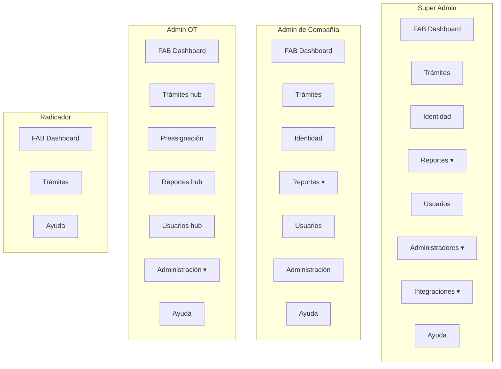

# Árbol del menú por rol — FLIT 2.0

> Generado: 2026-08-04 · fuente: `frontend/components/atom/Shell.tsx`, `frontend/components/atom/dock/dockGroups.ts`, `frontend/components/admin/transit-offices/ot-nav.ts`, `frontend/components/admin/companies/CompanyConfigTabs.tsx`, `frontend/hooks/useAccessibleModules.ts`, seed DEV `DevelopmentAuthSeeder.cs`.
>
> Documento descriptivo del **menú real en código** (dock inferior). No decide producto: si contradice al código, regenerar.

---

## 1. Cómo funciona la navegación

FLIT **no** usa un sidebar vertical. La navegación principal es un **dock inferior flotante** (`Shell.tsx` + `dock/*`):

| Pieza | Comportamiento |
|---|---|
| **FAB central** (`Inicio FLIT`) | Abre el módulo Dashboard (`/?m=dashboard`). No aparece como ítem del dock. |
| **Píldora de un solo ítem** | Navega directo (ej. Trámites, Ayuda, Administración). |
| **Píldora con varios ítems** | Abre submenú hacia arriba (ej. Administradores → Compañías / Tránsito / RBAC). |
| **Móvil (`<lg`)** | Lanzador FAB + hoja agrupada por secciones. |
| **Menú de usuario (⋮)** | Común a todos: Actualización de información, Cambio de contraseña, Salir. |

### Capas que deciden qué se ve

```
┌─────────────────────────────────────────────────────────┐
│ 1. RBAC — GET /api/v1/security/modules                  │
│    → visibleModuleCodes (filtra DOCK base de la SPA)     │
│    → "ayuda" siempre visible                            │
├─────────────────────────────────────────────────────────┤
│ 2. Rol JWT — isSuperAdmin / isAdminCompany / isOtAdmin  │
│    → empuja entradas admin/OT/empresa al dock           │
├─────────────────────────────────────────────────────────┤
│ 3. Permisos puntuales — logqx.read / ict.logs.read      │
│    → LOG QX e ICT (también SuperAdmin por bypass)       │
├─────────────────────────────────────────────────────────┤
│ 4. Agrupación — buildDockGroups(entries)                │
│    → orden estable; omite grupos vacíos                 │
└─────────────────────────────────────────────────────────┘
```

**Códigos de rol JWT**

| Label en UI | `role` / `role_code` |
|---|---|
| Super Admin | `SuperAdmin` |
| Admin de Compañía | `AdminCompany` |
| Admin OT | `ot_admin` |
| Radicador | `Radicador` (sin label especial; muestra el code) |

### Gate de rutas (independiente del menú)

El dock **no** es el control de acceso: `frontend/middleware.ts` + `lib/auth/guard.ts` deciden en el borde quién renderiza cada ruta protegida, y la API vuelve a validar por policy/permiso.

| Ruta | Quién pasa | Resto |
|---|---|---|
| `/admin/*` (todo) | `SuperAdmin` | → `/403` |
| `/admin/transit-offices/*` | `SuperAdmin` + `ot_admin` | → `/403` |
| `/admin/companies/*` | `SuperAdmin` + `AdminCompany` | → `/403` |
| `/empresa/*` | `SuperAdmin` + `AdminCompany` | → `/403` |

Sin token, token malformado o `exp` vencido → `/403` sin renderizar (`hasActiveSession`).

---

## 2. Catálogo de agrupadores del dock

Orden estable (`DOCK_GROUP_ORDER`):

| Grupo (id) | Label visible | Tipo típico |
|---|---|---|
| `tramites` | Trámites | Píldora directa |
| `preasignacion` | Preasignación | Solo Admin OT |
| `identidad` | Identidad | Píldora directa (módulo SPA `validaciones`) |
| `reportes` | Reportes | Submenú si hay Reportes + Reportes Detallados |
| `usuarios` | Usuarios | Píldora directa |
| `administracion` | Administración | Submenú Admin OT (Reglas / Documentos / Requisitos) |
| `administradores` | Administradores | SuperAdmin: Compañías, Tránsito, Documental, Improntas, Quipux, RBAC, Auditoría y submenú anidado Plataforma (Mandatos). AdminCompany: píldora “Administración”. |
| `integraciones` | Integraciones | Log QX / Log ICT si hay permiso |
| `ayuda` | Ayuda | Universal |

---

## 3. Super Admin (`SuperAdmin`)

Acceso global. Bypass de permisos en runtime; el dock RBAC suele exponer **todos** los módulos SPA.

### Árbol del dock

```
FAB Inicio FLIT (Dashboard)
│
├── Trámites                          → /tramites  (o ?m=tramites)
├── Identidad                         → ?m=validaciones
├── Reportes ▾
│   ├── Reportes                      → ?m=reportes
│   └── Reportes Detallados           → ?m=reportes-detallados
├── Usuarios                          → ?m=usuarios
├── Administradores ▾
│   ├── Compañías                     → /admin/companies  (listado global)
│   ├── Tránsito                      → /admin/transit-offices  (listado OT)
│   ├── Documental                    → /admin/documents
│   ├── Improntas                     → /admin/improntas
│   ├── Quipux                        → /admin/quipux
│   ├── RBAC Admin                    → ?m=rbac
│   ├── Auditoría                     → ?m=auditoria
│   └── Plataforma ▾
│       └── Mandatos                  → /admin/plataforma/mandatos  (404 placeholder)
├── Integraciones ▾ (si aplica)
│   ├── Log QX                        → ?m=log-qx
│   └── Log ICT                       → ?m=ict-logs
└── Ayuda                             → ?m=ayuda
```

### Navegación secundaria (fuera del dock)

**Hub OT** (tras entrar a un organismo): `OtTabBar` visible solo para SuperAdmin.

```
/admin/transit-offices/{id}/
├── Trámites
├── Reglas
├── Documentos
├── Requisitos
├── Preasignación
├── Usuarios
└── Reportes
```

**Consola de compañía** (`/admin/companies/{tenantId}`): pestañas `CompanyConfigTabs`.

```
Compañía {razón social}
├── Matrícula Inicial
├── Traspasos
├── Configuración Empresa
├── Documentos
├── Placas preasignadas          (solo si preasignación activa)
├── Representantes legales
├── Mandatarios
├── Usuarios                     (slot SuperAdmin)
└── Historial de Cambios
```

**Improntas**

```
/admin/improntas
├── Generar impronta
└── Historial
```

**Módulo Trámites** (mismo subárbol para todo rol que tenga `tramites.read`)

```
/tramites                          listado
├── /tramites/nuevo/{modalidad}    wizard de radicación (requiere tramites.create)
├── /tramites/{instanceId}         detalle / seguimiento (modo inmersivo)
└── /tramites/prevalidaciones      prevalidación de identidad (enlace desde Identidad)
```

**Módulo Usuarios** (pestañas internas, `Usuarios.tsx`)

```
?m=usuarios
├── Usuarios
├── Roles y permisos
├── Clientes ICT        (solo con ict.clients.manage; SuperAdmin por bypass)
└── Eliminados          (exclusivo SuperAdmin — AdminCompany y Admin OT no la ven)
```

---

## 4. Admin de Compañía (`AdminCompany`)

Administra **su tenant**. Seed DEV: casi todos los permisos SPA excepto `rbac.manage`.

### Árbol del dock

```
FAB Inicio FLIT (Dashboard)
│
├── Trámites                          → /tramites
├── Identidad                         → ?m=validaciones
├── Reportes ▾
│   ├── Reportes                      → ?m=reportes
│   └── Reportes Detallados           → ?m=reportes-detallados
├── Usuarios                          → ?m=usuarios   (módulo RBAC, no ítem “extra” junto a Administración)
├── Administración                    → /admin/companies  (redirige a su tenant — HU #11228)
└── Ayuda                             → ?m=ayuda
```

**No ve:** Compañías (listado global), Documental plataforma, Improntas, Quipux, Tránsito, RBAC Admin, Auditoría global.

### Consola “Administración” (misma ficha de compañía)

Misma barra de pestañas que SuperAdmin, **sin** la pestaña Usuarios inyectada por slot SuperAdmin (gestión de usuarios del tenant va por el módulo dock `Usuarios`).

```
Administración → /admin/companies/{su-tenant}
├── Matrícula Inicial
├── Traspasos
├── Configuración Empresa
├── Documentos
├── Placas preasignadas          (condicional)
├── Representantes legales
├── Mandatarios
└── Historial de Cambios
```

### Usuarios (sub-árbol interno del módulo)

```
?m=usuarios
├── Usuarios              (invitar, editar, suspender, reset de clave — la API lo acota a su tenant)
├── Roles y permisos
└── Clientes ICT          (solo con ict.clients.manage)
✗ Eliminados              — exclusivo SuperAdmin
```

### Reportes (sub-árbol interno del módulo)

Visible según slugs JWT (`reportes.*.read`). Seed AdminCompany suele tener todos:

```
Reportes
├── Resumen general
├── Operación / Trámites
├── Organismo de Tránsito
├── Uso del aplicativo
└── Productividad
(+ programación/alertas si reportes.programacion.manage)
```

---

## 5. Admin OT (`ot_admin`)

Consola del organismo. Las pestañas del hub **viven en el dock**; se omiten los módulos SPA homónimos (`tramites`, `reportes`, `reportes-detallados`, `usuarios`) para no duplicar.

`OtTabBar` **no** se muestra (solo SuperAdmin la conserva).

### Árbol del dock

```
FAB Inicio FLIT (Dashboard)
│
├── Trámites                          → hub OT …/client-procedures
├── Preasignación                     → hub OT …/plate-ranges
├── Identidad                         → ?m=validaciones  (solo si RBAC lo concede; ver nota)
├── Reportes                          → hub OT …/reportes
├── Usuarios                          → hub OT …/usuarios
├── Administración ▾
│   ├── Reglas                        → hub OT …/rules
│   ├── Documentos                    → hub OT …/documents
│   └── Requisitos                    → hub OT …/requirements
└── Ayuda                             → ?m=ayuda
```

**No ve:** Compañías, Documental plataforma, Improntas, Quipux, Tránsito (listado), RBAC Admin, Auditoría.

Rutas del hub: `/admin/transit-offices/{transitOfficeId}/{segment}`. El `transitOfficeId` **no viaja en el JWT**: se resuelve al hacer clic — primero de la URL, luego de `sessionStorage`, y si no, del perfil OT (`resolveOtHubHref`, `ot-nav.ts`).

> **Nota — el dock del Admin OT es casi todo claim, no RBAC.** El rol `ot_admin` se crea **sin permisos** (`CreateTransitOfficeHandler`), así que su catálogo de módulos accesibles llega vacío: del bloque SPA solo sobrevive Ayuda (universal) y todo lo demás lo empuja el claim `ot_admin`. "Identidad" solo aparece si alguien le concede `validaciones.read` explícitamente en RBAC.

Otras diferencias frente a SuperAdmin dentro del hub: no se pinta `OtTabBar` ni el enlace "Volver al listado de OT" (`OtHubLayout`). Las rutas legacy `…/tramites` y `…/webhooks` siguen vivas por URL pero salieron de la oferta de menú, y los **mandatarios** ya no cuelgan del perfil OT (HU #11202): los registra la compañía.

---

## 6. Radicador (`Radicador`)

Operador de compañía. Seed DEV (`radicador@empresa.local`): solo `dashboard.read`, `tramites.read`, `tramites.create`.

### Árbol del dock (DEV / tipico)

```
FAB Inicio FLIT (Dashboard)
│
├── Trámites                          → /tramites
└── Ayuda                             → ?m=ayuda
```

**No ve** entradas de rol admin (`Administración`, OT hub, Compañías, RBAC, etc.). Cualquier módulo SPA adicional solo aparece si el rol tiene el permiso RBAC correspondiente en catálogo (no hardcodeado en `Shell`).

`Radicador` **no es un rol de sistema**: es un rol del catálogo global con `target_entity_type = COMPANY` e `is_system = false`. Su menú es 100 % RBAC — no dispara ningún bloque de rol del `Shell` — y por lo tanto es el único de los cuatro cuyo árbol se puede cambiar **desde RBAC Admin sin tocar código** (concederle `reportes.resumen.read` le enciende la píldora Reportes). Cualquier `/admin/*` o `/empresa/*` lo manda a `/403`.

Dentro del wizard, `tramites.create` es lo que habilita `/tramites/nuevo/{modalidad}`; el usuario semilla vive en `EMPRESA_DEMO` (compañía sin configurar) justamente para verificar que la matrícula inicial nace apagada.

---

## 7. Matriz comparativa (dock)

| Entrada / grupo | Super Admin | Admin Compañía | Admin OT | Radicador (seed DEV) |
|---|:-:|:-:|:-:|:-:|
| Dashboard (FAB) | ✅ | ✅ | ✅ | ✅ |
| Trámites (SPA `/tramites`) | ✅ | ✅ | ❌¹ | ✅ |
| Trámites (hub OT) | vía Tránsito + tabs | ❌ | ✅ | ❌ |
| Identidad | ✅ | ✅ | condicional RBAC | ❌ |
| Reportes / Reportes Detallados (SPA) | ✅ | ✅ | ❌¹ | ❌ |
| Reportes (hub OT) | vía tabs | ❌ | ✅ | ❌ |
| Usuarios (SPA) | ✅ | ✅ | ❌¹ | ❌ |
| Usuarios (hub OT) | vía tabs | ❌ | ✅ | ❌ |
| Administradores ▾ (… + Plataforma → Mandatos) | ✅ | ❌ | ❌ | ❌ |
| Administración → consola compañía | ❌² | ✅ | ❌ | ❌ |
| Administración OT ▾ (Reglas/Docs/Requisitos) | vía tabs | ❌ | ✅ | ❌ |
| Preasignación (dock) | vía tabs | ❌ | ✅ | ❌ |
| Integraciones ▾ (Log QX / Log ICT) | permiso o bypass | permiso | permiso | permiso |
| Ayuda | ✅ | ✅ | ✅ | ✅ |

¹ Omitidos a propósito en dock Admin OT (`otAdminSpaOmit`).  
² SuperAdmin entra por **Administradores → Compañías** (listado), no por la píldora “Administración”.

---

## 8. Diagrama resumen



---

## 9. Archivos fuente

| Qué | Dónde |
|---|---|
| Construcción del dock por rol | `frontend/components/atom/Shell.tsx` |
| Agrupadores / submenús | `frontend/components/atom/dock/dockGroups.ts` |
| UI desktop del dock | `frontend/components/atom/dock/DockDesktop.tsx` |
| Módulos SPA visibles (RBAC) | `frontend/hooks/useAccessibleModules.ts` → `GET /api/v1/security/modules` |
| Hub OT (tabs + keys dock) | `frontend/components/admin/transit-offices/ot-nav.ts` |
| Pestañas consola compañía | `frontend/components/admin/companies/CompanyConfigTabs.tsx` |
| Pestañas Reportes | `frontend/components/atom/modules/Reportes.tsx` |
| Seed roles/permisos DEV | `services/core-api/src/Flit.Infrastructure/Security/DevelopmentAuthSeeder.cs` |
| Tests de menú por rol | `frontend/components/atom/__tests__/Shell.test.tsx` |

---

## 10. Notas

1. El menú es **UX**: ocultar ítems no sustituye policies backend (`context/06-permisos-y-rbac.md`).
2. Multi-rol (HU #10506): si el JWT trae varios roles, pueden aplicarse **varias** ramas (`isSuperAdmin` + `isAdminCompany` + `isOtAdmin`) a la vez.
3. Mientras cargan módulos (`modulesLoading`), `visibleModuleCodes` se pasa vacío: solo quedan Ayuda + entradas empujadas por rol.
4. En ambientes sin seed DEV, el árbol del Radicador (y de cualquier rol custom) depende del catálogo RBAC real, no de hardcodes en el front.

### Trampas verificadas

5. **`improntas` es un permiso sin puerta.** El seed le concede `improntas.read` / `improntas.generate` a AdminCompany, pero `improntas` no está ni en la constante `DOCK` ni en `DOCK_ITEM_GROUP`: el módulo solo se alcanza por el botón "Improntas" del bloque SuperAdmin. AdminCompany tiene el permiso y ninguna entrada por dónde entrar.
6. **`logqx` (código en BD) ≠ `log-qx` (id de módulo en la SPA).** No casan, así que el catálogo RBAC nunca haría visible LOG QX: el gate real es el permiso `logqx.read` evaluado en el dock y en el render. `log-qx` se declara como módulo "universal" solo para que `parseModule` no rebote a Dashboard tras el `router.replace`. Mismo patrón para `auditoria` e `ict-logs`.
7. **Una entrada sin fila en `DOCK_ITEM_GROUP` desaparece en silencio**: `buildDockGroups` hace `continue` con los ítems sin agrupador. Agregar una entrada al `Shell` sin registrarla en el mapa la vuelve invisible sin ningún error.
8. **Dashboard e "Inicio" son el mismo módulo**: `dashboard` es un módulo RBAC real (`dashboard.read`), pero nunca se pinta como píldora — su única puerta es el FAB, que se muestra siempre, tenga o no el permiso.
