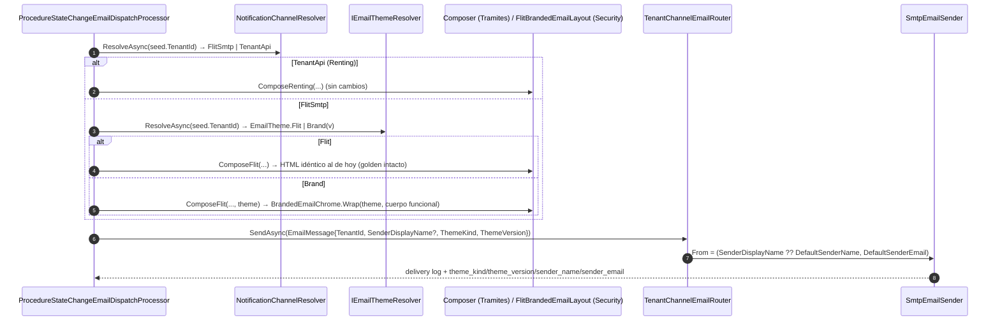

# ADR-0060: Marca Blanca — identidad de marca resuelta por dominio sellado, acceso acotado a la red y tema de correo por red

**Fecha**: 2026-09-15
**Status**: Propuesto
**Deciders**: Líder Técnico FLIT (pendiente — aceptación exclusiva humana, regla FLIT 15), Product Owner (Épica #12237), Architecture Agent
**Tags**: arquitectura, backend, frontend, database, seguridad, infra, multi-tenant, modulo-admin, modulo-security, modulo-notificaciones, marca-blanca
**Épica / Features**: #12237 · #12366 identidad · #12367 aplicación visual · #12368 dominio · #12369 acceso · #12370 titularidad/TLS · #12405 tema de correo
**Base de código**: `develop@6be9cd0b` (épica #12235 Concesión mergeada: `parent_tenant_id`, `tenant_type` con `MARCA_BLANCA`, `TenantScope`, `RequestTenantResolver`, `GroupHeadCompanyPolicy`)
**Relacionado**: [ADR-0057-jerarquia-de-clientes-alcance-tipado-fail-closed] (revisión 2026-09-10: la clase de la cabeza es un valor de `tenant_type`), [ADR-0057-banners-imagen-endpoint-propio-sin-presigned] (Aceptado), [ADR-0042-documentos-personalizados-por-compania], [ADR-0059-estandar-procesos-automaticos-periodicos]

> **Citar este ADR por slug** (`ADR-0060-marca-blanca-identidad-dominio-y-tema-de-correo`): el repo tiene números de ADR duplicados en `services/core-api/docs/adr/`; el slug es la referencia estable.
>
> **Hechos de partida**: los cuatro briefs del `explore-agent` del 2026-09-15 (`.claude/state/marca-blanca/brief-*.json`). Este ADR no reabre las decisiones ya tomadas por el usuario en el plan (PR por Feature; borde/TLS = compose + runbook; Gateway sin validación de JWT = Bug diferido fuera de alcance; TXT DNS vía NuGet `DnsClient`; logo PNG/JPEG/WebP ≤ 512 KB y contraste 4,5:1 parametrizables).
>
> **Los AC mandan**: donde una HU ya fija un contrato (tablas `admin.tenant_brandings` / `admin.tenant_domains`, rutas `/admin/companies/{tenantId}/branding|domain`, `/company/branding`, `/public/branding`, `/me/branding`, código 403 con dominio de red en login, `X-…` sellado en el borde) este ADR lo respeta y solo decide lo que los AC dejan abierto.

---

## Contexto

Una cabeza de red de tipo `MARCA_BLANCA` debe operar bajo su propio dominio con nombre de plataforma, logotipo y paleta propios, aplicados **antes del inicio de sesión** (pantalla de acceso), en la cabecera de la aplicación y en los correos que la plataforma envía en su nombre; sus compañías hijas heredan esa marca sin poder anularla; el acceso por el dominio de la red queda acotado a los usuarios de esa red; y todo lo que no es Marca Blanca (Concesiones, hijas de Concesión, compañías sin red, dominio de FLIT) debe seguir **byte a byte** igual (AC de paridad #12429).

Hechos del código que condicionan la solución (briefs, confianza `high` salvo nota):

- **Cero** campos de marca o dominio en `identity.tenants` ni en `admin.tenant_operational_policies`. La auditoría de gobernanza por campo ya existe (`admin.tenant_config_audit_logs`, escrita en código desde `CompanyWriteRepository` en el mismo `SaveChanges`).
- La resolución del tenant es **100 % JWT** (`RequestTenantResolver`, único punto; test de arquitectura que prohíbe copias). No existe ningún uso de `Host` en la API ni en el Gateway. YARP ya rutea por `Hosts` (`ict-host-route`, `Order -100`) — precedente para el sello. CORS es una lista fija en `appsettings` (Gateway y API).
- Login: **1 email = 1 tenant** (`FindByEmailAsync` devuelve un solo `UserAuthSnapshot`), respuesta ya uniforme 401 `INVALID_CREDENTIALS`, distinciones 403 solo tras verificar contraseña. Enlaces de correo: 3 puntos de invitación (`Invitations:ActivateUrlBase`) + 1 de reset (`PasswordRecovery:ResetUrlBase`), URL fija por ambiente.
- Proxy de borde y TLS viven **fuera del repo** (nginx externo; contenedores en `127.0.0.1`). No hay `DnsClient` ni `System.Net.Dns` (no resuelve TXT). Sí hay patrón `BackgroundService` y estándar de jobs (ADR-0059).
- Correo: sin motor de plantillas; composers `StringBuilder` con **dos variantes hardcoded** (Flit / Renting) en Trámites y un `FlitBrandedEmailLayout.Wrap` solo en Security; `From` global fijo en `SmtpEmailSender`; `TenantId` disponible **antes** de componer en `ProcedureStateChangeEmailDispatchProcessor`; preview de muestra reutiliza los composers de producción (`NotificationSampleRenderer`).
- Frontend: tema oscuro = clase `.dark` con hook local en `Shell.tsx`; sin `ThemeProvider`; sin fetch pre-login; logo hardcodeado en `Shell`/`Login`/`invite/activate`; `<title>` literal; tokens crudos `--color-flit-*` (hex, sin variante dark) coexisten con la paleta shadcn en `oklch()` (con `.dark`). 381 archivos con hex literales (el retemado global no cabe: #12415/#12420 acotan superficies).
- Logo/imágenes administradas: patrón `BannerImageStorage` (puerto acotado sobre `IAttachmentStorage`, GroupId fijo, streaming propio con `ETag`, sin presigned — ADR-0057 banners, Aceptado) y patrón de versionado `admin.company_personalized_documents` (versión, estado, `storage_sha256`, activación/desactivación).

Restricciones: Clean Architecture (domain → application → infrastructure → API); la marca es **lectura pública por dominio** pero toda **escritura va por `TenantScope`/`CanWrite`**; sin editor de plantillas, sin marca en PDF/FUR; sin infraestructura de correo por cliente (§8 del requerimiento); Ley 1581 (la ruta pública no expone NIT, correos, nombres de compañía ni hijos).

---

## Decisión (resumen en cinco líneas)

1. **Modelo**: dos tablas nuevas en `admin` (`tenant_brandings` 1:1 con la cabeza, borrador/publicado en `jsonb` + versión publicada; `tenant_domains` un dominio por red con ciclo de estados) más `tenant_brand_logos` (versionado del logotipo calcado del patrón de documentos personalizados, servido por endpoint propio). La fila vive **solo en la cabeza**; la hija hereda por `parent_tenant_id` en lectura. Auditoría con old/new reutilizando `admin.tenant_config_audit_logs`. Disparadores que exigen `tenant_type = 'MARCA_BLANCA'` al escribir; al cambiar el tipo el dato se conserva y **deja de resolverse** (comprobación en lectura).
2. **Resolución pública por dominio**: el Gateway **sella `X-Flit-Domain`** con el `Host` real (descarta cualquier valor entrante) mediante un `ITransformProvider` de YARP; la API solo lee ese sello y construye un `DomainContext` (`Flit` | `Network(headTenantId)`) en un único componente junto a `RequestTenantResolver`. `GET /public/branding` responde siempre 200 con la misma forma, cache de 60 s por host, rate limit propio, y **respaldo FLIT** para todo caso negativo o fallo. CORS del Gateway = lista fija ∪ dominios activos (endpoint interno con clave, caché 60 s).
3. **Acceso acotado**: `LoginHandler`/`ForgotPasswordHandler` reciben el `DomainContext`; en dominio de red solo autentica un usuario cuyo tenant ∈ {cabeza} ∪ hijas (vía el resolutor de `TenantScope` de la cabeza); en dominio FLIT, un usuario cuya red tiene dominio activo recibe 403 `NETWORK_DOMAIN_REQUIRED` + `networkDomain` **solo con credencial válida**. El JWT gana el claim `dom`; la API rechaza un token bajo un sello distinto. Un `INetworkUrlBaseResolver` sustituye el origen de las URL base configuradas en los 4 puntos de construcción de enlaces (invitación → tenant destino → cabeza → dominio activo; reset → dominio sellado de la solicitud).
4. **Tema de correo**: `EmailTheme` (valores, nunca marcado) + `IEmailThemeResolver` (tenant → tipo/padre → `published` de la cabeza, caché 60 s, fallo → `EmailTheme.Flit`). **Camino FLIT intacto byte a byte**; con tema de marca, los tres módulos (Security, Trámites, Analítica) pasan por un único `BrandedEmailChrome` (cabecera/pie/color). `SmtpEmailSender` usa `EmailMessage.SenderDisplayName` saneado cuando existe; dirección, Reply-To y canal Renting (`TenantApi`) no cambian. El registro de entrega guarda tema, versión y remitente aplicados.
5. **Frontend**: `app/layout.tsx` (Server Component) lee el `host`; si es un host de FLIT no hace ninguna llamada nueva (paridad píxel a píxel); si no, obtiene `GET /public/branding` **por el propio dominio** (misma origen, `revalidate: 60`, timeout corto, fallo → FLIT) e inyecta en `<head>` un bloque `:root{--brand-*}` + `.dark{--brand-*}` con tonos derivados en el servidor. Los tokens `--color-flit-*` pasan a ser **alias** de `--brand-*` con los mismos valores por defecto; la paleta `oklch` de shadcn no se toca en esta ola. En dominios de red la API se consume **misma origen** (`/api/v1`), que es lo que hace posible el sello por `Host`.

---

## D1 — Modelo de marca y dominio

### Opción 1: Tablas dedicadas en `admin` (`tenant_brandings`, `tenant_brand_logos`, `tenant_domains`) — **elegida**

Es la que fijan las notas técnicas de #12412 (DDL 111) y #12416 (DDL 112). Detalle en `.claude/state/marca-blanca/diseno/ddl-conceptual.sql`.

- `admin.tenant_brandings`: `tenant_id` PK y FK a `identity.tenants` `ON DELETE RESTRICT` (1:1 con la cabeza; excepción documentada a A3 del checklist), `draft jsonb`, `published jsonb`, `published_version int`, `published_at/by`, columnas estándar, `row_version`. El `jsonb` lleva `schemaVersion`, `platformName`, `colors{primary,secondary,onPrimary}`, `logoId`. Publicar = copiar `draft` → `published` en la misma transacción, `published_version + 1`, auditoría `TenantBranding.published` old/new.
- `admin.tenant_brand_logos`: una fila por versión (`id uuidv7`, `tenant_id`, `version`, `content_type`, `storage_path`, `storage_sha256`, `size_bytes`, `width_px`, `height_px`, `status active|superseded`). Reutiliza el **mecanismo** de documentos personalizados (versión + integridad + reemplazo que conserva la anterior) sin meter filas en `admin.company_personalized_documents`: esa tabla es de PDF (`page_count`), tiene un resolutor de elegibilidad propio (ADR-0043) y #12413 AC7 exige que ninguna de sus validaciones cambie. Bytes vía puerto acotado `IBrandLogoStorage` → `IAttachmentStorage` (mismo patrón que `BannerImageStorage`, ADR-0057 banners).
- `admin.tenant_domains`: `id uuidv7`, `tenant_id` UNIQUE (un dominio por red) FK `RESTRICT`, `host` UNIQUE en minúsculas (CHECK RFC 1123 + punycode), `status pending|verified|active|failed`, `verification_token` único, `verified_at`, `activated_at`, `certificate_issued_at` (señal de #12426), `failure_reason`, `grace_until`, `next_check_at`, `check_attempts`, soft delete (retiro) con índices únicos parciales `WHERE deleted_at IS NULL`.
- **Disparadores fail-closed** (`identity.trg_require_marca_blanca_head()`, compartido): `BEFORE INSERT OR UPDATE` en las tres tablas exige `tenant_type = 'MARCA_BLANCA' AND is_group_parent` (el CHECK `ck_tenants_group_parent_by_type` de #12406 acopla ambos). **No hay disparador en `identity.tenants`** que borre o cascadee al cambiar el tipo: #12412 AC6 exige conservar el dato y auditar; los resolutores comprueban el tipo **en lectura** (`JOIN identity.tenants ... WHERE tenant_type='MARCA_BLANCA' AND is_active`).
- **Herencia**: la fila existe solo en la cabeza. Un hijo resuelve `parent_tenant_id` → cabeza → `published`. Nunca se copia a la hija (decisión 7 del PO: hereda sin anular).
- **Auditoría**: `admin.tenant_config_audit_logs` con `EntityName ∈ {TenantBranding, TenantBrandLogo, TenantDomain}`, `FieldName ∈ {draft, published, logo, host, status}`, `OldValue/NewValue` como JSON compacto, `ChangedBy` = usuario o `job:dns-verification`. Cambios de estado del dominio (#12425 AC5) van aquí con `NewValue = {"status":"failed","reason":"…"}`: no se crea tabla de historial.

**Pros:** contrato ya pactado en los AC; cero columnas nuevas en `identity.tenants` (tabla caliente leída por el resolver de alcance en cada petición); el `jsonb` borrador/publicado evita una tabla de versiones para un dato pequeño y sin consulta por campo; disparadores + tipo hacen imposible una marca en una hija o en una Concesión aunque falle la aplicación; `published_version` da la traza que piden #12428 AC5 y el cache-busting del logo.
**Cons:** tres tablas y tres disparadores por una funcionalidad de una decena de campos; `jsonb` sin CHECK de forma (la forma la valida la aplicación, #12413); una versión vieja del logo sigue siendo servible por URL (deseado para caché, pero hay que documentarlo).
**Esfuerzo:** M (DDL + repositorio + 2 conjuntos de endpoints).
**Riesgos:** el disparador de tipo y el CHECK de #12406 deben probarse contra PostgreSQL real con tres clientes (AC8 #12412); una publicación y un cambio de tipo concurrentes se resuelven por `row_version`.

### Opción 2: Columnas en `identity.tenants` (`brand_name`, `brand_logo_id`, `brand_primary`, …, `network_host`)

**Pros:** cero tablas nuevas; un solo `SELECT` para tenant + marca; el trigger de jerarquía ya existente podría extenderse.
**Cons:** contradice las notas técnicas de #12412/#12416; obliga a duplicar columnas para borrador/publicado (o a perder el borrador); ensancha la tabla más sensible del sistema (RLS decorativo hoy; cada columna nueva es superficie de fuga en `SELECT *`); un dominio `UNIQUE NULL` por fila mezcla entidad con configuración; auditoría old/new por columna se vuelve verbosa.
**Esfuerzo:** S en DDL, M en código.
**Riesgos:** cambiar `identity.tenants` toca `TenantConfiguration`, `DbTenantScopeResolver` y todo snapshot de tests que serializa tenants.

### Opción 3: Ampliar `admin.tenant_operational_policies` (`TenantSettings`)

**Pros:** ya tiene repositorio, endpoint `GET/PUT /admin/companies/{id}/settings` y auditoría; la hija podría "heredar" con la misma lógica de políticas.
**Cons:** las políticas operativas son **por tenant** (canal, restricciones) y explícitamente no tienen concepto de red (brief notificaciones F10); mezclar marca (pública, heredada, versionada) con políticas (privadas, no heredadas) rompe el aislamiento de lectura pública: la ruta anónima tendría que leer una tabla de políticas; el logo y el dominio no caben como "policy" sin forzar el modelo.
**Esfuerzo:** S.
**Riesgos:** una fuga en el endpoint público de marca expondría políticas operativas.

**Tradeoff aceptado (D1):** tres tablas y tres disparadores a cambio de aislamiento total entre lo público (marca publicada, logo por versión), lo gobernado (borrador) y lo estructural (`identity.tenants` intacta). El acoplamiento al tipo se hace en BD porque es el mismo invariante fail-closed que ya adoptó ADR-0057-jerarquía.

---

## D2 — Resolución pública por dominio antes del login

### Opción 1: Sello `X-Flit-Domain` en el Gateway + API misma origen en dominios de red + `DomainContext` único — **elegida**

```mermaid
sequenceDiagram
    autonumber
    participant B as Navegador (https://cliente.com)
    participant E as nginx externo (catch-all, Host preservado)
    participant N as Next.js server (layout.tsx)
    participant G as Flit.Gateway (YARP)
    participant A as Flit.Api
    participant DB as PostgreSQL

    B->>E: GET / (Host: cliente.com)
    E->>N: proxy_pass (Host: cliente.com)
    N->>N: host ∉ FLIT_HOSTS → hay que resolver marca
    N->>E: GET https://cliente.com/api/v1/public/branding (fetch, revalidate 60 s, timeout 1,5 s)
    E->>G: /api/* → Gateway (Host: cliente.com)
    G->>G: RemoveRequestHeader X-Flit-Domain ; Set X-Flit-Domain = host normalizado
    G->>A: GET /api/v1/public/branding (X-Flit-Domain: cliente.com)
    A->>A: DomainContextMiddleware → ITenantDomainResolver (caché 60 s)
    alt caché fría
        A->>DB: SELECT d.tenant_id, b.published … WHERE host=$1 AND status='active' AND t.tenant_type='MARCA_BLANCA' AND t.is_active
    end
    A-->>G: 200 BrandIdentityResponse (marca publicada | identidad FLIT, misma forma)
    G-->>N: 200
    N-->>B: HTML con <style>:root{--brand-*}.dark{--brand-*}</style>, <title>, favicon → primera pintura ya con marca
    B->>E: GET /api/v1/public/branding/logos/{logoId} (Cache-Control: immutable)
```

- **Sello**: `Flit.Gateway` registra un `ITransformProvider` (`DomainSealTransform`) que en **toda** ruta hace `RequestHeaderRemove: X-Flit-Domain` y luego `RequestHeader Set: X-Flit-Domain = Request.Host.Host` en minúsculas y sin puerto. Se elige un transform en código y no solo `appsettings` porque la secuencia "borrar lo entrante, sellar lo real" debe ser inmutable y testeable (AC5 #12417 prueba negativa de suplantación). El precedente `ict-host-route` no se toca (AC4).
- **Misma origen en dominios de red**: el borde (#12421) enruta `cliente.com/api/v1/*` → Gateway y el resto → frontend. Así el `Host` que ve el Gateway **es** el dominio de la red también en login, recuperación y todo el runtime. El frontend resuelve la base de la API en tiempo de ejecución: host ∈ `NEXT_PUBLIC_FLIT_HOSTS` → `NEXT_PUBLIC_API_BASE_URL` (hoy); si no → `/api/v1` relativo. Esta es la pieza que hace verdadero "el dominio se toma del sello, nunca de un parámetro" para todo el flujo, no solo para la marca.
- **Fetch del servidor Next**: va por el **propio dominio público** (hairpin por el borde) — no existe cabecera de confianza ni parámetro; el Gateway sella lo que ve. En hosts de FLIT no se llama a nada (paridad). Alternativa técnica si el VPS no admite hairpin: petición al Gateway interno con `Host` sobrescrito vía `http.request` (undici `fetch` descarta `Host`); ver *missing_facts*.
- **`DomainContext`** (`Flit.Api/Authorization/DomainContext.cs` + `DomainContextMiddleware` en el mismo componente que `RequestTenantResolver`, para no romper `TenantResolutionArchitectureTests`): `Kind ∈ {Flit, Network}`, `Host`, `HeadTenantId?`. Sin sello, sello vacío o host ∈ hosts FLIT ⇒ `Flit`. Lo consume `IDomainContextAccessor` desde Application (interfaz en `Flit.Modules.Security.Application`, implementación en API).
- **`ITenantDomainResolver`** (`Flit.Admin.Application/Domains/`): `ResolveAsync(host)` → `NetworkResolution.None | Head(tenantId)`; lee BD con `IMemoryCache` 60 s por host **y** entrada negativa cacheada (mismo coste para host desconocido); invalidación explícita al cambiar/retirar dominio, al publicar marca y al cambiar el tipo (`CompanyWriteRepository`). Cualquier excepción ⇒ `None` + log `Warning` (AC4 #12416).
- **`GET /public/branding`**: siempre `200`, `BrandIdentityResponse { platformName, logoUrl, colors{primary,secondary,onPrimary}, version }` con `BrandIdentity.Flit` (`"FLIT 2.0"`, `logoUrl: null` → el frontend usa su SVG empaquetado, colores = tokens actuales, `version: 0`) para todo negativo (desconocido, pendiente, fallido, inactivo, sin publicar, fallo). Sin `isDefault` ni ids de tenant. Un `Stopwatch` de relleno hasta un mínimo configurable (`PublicBranding:MinResponseMs`, default 0 en dev) cubre el "tiempo equivalente" si la suite de #12429 lo exige. `Cache-Control: public, max-age=60` + `Vary: X-Flit-Domain`. Rate limit ASP.NET (`RateLimiter` policy `public-branding`, partición por IP del `X-Forwarded-For` que sella el borde).
- **Logo**: `GET /public/branding/logos/{logoId}` (uuidv7 opaco de la versión; no es id de compañía) → streaming con `Content-Type` sniffed, `ETag: sha256`, `Cache-Control: public, max-age=31536000, immutable`. Publicar una versión nueva cambia `logoId` ⇒ cambia la URL (AC4 #12418). Un `logoId` inexistente responde igual que uno de una cabeza que dejó de ser MB (404 sin cuerpo).
- **`GET /me/branding`** (auth): cabeza → su `published`; hija → la de su `parent_tenant_id` (vía `TenantScope`, no el token); Concesión/sin red/Concesión-hija → FLIT. Sin parámetro de tenant (AC5: nadie puede pedir la marca de otra red).
- **CORS derivados**: `Flit.Gateway` sustituye `AddDefaultPolicy(WithOrigins(lista))` por `SetIsOriginAllowed(origin => allowedOrigins.Contains(origin))` donde `allowedOrigins` = lista fija ∪ `https://{host}` de dominios activos, obtenidos por `GET /api/v1/internal/domains/active` en `Flit.Api` (protegido por `X-Internal-Key` de entorno; YARP **no** publica `/api/v1/internal/*` — ruta explícita a 404) con caché 60 s y fallo ⇒ solo la lista fija. Con misma origen en dominios de red, CORS es defensa en profundidad para clientes que aún usen la base absoluta.
- **`/public/domain-context`**: **no se implementa**. Toda la información que daría (¿es dominio de red?) ya está en `/public/branding` o la deduce el frontend comparando el host con `NEXT_PUBLIC_FLIT_HOSTS`, y una ruta más es una superficie más de enumeración.

**Pros:** cero confianza en cabeceras del cliente; un único componente de resolución (cumple la regla de #12320); reutiliza `IMemoryCache`, YARP transforms y el patrón `Public/` de endpoints; el hairpin evita cualquier "cabecera interna de confianza"; negativa y positiva comparten camino y caché ⇒ anti-enumeración por construcción.
**Cons:** exige que el borde enrute `/api/v1/*` bajo cada dominio (decisión de infra #12421) y que el frontend resuelva la base de la API en runtime en `client.ts` y `tramites-client.ts`; el Gateway necesita un endpoint interno y una clave de entorno más; el hairpin depende de que el certificado del dominio ya esté emitido (coherente con "activo solo con certificado", #12425 AC3).
**Esfuerzo:** M (Gateway S, API M, frontend S).
**Riesgos:** colisión de `/api/v1` con rutas propias de Next (`app/api/**`) — verificar; hairpin no permitido en el VPS — alternativa `http.request` con `Host`; el Gateway hoy no valida JWT (Bug diferido): quien hable directo con `Flit.Api` puede fabricar `X-Flit-Domain` — límite declarado en los Features #12368/#12369, no se mitiga aquí.

### Opción 2: Parámetro `?host=` / cabecera `X-Flit-Domain` aceptada del cliente, con validación en la API

**Pros:** no toca el Gateway ni el borde; el servidor Next pasa el host que ve; funciona con la base absoluta de la API (`api.<env>…`).
**Cons:** viola AC1 de #12418 y AC1/AC5 de #12417 (el cliente elige el dominio ⇒ sondeo masivo y suplantación de contexto de login); obliga a listas de confianza por IP para "clientes internos", que no existen en el repo.
**Esfuerzo:** S.
**Riesgos:** enumeración y suplantación; rechazada por los AC.

### Opción 3: Resolver el dominio desde `Origin`/`Referer`

**Pros:** el navegador fija `Origin` y JS no puede alterarlo; no exige misma origen; el frontend sigue con la base absoluta.
**Cons:** `Origin` es trivial de fabricar fuera del navegador (curl); la petición del servidor Next no lleva `Origin`; no es "el host real de entrada" que exige AC1 #12417; los enlaces de correo (misma origen por naturaleza) seguirían necesitando el `Host`.
**Esfuerzo:** S.
**Riesgos:** los mismos que la opción 2 con una capa de confusión más.

**Tradeoff aceptado (D2):** pagar la exigencia de misma origen en dominios de red (borde + base de API en runtime) a cambio de un único mecanismo de dominio válido para marca, login, recuperación, activación y runtime, no falsificable desde el navegador.

---

## D3 — Acceso acotado por dominio, redirección y enlaces de correo

### Opción 1: Acotamiento en los handlers de Security con `DomainContext` + claim `dom` + resolutor de URL base por red — **elegida**

```mermaid
sequenceDiagram
    autonumber
    participant B as Navegador
    participant G as Gateway (sella X-Flit-Domain)
    participant A as Flit.Api (DomainContextMiddleware)
    participant L as LoginHandler
    participant S as ITenantNetworkMembership (TenantScope de la cabeza)

    B->>G: POST /api/v1/auth/login {email, password}
    G->>A: + X-Flit-Domain
    A->>L: HandleAsync(request, domainContext)
    L->>L: snapshot = FindByEmail; SIEMPRE Verify(password) (tiempo constante)
    alt credencial inválida o snapshot null
        L-->>B: 401 INVALID_CREDENTIALS (igual que hoy)
    else dominio de red R
        L->>S: ¿snapshot.TenantId ∈ {R} ∪ hijas(R)? ¿no SuperAdmin?
        alt no pertenece
            L-->>B: 401 INVALID_CREDENTIALS (mismo cuerpo, mismo código)
        else pertenece
            L-->>B: 200 {token(claims + dom=R.host), …campos de hoy}
        end
    else dominio FLIT
        L->>S: ¿tenant ∈ red MARCA_BLANCA con dominio activo?
        alt sí y no es SuperAdmin
            L-->>B: 403 NETWORK_DOMAIN_REQUIRED {networkDomain:"cliente.com"} (aditivo)
        else no
            L-->>B: 200 igual que hoy (token con dom=flit)
        end
    end
```

- **Pertenencia a la red**: `ITenantNetworkMembership.IsMemberAsync(headTenantId, tenantId)` implementado sobre el mismo `DbTenantScopeResolver` de ADR-0057-jerarquía (`Group(head, hijos)`); nunca datos del cliente. Con el hecho 1 email = 1 tenant, "las asignaciones de la sesión" son una: el JWT sale exactamente como hoy (mismo `tenant_id`), y el "selector de compañía" de #12424 AC1 degenera a una compañía. Si el modelo de membresías múltiples llegara a existir, este punto (`LoginHandler:22`) es el único a ampliar.
- **Tiempo constante**: el hash de contraseña se verifica **siempre** (también con snapshot nulo, contra un hash señuelo ya usado hoy si existe; si no, se introduce `DummyPasswordHash`) y la comprobación de red ocurre **después** del hash en todos los caminos; el cuerpo/código del rechazo de red es el mismo `InvalidCredentialsException`.
- **Redirección**: 403 + `error: "NETWORK_DOMAIN_REQUIRED"`, `networkDomain: "<host>"` sigue el patrón vigente de 403 post-verificación (`ACCOUNT_TEMPORARILY_BLOCKED`, `ALL_ROLES_INACTIVE`); ruta y verbo intactos, campos aditivos y opcionales (AC7 #12422). Solo si la red tiene dominio **activo**; sin dominio activo, la red entra por FLIT como hoy (coherente con #12423 AC1).
- **Ligadura al dominio**: `IJwtTokenIssuer.IssueToken` añade el claim `dom` (`flit` | host). `DomainBindingMiddleware` (mismo componente) rechaza con 401 un token cuyo `dom` ≠ dominio sellado normalizado. Tokens sin claim `dom` (emitidos antes del despliegue) se tratan como `flit` ⇒ siguen valiendo en el dominio de FLIT (paridad, sin logout masivo). SuperAdmin: en dominio de red, `INVALID_CREDENTIALS`.
- **Recuperación**: `ForgotPasswordHandler` recibe `DomainContext`; envía correo solo si (dominio de red ∧ usuario ∈ red) ∨ (dominio FLIT ∧ usuario ∉ red MB con dominio activo); la respuesta es la misma en todos los casos (ya lo es hoy).
- **URL base por red**: `INetworkUrlBaseResolver` en `Flit.Modules.Security.Application/Auth/`: `ForTenantAsync(tenantId, configuredBase)` (invitación: tenant destino → cabeza → dominio activo) y `ForRequestDomain(domainContext, configuredBase)` (reset). Devuelve `https://{host}{PathAndQuery(configuredBase)}` cuando hay dominio activo; si no, **la cadena configurada literal** (prueba de igualdad literal, AC4 #12423). Los 4 puntos (`CreateInvitationHandler:59`, `ResendInvitationHandler:47`, `ReactivateInvitationHandler:87`, `ForgotPasswordHandler:44`) sustituyen `options.XUrlBase` por el resolutor.
- **Activación en dominio ajeno** (#12423 AC5): sin columna nueva. `ActivateInvitation`/`ResetPassword` calculan "dominio esperado" = `ForTenantAsync(tenant del token)` y lo comparan con el sello; si difiere ⇒ el mismo error genérico de token inválido. Reenviar recalcula con el dominio vigente (AC2) sin estado adicional.

**Pros:** cambios en 2 handlers + 1 emisor + 1 middleware; el JWT no crece con listas; reutiliza `TenantScope`; ningún contrato existente cambia; sin tablas nuevas para tokens.
**Cons:** la ligadura `dom` es una restricción de producto mientras el Gateway no valide firma (límite declarado en #12369); el resolutor de URL hace una lectura de BD por correo (cacheada 60 s por tenant en `ITenantDomainResolver`).
**Esfuerzo:** L para #12422 (8 SP: matriz de pruebas y tiempos), S para #12423.
**Riesgos:** una regresión en el orden hash → red rompería el tiempo constante; mitigación: test que mide muestras repetidas con tolerancia (AC8 #12422, AC2 #12429).

### Opción 2: Acotamiento en el Gateway (ruta por `Hosts` con policy que exige `dom` en el JWT y rechazo de login por dominio)

**Pros:** un solo lugar; la API no cambia.
**Cons:** el Gateway no tiene BD ni conoce la jerarquía; debería llamar a la API para saber la red del usuario ⇒ doble salto y latencia en login; hoy no valida JWT (F7) ⇒ policy inerte; la recuperación de contraseña y los enlaces siguen necesitando la API.
**Esfuerzo:** M.
**Riesgos:** control de acceso repartido en dos capas; el pass-through de firma lo vacía.

### Opción 3: Tabla de membresías usuario↔tenant con selector post-login

**Pros:** cubre literalmente #12422 AC1 y #12424 AC1 (varias asignaciones por usuario) y la decisión 6 del PO.
**Cons:** el hecho es que hoy 1 email = 1 tenant y no existe membresía (brief auth F2); introducirla es un rediseño del módulo Security (invitaciones, roles por tenant, `UserAuthSnapshot`) muy superior a 8 SP y fuera de la épica; el plan del orquestador ya lo descarta.
**Esfuerzo:** L+.
**Riesgos:** desbordar la ola; contradice el plan aceptado.

**Tradeoff aceptado (D3):** implementar el acotamiento sobre el modelo real (un tenant por usuario) dejando el punto único de ampliación documentado, a cambio de que el "selector" de #12424 sea, hoy, una lista de un elemento.

---

## D4 — Tema de correo por red

### Opción 1: `EmailTheme` + `IEmailThemeResolver`; camino FLIT byte a byte intacto; `BrandedEmailChrome` único para tema de marca — **elegida**



- **Dónde vive**: `EmailTheme` (record: `Kind Flit|Brand`, `PlatformName`, `LogoUrl` absoluta, `PrimaryColor`, `SecondaryColor`, `OnPrimaryColor`, `Version`) e `IEmailThemeResolver` en `Flit.Modules.Security.Domain/Auth/` junto a `IEmailSender`/`EmailMessage`, que es el contrato que ya comparten Security.Application e Infrastructure. Implementación `DbEmailThemeResolver` en `Flit.Infrastructure/Notifications/Theme/` (tenant → `tenant_type`/`parent_tenant_id` → `published` de la cabeza; caché 60 s; fallo ⇒ `EmailTheme.Flit` + log). `LogoUrl` = `{PublicApiBaseUrl}/api/v1/public/branding/logos/{logoId}` (nueva opción `PublicBranding:PublicBaseUrl`, hermana de `NotificationEmailAssetsOptions.BaseUrl`), absoluta y sin presigned (AC3 #12428).
- **Inyección**: Trámites — `ComposeFlit(…)` en `TramiteCambioEstadoEmailComposer`/`AsignacionPlacaEmailComposer` gana un parámetro `EmailTheme theme`; con `theme.Kind == Flit` ejecuta el código actual sin cambios (golden `TramiteEmailGoldenTests` intacto); con `Brand` envuelve el **cuerpo funcional** (mismo texto y datos) en `BrandedEmailChrome`. Security — `FlitBrandedEmailLayout.Wrap(theme, …)`: `Flit` ⇒ camino actual; `Brand` ⇒ `BrandedEmailChrome`. Analítica — mismo patrón sobre sus composers. `BrandedEmailChrome` (`Flit.Modules.Security.Domain/Auth/`, sin dependencias) es la **única** cabecera/pie con tema: tabla 600 px, estilos en línea, sin fuentes externas, `alt` en el logo, color principal en botones/enlaces, pie con el nombre (AC2/AC7 #12428).
- **Remitente** (#12430): `EmailMessage.SenderDisplayName` (aditivo, `null` por defecto). `SmtpEmailSender` usa `new MailboxAddress(SanitizeDisplayName(name), settings.DefaultSenderEmail)`; el saneado quita CR/LF/control, `<`, `>`, `@`, `"`, recorta a 64. `RentingEmailApiSender` ignora el campo (canal intacto). Reply-To no existe y sigue sin existir.
- **Traza**: `admin.notification_delivery_logs` + `theme_kind`, `theme_version`, `sender_name`, `sender_email` (nullables; filas antiguas quedan en `NULL`).
- **Muestra**: `NotificationSampleRenderer.Render(id, channel, assetsBaseUrl, overlay, theme)`; `GET …/plantillas/{id}/muestra?tenantId=` (SuperAdmin: resuelve el tema de esa red; sin `tenantId` ⇒ FLIT idéntico a hoy) y `GET /company/branding/email-sample?templateId=&source=draft|published` (cabeza: el tema se construye desde su borrador o publicado, sin persistir). La prueba de envío de la consola gana `tenantId` opcional (AC2 #12430).

**Pros:** paridad byte a byte garantizada por construcción (el camino FLIT no se toca); un solo chrome para tema de marca ⇒ la matriz de clientes de correo (AC7) se verifica una vez; resolutor cacheado y con respaldo; sin marcado configurable ⇒ sin sanitización de HTML ni phishing con marca del cliente; canal Renting intacto.
**Cons:** en modo marca conviven dos "estructuras" en el código (la de FLIT por módulo y el chrome único); el cuerpo funcional debe extraerse de cada composer como fragmento reutilizable (refactor mecánico guiado por los goldens); AC8 "ningún envío construye su propio encabezado" se cumple para tema de marca y se documenta que para FLIT sigue la cabecera actual por AC9.
**Esfuerzo:** M (#12428 5 SP, #12430 3 SP).
**Riesgos:** un composer de Analítica que no se haya inventariado se quedaría sin tema — mitigación: `SecurityEmailTemplateCatalogCoverageTests`/`NotificationTemplateCatalogTests` ampliados a "toda plantilla del catálogo renderiza con `Brand`".

### Opción 2: Parametrizar en sitio las dos variantes actuales (Flit/Renting) con valores de tema, sin chrome nuevo

**Pros:** diff mínimo; goldens intactos si `theme = Flit` reproduce los mismos literales.
**Cons:** cada módulo mantiene su cabecera/pie distinta también en modo marca (contradice la "estructura única" de #12428); tres lugares donde probar clientes de correo; la variante Renting se contamina de parámetros que no usa.
**Esfuerzo:** S-M.
**Riesgos:** deriva entre módulos con el tiempo.

### Opción 3: Unificar todos los módulos en un layout único y regenerar los goldens

**Pros:** una sola estructura para todo, también FLIT; código más limpio.
**Cons:** rompe AC9 de #12428 y AC1 de #12429 (cuerpo idéntico byte a byte "al de antes de la épica"); cambia correos de compañías que no pidieron nada.
**Esfuerzo:** M.
**Riesgos:** regresión visual para todos los clientes; rechazada por los AC.

**Tradeoff aceptado (D4):** dos estructuras en código (FLIT heredada + chrome de marca) a cambio de cero riesgo de regresión para quien no es Marca Blanca. Se propone al PO/QA leer AC8 como "todo envío con tema de marca usa el chrome único".

---

## D5 — Proveedor de marca en el frontend

### Opción 1: Resolución en `app/layout.tsx` (Server Component) + `<style>` inyectado + `BrandProvider` de contexto + alias `--color-flit-*` → `--brand-*` — **elegida**

- **Resolución**: `lib/brand/resolve-brand.server.ts` (solo servidor): `host = headers().get('host')`; si `host ∈ NEXT_PUBLIC_FLIT_HOSTS` (lista por ambiente; default `localhost:*`, `dev.flitsas.online`, …) ⇒ `FLIT_BRAND` sin fetch. Si no ⇒ `fetch('https://'+host+'/api/v1/public/branding', { next: { revalidate: 60 }, signal: AbortSignal.timeout(1500) })`; cualquier error ⇒ `FLIT_BRAND` + `console.warn`. `React.cache()` para que `generateMetadata()` y el layout compartan la misma resolución.
- **Inyección**: `layout.tsx` renderiza `<BrandStyle brand={brand}/>` (un `<style id="brand-tokens">` en `<head>` con `:root{--brand-primary;--brand-secondary;--brand-on-primary;--brand-primary-hover}` y `.dark{…}` con tonos derivados en servidor por `lib/brand/derive-dark.ts`: conversión hex→OKLCH, ajuste de luminosidad y comprobación de contraste con `lib/brand/contrast.ts` — la **misma fórmula WCAG 2.1** que #12413; si un tono derivado no llega a 4,5:1 se corrige la luminosidad hasta cumplir). Sin dependencia nueva (≈80 líneas). El conmutador `.dark` de `Shell.tsx` no cambia.
- **Tokens**: en `globals.css` los `--color-flit-primary/brand/tech/alert/bg/gray` pasan a `var(--brand-*, <hex actual>)` con el hex actual como valor por defecto. Sin bloque inyectado, el CSS computa **exactamente los mismos valores** (paridad píxel a píxel en host FLIT). La paleta `oklch` de shadcn (`--primary`, `--background`, …) **no se remapea** en esta ola: gobierna componentes fuera del alcance cerrado; #12415 puede proponer remapear `--primary` si el inventario demuestra que la cabecera lo usa.
- **Contexto**: `components/brand/BrandProvider.tsx` (cliente) expone `useBrand()` → `{ platformName, logoUrl, colors, isFlit }`; `Shell.tsx`, `Login.tsx`, `invite/activate/page.tsx`, `AuthCard` leen logo/nombre de ahí (`logoUrl ?? asset FLIT según tema`). `generateMetadata()` fija `title` y `icons` (favicon = `logoUrl` PNG/WebP/JPEG; FLIT = actual).
- **Sesión**: en host de red, `Shell` no vuelve a pedir nada (la marca por host ya es la de la red y el login garantiza que el usuario pertenece a ella). `GET /me/branding` queda como contrato de backend (AC5 #12418) consumido solo por el configurador (#12414) para "marca publicada" y por pruebas; en host FLIT **cero llamadas nuevas** (AC7 #12419).
- **Base de la API**: `lib/api/base-url.ts` → `isFlitHost(location.host) ? NEXT_PUBLIC_API_BASE_URL : '/api/v1'`, consumido por `client.ts` y `tramites-client.ts`.

**Pros:** primera pintura con marca sin destello (SSR); cero llamadas nuevas en FLIT; sin `next-themes` ni librería de color; el modo oscuro reutiliza el mecanismo existente; el contexto es un único componente reutilizable por las cinco superficies del alcance.
**Cons:** dos superficies de tokens siguen coexistiendo (crudos vs oklch); la derivación de tonos en servidor exige una función propia; `headers()` convierte el layout raíz en dinámico para dominios de red (ya lo es de facto por `SessionExpiredListener`; en host FLIT se puede cortocircuitar antes de leer nada más).
**Esfuerzo:** M (#12419 5 SP).
**Riesgos:** una superficie que lea hex literal en vez del token no cambia de color — lo cubre la regla de lint de #12415 y el saneamiento de #12420.

### Opción 2: `middleware.ts` (edge) resuelve la marca y la pasa por cookie/cabecera a un `ThemeProvider` cliente

**Pros:** un punto de intercepción ya existente; permite reescribir rutas por host.
**Cons:** el edge no debe hacer fetch con timeout largo en cada petición; la cookie es dato del cliente (manipulable) y el ADR prohíbe decidir marca desde datos del cliente; el primer render seguiría dependiendo de JS para aplicar tokens ⇒ destello.
**Esfuerzo:** M.
**Riesgos:** latencia en todas las rutas; marca por cookie falsificable.

### Opción 3: Resolución en cliente (`useEffect` en `Login`/`Shell`) tras la primera pintura

**Pros:** cero cambios en Server Components; fácil de probar.
**Cons:** destello con colores de FLIT (viola AC1 #12419); `<title>`/favicon tarde; dos fetches (login y shell).
**Esfuerzo:** S.
**Riesgos:** rechazada por los AC.

**Tradeoff aceptado (D5):** aceptar un layout raíz dinámico y una pequeña librería de color propia a cambio de primera pintura correcta y paridad exacta en FLIT.

---

## Consecuencias

### Lo que se gana
- Una marca, un dominio y un tema por red con un solo origen de verdad (la cabeza) y herencia por `parent_tenant_id` en lectura; imposible en hijas/Concesiones por BD.
- Un único mecanismo de dominio (`X-Flit-Domain` sellado + `DomainContext`) que sirve a marca, login, recuperación, activación, enlaces y CORS.
- Paridad verificable: en host FLIT el frontend no llama a nada nuevo y el CSS computa los mismos valores; en correo el camino FLIT no se toca; en login la respuesta negativa es la de hoy.
- Anti-enumeración por construcción: positivo y negativo comparten camino, caché y forma; sin ids internos en lo público.

### Lo que se pierde
- Simplicidad del despliegue: dominios de red exigen misma origen en el borde y base de API en runtime.
- Dos estructuras de correo conviven en código (FLIT heredada + chrome de marca).
- El acotamiento por dominio es una restricción de producto mientras el Gateway no valide firma (Bug diferido).

### Cambios operacionales
- Nuevas opciones de configuración: `PublicBranding:PublicBaseUrl`, `PublicBranding:MinResponseMs`, `PublicBranding:FlitHosts`, `Branding:Logo:{MaxBytes,MinWidth,MinHeight,MaxWidth,MaxHeight}`, `Branding:MinContrastRatio`, `Domains:Reserved`, `Domains:Verification:{Interval,MaxAttempts,GracePeriod}`, `Gateway:InternalKey`, `NEXT_PUBLIC_FLIT_HOSTS`.
- Dependencia nueva auditada: NuGet `DnsClient` (regla 18) — solo `Flit.Infrastructure`, uso acotado a TXT en `_flit-verify.<host>`, resolutor inyectable (`IDnsTxtResolver`) para pruebas.
- Job `dns-domain-verification` conforme a ADR-0059 (`BackgroundService`, claim `FOR UPDATE SKIP LOCKED` sobre `tenant_domains.next_check_at`, configuración en BD y visible en `/admin/jobs`).
- Runbook de alta/baja/reversión de dominio y de emisión ACME en el borde (#12421/#12426), sin secretos en el repo.

---

## ADRs relacionados
- [ADR-0057-jerarquia-de-clientes-alcance-tipado-fail-closed] — `TenantScope`, `parent_tenant_id`, `tenant_type` de cabeza; este ADR **no** lo contradice: reutiliza su resolver y su invariante de tipo.
- [ADR-0057-banners-imagen-endpoint-propio-sin-presigned] (Aceptado) — patrón de imagen servida por endpoint propio; el logo de marca lo sigue.
- [ADR-0042-documentos-personalizados-por-compania] — patrón de versionado con integridad; el logo copia el mecanismo, no la tabla.
- [ADR-0059-estandar-procesos-automaticos-periodicos] — el job de verificación DNS.
- [ADR-0044-envio-real-vs-buzon-de-control-por-despliegue] — el buzón de control captura los correos con tema en pruebas.

## Notas para agentes
- **Database Agent**: materializar `.claude/state/marca-blanca/diseno/ddl-conceptual.sql` en **dos** migraciones EF (`E12412_TenantBrandings` y `E12416_TenantDomains`, timestamps > `20260914200000`) + una tercera para `notification_delivery_logs` (#12428); disparador compartido `identity.trg_require_marca_blanca_head()`; `Down` completo; sin backfill; verificar con el arnés PostgreSQL real con tres clientes (MB, Concesión, sin red).
- **Backend Agent**: `DomainContext`, `DomainContextMiddleware`, `DomainBindingMiddleware` viven en `Flit.Api/Authorization/` (mismo componente que `RequestTenantResolver`) o `TenantResolutionArchitectureTests` fallará; rutas nuevas bajo `/api/v1/company/*` y `/api/v1/admin/companies/{id}/*` deben declararse donde exige `AC7_TodaRutaDeRedEstaCubiertaPorRuntimeScopedRoutes`; `Public/` para lo anónimo; escrituras con `GroupHeadCompanyPolicy` + `CanWrite`; nunca `IgnoreQueryFilters()`.
- **Frontend Agent**: un solo `BrandProvider`; `--color-flit-*` como alias con default; base de API por host; sin `next-themes`; contraste con la misma función que el backend (fixture compartido de casos).
- **QA Agent**: suites de paridad/anti-enumeración (#12429) con muestras repetidas y tolerancia fija; capturas claro/oscuro en host FLIT antes/después; matriz de clientes de correo para el chrome de marca.
- **Security Agent**: revisar saneado de `SenderDisplayName`, sniffer de logo (rechazo de SVG), rate limit público, orden hash → red en login, claim `dom`, endpoint interno con clave, y que ninguna respuesta pública lleve ids de tenant.
- **Infra Agent**: catch-all en el borde con `Host` preservado y `/api/v1/*` → Gateway por dominio; ACME por host; señal `certificate_issued_at` hacia la API (`PUT /internal/domains/{host}/certificate` con clave interna); alerta a 14 días.

## Referencias externas
- RFC 1123 §2.1 (nombres de host), RFC 3492 (punycode), RFC 5322 §3.6.2 (`From` display-name), WCAG 2.1 §1.4.3 (contraste 4,5:1), YARP Transforms (`RequestHeader`, `RequestHeaderRemove`), ASP.NET Core `RateLimiter`, Next.js App Router `headers()` / `fetch` `revalidate`.
