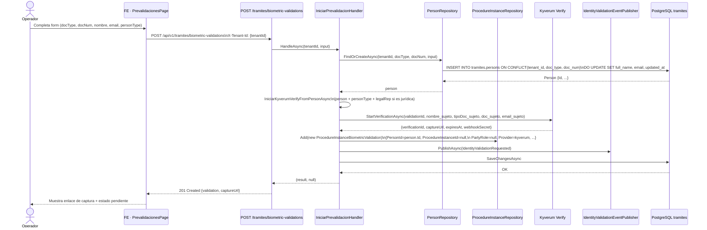
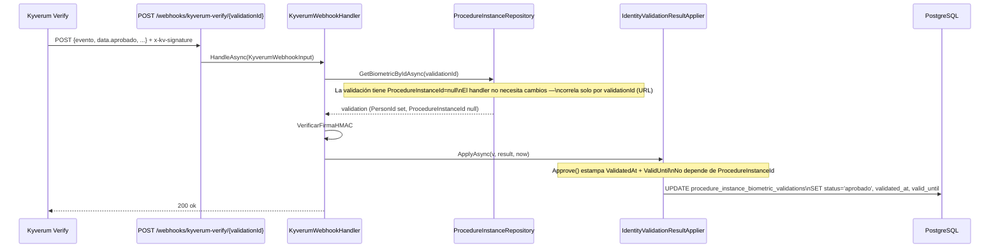

# Diseño Técnico: Feature #10864 — Prevalidación de identidad

> **Estado:** BORRADOR · Pendiente aprobación humana  
> **Fecha:** 2026-07-24  
> **Autor:** architecture-agent  
> **Feature ADO:** [Trámites] Prevalidación de identidad — #10864  
> **HUs hijas:** #10865 (BE) · #10866 (BE) · #10867 (BE) · #10868 (FE) · #10869 (FE)  
> **ADR asociado:** `services/core-api/docs/adr/ADR-0030-persona-entidad-tenant-prevalidacion.md`  
> **Rama base de diseño:** `develop` (no mezclar con `feature/AB-10863-gestion-tramite`)

---

## 1. Contexto

El sistema de validación biométrica actual (`ProcedureInstanceBiometricValidation`) exige que toda
validación esté ligada a un trámite en estado borrador:
- `ProcedureInstanceId` es NOT NULL con FK a `procedure_instances`
- `IniciarKyverumVerifyHandler` exige `instance.Status == TramiteEstado.Borrador`
- `FindVigenteApprovedByDocumentAsync` filtra `v.ProcedureInstance != null && v.ProcedureInstance.DeletedAt == null`

El Feature #10864 requiere dos capacidades nuevas:
1. **CF-01** — Crear validaciones _standalone_ (sin trámite previo) desde un módulo de prevalidación
2. **CF-02** — Reutilizar automáticamente esas prevalidaciones al crear un trámite cuyo actor coincide por documento

La clave de persona `IdentidadKey(tenant, tipoDoc, documento)` ya existe como función estática en
`BiometricRules` pero no hay ninguna entidad persistida que represente a una persona en el tenant.
El documento de actor (`ProcedureInstanceActor`) es hijo del trámite y no sirve como ancla cross-trámite.

---

## 2. Alternativas evaluadas

### Opción A — `tramites.persons` (entidad en el BC tramites, con FK nullable)

Crear tabla `tramites.persons` identificada por `(tenant_id, document_type, document_number)`.  
Hacer `procedure_instance_id` nullable en `procedure_instance_biometric_validations`.  
Agregar `person_id` FK NOT NULL para nuevas filas (NULL para backcompat de registros históricos).  
La entidad `Person` vive en el bounded context tramites, que ya es dueño de `ProcedureInstanceActor`.

**Pros:**
- Sin dependencia cross-BC: tramites sigue siendo autónomo
- Mínima fricción con el stack existente (mismo DbContext, mismos schemas)
- `PersonRepository` puede usar el mismo patrón de `IProcedureInstanceRepository`
- `IdentidadKey` ya define el identificador de negocio; solo se formaliza como entidad
- FK nullable en `procedure_instance_biometric_validations` permite zero-downtime migration

**Contras:**
- `Person` en `tramites` puede sentirse acoplado a ese BC; si en el futuro hay personas sin trámites
  (e.g. en otro módulo FLIT) habría que migrar el schema
- La entidad persona lleva datos de RL embebidos (en vez de una tabla separada `legal_representatives`),
  lo que es denormalizacion pero acorde al patrón actual de `ProcedureInstanceActor`

**Esfuerzo:** M  
**Riesgos:** La FK nullable requiere que `ON DELETE CASCADE` se cambie a `ON DELETE SET NULL`
para que el borrado de instancias no afecte validaciones standalone.

---

### Opción B — `identity.persons` (entidad en el BC identity, cross-schema FK)

Crear `identity.persons` como entidad cross-cutting, con FK cross-schema desde `tramites`.

**Pros:**
- Separación conceptual: una persona es una identidad, no un tramite
- Reutilizable en el futuro para autenticación/users
- Alineado con naming del módulo `identity`

**Contras:**
- FK cross-schema aumenta complejidad de migraciones (dependencias de orden)
- El bounded context `identity` hoy maneja tenants, users, roles — agregar personas sería
  una expansión de scope no planeada
- `IdentitySubject` ya existe como value object en `Flit.Tramites.Application` — duplicar
  la semántica en dos BCs introduce confusión de naming
- Mayor riesgo de conflicto con HUs paralelas del módulo identity

**Esfuerzo:** L  
**Riesgos:** Deuda de integridad referencial cross-schema; complejidad de RLS cross-BC.

---

### Opción C — Sin entidad persona, solo `procedure_instance_id` nullable

Hacer `procedure_instance_id` nullable sin crear una tabla `persons`. Las validaciones
standalone se identifican por el composite `(tenant_id, document_type, document_number)` de
la propia fila de validación, usando el índice existente.

**Pros:**
- Cambio mínimo (una columna nullable + índice + cambio de query)
- Sin migración nueva de entidad
- Zero nuevos modelos de dominio

**Contras:**
- Contradice CF-00 / decisión de producto P1 ("entidad persona/sujeto a nivel tenant") — explícitamente
  rechazada a nivel producto
- Sin entidad persona, no se puede agregar datos de la persona sin duplicar en cada validación
- Difícil construir un historial de validaciones por persona en el futuro
- Sin FK formal, no hay integridad referencial al actualizar documento de la persona

**Esfuerzo:** S  
**Riesgos:** Viola P1 cerrado; deuda de modelo para fases siguientes.

---

## 3. Decisión

**Opción A — `tramites.persons` en el BC tramites, con nullable FK y ON DELETE SET NULL.**

**Justificación:** La persona/sujeto es primariamente un participante de trámites en FLIT en la
fase actual. Colocarla en el BC tramites mantiene la autonomía del bounded context, evita FK
cross-schema y reutiliza el patrón de `ProcedureInstanceActor` (que ya tiene los campos de RL
embebidos en `metadata` JSON). La opción B mejora separación conceptual a largo plazo pero
tiene un costo de complejidad injustificado para el scope actual. La opción C viola P1 y cierra
la puerta a reportes por persona.

La entidad se llama `Person` (no `Subject`) porque:
- `IdentitySubject` ya está tomado como value object en la capa Application
- "Persona" es el término del dominio en FLIT
- `subject` como tabla sería ambiguo con sujetos HTTP/OAuth

**Naming SQL:** `tramites.persons`  
**Naming C#:** `Person` (entity), `IPersonRepository` (interface), `PersonRepository` (impl)

---

## 4. Sequence Diagrams

### 4.1 CF-01 — Crear prevalidación standalone (sin trámite)



### 4.2 CF-02 — Reutilización automática al crear trámite (EnsureIdentity)

```mermaid
sequenceDiagram
    actor Operador
    participant FE as FE · WizardActor
    participant API as POST /instances/{id}/identity/ensure
    participant Handler as EnsureIdentityHandler
    participant Repo as ProcedureInstanceRepository
    participant DB as PostgreSQL tramites

    Operador->>FE: Guarda actor "comprador" en trámite
    FE->>API: POST /api/v1/tramites/instances/{id}/identity/ensure\n{parte: "comprador"}
    API->>Handler: HandleAsync(instanceId, tenantId, "comprador")

    Handler->>Handler: Resolver IdentitySubject del actor\n(IdentitySubjectResolver.For(actor))
    Handler->>Repo: FindVigenteApprovedByDocumentAsync\n(tenantId, tipoDoc, docNum, now)

    Note over Repo,DB: QUERY MODIFICADA: incluye\nProcedureInstanceId IS NULL\n(prevalidaciones standalone)
    Repo->>DB: SELECT * FROM procedure_instance_biometric_validations v\nLEFT JOIN procedure_instances pi ON v.procedure_instance_id = pi.id\nWHERE v.tenant_id=? AND v.status='aprobado'\nAND v.document_type=? AND v.document_number=?\nAND (v.valid_until>now OR v.validated_at>=cutoff)\nAND (v.procedure_instance_id IS NULL\n     OR pi.deleted_at IS NULL)\nORDER BY v.validated_at DESC LIMIT 10

    DB-->>Repo: prevalidacion standalone (procedure_instance_id IS NULL, aprobada, vigente)
    Repo-->>Handler: source (validación standalone vigente)

    Handler-->>API: EnsureIdentityResult(Outcome="reusada", ValidationId=source.Id)
    API-->>FE: 200 {outcome:"reusada", validationId:"..."}
    FE-->>Operador: Identidad marcada como "reusada" sin reenviar enlace
```



### 4.3 Webhook Kyverum — Prevalidación standalone (sin cambio de flujo)



---

## 5. Contrato API (cambios OpenAPI propuestos)

### 5.1 Nuevo endpoint: POST /api/v1/tramites/biometric-validations

```yaml
# Agregar en contracts/openapi/core-api.v1.yaml bajo /api/v1/tramites/biometric-validations

post:
  operationId: iniciarPrevalidacionIdentidad
  tags: [Tramites, Identidad, Prevalidacion]
  summary: Crear prevalidación de identidad standalone (sin trámite) — CF-01
  description: >
    Crea una validación biométrica de identidad sin trámite asociado (prevalidación).
    Encuentra o crea la entidad persona en el tenant por (documentType, documentNumber),
    luego inicia la validación con el proveedor activo (Kyverum o mock).
    El enlace de captura se devuelve en captureUrl para que el operador lo comparta.
    Persona jurídica: los datos del RL (legalRepDocumentType, legalRepDocumentNumber,
    legalRepName, legalRepEmail) son los que validan biométricamente.
  security:
    - bearerAuth: []
  parameters:
    - name: X-Tenant-Id
      in: header
      required: true
      schema: { type: string, format: uuid }
  requestBody:
    required: true
    content:
      application/json:
        schema:
          $ref: "#/components/schemas/IniciarPrevalidacionRequest"
  responses:
    "201":
      description: Prevalidación creada. captureUrl listo para compartir.
      content:
        application/json:
          schema:
            $ref: "#/components/schemas/IniciarKyverumVerifyResult"
    "202":
      description: Encolado (fallo transitorio del proveedor). Worker reintentará el envío.
      content:
        application/json:
          schema:
            $ref: "#/components/schemas/IniciarKyverumVerifyResult"
    "400":
      description: Datos inválidos o incompletos.
    "409":
      description: Ya existe una prevalidación activa o aprobada para este documento.
    "502":
      description: El proveedor rechazó la solicitud (error definitivo).
    "503":
      description: El proveedor no está disponible (error transitorio).
```

### 5.2 Nuevo schema: IniciarPrevalidacionRequest

```yaml
IniciarPrevalidacionRequest:
  type: object
  required: [documentType, documentNumber, name, email]
  properties:
    documentType:
      type: string
      maxLength: 20
      example: "CC"
      description: Tipo de documento de la persona (CC, CE, NIT, PP…)
    documentNumber:
      type: string
      maxLength: 40
      example: "1234567890"
    name:
      type: string
      maxLength: 200
      description: Nombre completo de la persona (o de la empresa si es jurídica).
    email:
      type: string
      format: email
      maxLength: 320
      description: Correo al que se envía el enlace de captura.
    personType:
      type: string
      enum: [natural, juridical]
      default: natural
      description: >
        'natural' → valida al titular; 'juridical' → valida al representante legal
        (datos legalRep* requeridos si personType='juridical').
    legalRepDocumentType:
      type: string
      maxLength: 20
      nullable: true
      description: Tipo de documento del RL (requerido si personType='juridical').
    legalRepDocumentNumber:
      type: string
      maxLength: 40
      nullable: true
    legalRepName:
      type: string
      maxLength: 200
      nullable: true
    legalRepEmail:
      type: string
      format: email
      maxLength: 320
      nullable: true
      description: Correo del RL. Si vacío, se usa el email de la empresa.
```

### 5.3 Cambios en TenantBiometricValidation (schema existente)

Los campos `instanceId`, `referenceNumber` y `modalidad` pasan a **nullable** para soportar
prevalidaciones standalone. Cambio backward-compatible para clientes que ya null-check estos campos
(en `Validaciones.tsx` ya se usa `??` en varios puntos):

```yaml
# En components/schemas/TenantBiometricValidationDto (o equivalente):
instanceId:
  type: string
  format: uuid
  nullable: true      # ANTES: required no-nullable
  description: >
    Id del trámite al que pertenece la validación. NULL para prevalidaciones standalone
    (creadas sin trámite previo — Feature #10864).
referenceNumber:
  type: string
  nullable: true      # ANTES: required no-nullable
  description: Número de referencia del trámite. NULL si standalone.
modalidad:
  type: string
  nullable: true      # ANTES: required no-nullable
  description: Modalidad del trámite. NULL si standalone.
```

### 5.4 Nuevo filtro en GET /api/v1/tramites/biometric-validations

```yaml
# Agregar a los query parameters existentes:
- name: standalone
  in: query
  required: false
  description: >
    true → solo prevalidaciones standalone (sin trámite);
    false → solo las ligadas a un trámite; omitido → todas.
  schema: { type: boolean }
```

---

## 6. Modelo de datos conceptual

### 6.1 Entidades y relaciones

```
tramites.tenants (identity.tenants)
    ↓ tenant_id FK
tramites.persons                        (NUEVA)
    id (PK, uuidv7)
    tenant_id
    document_type + document_number     ← clave de negocio
    full_name, email
    person_type ('natural' | 'juridical')
    legal_rep_*                         ← datos RL embebidos (misma estrategia que ProcedureInstanceActor.metadata)
    created_at/by, updated_at/by, deleted_at/by, row_version

tramites.procedure_instances
    ↑ procedure_instance_id FK (NULLABLE ahora)

tramites.procedure_instance_biometric_validations
    id (PK, uuidv7)
    tenant_id
    procedure_instance_id   → procedure_instances (FK NULLABLE, ON DELETE SET NULL)  ← CAMBIO
    person_id               → persons (FK NULLABLE backcompat, NOT NULL en nuevas filas)  ← NUEVO
    party_role              ← NULL para standalone
    ...columnas existentes sin cambio
```

### 6.2 Invariantes de la entidad

- Una prevalidación standalone: `procedure_instance_id IS NULL AND person_id IS NOT NULL`
- Una validación de trámite (nueva): `procedure_instance_id IS NOT NULL AND person_id IS NOT NULL`
- Una validación de trámite (histórica): `procedure_instance_id IS NOT NULL AND person_id IS NULL`
- Constraint: `CHECK (person_id IS NOT NULL OR procedure_instance_id IS NOT NULL)`

### 6.3 Patrón de identidad del sujeto para standalone

Para persona **natural**: `IdentitySubject(nombre, docType, docNum, email)` = datos directos del body.  
Para persona **jurídica**: el sujeto que valida biométricamente es el RL → `IdentitySubject` usa
`legalRepDocumentType`, `legalRepDocumentNumber`, `legalRepName`, `legalRepEmail`. Este es exactamente
el patrón actual de `IdentitySubjectResolver.For(actor)` para PJ, trasladado al contexto standalone.

---

## 7. DDL de referencia (borrador para database-agent)

> **Nota:** Este DDL es una guía de referencia. El `database-agent` materializará la migración
> EF Core siguiendo `checklist-validacion-schema.md` §A completo.

### 7.1 Tabla nueva: `tramites.persons`

```sql
-- HU #10865 — Entidad persona/sujeto a nivel tenant
-- Sigue el patrón de tramites.procedure_instances (misma convención snake_case + uuidv7 + RLS)

CREATE TABLE tramites.persons (
    id              uuid            PRIMARY KEY DEFAULT uuidv7(),
    tenant_id       uuid            NOT NULL
                                    REFERENCES identity.tenants(id)
                                        ON DELETE RESTRICT
                                        ON UPDATE CASCADE,
    document_type   varchar(20)     NOT NULL,
    document_number varchar(40)     NOT NULL,
    full_name       varchar(200)    NOT NULL,
    email           varchar(320)    NOT NULL,
    -- 'natural' | 'juridical'
    person_type     varchar(20)     NOT NULL DEFAULT 'natural',
    -- Representante legal embebido (solo para jurídicas; null para naturales)
    -- Mismo enfoque que ProcedureInstanceActor.metadata — evita tabla RL separada en fase 1
    legal_rep_document_type   varchar(20),
    legal_rep_document_number varchar(40),
    legal_rep_name            varchar(200),
    legal_rep_email           varchar(320),
    -- Columnas estándar FLIT (checklist §A5/A6)
    created_at      timestamptz     NOT NULL DEFAULT now(),
    created_by      uuid,
    updated_at      timestamptz,
    updated_by      uuid,
    deleted_at      timestamptz,
    deleted_by      uuid,
    row_version     integer         NOT NULL DEFAULT 1
);

-- PK nomenclatura §A12
ALTER TABLE tramites.persons
    RENAME CONSTRAINT persons_pkey TO pk_persons;

-- FK nomenclatura §A7 + índice §A9
CREATE INDEX ix_persons_tenant_id ON tramites.persons (tenant_id);

-- Clave de negocio única por tenant: §A11 (tenant_id primera columna)
CREATE UNIQUE INDEX uq_persons_tenant_document
    ON tramites.persons (tenant_id, document_type, document_number)
    WHERE deleted_at IS NULL;

-- RLS §A10
ALTER TABLE tramites.persons ENABLE ROW LEVEL SECURITY;
CREATE POLICY tenant_isolation ON tramites.persons
    USING (tenant_id::text = current_setting('app.current_tenant_id', TRUE));

-- Trigger row_version §A16
CREATE TRIGGER tr_persons_row_version
    BEFORE UPDATE ON tramites.persons
    FOR EACH ROW EXECUTE FUNCTION tramites.increment_row_version();

-- Trigger audit §A16
CREATE TRIGGER tr_persons_audit
    AFTER INSERT OR UPDATE OR DELETE ON tramites.persons
    FOR EACH ROW EXECUTE FUNCTION audit.log_change();

-- Comentarios PII §A15
COMMENT ON COLUMN tramites.persons.full_name       IS '@pii:medium Nombre completo de la persona.';
COMMENT ON COLUMN tramites.persons.email           IS '@pii:high Correo electrónico de la persona.';
COMMENT ON COLUMN tramites.persons.document_number IS '@pii:high Número de documento de identidad.';
COMMENT ON COLUMN tramites.persons.legal_rep_document_number IS '@pii:high Número de documento del representante legal.';
COMMENT ON COLUMN tramites.persons.legal_rep_email IS '@pii:high Correo del representante legal.';
COMMENT ON COLUMN tramites.persons.legal_rep_name  IS '@pii:medium Nombre del representante legal.';
```

### 7.2 Alteraciones a `tramites.procedure_instance_biometric_validations`

```sql
-- HU #10865 — Hacer procedure_instance_id nullable + agregar person_id FK

-- 1. Agregar columna person_id (nullable para backcompat histórico)
ALTER TABLE tramites.procedure_instance_biometric_validations
    ADD COLUMN person_id uuid REFERENCES tramites.persons(id)
        ON DELETE RESTRICT
        ON UPDATE CASCADE;

-- Nombre FK §A7
ALTER TABLE tramites.procedure_instance_biometric_validations
    RENAME CONSTRAINT
        procedure_instance_biometric_validations_person_id_fkey
    TO fk_procedure_instance_biometric_validations_persons;

-- 2. Índice para FK person_id §A9
CREATE INDEX ix_procedure_instance_biometric_validations_person_id
    ON tramites.procedure_instance_biometric_validations (person_id)
    WHERE person_id IS NOT NULL;

-- 3. Hacer procedure_instance_id nullable
ALTER TABLE tramites.procedure_instance_biometric_validations
    ALTER COLUMN procedure_instance_id DROP NOT NULL;

-- 4. Cambiar ON DELETE behavior de CASCADE → SET NULL
--    (cascade borraba filas de validación al borrar el trámite;
--     con procedure_instance_id nullable, SET NULL protege las standalone)
ALTER TABLE tramites.procedure_instance_biometric_validations
    DROP CONSTRAINT fk_procedure_instance_biometric_validations_procedure_instances;

ALTER TABLE tramites.procedure_instance_biometric_validations
    ADD CONSTRAINT fk_procedure_instance_biometric_validations_procedure_instances
        FOREIGN KEY (procedure_instance_id)
        REFERENCES tramites.procedure_instances(id)
        ON DELETE SET NULL   -- protege validaciones standalone
        ON UPDATE CASCADE;

-- 5. Check de ancla: al menos uno de los dos debe estar seteado
ALTER TABLE tramites.procedure_instance_biometric_validations
    ADD CONSTRAINT ck_biometric_validation_anchor
        CHECK (person_id IS NOT NULL OR procedure_instance_id IS NOT NULL);
```

### 7.3 Índice compuesto para CF-02 (reutilización)

```sql
-- Índice de cobertura para FindVigenteApprovedByDocumentAsync (incluye prevalidaciones standalone)
-- Tenant + doc type + doc number + status + valid_until → cubre el filtro grueso
CREATE INDEX ix_biometric_validations_vigente_approved
    ON tramites.procedure_instance_biometric_validations
        (tenant_id, document_type, document_number, status, valid_until DESC)
    WHERE status = 'aprobado'
      AND deleted_at IS NULL;
```

---

## 8. Lista exacta de archivos a crear/modificar

### 8.1 Backend — `services/core-api/`

#### HU #10865 — CF-00: Entidad persona + migración (database-agent)

| Acción | Archivo |
|--------|---------|
| **CREAR** | `src/Flit.Tramites.Domain/Entities/Person.cs` |
| **CREAR** | `src/Flit.Tramites.Domain/Repositories/IPersonRepository.cs` |
| **CREAR** | `src/Flit.Infrastructure/Persistence/Configurations/Tramites/PersonConfiguration.cs` |
| **CREAR** | `src/Flit.Infrastructure/Persistence/Repositories/PersonRepository.cs` |
| **MODIFICAR** | `src/Flit.Infrastructure/Persistence/FlitDbContext.cs` — agregar `DbSet<Person> Persons` |
| **MODIFICAR** | `src/Flit.Tramites.Domain/Entities/ProcedureInstanceBiometricValidation.cs` — `ProcedureInstanceId` → `Guid?`, agregar `PersonId Guid?`, nav property `Person?` |
| **MODIFICAR** | `src/Flit.Infrastructure/Persistence/Configurations/Tramites/ProcedureInstanceBiometricValidationConfiguration.cs` — nullable FK + SET NULL + `person_id` mapping |
| **CREAR** | `src/Flit.Infrastructure/Migrations/YYYYMMDD_HU10865_PersonEntityAndNullableInstanceId.cs` |
| **CREAR** | `src/Flit.Infrastructure/Persistence/Sql/Ddl/XX-tramites-persons.sql` |
| **MODIFICAR** | `src/Flit.Tramites.Application/DependencyInjection.cs` — registrar `PersonRepository` |

#### HU #10866 — CF-01: Endpoint standalone

| Acción | Archivo |
|--------|---------|
| **CREAR** | `src/Flit.Tramites.Application/UseCases/Persons/IniciarPrevalidacionCommand.cs` — handler + DTOs |
| **MODIFICAR** | `src/Flit.Tramites.Domain/Repositories/IPersonRepository.cs` — `FindOrCreateAsync` |
| **MODIFICAR** | `src/Flit.Infrastructure/Persistence/Repositories/PersonRepository.cs` — impl `FindOrCreateAsync` |
| **MODIFICAR** | `src/Flit.Api/Endpoints/Tramites/BiometricaEndpoints.cs` — agregar `POST /biometric-validations` route |
| **MODIFICAR** | `src/Flit.Tramites.Application/DependencyInjection.cs` — registrar `IniciarPrevalidacionHandler` |

#### HU #10867 — CF-02: Reutilización por referencia

| Acción | Archivo |
|--------|---------|
| **MODIFICAR** | `src/Flit.Infrastructure/Persistence/Repositories/ProcedureInstanceRepository.cs` — `FindVigenteApprovedByDocumentAsync`: quitar `&& v.ProcedureInstance != null` → `&& (v.ProcedureInstanceId == null \|\| v.ProcedureInstance.DeletedAt == null)` |
| **MODIFICAR** | `src/Flit.Infrastructure/Persistence/Repositories/ProcedureInstanceRepository.cs` — `ListVigenteApprovedIdentityKeysAsync`: mismo cambio |
| **MODIFICAR** | `src/Flit.Tramites.Application/UseCases/ProcedureInstances/TenantBiometricValidationListQuery.cs` — agregar filtro `standalone` (bool?) + hacer `instanceId`/`referenceNumber`/`modalidad` nullable en DTO |
| **MODIFICAR** | `src/Flit.Tramites.Application/UseCases/ProcedureInstances/ListTenantBiometricValidationsQuery.cs` — ajustar el handler para LEFT JOIN / navegación nullable |

#### Tests

| Acción | Archivo |
|--------|---------|
| **CREAR** | `tests/Flit.Tramites.Application.Tests/UseCases/Persons/IniciarPrevalidacionHandlerTests.cs` |
| **MODIFICAR** | `tests/Flit.Tramites.Application.Tests/UseCases/ProcedureInstances/EnsureIdentityHandlerTests.cs` — nuevos escenarios: prevalidación standalone vigente → reusada |
| **MODIFICAR** | `tests/Flit.Tramites.Application.Tests/UseCases/ProcedureInstances/TenantBiometricValidationListQueryTests.cs` |

### 8.2 Frontend — `frontend/`

#### HU #10868 — CF-01: Pantalla prevalidación

| Acción | Archivo |
|--------|---------|
| **CREAR** | `app/(dashboard)/tramites/prevalidaciones/page.tsx` — layout + import `PrevalidacionesModule` |
| **CREAR** | `components/atom/modules/PrevalidacionesModule.tsx` — 4 estados (cargando/vacío/error/lleno) |
| **CREAR** | `components/atom/modules/PrevalidacionForm.tsx` — form modal/drawer para crear prevalidación |
| **MODIFICAR** | `components/atom/modules/Validaciones.tsx` — agregar botón "Nueva prevalidación" + link a `/tramites/prevalidaciones` |
| **MODIFICAR** | `frontend/lib/api/tramites-client.ts` — agregar `createPrevalidacion(tenantId, input)` → `POST /biometric-validations` |
| **MODIFICAR** | `frontend/lib/api/types/procedure-runtime.ts` — `TenantBiometricValidation.instanceId/referenceNumber/modalidad` → nullable |
| **MODIFICAR** | `frontend/app/(dashboard)/tramites/page.tsx` o nav — agregar entrada "Prevalidaciones" en el sidebar tramites |

#### HU #10869 — CF-02: Vista transversal tolera null

| Acción | Archivo |
|--------|---------|
| **MODIFICAR** | `components/atom/modules/Validaciones.tsx` — columnas Trámite/Modalidad → nullable display (`referenceNumber ?? "—"`, `modalidad ?? "Prevalidación"`) + badge diferenciador |
| **MODIFICAR** | `frontend/lib/api/types/procedure-runtime.ts` — ya cubierto en HU #10868 |

### 8.3 Contratos e infraestructura

| Acción | Archivo |
|--------|---------|
| **MODIFICAR** | `contracts/openapi/core-api.v1.yaml` — nuevo path `POST /biometric-validations`, nuevo schema `IniciarPrevalidacionRequest`, campos nullable en `TenantBiometricValidationDto` |
| **CREAR** | `services/core-api/docs/adr/ADR-0030-persona-entidad-tenant-prevalidacion.md` |
| **CREAR** | `docs/design/FEATURE-10864-prevalidacion-identidad.md` (este archivo) |

---

## 9. Notas operativas por agente

### Para `database-agent` (HU #10865 — prioritario, prerequisito de todo)

1. **Materializar la migración EF Core** usando el DDL §7 como guía de referencia.
2. Seguir `checklist-validacion-schema.md` §A completo para `tramites.persons`.
3. El `PersonConfiguration.cs` debe:
   - Mapear `HasIndex(x => new { x.TenantId, x.DocumentType, x.DocumentNumber })` con `.IsUnique().HasFilter("deleted_at IS NULL")`
   - Mapear `property(x => x.RowVersion).IsRowVersion()` (§B8 checklist)
   - Usar `.HasDefaultValueSql("uuidv7()")` para la PK (igual que `ProcedureInstanceBiometricValidation`)
4. En `ProcedureInstanceBiometricValidationConfiguration.cs`:
   - `builder.HasOne(x => x.Person).WithMany().HasForeignKey(x => x.PersonId).OnDelete(DeleteBehavior.Restrict)`
   - `builder.HasOne(x => x.ProcedureInstance)...OnDelete(DeleteBehavior.SetNull)` — ⚠️ cambio respecto al Cascade actual
5. **Índice crítico para CF-02:** índice compuesto en `(tenant_id, document_type, document_number, status, valid_until)` en `procedure_instance_biometric_validations` para que `FindVigenteApprovedByDocumentAsync` sea eficiente incluyendo standalone.
6. **Rollback:** asegurar que la migración `Down()` sea reversible; DROP COLUMN es irreversible si hay datos → si hay datos históricos usar `SET NOT NULL` como alternativa al DROP.
7. El `ck_biometric_validation_anchor` CHECK debe estar en la migración.
8. Comentarios `@pii:` obligatorios en `full_name`, `email`, `document_number`, `legal_rep_*` (Ley 1581).

### Para `backend-agent` (HU #10866 y #10867)

**HU #10866 — `IniciarPrevalidacionHandler`:**
1. No reutilizar ni modificar `IniciarKyverumVerifyHandler`; crear handler separado en `UseCases/Persons/`.
2. La resolución del sujeto de identidad (PN vs PJ/RL) debe pasar por `IdentitySubjectResolver` o un patrón equivalente — no duplicar la lógica jurídica.
3. El nuevo handler NO valida estado de trámite (no existe trámite). En su lugar valida:
   - Persona ya tiene prevalidación activa (enviado/en_proceso): error `prevalidacion_activa`
   - Datos del RL presentes cuando personType='juridical'
4. `party_role` debe setearse a `null` en la validación standalone (sin parte comprador/vendedor).
5. `PersonRepository.FindOrCreateAsync`: upsert idempotente por `(tenant_id, document_type, document_number)`. Usar `ON CONFLICT DO UPDATE` en SQL o `ExecuteUpsertAsync` si hay patrón en el repo.
6. El endpoint `POST /biometric-validations` va en `BiometricaEndpoints.cs` (misma clase, nuevo route).
7. El webhook y reconciliación existentes **no requieren cambios**: correlacionan por `validationId` (URL), independiente de si la validación tiene trámite o no.

**HU #10867 — `EnsureIdentityHandler` + repositorio:**
1. Cambio de una línea en `FindVigenteApprovedByDocumentAsync`:
   ```csharp
   // ANTES:
   && v.ProcedureInstance != null
   && v.ProcedureInstance.DeletedAt == null
   
   // DESPUÉS:
   && (v.ProcedureInstanceId == null          // standalone: no tiene instancia, siempre válido
       || (v.ProcedureInstance != null         // ligada a instancia: instancia no eliminada
           && v.ProcedureInstance.DeletedAt == null))
   ```
2. El mismo cambio aplica en `ListVigenteApprovedIdentityKeysAsync` (batch query para el listado).
3. El `EnsureIdentityHandler` mismo NO necesita cambio de lógica: `FindVigenteApprovedByDocumentAsync`
   devuelve la validación (con `ProcedureInstanceId == null` para standalone) y el handler la retorna
   como `Reusada` con el `ValidationId` de la standalone. El front solo necesita el ID de la validación.
4. El DTO de `TenantBiometricValidationDto` necesita `InstanceId`, `ReferenceNumber`, `Modalidad` como nullable.
5. En `ListTenantBiometricValidationsQuery`, el query debe usar LEFT JOIN implícito (navegación EF)
   a `procedure_instances` — EF Core ya hace LEFT JOIN si la nav property es nullable.

### Para `frontend-agent` (HU #10868 y #10869)

**HU #10868 — Pantalla prevalidaciones:**
1. Ruta: `/tramites/prevalidaciones` (nueva página bajo `app/(dashboard)/tramites/`).
2. El form de creación debe implementar los 4 estados WCAG obligatorios.
3. **Riesgo de conflicto con #10863**: `Validaciones.tsx` también es tocado por #10863
   (feature paralelo, rama `feature/AB-10863-gestion-tramite`). Coordinación necesaria:
   - Agregar el botón "Nueva prevalidación" como adición limpia (nueva sección o header action)
   - No modificar las columnas existentes de la tabla — solo agregar el link
4. La pantalla de prevalidaciones puede reutilizar los componentes de `StatusBadge` y los estados
   de `BiometricEstados` que ya existen en `Validaciones.tsx`.
5. Enlace desde `Validaciones.tsx`: un botón/link "Nueva prevalidación" que navega a `/tramites/prevalidaciones`.
   Idealmente en el header del módulo al lado de "Actualizar".

**HU #10869 — Vista transversal tolera null:**
1. En `TenantBiometricValidation` cambiar los tipos TypeScript:
   - `instanceId: string | null`
   - `referenceNumber: string | null`
   - `modalidad: string | null`
2. En la tabla de `Validaciones.tsx`, para filas standalone:
   - Columna "Trámite": mostrar `"—"` o badge `"Prevalidación"` cuando `referenceNumber == null`
   - Columna "Modalidad": mostrar `"—"` cuando `modalidad == null`
   - La navegación al trámite (clic en referencia) debe condicionarse a `instanceId != null`
3. **Riesgo de conflicto con #10863**: mismo archivo. Estrategia recomendada: coordinación de merge
   o PR base compartido con `develop` como base.

### Para `qa-agent`

1. TCs de CF-00: entidad persona creada/actualizada correctamente por (tenant+doc+tipo), unicidad.
2. TCs de CF-01: crear prevalidación natural, jurídica/RL, datos incompletos, prevalidación activa (409).
3. TCs de CF-02: reuso de prevalidación standalone vigente al crear trámite, prevalidación expirada no reutilizada, prevalidación de otro tenant no reutilizada.
4. TCs de CF-01 webhook: webhook Kyverum llega a validación standalone, se aprueba, `ValidUntil` estampado.
5. TCs vista: listado incluye standalone con campos null, filtro `standalone=true/false`, badge diferenciador.
6. Escenario borde: prevalidación standalone vigente + validación de trámite vigente para el mismo doc → `EnsureIdentity` debe priorizar la más reciente (validada más recientemente = mayor `ValidatedAt`).
7. Riesgo regresión: `EnsureIdentityHandler` con instancias existentes no debe afectarse por el cambio de `FindVigenteApprovedByDocumentAsync`.

### Para `security-agent` (CRÍTICO — Habeas Data / Ley 1581)

1. **Habeas Data §**: La entidad `persons` almacena PII sin trámite como contexto. Requerimientos:
   - **Base legal del tratamiento**: el sistema debe registrar el consentimiento o la base legal
     (necesidad contractual, interés legítimo del OT) antes de crear la persona. Evaluar si
     el campo `consent_basis varchar(50)` o `legal_basis` es necesario en `persons`. ⚠️ Escalar al LT.
   - **Derecho al olvido**: un operador debe poder eliminar (soft delete) una persona y sus validaciones
     standalone sin dejar PII activa. El soft delete ya es el patrón (deleted_at), pero verificar que
     el pipeline de auditoría no retiene PII en `audit_log` por más tiempo del permitido.
   - **Minimización de datos**: el formulario de prevalidación solo recoge tipo+número+nombre+email (CF P6a).
     No permitir campos adicionales en el endpoint.
2. **Sanitización de payloads Kyverum**: el campo `provider_payload` debe ser sanitizado (ya lo hace
   `KyverumWebhookHandler.Sanitize`) — verificar que `IniciarPrevalidacionHandler` también sanitice.
3. **Comentarios `@pii:` en DDL**: obligatorios para `full_name`, `email`, `document_number`,
   `legal_rep_document_number`, `legal_rep_email`, `legal_rep_name` en `tramites.persons`.
4. **RLS en `tramites.persons`**: debe activarse con la misma política `tenant_isolation` que las demás
   tablas de negocio (ver §7.1 DDL).
5. **Acceso al endpoint**: `POST /biometric-validations` debe requerir rol `operador_flit` (no
   `ciudadano`/`portal`). Verificar que el middleware de autorización lo cubra.

### Para `infra-agent`

1. Sin cambios de infraestructura específicos para este feature.
2. La migración EF Core se ejecuta con `dotnet ef database update` en el pipeline de DEV/QA.
3. Verificar que la migración `HU10865_PersonEntityAndNullableInstanceId` sea reversible en el
   pipeline de rollback. El `ck_biometric_validation_anchor` puede fallar el `Down()` si hay filas
   con `person_id IS NULL AND procedure_instance_id IS NULL` — agregar guard en el `Down()`.

---

## 10. Riesgos y plan de mitigación

| Riesgo | Impacto | Probabilidad | Mitigación |
|--------|---------|-------------|------------|
| Conflicto de merge con `feature/AB-10863-gestion-tramite` en `Validaciones.tsx` | M | Alta | Coordinar con el LT el orden de merge; FE-01 de #10864 debe basarse en `develop` o esperar merge de #10863 primero |
| `ON DELETE CASCADE → SET NULL` rompe asunción de codigo que espera que si hay instancia hay validaciones | M | Media | Revisar todos los usos de `instance.BiometricValidations` para manejar el caso de nullable; el getter EF Core puede devolver colecciones vacías |
| Habeas Data: personas sin consentimiento explícito | A | Media | Escalar al LT antes de activar en PDN; considerar campo `legal_basis` en `persons` |
| `FindVigenteApprovedByDocumentAsync` devuelve standalone en contextos donde no se espera (e.g. listado de alerts de instancia) | M | Baja | El listado de alertas por instancia filtra por `procedure_instance_id = instance.Id`; sin cambio necesario ahí |
| `party_role = null` en validación standalone rompe la UI del wizard que asume `partyRole` es siempre comprador/vendedor | B | Baja | La vista transversal ya soporta `partyRole = null` (HU #10234, columna nullable) |

---

## 11. Gate de aprobación

**Este diseño está en estado BORRADOR. Requiere:**
1. ✅ Revisión y aprobación del Líder Técnico humano antes de que el `database-agent` inicie la migración
2. ✅ Confirmación del equipo de Producto sobre el campo `legal_basis` / consentimiento en `persons` (Ley 1581)
3. ✅ Alineación con el equipo de #10863 sobre estrategia de merge para `Validaciones.tsx`

**Orden de implementación recomendado:**
1. `database-agent` → HU #10865 (prerequisito físico de todo)
2. `backend-agent` → HU #10866 (endpoint standalone)
3. `backend-agent` → HU #10867 (reutilización al crear trámite)
4. `frontend-agent` → HU #10868 (pantalla + botón en Validaciones)
5. `frontend-agent` → HU #10869 (nullable en vista transversal — puede ir paralelo a #10868)
