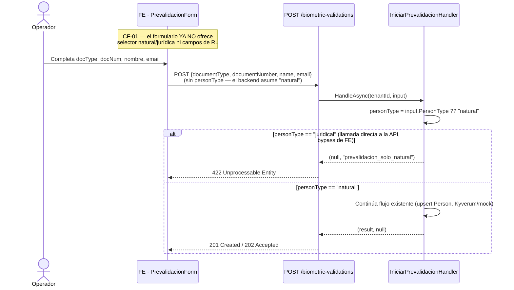
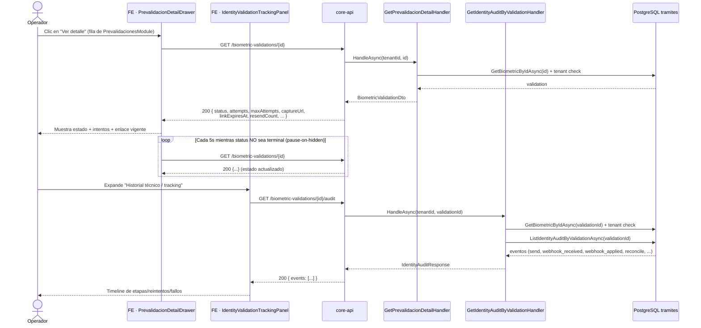
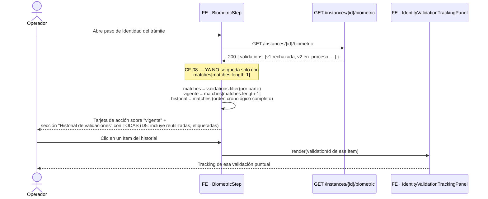

# Diseño Técnico: Feature #11004 — Mejoras prevalidación y tracking de validación de identidad

> **Estado:** BORRADOR · Pendiente aprobación humana
> **Fecha:** 2026-07-28
> **Autor:** architecture-agent
> **Feature ADO:** [Trámites] Mejoras prevalidación y tracking de validación de identidad — [#11004](https://dev.azure.com/FlitDevOps/9032fb34-d178-4c62-b1f5-6805b56524b1/_workitems/edit/11004)
> **Feature hermano:** #10864 (prevalidación de identidad) — ya implementado en `develop`
> **Criterios fuente:** `docs/criterios-mejoras-prevalidacion-validacion-identidad.md` (CF-01 a CF-08)
> **ADR asociado:** `services/core-api/docs/adr/ADR-0036-prevalidacion-natural-tracking-desacoplado-instancia.md`
> **Decisiones de producto cerradas:** D1–D5 (ver §1.2) — no se reabren salvo bloqueante

---

## 1. Contexto

### 1.1 Qué ya existe (baseline real, verificado en código — más avanzado que el borrador de criterios)

El documento `docs/criterios-mejoras-prevalidacion-validacion-identidad.md` describe el baseline como si
solo existiera el alta de prevalidación (`POST /biometric-validations`) y el listado. En la revisión de
código para este diseño se confirma que el Feature #10864 avanzó más de lo documentado ahí — ya incluyen
edición y reenvío de prevalidaciones standalone (`PATCH/POST /biometric-validations/{id}[/resend]`,
`EditarPrevalidacionHandler`/`ReenviarPrevalidacionHandler`, con sus propias decisiones D7–D12 y su propio
"CF-03" — **distinto** del CF-03 de este documento; no confundir los dos). Esto no cambia el alcance de
CF-01 a CF-08, pero sí reduce el trabajo real pendiente. Confirmado por lectura directa del código:

| Criterio | Gap real confirmado en código | Evidencia |
|----------|-------------------------------|-----------|
| CF-01 | `IniciarPrevalidacionHandler` **acepta** `personType=juridical` (con datos de RL); `PrevalidacionForm.tsx` tiene el selector natural/jurídica completo | `IniciarPrevalidacionCommand.cs` líneas 78-88; `PrevalidacionForm.tsx` líneas 82-96, 322-420 |
| CF-02 | El backend ya soporta `Standalone` en `TenantBiometricValidationListQuery`/`BiometricaEndpoints`; el cliente FE (`tramites-client.ts`) **no serializa** `standalone`; `PrevalidacionesModule` hace fallback client-side | `tramites-client.ts` líneas 1063-1094 (sin `add('standalone', ...)`); `PrevalidacionesModule.tsx` líneas 121-131 |
| CF-03 | Sin cambios — el submódulo Validaciones ya muestra ambas (comportamiento deseado, no tocar) | — |
| CF-04 | `TenantBiometricValidationDto` ya viaja con documento completo; `maskDoc()` enmascara en FE en ambos módulos | `Validaciones.tsx` línea 102 + 833; `PrevalidacionesModule.tsx` línea 77 + 530 |
| CF-05 | `TenantBiometricValidationDto` **no tiene** `Email` (ni en el record C# ni en el mapeo `ToDto`); tipo TS `TenantBiometricValidationFilters`/fila tampoco | `ListTenantBiometricValidationsQuery.cs` líneas 14-43, 122-147 |
| CF-06 | No existe vista de detalle para prevalidación; solo listado + formulario de alta | Sin resultados para "detalle"/drawer en `PrevalidacionesModule.tsx` |
| CF-07 | El único endpoint de auditoría exige `instanceId` (`GET /instances/{id}/biometric/{validationId}/audit`); prevalidaciones standalone no tienen instancia. El único consumidor FE (`IdentityAuditPanel`) exige `SuperAdmin` | `BiometricaEndpoints.cs` línea 280; `BiometricStep.tsx` línea 268 (`isAdmin`), 710-720 |
| CF-08 | `BiometricStep.tsx` y `IdentityStatusPanel.tsx` toman **solo la última** validación por parte (`matches[matches.length - 1]`) | `BiometricStep.tsx` línea 207; `IdentityStatusPanel.tsx` línea 102 |

**Conclusión:** los 8 criterios siguen vigentes tal cual fueron redactados; solo se corrige el marco de
referencia de "qué está construido" para que Backend/Frontend Agent no re-implementen lo que ya existe
(edición/reenvío de prevalidaciones).

### 1.2 Decisiones de producto ya cerradas (no se reabren)

| ID | Decisión |
|----|----------|
| D1 | El backend **rechaza** `personType=juridical` en prevalidación (422) — no es solo un cambio de UI |
| D2 | El tracking (CF-07) es visible para los roles del módulo Validaciones/Prevalidaciones (todo usuario autenticado del tenant con acceso a `/tramites`), **no** solo `SuperAdmin` |
| D3 | Documento y correo completos **solo** en las tablas de Validaciones y Prevalidaciones (no en exports/KPIs/Dashboard) |
| D4 | El detalle de prevalidación (CF-06) es un **drawer/panel** en la misma página, no una ruta dedicada |
| D5 | El historial en trámite (CF-08) incluye prevalidaciones **reutilizadas** (referenced), etiquetadas como tal, si el `GET .../biometric` ya las devuelve |

### 1.3 Fuera de alcance (heredado del documento de criterios)

Proveedor Kyverum, tiempo real vía WebSocket/SSE (sigue siendo polling HTTP), vigencia de 30 días, canal
SMS/WhatsApp, módulo Admin de identidad de mandatarios.

---

## 2. Alternativas evaluadas

La decisión de arquitectura central de este Feature es **cómo exponer tracking de identidad para
validaciones que no tienen `instanceId`** (prevalidaciones standalone) sin duplicar lógica ni tocar el
schema. Las tres alternativas:

### Opción A — Endpoint de auditoría por `validationId` (tenant-scoped, sin instancia) + componente de tracking compartido (recomendada)

Nuevo endpoint hermano del existente `GET /biometric-validations/{validationId}/audit` (sin prefijo de
instancia), reutilizando el mismo query de repositorio. Se extrae `IdentityAuditPanel` de `BiometricStep`
a un componente compartido `IdentityValidationTrackingPanel`, consumido desde Validaciones, Prevalidaciones
y el propio trámite. El resto de criterios (email, standalone, doc completo, historial) son cambios
aditivos sobre contratos/DTOs ya existentes.

**Pros:**
- Cero cambios de schema — reutiliza `identity_validation_audit` y `ListIdentityAuditByValidationAsync` tal cual
- Un solo componente de FE de tracking para los 3 puntos de consumo (evita 3 implementaciones divergentes)
- Compatible con PRs incrementales ≤ 800 líneas por fase (igual que el plan de Fases 0-4 del documento de criterios)
- El endpoint existente por-instancia no se toca — cero riesgo de regresión en `BiometricStep` mientras se migra
- Reutiliza el mismo patrón de autorización (`RequireAuthorization()` genérico) que ya tienen todos los endpoints de `BiometricaEndpoints`

**Contras:**
- Dos endpoints de auditoría coexisten (por instancia y por validación) durante una fase de transición
- Requiere quitar el gate `SuperAdmin` del componente de FE (mitigado: el backend ya sanea la bitácora — sin secretos ni PII cruda — D2 ya cerró esta decisión)

**Esfuerzo:** M
**Riesgos:** Bajo

---

### Opción B — Endpoint de tracking agregador único (`.../tracking`) que combina detalle + auditoría + historial relacionado

Un nuevo endpoint que en una sola respuesta entrega `{ validation, auditEvents, relatedValidations }`,
consumido uniformemente por el detalle de prevalidación, el tracking de Validaciones y el historial del
trámite.

**Pros:**
- Una sola llamada de red para pintar el detalle completo (menos round-trips)
- Un solo contrato a versionar hacia adelante

**Contras:**
- Duplica información que ya sirven `GET .../biometric` (lista) y `GET .../audit` (eventos) — dos fuentes de verdad a mantener sincronizadas
- Mayor superficie de contrato (OpenAPI, DTOs, tests) para un Feature cuyo criterio de datos es explícitamente "reuse, sin tablas nuevas" — aquí se estaría sobre-diseñando el lado de lectura
- PRs más grandes, más difícil mantener el límite de 800 líneas por PR
- No hay necesidad funcional real: CF-06/CF-07 piden ver detalle y tracking, no una vista fusionada con historial relacionado de otras validaciones

**Esfuerzo:** L
**Riesgos:** Medio — mayor probabilidad de exceder el límite de PR y de introducir inconsistencias entre el nuevo endpoint agregador y los ya existentes.

---

### Opción C — Sin endpoint nuevo: anclar el tracking de standalone a un `instanceId` sintético o reutilizar el endpoint existente con `Guid.Empty`

Evitar cualquier cambio de backend generando un id de instancia "de relleno" para que las prevalidaciones
standalone puedan usar `GET /instances/{id}/biometric/{validationId}/audit` sin modificar la ruta.

**Pros:**
- Cero cambios de backend en el corto plazo

**Contras:**
- Viola el invariante de dominio de ADR-0030 (`ProcedureInstanceId IS NULL` para standalone es intencional, no un vacío a rellenar)
- Corrompe cualquier query o reporte futuro que asuma que un `instanceId` no nulo referencia un trámite real
- No resuelve CF-06 (detalle con poll) porque el poll también necesita un GET por id sin depender de instancia
- Rechazada — no cumple el criterio funcional ni es sostenible

**Esfuerzo:** S
**Riesgos:** Alto (corrompe el modelo de datos) — descartada.

---

## 3. Decisión

**Opción A.** Justificación: reutiliza el 100% de la infraestructura de auditoría ya construida y probada
en el Feature #10864 (tabla, query, sanitización), no introduce una segunda fuente de verdad para datos que
ya se sirven por otros endpoints, y permite implementar por fases incrementales igual que el resto del
Feature. La Opción B resuelve un problema de "menos round-trips" que no está entre los criterios
funcionales (CF-06/CF-07 no piden una vista fusionada) y tiene un costo de mantenimiento mayor a futuro
para un feature explícitamente definido como "reuse". La Opción C queda descartada por violar el modelo de
datos.

Esta decisión, junto con el rechazo server-side de `personType=juridical` (CF-01/D1), se documenta en
**ADR-0036** (estado `Propuesto`) por sentar precedente sobre ADR-0030.

---

## 4. Sequence Diagrams

### 4.1 CF-01 — Alta de prevalidación: rechazo de persona jurídica (422)



### 4.2 CF-06 + CF-07 — Detalle de prevalidación con poll + tracking (sin instancia)



### 4.3 CF-07 en Validaciones (trámite) — mismo componente de tracking, sin gate SuperAdmin

```mermaid
sequenceDiagram
    actor Operador as Operador (rol módulo, NO SuperAdmin)
    participant Val as FE · Validaciones.tsx
    participant Track as FE · IdentityValidationTrackingPanel
    participant API as GET /biometric-validations/{validationId}/audit

    Operador->>Val: Clic "Ver tracking" en una fila (standalone o de trámite)
    Val->>Track: render(validationId)
    Note over Track: D2 — ya NO valida isSuperAdmin();<br/>solo requiere sesión autenticada del tenant
    Track->>API: GET /biometric-validations/{validationId}/audit
    API-->>Track: 200 { events: [...] } (mismo endpoint que 4.2)
    Track-->>Operador: Timeline de etapas/reintentos/fallos
```

### 4.4 CF-08 — Historial completo de validaciones en el trámite



---

## 5. Contrato API (cambios OpenAPI conceptuales)

Todos los cambios son **aditivos** salvo la corrección de nullability ya usada en código pero no reflejada
en `contracts/openapi/core-api.v1.yaml` (deuda del Feature #10864).

### 5.1 `GET /api/v1/tramites/biometric-validations` — CF-02, CF-05

```yaml
# Agregar a los parameters ya existentes (el backend YA lo acepta; falta documentarlo):
- name: standalone
  in: query
  required: false
  description: >
    true = solo prevalidaciones standalone (sin trámite); false = solo ligadas a trámite;
    omitido = todas (comportamiento actual del submódulo Validaciones — CF-03).
  schema: { type: boolean }
```

```yaml
# TenantBiometricValidationDto — corregir nullability (ya es así en el DTO C#) + CF-05 (email):
TenantBiometricValidationDto:
  required: [id, name, documentType, documentNumber, status, provider, expired, createdAt, email]
  properties:
    instanceId: { type: string, format: uuid, nullable: true }      # antes: required no-nullable (deuda #10864)
    referenceNumber: { type: string, nullable: true }                # antes: required no-nullable (deuda #10864)
    modalidad: { type: string, nullable: true }                      # antes: required no-nullable (deuda #10864)
    email:                                                            # NUEVO — CF-05
      type: string
      format: email
      description: >
        Correo de la validación. Vista autenticada del gestor del tenant (D3): completo,
        sin enmascarar. Solo visible en Validaciones y Prevalidaciones — no en exports/Dashboard.
```

### 5.2 Nuevo: `GET /api/v1/tramites/biometric-validations/{id}` — CF-06 (poll de detalle)

```yaml
get:
  operationId: getPrevalidacionDetail
  tags: [Tramites, Identidad, Prevalidacion]
  summary: Detalle de una validación de identidad por id (tenant-scoped) — CF-06
  description: >
    Devuelve el estado actual de UNA validación (standalone o de trámite) para poll de detalle.
    Mismo DTO que usa el listado por-instancia (BiometricValidationDto): estado, intentos,
    enlace de captura vigente, vigencia. Reemplaza la necesidad de un instanceId para
    prevalidaciones standalone.
  security: [{ bearerAuth: [] }]
  parameters:
    - name: id
      in: path
      required: true
      schema: { type: string, format: uuid }
    - name: X-Tenant-Id
      in: header
      required: true
      schema: { type: string, format: uuid }
  responses:
    "200":
      content:
        application/json:
          schema: { $ref: "#/components/schemas/BiometricValidationDto" }
    "404":
      description: No existe o pertenece a otro tenant.
```

### 5.3 Nuevo: `GET /api/v1/tramites/biometric-validations/{validationId}/audit` — CF-07

```yaml
get:
  operationId: getIdentityAuditByValidation
  tags: [Tramites, Identidad]
  summary: Bitácora de una validación de identidad, sin depender de instancia — CF-07
  description: >
    Equivalente a GET /instances/{id}/biometric/{validationId}/audit pero SIN instanceId:
    sirve tanto para prevalidaciones standalone como de trámite. Autorización: cualquier
    usuario autenticado del tenant (D2 — no restringido a SuperAdmin). Respuesta saneada,
    sin secretos ni PII cruda (mismo criterio que el endpoint por-instancia).
  security: [{ bearerAuth: [] }]
  parameters:
    - name: validationId
      in: path
      required: true
      schema: { type: string, format: uuid }
    - name: X-Tenant-Id
      in: header
      required: true
      schema: { type: string, format: uuid }
  responses:
    "200":
      content:
        application/json:
          schema: { $ref: "#/components/schemas/IdentityAuditResponse" }
    "404":
      description: No existe o pertenece a otro tenant.
```

### 5.4 `POST /api/v1/tramites/biometric-validations` — CF-01

```yaml
responses:
  "422":
    description: >
      NUEVO — personType=juridical en el flujo de prevalidación (CF-01/D1). La validación de
      actores jurídicos sigue existiendo, pero solo dentro de un trámite.
    content:
      application/json:
        schema: { $ref: "#/components/schemas/ErrorResponse" }
```

`IniciarPrevalidacionRequest` **no cambia de forma** (se mantienen `personType`/`legalRep*` para no romper
compatibilidad con clientes que aún los envíen expresamente en `"natural"`); el backend simplemente rechaza
`"juridical"`. `PrevalidacionForm` deja de enviar `personType`/`legalRep*` en absoluto.

---

## 6. Modelo de datos conceptual

### Schema requerido: **NO (NA)**

No se crean tablas ni columnas nuevas. Verificado en código:

| Campo necesario para los CF | Ya existe en | 
|------------------------------|---------------|
| `Email` (CF-05) | `ProcedureInstanceBiometricValidation.Email` (columna ya persistida, solo faltaba en el DTO de listado) |
| `Attempts`/`MaxAttempts`/`ResendCount`/`LastAttemptAt` (CF-06, detalle) | Ya en la entidad (usados hoy por `BiometricValidationDto`/mock-flow) |
| `Standalone` (CF-02) | `TenantBiometricValidationListQuery.Standalone` + `BiometricValidationListFilter.Standalone` — ya implementado en el repositorio, solo falta que el FE lo envíe |
| Auditoría por `validationId` sin instancia (CF-07) | `IdentityValidationAuditEvent.TenantId` + `ValidationId` ya existen como columnas — el query nuevo solo cambia el filtro (quita `ProcedureInstanceId`) |
| Historial completo por parte (CF-08) | `GET .../biometric` ya devuelve todas las filas por parte; el gap es 100% de renderizado en FE (`matches[matches.length-1]` → lista completa) |

Todos los cambios de este Feature son: (a) proyección de columnas existentes hacia el DTO de listado, (b)
un nuevo query de lectura sobre una tabla ya poblada (auditoría), y (c) lógica de presentación en FE. **No
se requiere migración EF Core ni intervención del `database-agent`** para este Feature.

### Invariantes que se preservan (sin cambio, heredadas de ADR-0030)

```
Prevalidación standalone: procedure_instance_id IS NULL AND person_id IS NOT NULL
Validación de trámite:    procedure_instance_id IS NOT NULL
```

CF-01 no cambia estos invariantes: solo restringe qué valores de `person_type` puede tomar una fila nueva
de `tramites.persons` creada desde el flujo de prevalidación (`"natural"` únicamente, a partir de este
Feature). Las filas jurídicas existentes conservan su `person_type='juridical'` y sus columnas `legal_rep_*`.

---

## 7. Lista exacta de archivos a crear/modificar

### 7.1 Backend — `services/core-api/`

| Acción | Archivo | Criterio |
|--------|---------|----------|
| **MODIFICAR** | `src/Flit.Tramites.Application/UseCases/Persons/IniciarPrevalidacionCommand.cs` — guard `personType=="juridical"` → `"prevalidacion_solo_natural"` como primer check, antes del upsert de `Person` | CF-01 |
| **MODIFICAR** | `src/Flit.Api/Endpoints/Tramites/BiometricaEndpoints.cs` — mapear `"prevalidacion_solo_natural"` → 422 en `POST /biometric-validations` | CF-01 |
| **MODIFICAR** | `src/Flit.Tramites.Application/UseCases/ProcedureInstances/ListTenantBiometricValidationsQuery.cs` — agregar `Email` a `TenantBiometricValidationDto` + mapeo en `ToDto` | CF-05 |
| **CREAR** | `src/Flit.Tramites.Application/UseCases/Persons/GetPrevalidacionDetailQuery.cs` — DTO + `GetPrevalidacionDetailHandler(IProcedureInstanceRepository)`, reutiliza `GetBiometricByIdAsync` + `IniciarBiometriaHandler.ToDto` | CF-06 |
| **CREAR** | `src/Flit.Tramites.Application/UseCases/ProcedureInstances/GetIdentityAuditByValidationQuery.cs` — `GetIdentityAuditByValidationHandler(IProcedureInstanceRepository)`, mismo patrón que `GetIdentityAuditHandler` sin `instanceId` | CF-07 |
| **MODIFICAR** | `src/Flit.Api/Endpoints/Tramites/BiometricaEndpoints.cs` — mapear `GET /biometric-validations/{id}` y `GET /biometric-validations/{validationId}/audit` | CF-06, CF-07 |
| **MODIFICAR** | `src/Flit.Tramites.Application/DependencyInjection.cs` — registrar los 2 handlers nuevos | CF-06, CF-07 |
| **MODIFICAR** | `contracts/openapi/core-api.v1.yaml` — cambios §5 (standalone param, email, nullability, 2 endpoints nuevos, 422 en POST) | Todos |

#### Tests backend

| Acción | Archivo |
|--------|---------|
| **MODIFICAR** | `tests/Flit.Tramites.Application.Tests/UseCases/Persons/IniciarPrevalidacionHandlerTests.cs` — caso `personType=juridical` → `prevalidacion_solo_natural` |
| **MODIFICAR** | `tests/Flit.Tramites.Application.Tests/UseCases/ProcedureInstances/TenantBiometricValidationListQueryTests.cs` — `Email` en DTO, filtro `standalone` |
| **CREAR** | `tests/Flit.Tramites.Application.Tests/UseCases/Persons/GetPrevalidacionDetailHandlerTests.cs` |
| **CREAR** | `tests/Flit.Tramites.Application.Tests/UseCases/ProcedureInstances/GetIdentityAuditByValidationHandlerTests.cs` — incluir caso cross-tenant → `not_found` |
| **MODIFICAR** | `tests/Flit.Tramites.Application.Tests/UseCases/Persons/EditarPrevalidacionHandlerTests.cs` / `ReenviarPrevalidacionHandlerTests.cs` — regresión: fixture con `person_type='juridical'` preexistente sigue editable/reenviable |

### 7.2 Frontend — `frontend/`

| Acción | Archivo | Criterio |
|--------|---------|----------|
| **MODIFICAR** | `lib/api/types/procedure-runtime.ts` — `TenantBiometricValidationFilters.standalone?: boolean`, `TenantBiometricValidation.email: string`, `instanceId`/`referenceNumber`/`modalidad` ya nullable (verificar) | CF-02, CF-05 |
| **MODIFICAR** | `lib/api/tramites-client.ts` — serializar `standalone` en `listTenantBiometricValidations`; agregar `getPrevalidacionDetail(id)` y `getBiometricAuditByValidation(validationId)` | CF-02, CF-06, CF-07 |
| **MODIFICAR** | `components/atom/modules/PrevalidacionForm.tsx` — eliminar selector natural/jurídica y bloque de representante legal completo; `FormValues` sin `personType`/`legalRep*` | CF-01 |
| **CREAR** | `components/atom/IdentityValidationTrackingPanel.tsx` — extraído/generalizado de `IdentityAuditPanel` (BiometricStep), parametrizado solo por `validationId`, SIN gate `SuperAdmin` | CF-07 |
| **CREAR** | `components/atom/modules/PrevalidacionDetailDrawer.tsx` — drawer con poll 5s (patrón `KyverumPendingView`), embebe `IdentityValidationTrackingPanel` | CF-06 |
| **MODIFICAR** | `components/atom/modules/PrevalidacionesModule.tsx` — quitar filtro/fallback client-side; llamar con `standalone: true` directo; quitar `maskDoc()`; columna Correo; acción "Ver detalle" → `PrevalidacionDetailDrawer` | CF-02, CF-04, CF-05, CF-06 |
| **MODIFICAR** | `components/atom/modules/Validaciones.tsx` — quitar `maskDoc()`; columna Correo; acción "Ver tracking" → `IdentityValidationTrackingPanel` | CF-04, CF-05, CF-07 |
| **MODIFICAR** | `components/operacion/BiometricStep.tsx` — reemplazar `IdentityAuditPanel` inline por el componente compartido (sin gate `isAdmin`); sección "Historial de validaciones" con TODAS las `matches` por parte (no solo la última); etiqueta "reutilizada" cuando aplique (D5) | CF-07, CF-08 |
| **MODIFICAR** | `components/operacion/IdentityStatusPanel.tsx` — `buildRows` expone `history: BiometricValidation[]` completo por actor, no solo la última | CF-08 |

#### Tests frontend

| Acción | Archivo |
|--------|---------|
| **MODIFICAR** | `components/atom/modules/__tests__/PrevalidacionForm.test.tsx` — sin UI jurídica; body sin `personType`/`legalRep*` |
| **MODIFICAR** | `components/atom/modules/__tests__/PrevalidacionesModule.test.tsx` — `standalone=true` real (sin fallback), doc completo, columna correo, apertura de detalle |
| **MODIFICAR** | `frontend/__tests__/validaciones-module.test.tsx` — doc completo, columna correo, acción tracking |
| **CREAR** | `components/atom/__tests__/IdentityValidationTrackingPanel.test.tsx` |
| **CREAR** | `components/atom/modules/__tests__/PrevalidacionDetailDrawer.test.tsx` — poll, pause-on-hidden, 4 estados |
| **MODIFICAR** | `components/operacion/__tests__/IdentityStatusPanel.test.tsx` — historial completo por actor |
| **CREAR/MODIFICAR** | test de `BiometricStep.tsx` (buscar el suite existente que cubra `ParteCard`/historial) — fixture con 2+ validaciones por parte |

### 7.3 Documentación

| Acción | Archivo |
|--------|---------|
| **CREAR** | `services/core-api/docs/adr/ADR-0036-prevalidacion-natural-tracking-desacoplado-instancia.md` (ya generado en este diseño) |
| **CREAR** | `docs/design/FEATURE-11004-mejoras-prevalidacion-tracking-identidad.md` (este archivo) |

---

## 8. Orden de implementación recomendado (fases ≤ 800 líneas por PR)

Mismo orden del plan de criterios (§5 del documento fuente), ajustado a los archivos reales de este diseño:

1. **Fase 0 — Contrato y filtros:** CF-02 (serializar `standalone` en FE) + CF-05 (Email en DTO + FE). Sin dependencias.
2. **Fase 1 — CF-01:** Guard backend `prevalidacion_solo_natural` + limpieza de `PrevalidacionForm`. Puede ir en paralelo a la Fase 0.
3. **Fase 2 — CF-04:** Quitar `maskDoc()` en ambos módulos (cambio pequeño, puede ir junto a Fase 0/1).
4. **Fase 3 — CF-07 backend:** Nuevo endpoint de auditoría por `validationId` + tests. Prerrequisito de Fase 4 y 6.
5. **Fase 4 — CF-07 frontend:** Extraer `IdentityValidationTrackingPanel`, quitar gate SuperAdmin, cablear en Validaciones/Prevalidaciones/BiometricStep.
6. **Fase 5 — CF-06:** Nuevo endpoint de detalle (`GET /biometric-validations/{id}`) + `PrevalidacionDetailDrawer` (depende de Fase 3/4 para embeber tracking).
7. **Fase 6 — CF-08:** Historial completo en `BiometricStep`/`IdentityStatusPanel` (puede ir en paralelo desde que Fase 4 esté lista, para reusar el tracking panel por ítem del historial).

---

## 9. Notas operativas por agente

### Para `backend-agent`

1. El guard de CF-01 va **antes** de `personRepo.FindOrCreateAsync` en `IniciarPrevalidacionHandler` — no
   crear/actualizar una `Person` jurídica que de todas formas se va a rechazar.
2. No tocar `EditarPrevalidacionHandler`/`ReenviarPrevalidacionHandler`: siguen resolviendo el sujeto vía
   `IniciarPrevalidacionHandler.ResolveSubject(person)`, que ya maneja ambos `PersonType` — es correcto que
   seguya soportando edición/reenvío de un registro jurídico histórico.
3. `GetIdentityAuditByValidationHandler` reutiliza `repo.GetBiometricByIdAsync` + `repo.ListIdentityAuditByValidationAsync`
   tal cual usa hoy `GetIdentityAuditHandler` (misma clase `IdentityAuditQuery.cs` o archivo hermano) — NO
   crear un query de repositorio nuevo. El check de tenant (`v.TenantId != tenantId → not_found`) es idéntico.
4. `GetPrevalidacionDetailHandler` reutiliza `IniciarBiometriaHandler.ToDto(validation, now)` para no duplicar
   el mapeo a `BiometricValidationDto`.
5. Todos los endpoints nuevos van dentro de `BiometricaEndpoints.cs` (mismo archivo, no crear uno nuevo) y
   heredan `RequireAuthorization()` del grupo — NO agregar `RequireRole` (D2: cualquier usuario del tenant).

### Para `frontend-agent`

1. `IdentityValidationTrackingPanel` debe aceptar solo `validationId: string` (sin `instanceId?`) y usar
   el endpoint nuevo (`getBiometricAuditByValidation`) — NO reutilizar `getBiometricAudit(instanceId, ...)`.
2. Verificar que al quitar el gate `useIsSuperAdmin()` de `BiometricStep.tsx`, el import
   `isSuperAdmin`/`decodeJwtPayload`/`getToken` no quede huérfano si no se usa en otra parte del archivo.
3. `PrevalidacionDetailDrawer`: seguir el mismo patrón de poll de `KyverumPendingView` (5s, `pause-on-hidden`,
   detener al llegar a estado terminal) — no reinventar el intervalo.
4. `PrevalidacionForm`: al quitar el bloque jurídico, simplificar también `IniciarPrevalidacionRequest` en
   el body enviado (no enviar `personType`/`legalRep*` en absoluto; el backend ya asume `"natural"` por
   defecto).
5. Riesgo de conflicto: `Validaciones.tsx` y `BiometricStep.tsx` son archivos "calientes" (tocados por
   varios features recientes — #10863, #10864, #10873, #10875). Basar la rama en `develop` actualizado
   antes de empezar cada fase y revisar diffs pequeños por PR.

### Para `qa-agent`

1. **CF-01:** POST directo a la API con `personType=juridical` → 422 `prevalidacion_solo_natural` (bypass de UI). Regresión: fixture con prevalidación jurídica preexistente sigue editable/reenviable sin error.
2. **CF-02:** listado de Prevalidaciones con `standalone=true` no debe traer NUNCA filas con `instanceId != null`, incluso si el filtro devuelve 0 resultados (verificar que ya no cae a "mostrar todas").
3. **CF-04/CF-05:** documento sin máscara y columna correo visibles en Validaciones y Prevalidaciones; verificar que Dashboard/exports (fuera de estas 2 tablas) siguen sin exponerlos (D3).
4. **CF-06:** detalle de prevalidación con poll — verificar pause-on-hidden (tab oculta detiene el polling) y que el poll se detiene en estado terminal.
5. **CF-07:** operador NO-SuperAdmin puede abrir tracking de una prevalidación standalone Y de una validación de trámite; usuario de OTRO tenant recibe 404 al intentar el mismo `validationId` (aislamiento tenant).
6. **CF-08:** fixture con 2+ validaciones por parte (rechazada + nueva en proceso) → ambas visibles en el historial del trámite; la tarjeta de acción sigue mostrando solo la vigente/más reciente. Caso D5: prevalidación reutilizada aparece etiquetada como tal en el historial.
7. Regresión general: `EnsureIdentityHandler`/`FindVigenteApprovedByDocumentAsync` no cambian en este Feature — validar que el reuso de prevalidaciones (Feature #10864) sigue funcionando igual.

### Para `security-agent`

1. **Habeas Data (D3):** confirmar que `email`/documento completo solo se exponen en `TenantBiometricValidationDto`
   (consumido por Validaciones/Prevalidaciones) y NO se agregan a ningún DTO de Dashboard/Analytics/exportación en este Feature.
2. Confirmar que el nuevo endpoint `GET /biometric-validations/{validationId}/audit` mantiene el mismo
   criterio de aislamiento por tenant que el endpoint por-instancia (`TenantId` como frontera dura, 404
   uniforme sin filtrar existencia cross-tenant).
3. Confirmar que abrir el tracking a roles no-SuperAdmin no cambia la proyección `IdentityAuditEventDto`
   (sigue sin secretos, sin `provider_payload` crudo, sin PII adicional) — el saneo ya existe, este Feature
   NO debe tocar `GetIdentityAuditHandler`/su lógica de sanitización, solo su punto de entrada.
4. Verificar que `IniciarPrevalidacionHandler` sigue sin aceptar `personType=juridical` incluso si el
   request llega directo a la API (no solo bloqueado en el FE) — es el criterio D1 explícito.

### Para `infra-agent`

Sin cambios de infraestructura ni de pipeline — no hay migraciones que ejecutar en este Feature.

---

## 10. Riesgos y mitigación

| Riesgo | Impacto | Probabilidad | Mitigación |
|--------|---------|-------------|------------|
| Conflicto de merge en `Validaciones.tsx`/`BiometricStep.tsx` (archivos tocados por múltiples features recientes) | M | Media | Fases pequeñas, rebase frecuente sobre `develop`, coordinar con LT el orden de merge si hay HUs paralelas activas |
| Registros con `person_type='juridical'` preexistentes en QA/PDN quedan sin poder revalidarse (solo editar/reenviar) | B | Baja (Feature #10864 es reciente, pocos datos) | Confirmar con QA si hay fixtures/datos reales jurídicos en QA antes de desplegar CF-01; documentar en release notes que deben crear una prevalidación natural nueva si necesitan revalidar |
| Abrir tracking a roles no-SuperAdmin expone timing/volumen de reintentos a más usuarios | B | Baja | El contenido ya está saneado (sin secretos/PII); es un cambio de visibilidad, no de contenido — aceptado por D2 |
| Dos endpoints de auditoría coexistiendo genera confusión sobre cuál usar en features futuras | B | Media | Documentar en el docstring de `GetIdentityAuditHandler` (por-instancia) que es el "legado" mantenido por `ReferencedFromOtherProcedure`, y que las integraciones nuevas deben usar el endpoint por-`validationId` |

---

## 11. Gate de aprobación

**Este diseño está en estado BORRADOR. Requiere:**
1. Revisión y aprobación del Líder Técnico humano antes de que `tech-lead-agent` descomponga en HUs
2. Confirmación de que no hay datos jurídicos activos en QA/PDN que dependan de poder crear nuevas prevalidaciones jurídicas (riesgo §10)
3. ADR-0036 pasa a `Propuesto` en el repositorio; su aceptación formal es exclusiva del Líder Técnico humano (regla FLIT #15)

**Fase 2b (schema): NA — confirmado.** No hay trabajo para `database-agent` en este Feature.
