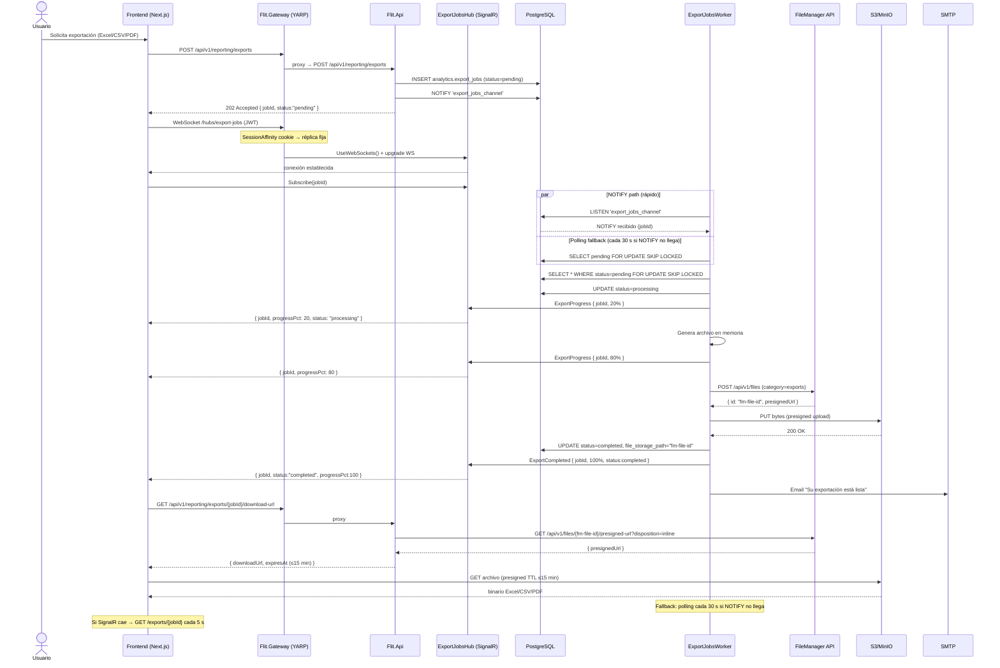

# Diseño Técnico: Feature #11076 — Subsistema de Reportería Transaccional V2

> **Estado:** APROBADO · Diseño arquitectónico listo para implementación
> **Fecha:** 2026-07-29
> **Autor:** architecture-agent · supervisado por Jorman Copete
> **Feature ADO:** [REPORTERÍA] Subsistema de Reportería Transaccional V2 — #11076
> **ADRs asociados:**
> - `services/core-api/docs/adr/ADR-0037-exportaciones-asincronas-listen-notify-signalr.md`
> - `services/core-api/docs/adr/ADR-0038-navegacion-reportes-unificada-big-bang.md`
> - `services/core-api/docs/adr/ADR-0039-signalr-yarp-session-affinity.md`
> **Rama base:** `feature/AB-11076-reporteria-transaccional-v2` (basada en `develop` @ `5e05b6f1`)

---

## 1. Contexto

El sistema de reportería actual (`Feature #10139`) tiene dos módulos desacoplados en el dock:
- **`reportes`** — dashboard con overview, productividad, tendencias, scheduling y alertas
- **`reportes-detallados`** — lista paginada de trámites con exportación Excel síncrona

Esta arquitectura dual produce: dos iconos en el dock para el mismo dominio funcional, exportaciones síncronas que bloquean el hilo HTTP, ausencia de consultas guardadas, ausencia de auditoría histórica de responsabilidad, ausencia de informes sobre tiempos/SLA, y ausencia de vista consolidada de volumetría para AdminFLIT.

El Feature #11076 cubre 10 sub-features en una única versión funcional descompuesta en múltiples HUs/PRs.

**Restricciones confirmadas:**
- Un único icono `reportes` en el dock; `reportes-detallados` eliminado completamente (big-bang, sin redirect)
- Exportaciones siempre asíncronas (máx. 50k registros, máx. 3 jobs pending por usuario)
- Consulta interactiva: 30 días por defecto, máximo 12 meses
- Responsabilidad histórica: usuario, rol y organización en el momento del evento
- Admin FLIT: vista global por defecto con filtros opcionales por empresa/OT
- Dashboard: mostrar/ocultar/reordenar KPIs existentes, sin constructor libre
- Formatos de exportación: Excel, CSV y PDF institucional en todos los reportes
- Backfill de historial NULL: UI muestra "Historial no disponible"
- Permisos: seed ejecutable como única fuente; matriz documentada en §9 para verificabilidad QA/Security

---

## 2. Diagnóstico del estado actual

### 2.1 Frontend

| Artefacto | Path | Estado en V2 |
|-----------|------|--------------|
| `Shell.tsx` | `frontend/components/atom/Shell.tsx` | MODIFICAR: eliminar dock entry `reportes-detallados` |
| `ReportesDetallados.tsx` | `frontend/components/atom/modules/ReportesDetallados.tsx` | ELIMINAR |
| `Reportes.tsx` | `frontend/components/atom/modules/Reportes.tsx` | EXTENDER: tabs V2, `ReportFilterContext`, `ExportController` |
| `modules.ts` | `frontend/lib/nav/modules.ts` | MODIFICAR: eliminar `reportes-detallados` de `ALL_MODULE_IDS` |
| `detailed-report.ts` | `frontend/lib/api/detailed-report.ts` | ELIMINAR |
| `page.tsx` | `frontend/app/page.tsx` | NO MODIFICAR: sin redirect (big-bang) |

### 2.2 Backend

| Artefacto | Path | Estado en V2 |
|-----------|------|--------------|
| `AnalyticsEndpoints.cs` | `src/Flit.Api/Endpoints/Analytics/AnalyticsEndpoints.cs` | MANTENER (dashboard existente) |
| `DetailedReportEndpoints.cs` | `src/Flit.Api/Endpoints/Analytics/DetailedReportEndpoints.cs` | MARCAR `[Obsolete]` → eliminar sprint +1 |
| `ProcedureExcelExporter.cs` | `src/Flit.Infrastructure/Documents/ProcedureExcelExporter.cs` | REUTILIZAR |
| `DetailedReportExcelExporter.cs` | `src/Flit.Infrastructure/Documents/DetailedReportExcelExporter.cs` | REUTILIZAR (base del exportador V2) |
| `ReportSchedule.cs` | `src/Flit.Infrastructure/Persistence/Entities/Analytics/ReportSchedule.cs` | MODIFICAR: extender `ReportType` |
| `IAttachmentStorage.cs` | `src/Flit.Tramites.Application/Storage/IAttachmentStorage.cs` | REUTILIZAR via adaptador `IExportFileStorage` |
| `FileManagerAttachmentStorage.cs` | `src/Flit.Infrastructure/Storage/FileManagerAttachmentStorage.cs` | REUTILIZAR sin modificar |
| `Flit.Gateway/appsettings.json` | `src/Flit.Gateway/appsettings.json` | MODIFICAR: SessionAffinity + cluster SignalR |
| `Flit.Gateway/Program.cs` | `src/Flit.Gateway/Program.cs` | MODIFICAR: `app.UseWebSockets()` BLOQUEANTE |

### 2.3 Hallazgos de storage

El storage de archivos existente (`IAttachmentStorage` / `FileManagerAttachmentStorage`) opera sobre un
**file-manager externo** que encapsula S3/MinIO con presigned URLs. Configuración en sección `"FileManager"`:

```
BaseUrl  (DEV): https://devfilemanager.flitsas.online/
BaseUrl  (PDN): ${FILE_MANAGER_BASE_URL}            ← env var obligatoria en VPS
FilesPath     : api/v1/files
Category      : "tramites"  → exports usarán sección "ExportFileManager" con Category: "exports"
PreviewTTL    : 10 min (≤15; alineado con TTL real de S3)
```

**Restricción crítica — `Delete()` es NO-OP:** el file-manager no expone borrado. Los archivos de export
persisten 30 días (cold storage lifecycle del file-manager). Los download links expiran en ≤15 min;
el archivo es inaccesible por URL expirada pero no se elimina del storage. Esta restricción está
documentada en ADR-0037 como constraint explícito y no es un bug.

### 2.4 Hallazgos de Gateway (YARP)

| Hallazgo | Impacto | Acción |
|----------|---------|--------|
| `signalr-route` YA EXISTE en `appsettings.json` para `/hubs/{**catch-all}` | Infraestructura de enrutamiento planificada | Actualizar con SessionAffinity + cluster dedicado |
| `app.UseWebSockets()` AUSENTE en `Program.cs` | Sin él YARP no negocia upgrade WebSocket → SignalR cae a long-polling | **BLOQUEANTE — agregar antes del primer deploy** |
| `LoadBalancingPolicy: RoundRobin` en cluster compartido | Reconnects WebSocket pueden caer a réplica diferente | Cluster dedicado `core-api-signalr-cluster` con SessionAffinity |
| `ActivityTimeout: 00:00:30` en `core-api-cluster` | Puede impactar handshake WS en alta latencia | Cluster dedicado con `ActivityTimeout: 00:05:00` |

---

## 3. Alternativas arquitectónicas evaluadas

### Opción A — Dashboard monolítico síncrono ampliado

Extender el dashboard actual con pestañas adicionales. Las exportaciones siguen siendo síncronas con
timeout HTTP extendido. Sin SignalR. Sin job queue.

**Pros:** cero infra nueva; mínimo esfuerzo de backend; sin dependencias adicionales
**Contras:** exportaciones > 30 s causan timeout de YARP (30 s ActivityTimeout); UX bloqueante;
no escala a 50k registros; no permite notificación push; deuda técnica inmediata
**Esfuerzo:** S · **Riesgo:** ALTO (timeout productivo)

### Opción B — export_jobs + LISTEN/NOTIFY + Worker + SignalR + REST fallback ✅ ELEGIDA

Tabla durable `export_jobs`. Worker con `LISTEN/NOTIFY` como wake-up y polling cada 30 s como
fallback. `FOR UPDATE SKIP LOCKED` para multi-réplica. SignalR hub para push en tiempo real.
REST fallback cuando SignalR está desconectado. Storage reutiliza `IAttachmentStorage` vía
adaptador `IExportFileStorage` con sección de config dedicada.

**Pros:** UX de notificación real (push); exportaciones de 50k sin timeout; resiliencia ante
failures; multi-réplica seguro; sin nueva infra (PG LISTEN/NOTIFY ya disponible); reutilización
de storage existente; REST fallback garantiza funcionamiento sin WebSocket
**Contras:** complejidad mayor que A; SignalR requiere `UseWebSockets()` en gateway; YARP
SessionAffinity necesaria para multi-réplica (sin Redis en Fase 1)
**Esfuerzo:** L · **Riesgo:** MEDIO

### Opción C — Bus de mensajes externo (RabbitMQ / SQS)

Worker consume mensajes de un broker externo. Notificación via polling REST en frontend.

**Pros:** desacoplamiento total; escalabilidad horizontal ilimitada
**Contras:** nueva infra (RabbitMQ o SQS); complejidad operativa desproporcionada al caso de uso;
sin ganancia real vs Opción B dado el volumen de FLIT (< 100 exportaciones simultáneas estimadas)
**Esfuerzo:** XL · **Riesgo:** MEDIO (over-engineering)

**Decisión:** Opción B — justificación: PG LISTEN/NOTIFY y `IAttachmentStorage` ya existen en el
repo; el risk de timeout de Opción A es productivo; Opción C es over-engineering para el volumen
proyectado.

---

## 4. Árbol de navegación y UX

```
Dock (Shell.tsx)
└── reportes  [única entrada — ModuleId: "reportes"]
    │
    └── Reportes.tsx (módulo unificado)
        ├── Tab: resumen         (overview/KPIs — reutiliza AnalyticsEndpoints /analytics/overview)
        ├── Tab: tramites        (listado V2 con filtros avanzados — /reporting/procedures)
        ├── Tab: consolidado     (volumetría — /reporting/consolidado)
        ├── Tab: productividad   (top radicadores — /reporting/productivity)
        ├── Tab: tiempos-sla     (tiempos por tipo/OT — /reporting/sla)
        ├── Tab: auditoria       (historial de responsabilidad — /reporting/procedures/{id}/audit)
        ├── Tab: programados     (informes programados — /reporting/schedules)
        └── Tab: alertas         (reglas de alerta — /reporting/alerts)
        │
        ├── ExportController     (estado de jobs, toast/badge, download)
        ├── ReportFilterContext  (estado global de filtros: dateFrom, dateTo, dateType, tenantId, OT, status, etc.)
        └── DashboardPreferences (mostrar/ocultar/reordenar KPIs — /reporting/preferences)
```

**Estados UI (los 4 obligatorios por componente):**
- **Vacío:** mensaje "Sin datos para el período seleccionado" con icono ilustrativo
- **Cargando:** skeleton loader por sección/tab
- **Error:** banner de error con código HTTP, acción "Reintentar"
- **Lleno:** contenido con paginación, sorting y filtros activos visibles

**WCAG 2.1 AA:** contraste mínimo 4.5:1 en texto, labels en todos los inputs de filtro,
`aria-live="polite"` en actualizaciones de progreso de export, navegación por teclado en tabs.

---

## 5. Arquitectura de Export Jobs (G1)

### 5.1 Componentes

| Componente | Tipo | Ubicación |
|-----------|------|-----------|
| `analytics.export_jobs` | Tabla PostgreSQL | DDL en §7 |
| `IExportFileStorage` | Puerto Application | `Flit.Analytics.Application/ExportJobs/` |
| `FileManagerExportStorage` | Adaptador Infrastructure | `Flit.Infrastructure/Storage/` |
| `ExportJobsChannelListener` | BackgroundService | `Flit.Infrastructure/Workers/` |
| `ExportJobsWorker` | BackgroundService | `Flit.Infrastructure/Workers/` |
| `ExportJobsHub` | SignalR Hub | `Flit.Infrastructure/Hubs/` |

### 5.2 Flujo de resiliencia

```
INSERT export_jobs (status=pending)
→ NOTIFY 'export_jobs_channel'          (wake-up inmediato)
          │
          ▼
ExportJobsChannelListener (LISTEN dedicado)
          │── polling fallback cada 30 s (si NOTIFY se pierde por PG restart)
          │
          ▼
ExportJobsWorker:
  SELECT * FROM analytics.export_jobs
  WHERE status = 'pending'
  ORDER BY created_at
  LIMIT 1
  FOR UPDATE SKIP LOCKED               ← multi-réplica seguro
          │
  UPDATE status = 'processing'
          │
  ┌─────────────────────────────────────────────┐
  │  Genera archivo (ExcelExporter / PDF)       │
  │  Progreso: push SignalR cada ~20% completado│
  └─────────────────────────────────────────────┘
          │
  IExportFileStorage.SaveExportAsync()
  → FileManager API → S3 presigned POST → bytes
  → returns StoragePath (ID opaco file-manager)
          │
  UPDATE status = 'completed',
         file_storage_path = StoragePath,
         progress_pct = 100,
         completed_at = now()
          │
  ExportJobsHub.Clients.User(ownerId)
    .SendAsync("ExportCompleted", { jobId, status, progressPct: 100 })
  IEmailSender.SendAsync(ownerEmail, "Exportación lista", body)
```

**Resiliencia ante fallos:**
- NOTIFY perdido → polling 30 s retoma jobs `pending`
- Worker crash mid-job → job queda `processing`; cron cada 5 min resetea jobs `processing` donde `updated_at < now() - interval '10 minutes'` a `status = 'failed'`
- SignalR desconectado → cliente llama `GET /api/v1/reporting/exports/{id}` para estado actual
- File-manager down → worker hace retry con backoff exponencial (3 intentos max); si falla → `status = 'failed'` con `error_message`

### 5.3 Diagrama de secuencia — Exportación asíncrona



### 5.4 Diagrama de secuencia — Consulta interactiva

```mermaid
sequenceDiagram
    actor U as Usuario
    participant FE as Frontend
    participant GW as YARP Gateway
    participant API as Flit.Api

    U->>FE: Aplica filtros (estado, OT, fecha, placa, etc.)
    FE->>GW: GET /api/v1/reporting/procedures?from=&to=&status=&page=1&pageSize=50
    GW->>API: proxy (RequirePermission: reporting.read)
    API->>API: TryResolveEffectiveTenant (SuperAdmin → global; tenant → filtrado)
    API->>API: BuildWhereClause (parámetros predefinidos, sin SQL dinámico)
    API-->>FE: { items[], totalCount, page, pageSize }
    FE->>FE: Renderiza tabla con paginación y sorting

    note over FE,API: Rango máximo: 12 meses; default 30 días
    note over API: Parámetros de agrupación predefinidos (no pivot libre)
    note over API: SQL parameterizado — sin concatenación de strings
```

---

## 6. Contratos API (resumen)

El contrato completo se define en `contracts/openapi/core-api.v1.yaml` bajo el tag `Reporting V2`.

### Endpoints nuevos `/api/v1/reporting/*`

| Método | Path | Permiso | Descripción |
|--------|------|---------|-------------|
| GET | `/reporting/procedures` | `reporting.read` | Listado paginado V2 (50 por página, max 200) |
| GET | `/reporting/procedures/{id}` | `reporting.detail` | Detalle de trámite en reporte |
| GET | `/reporting/procedures/{id}/audit` | `reporting.audit` | Historial de responsabilidad |
| GET | `/reporting/consolidado` | `reporting.consolidado` | Volumetría por tipo/OT/período |
| GET | `/reporting/productivity` | `reporting.productivity` | Productividad por actor/OT |
| GET | `/reporting/sla` | `reporting.read` | Tiempos promedio vs SLA configurable |
| POST | `/reporting/exports` | `reporting.export` | Solicitar exportación asíncrona |
| GET | `/reporting/exports` | `reporting.export` | Listar mis exportaciones |
| GET | `/reporting/exports/{id}` | `reporting.export` | Estado de un job |
| GET | `/reporting/exports/{id}/download-url` | `reporting.export.download` | URL temporal ≤15 min |
| GET | `/reporting/saved-queries` | `reporting.saved-queries.read` | Listar consultas guardadas |
| POST | `/reporting/saved-queries` | `reporting.saved-queries.write` | Crear consulta guardada |
| PUT | `/reporting/saved-queries/{id}` | `reporting.saved-queries.write` | Actualizar consulta guardada |
| DELETE | `/reporting/saved-queries/{id}` | `reporting.saved-queries.write` | Eliminar consulta guardada |
| GET | `/reporting/preferences` | `reporting.dashboard.preferences` | Obtener preferencias de dashboard |
| PUT | `/reporting/preferences` | `reporting.dashboard.preferences` | Guardar preferencias de dashboard |

### Filtros de consulta (parámetros GET /reporting/procedures)

```yaml
- name: from         # date-time, default: hoy - 30 días
- name: to           # date-time, default: hoy, max: from + 12 meses
- name: dateType     # enum: created_at | updated_at | completed_at
- name: status       # enum: borrador | en_proceso | resuelto | rechazado | subsanacion
- name: procedureType # string (código de tipo de trámite)
- name: tenantId     # uuid (solo SuperAdmin; tenant users: ignorado)
- name: transitOfficeId # uuid
- name: search       # string (placa, VIN, documento persona)
- name: sortBy       # enum: created_at | status | procedure_type | elapsed_hours
- name: sortOrder    # enum: asc | desc, default: desc
- name: page         # integer, min: 1, default: 1
- name: pageSize     # integer, min: 10, max: 200, default: 50
```

### Límites de export jobs

- `pageSize` de exportación: máx. **50 000 registros**
- Jobs pending simultáneos por usuario: máx. **3**
- Formatos: `excel` | `csv` | `pdf`
- TTL de download URL: **≤ 15 min** (presigned S3)
- Retención de archivo en storage: **30 días** (lifecycle file-manager)
- Retención de registro en `export_jobs`: **30 días** (soft-delete por cron)

---

## 7. Modelo de datos conceptual y DDL de referencia

> **Nota:** El DDL a continuación es de referencia para el `database-agent`. La migración EF Core
> definitiva la genera el `database-agent` siguiendo `checklist-validacion-schema.md`.

### Nuevas entidades

```sql
-- ─── analytics.export_jobs ────────────────────────────────────────────────
CREATE TABLE analytics.export_jobs (
    id               uuid         NOT NULL DEFAULT uuidv7(),
    tenant_id        uuid         NOT NULL,
    owner_user_id    uuid         NOT NULL,
    status           varchar(20)  NOT NULL DEFAULT 'pending',
                     -- pending | processing | completed | failed
    report_type      varchar(50)  NOT NULL,
                     -- procedures | consolidado | productivity | sla
    format           varchar(10)  NOT NULL,
                     -- excel | csv | pdf
    filters_json     jsonb        NOT NULL DEFAULT '{}',
    progress_pct     smallint     NOT NULL DEFAULT 0,
    file_storage_path varchar(500)  NULL,   -- ID opaco del file-manager (null hasta completarse)
    file_size_bytes  bigint        NULL,
    file_sha256      varchar(64)   NULL,
    error_message    text          NULL,
    expires_at       timestamptz  NOT NULL,                 -- now() + 30 days
    started_at       timestamptz   NULL,
    completed_at     timestamptz   NULL,
    created_at       timestamptz  NOT NULL DEFAULT now(),
    updated_at       timestamptz   NULL,
    deleted_at       timestamptz   NULL,
    CONSTRAINT pk_export_jobs PRIMARY KEY (id),
    CONSTRAINT chk_export_jobs_status
        CHECK (status IN ('pending','processing','completed','failed')),
    CONSTRAINT chk_export_jobs_format
        CHECK (format IN ('excel','csv','pdf')),
    CONSTRAINT chk_export_jobs_progress
        CHECK (progress_pct BETWEEN 0 AND 100)
);
CREATE INDEX ix_export_jobs_tenant_owner
    ON analytics.export_jobs(tenant_id, owner_user_id)
    WHERE deleted_at IS NULL;
CREATE INDEX ix_export_jobs_status_created
    ON analytics.export_jobs(status, created_at)
    WHERE status = 'pending' AND deleted_at IS NULL;
-- RLS: habilitar si el schema analytics lo requiere (database-agent decide)

-- ─── analytics.saved_queries ──────────────────────────────────────────────
CREATE TABLE analytics.saved_queries (
    id            uuid        NOT NULL DEFAULT uuidv7(),
    tenant_id     uuid        NOT NULL,
    user_id       uuid        NOT NULL,
    name          varchar(150) NOT NULL,
    description   varchar(500)  NULL,
    filters_json  jsonb       NOT NULL DEFAULT '{}',
    is_shared     boolean     NOT NULL DEFAULT false,
    created_at    timestamptz NOT NULL DEFAULT now(),
    updated_at    timestamptz  NULL,
    deleted_at    timestamptz  NULL,
    CONSTRAINT pk_saved_queries PRIMARY KEY (id)
);
CREATE INDEX ix_saved_queries_tenant_user
    ON analytics.saved_queries(tenant_id, user_id)
    WHERE deleted_at IS NULL;

-- ─── analytics.dashboard_preferences ──────────────────────────────────────
CREATE TABLE analytics.dashboard_preferences (
    id          uuid    NOT NULL DEFAULT uuidv7(),
    tenant_id   uuid    NOT NULL,
    user_id     uuid    NOT NULL,
    config_json jsonb   NOT NULL DEFAULT '{}',
    -- config_json: { "visibleKpis": ["totalTramites","..."], "kpiOrder": [...], "hiddenCharts": [...] }
    created_at  timestamptz NOT NULL DEFAULT now(),
    updated_at  timestamptz  NULL,
    CONSTRAINT pk_dashboard_preferences PRIMARY KEY (id),
    CONSTRAINT uq_dashboard_preferences_user
        UNIQUE (tenant_id, user_id)
);

-- ─── analytics.report_sla_config ──────────────────────────────────────────
-- SLA configurable por tipo de trámite y OT (o global del tenant)
CREATE TABLE analytics.report_sla_config (
    id               uuid       NOT NULL DEFAULT uuidv7(),
    tenant_id        uuid       NOT NULL,
    transit_office_id uuid       NULL,    -- null = aplica a todo el tenant
    procedure_type   varchar(50)  NULL,   -- null = aplica a todos los tipos
    sla_hours        smallint   NOT NULL, -- horas hábiles objetivo
    calendar_type    varchar(20) NOT NULL DEFAULT 'business',
    -- business | calendar (festivos incluidos o no)
    effective_from   date       NOT NULL DEFAULT CURRENT_DATE,
    effective_to     date        NULL,
    created_at       timestamptz NOT NULL DEFAULT now(),
    created_by       uuid         NULL,
    CONSTRAINT pk_report_sla_config PRIMARY KEY (id)
);
CREATE INDEX ix_report_sla_config_tenant
    ON analytics.report_sla_config(tenant_id, procedure_type, transit_office_id)
    WHERE effective_to IS NULL OR effective_to >= CURRENT_DATE;
```

### Vista nueva (diseño conceptual — DDL definitivo lo materializa database-agent)

```sql
-- Extiende analytics.v_procedure_detail_report con campos de V2
-- (plate, vin, transit_office_name, company_name, elapsed_hours_total)
-- Supersede o extiende: 35-HU10814-procedure-detail-bi-view.sql
-- database-agent confirma estrategia: ALTER VIEW o nueva vista v_reporting_tramites
```

### Extensión de status_history (G3 — ALTER TABLE determinista)

```sql
-- Decisión aprobada (2026-07-29): SIEMPRE ALTER TABLE, sin bifurcación de schema.
-- ADD COLUMN IF NOT EXISTS con DEFAULT NULL → operación O(1) en PG17 (no reescribe heap).
-- El umbral Reporting:MigrationSafety:StatusHistoryRowWarningThreshold (default 500 000)
-- genera únicamente un Warning de telemetría; NO modifica el DDL aplicado.

-- Columnas agregadas:
-- role_id_at_time           uuid        NULL  (rol del actor al momento del evento)
-- organization_id_at_time   uuid        NULL  (OT/empresa del actor al momento)
-- organization_type_at_time varchar(20) NULL  ('ot' | 'empresa')

-- Backfill: registros previos quedan con NULL → frontend muestra "Historial no disponible"
-- Backend: si role_id_at_time IS NULL → response.historyAvailable = false
```

---

## 8. Seguridad, rendimiento y observabilidad

### 8.1 Seguridad

**Anti SQL-injection:** todos los filtros de agrupación predefinidos son enumeraciones validadas
en el backend (no strings libres). Las cláusulas `WHERE` usan parámetros Npgsql (`@param`),
sin concatenación de strings. Los campos de sorting (`sortBy`) se mapean a columnas concretas
en una tabla switch antes de pasarlos al query builder.

**Tenant enforcement:** `TenantEnforcementMiddleware` (ya existente) resuelve `tenant_id` del JWT.
SuperAdmin puede pasar `?tenantId=` como query param para vista global. Cualquier usuario no-SuperAdmin
que envíe un `tenantId` distinto al de su token recibe 403 (mismo patrón que `AnalyticsEndpoints`).

**PII / Habeas Data (Ley 1581):** los campos `person_document`, `person_name` en resultados de
reportes solo se incluyen si el permiso `reporting.audit` o `reporting.detail` está presente.
Los export files se eliminan del download URL en ≤ 15 min (aunque el archivo persiste en S3
por el lifecycle de 30 días del file-manager). No se loguean presigned URLs completas
(contienen firma HMAC).

**Export ownership:** `GET /reporting/exports/{id}/download-url` valida además que
`export_jobs.owner_user_id = caller.sub`. Un job de otro usuario devuelve 403 aunque
el slug `reporting.export.download` esté presente en el token.

### 8.2 Rendimiento e índices

| Índice | Tabla | Columnas | Propósito |
|--------|-------|---------|-----------|
| `ix_export_jobs_tenant_owner` | `analytics.export_jobs` | `(tenant_id, owner_user_id)` WHERE `deleted_at IS NULL` | Listar mis exportaciones |
| `ix_export_jobs_status_created` | `analytics.export_jobs` | `(status, created_at)` WHERE `status='pending'` | Worker SELECT pending |
| `ix_saved_queries_tenant_user` | `analytics.saved_queries` | `(tenant_id, user_id)` WHERE `deleted_at IS NULL` | Listar mis consultas |
| `ix_report_sla_config_tenant` | `analytics.report_sla_config` | `(tenant_id, procedure_type, transit_office_id)` | Lookup de SLA por tipo |

**Consulta V2 `/reporting/procedures`:** usa la vista `v_reporting_tramites` (o extensión de
`v_procedure_detail_report`) con índice en `(tenant_id, created_at DESC)` para el filtro
de rango de fechas. Sin materialización (ADR-0021 Aceptado: 100% lectura viva).

**Límites de concurrencia:** máx. 3 jobs pending por usuario (validado en `RequestExportHandler`
antes de insertar). El `ExportJobsWorker` procesa 1 job a la vez por réplica; con `FOR UPDATE SKIP LOCKED`
no hay doble procesamiento.

### 8.3 Observabilidad

| Signal | Herramienta | Métrica |
|--------|-------------|---------|
| Latencia de query `/reporting/procedures` | OpenTelemetry | Histograma P50/P95/P99 |
| Jobs en estado `pending` > 5 min | AlertRule existente (o nueva) | Counter |
| Jobs `failed` | AlertRule | Counter + email |
| Tamaño de export file | Log + métrica | `export.file_size_bytes` |
| Conexiones SignalR activas | Métricas .NET | Gauge |
| Tasa de error file-manager | HttpClient instrumentation | Counter por status HTTP |

**Trazabilidad:** `CorrelationIdMiddleware` ya existente propaga `X-Correlation-Id` al file-manager
y al worker via campo `correlation_id` en `export_jobs`.

---

## 9. Matriz de permisos RBAC (G5)

**Fuente ejecutable:** seed en migración EF Core. Sin ADR dedicado de permisos.
**Motivo de documentar aquí:** QA y Security deben verificar que cada `RequirePermission("slug")` en
los endpoints tenga correspondencia exacta con el seed. Sin lista de referencia, la verificación es
manual y propensa a errores (un slug ausente en seed causa 403 silencioso para todos los usuarios).

**Nuevo módulo:** `security.modules { code: "reportes-v2", name: "Reportería Transaccional V2" }`

| # | Slug | Scope | HTTP | Route Pattern | Roles sugeridos |
|---|------|-------|------|---------------|-----------------|
| 1 | `reporting.read` | tenant | GET | `/api/v1/reporting/procedures*` | Todos los roles activos |
| 2 | `reporting.detail` | tenant | GET | `/api/v1/reporting/procedures/{id}` | Todos los roles activos |
| 3 | `reporting.export` | tenant | POST/GET | `/api/v1/reporting/exports*` | AdminCompany, Radicador, Operador |
| 4 | `reporting.export.download` | tenant | GET | `/api/v1/reporting/exports/{id}/download-url` | Propietario del job (validación extra owner) |
| 5 | `reporting.saved-queries.read` | tenant | GET | `/api/v1/reporting/saved-queries*` | Todos los roles activos |
| 6 | `reporting.saved-queries.write` | tenant | POST/PUT/DELETE | `/api/v1/reporting/saved-queries*` | Todos los roles activos |
| 7 | `reporting.schedules.read` | tenant | GET | `/api/v1/reporting/schedules*` | AdminCompany |
| 8 | `reporting.schedules.write` | tenant | POST/PUT/DELETE | `/api/v1/reporting/schedules*` | AdminCompany |
| 9 | `reporting.alerts.read` | tenant | GET | `/api/v1/reporting/alerts*` | AdminCompany |
| 10 | `reporting.alerts.write` | tenant | POST/PUT/DELETE | `/api/v1/reporting/alerts*` | AdminCompany |
| 11 | `reporting.dashboard.preferences` | tenant | GET/PUT | `/api/v1/reporting/preferences*` | Todos los roles activos |
| 12 | `reporting.audit` | tenant | GET | `/api/v1/reporting/procedures/{id}/audit*` | AdminCompany, SuperAdmin |
| 13 | `reporting.consolidado` | tenant | GET | `/api/v1/reporting/consolidado*` | AdminCompany, SuperAdmin |
| 14 | `reporting.productivity` | tenant | GET | `/api/v1/reporting/productivity*` | AdminCompany |
| 15 | `reporting.global` | global | GET | `/api/v1/reporting/*` con `?tenantId` | SuperAdmin únicamente |

**Permisos legados a eliminar del seed en el PR big-bang:**
- `detailed-report.read`
- `detailed-report.export`
- (todos los slugs prefijados `detailed-report.*`)

---

## 10. Plan de pruebas

### 10.1 Tests unitarios (dev-tester — encadenado al implementar cada HU)

- `RequestExportHandler`: valida límite de 3 jobs pending por usuario (AC: 4to job → 409)
- `ExportJobsWorker`: idempotencia con `FOR UPDATE SKIP LOCKED` (AC: dos workers, un job → procesado una sola vez)
- `FileManagerExportStorage.SaveExportAsync`: mock de `IAttachmentStorage`, verifica `tipo = "export_{format}"`
- `FileManagerExportStorage.GetDownloadUrlAsync`: TTL ≤ 15 min en `expiresAt`
- `TryResolveEffectiveTenant`: SuperAdmin con `?tenantId` → global; tenant user con `?tenantId` diferente → 403
- `BuildWhereClause`: parámetro `sortBy` con valor fuera de enum → 400 Bad Request (sin SQL inyección posible)

### 10.2 Tests E2E (qa-agent — Playwright)

- **TC-01:** Solicitar export Excel → hub SignalR recibe eventos de progreso → descarga exitosa
- **TC-02:** Solicitar 4 exports → 4to retorna 409 EXPORT_LIMIT_EXCEEDED
- **TC-03:** Filtrar por rango > 12 meses → 400 DATE_RANGE_TOO_WIDE
- **TC-04:** Usuario sin permiso `reporting.export` → botón "Exportar" ausente; POST directo → 403
- **TC-05:** SignalR desconectado → cliente hace GET polling → descarga exitosa
- **TC-06:** Módulo `reportes-detallados` eliminado → navegación directa a `?m=reportes-detallados` → 404 o redirige al home (big-bang, sin redirect definido)
- **TC-07:** `GET /exports/{id}/download-url` con job de otro usuario → 403
- **TC-08:** Auditoría con `role_id_at_time IS NULL` → UI muestra "Historial no disponible"
- **TC-09:** Export > 50k registros → 422 EXPORT_LIMIT_EXCEEDED_RECORDS
- **TC-10:** Admin FLIT: vista global por defecto sin filtro tenant

### 10.3 Tests de seguridad (security-agent)

- Verificar que no hay concatenación de strings en cláusulas WHERE de `/reporting/procedures`
- Verificar que presigned URLs no se logean en Serilog
- Verificar que `owner_user_id` se valida en `/exports/{id}/download-url` (IDOR check)
- Verificar que campos PII solo aparecen con permisos `reporting.detail` o `reporting.audit`
- Verificar que seed RBAC no tiene slugs `detailed-report.*` activos post big-bang

---

## 11. Riesgos principales

| # | Riesgo | Severidad | Mitigación |
|---|--------|-----------|------------|
| R-01 | `UseWebSockets()` ausente en Gateway — YARP no negocia WS | ALTO | Agregar en `Flit.Gateway/Program.cs` antes del primer deploy (BLOQUEANTE) |
| R-02 | `FILE_MANAGER_BASE_URL` mismatch entre core-api y worker | ALTO | Mismo `IOptions<FileManagerOptions>` inyectado por DI; validar en CI |
| R-03 | `Delete()` NO-OP — export files no se pueden eliminar on-demand | MEDIO | Lifecycle 30 días del file-manager; documentado en ADR-0037 como constraint; sin endpoint de delete |
| R-04 | YARP RoundRobin + SignalR reconnect a réplica diferente | MEDIO | SessionAffinity cookie en `signalr-route` (ADR-0039) |
| R-05 | Sin Redis backplane — réplicas > 2 pierden eventos SignalR | MEDIO | Monitorear; activar Redis cuando réplicas core-api > 2 |
| R-06 | LISTEN/NOTIFY perdido en PG restart | BAJO | Polling fallback 30 s; reset de jobs `processing` > 10 min |
| R-07 | `AnalyticsSchedulerProcessor` multi-réplica puede duplicar emails | MEDIO | `LastSentAt` sellado pre-envío (confirmado en entity); agregar test de idempotencia |
| R-08 | status_history sin `role_id_at_time` — auditoría histórica incompleta | BAJO-MEDIO | Backfill NULL (ALTER TABLE determinista — PG17 O(1)); UI "Historial no disponible" para registros pre-backfill |

---

## 12. Lista exacta de archivos a crear/modificar

### Backend — Crear (nuevos)

| Archivo | Descripción |
|---------|-------------|
| `src/Flit.Analytics.Application/ExportJobs/IExportFileStorage.cs` | Puerto application |
| `src/Flit.Analytics.Application/ExportJobs/IExportJobRepository.cs` | Puerto repositorio |
| `src/Flit.Analytics.Application/ExportJobs/Commands/RequestExportCommand.cs` | Caso de uso |
| `src/Flit.Analytics.Application/ExportJobs/Commands/RequestExportHandler.cs` | Handler + NOTIFY |
| `src/Flit.Analytics.Application/ExportJobs/Queries/GetExportJobQuery.cs` | Query estado |
| `src/Flit.Analytics.Application/ExportJobs/Queries/GetExportJobHandler.cs` | Handler query |
| `src/Flit.Analytics.Application/ExportJobs/Queries/GetDownloadUrlQuery.cs` | Query URL |
| `src/Flit.Analytics.Application/ExportJobs/Queries/GetDownloadUrlHandler.cs` | Handler URL |
| `src/Flit.Analytics.Application/Reporting/Queries/GetProceduresReportQuery.cs` | Listado V2 |
| `src/Flit.Analytics.Application/Reporting/Queries/GetProceduresReportHandler.cs` | Handler listado |
| `src/Flit.Analytics.Application/Reporting/Queries/GetAuditHistoryQuery.cs` | Auditoría |
| `src/Flit.Analytics.Application/Reporting/Queries/GetAuditHistoryHandler.cs` | Handler auditoría |
| `src/Flit.Infrastructure/Storage/FileManagerExportStorage.cs` | Adaptador IExportFileStorage |
| `src/Flit.Infrastructure/Workers/ExportJobsChannelListener.cs` | LISTEN/NOTIFY BackgroundService |
| `src/Flit.Infrastructure/Workers/ExportJobsWorker.cs` | Worker procesamiento jobs |
| `src/Flit.Infrastructure/Hubs/ExportJobsHub.cs` | SignalR Hub |
| `src/Flit.Infrastructure/Persistence/Repositories/ExportJobRepository.cs` | Repositorio EF Core |
| `src/Flit.Api/Endpoints/Reporting/ReportingEndpoints.cs` | Endpoints /reporting/procedures* |
| `src/Flit.Api/Endpoints/Reporting/ExportJobsEndpoints.cs` | Endpoints /reporting/exports* |
| `src/Flit.Api/Endpoints/Reporting/SavedQueriesEndpoints.cs` | Endpoints /reporting/saved-queries* |
| `src/Flit.Api/Endpoints/Reporting/DashboardPreferencesEndpoints.cs` | Endpoints /reporting/preferences |
| `src/Flit.Infrastructure/Persistence/Sql/Ddl/40-F11076-reporting-v2.sql` | DDL referencia |
| `src/Flit.Infrastructure/Migrations/[timestamp]_F11076_ReportingV2.cs` | Migración (database-agent) |
| `docs/adr/ADR-0037-exportaciones-asincronas-listen-notify-signalr.md` | ADR export jobs |
| `docs/adr/ADR-0038-navegacion-reportes-unificada-big-bang.md` | ADR big-bang |
| `docs/adr/ADR-0039-signalr-yarp-session-affinity.md` | ADR SignalR transport |

### Backend — Modificar (existentes)

| Archivo | Cambio |
|---------|--------|
| `src/Flit.Api/Program.cs` | `AddSignalR()` + `MapHub<ExportJobsHub>("/hubs/export-jobs")` |
| `src/Flit.Api/Endpoints/Analytics/DetailedReportEndpoints.cs` | Marcar `[Obsolete]` |
| `src/Flit.Infrastructure/InfrastructureExtensions.cs` | Registrar `IExportFileStorage`, workers, hub |
| `src/Flit.Infrastructure/Persistence/Entities/Analytics/ReportSchedule.cs` | Extender `ReportType` |
| `src/Flit.Gateway/Program.cs` | `app.UseWebSockets()` antes de `MapReverseProxy()` — **BLOQUEANTE** |
| `src/Flit.Gateway/appsettings.json` | `signalr-route` SessionAffinity + `core-api-signalr-cluster` |

### Frontend — Eliminar

| Archivo |
|---------|
| `frontend/components/atom/modules/ReportesDetallados.tsx` |
| `frontend/lib/api/detailed-report.ts` |

### Frontend — Modificar

| Archivo | Cambio |
|---------|--------|
| `frontend/components/atom/Shell.tsx` | Eliminar dock entry `reportes-detallados` |
| `frontend/lib/nav/modules.ts` | Eliminar `reportes-detallados` de `ALL_MODULE_IDS` |
| `frontend/components/atom/modules/Reportes.tsx` | Tabs V2, `ReportFilterContext`, `ExportController` |

### Frontend — Crear (nuevos)

| Archivo | Descripción |
|---------|-------------|
| `frontend/lib/api/reporting-v2.ts` | API client `/api/v1/reporting/*` |
| `frontend/lib/signalr/export-jobs-client.ts` | SignalR client + REST fallback |
| `frontend/components/atom/modules/reportes/ExportController.tsx` | UI jobs + toast + badge |
| `frontend/components/atom/modules/reportes/ReportFilterContext.tsx` | Context global filtros |
| `frontend/components/atom/modules/reportes/HistoryUnavailableBadge.tsx` | UI G6 backfill |
| `frontend/components/atom/modules/reportes/tabs/TramitesTab.tsx` | Tab listado V2 |
| `frontend/components/atom/modules/reportes/tabs/ConsolidadoTab.tsx` | Tab volumetría |
| `frontend/components/atom/modules/reportes/tabs/ProductividadTab.tsx` | Tab productividad |
| `frontend/components/atom/modules/reportes/tabs/SlaTab.tsx` | Tab tiempos/SLA |
| `frontend/components/atom/modules/reportes/tabs/AuditoriaTab.tsx` | Tab auditoría |

### Contratos — Modificar

| Archivo | Cambio |
|---------|--------|
| `contracts/openapi/core-api.v1.yaml` | Tag `"Reporting V2"` + paths `/api/v1/reporting/*` + schemas |

### Documentación de diseño — Crear

| Archivo |
|---------|
| `docs/design/FEATURE-11076-reporteria-transaccional-v2.md` (este archivo) |
| `docs/wiki/FEATURE-11076-planificacion-reporteria-transaccional-v2.md` |

---

## 13. Notas operativas por agente

### database-agent

1. ✅ **G3 — ALTER TABLE determinista aprobado (2026-07-29):** `ALTER TABLE tramites.procedure_instance_status_history ADD COLUMN IF NOT EXISTS ...` (PG17 O(1), nullable/NULL). Sin bifurcación de schema.
2. ✅ Validado DDL de `export_jobs`, `saved_queries`, `dashboard_preferences`, `report_sla_config`, `holiday_calendar` contra `checklist-validacion-schema.md`.
3. ✅ Vista `v_reporting_tramites` creada como NUEVA vista (no altera `v_procedure_detail_report` — retrocompat).
4. ✅ RLS en todas las tablas `analytics.*`; `holiday_calendar` es catálogo mixto (tenant_id NULL = global).
5. ✅ Índice `ix_procedure_instances_tenant_created_reporting` para rango 12 meses sin filtro de estado.
6. Umbral `Reporting:MigrationSafety:StatusHistoryRowWarningThreshold` (default 500 000) registrado en appsettings; genera Warning de telemetría post-migración; no bifurca schema.

### backend-agent

1. Implementar `IExportFileStorage` y `FileManagerExportStorage` usando `IOptions<ExportFileManagerOptions>` (sección config dedicada `"ExportFileManager"`)
2. Implementar `ExportJobsChannelListener` (LISTEN dedicado) + `ExportJobsWorker` (FOR UPDATE SKIP LOCKED)
3. Implementar `ExportJobsHub` con método `Subscribe(jobId)` y eventos `ExportProgress`, `ExportCompleted`
4. Agregar `builder.Services.AddSignalR()` y `app.MapHub<ExportJobsHub>("/hubs/export-jobs")` en `Program.cs`
5. Marcar `DetailedReportEndpoints` con `[Obsolete]`; no eliminar en el PR inicial
6. Validar que todos los endpoints usan `RequirePermission` con slugs de la matriz §9
7. Validar límite de 3 jobs pending en `RequestExportHandler` antes del INSERT
8. Validar ownership en `GetDownloadUrlHandler` (`owner_user_id = caller.sub`)
9. Los parámetros de `sortBy` deben mapearse a columnas concretas (switch exhaustivo); nunca concatenar

### frontend-agent

1. Eliminar `ReportesDetallados.tsx` y `detailed-report.ts` sin redirect en `page.tsx`
2. Eliminar entrada `reportes-detallados` del dock en `Shell.tsx`
3. Implementar `ReportFilterContext` como contexto React con estado persistido en URL params
4. Implementar `export-jobs-client.ts` con reconexión automática y fallback a polling REST cada 5 s
5. Los 4 estados UI (vacío, cargando, error, lleno) son obligatorios en cada tab
6. WCAG 2.1 AA: `aria-live="polite"` en progreso de export; `aria-label` en iconos de badge
7. `HistoryUnavailableBadge` debe mostrarse cuando `historyAvailable === false`, no un campo vacío

### infra-agent

1. **BLOQUEANTE:** agregar `app.UseWebSockets()` antes de `app.MapReverseProxy()` en `Flit.Gateway/Program.cs`
2. Actualizar `Flit.Gateway/appsettings.json`: cluster `core-api-signalr-cluster` con `ActivityTimeout: 00:05:00`; `signalr-route` con `SessionAffinity` cookie
3. Validar en DEV que el handshake WebSocket completa vía YARP antes de que QA ejecute TCs
4. Agregar health check de conectividad al file-manager al arranque de core-api
5. Documentar umbral de Redis backplane: activar cuando réplicas core-api > 2

### qa-agent

1. Ejecutar TCs §10.2 — prioridad: TC-01 (happy path export), TC-06 (big-bang), TC-07 (IDOR)
2. Verificar que `?m=reportes-detallados` resulta en comportamiento correcto (big-bang sin redirect)
3. Validar `historyAvailable: false` → badge "Historial no disponible" en datos de auditoría
4. Verificar los 4 estados UI en cada tab antes de certificar

### security-agent

1. Revisar que no hay concatenación de strings en cláusulas WHERE (anti SQL-injection)
2. Verificar IDOR en `/exports/{id}/download-url` con job de otro usuario
3. Verificar que presigned URLs no aparecen en logs de Serilog (grep por `presigned-url` en logs)
4. Verificar que campos PII solo se devuelven con los permisos correctos (`reporting.detail`, `reporting.audit`)
5. Verificar que los slugs `detailed-report.*` no existen en la BD post big-bang
6. Verificar que `FILE_MANAGER_BASE_URL` no está hardcodeada en código fuente (gitleaks)
