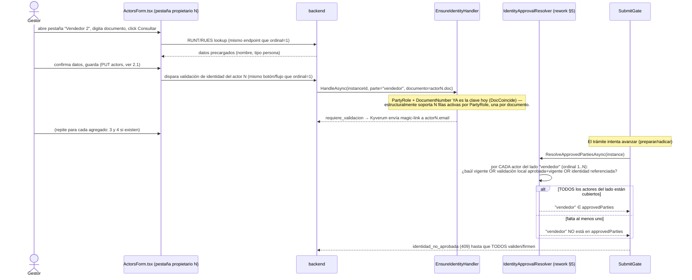

# Diseño: Múltiple Propietario (hasta 4 partes por lado, con reparto porcentual)

> architecture-agent · 2026-09-01 (v2 — incorpora respuestas del usuario a §10 v1) · Encargo directo
> (sin HU/Feature en ADO — restricción explícita del encargo) · No incluye FUR ni Consolidado (fuera
> de alcance, ver §Brecha conocida)
> Fuentes: definición funcional cerrada con el usuario (este encargo) + respuestas del usuario a las 3
> preguntas abiertas de la v1 (§10, ahora §10 "Decisiones confirmadas") + lectura de
> `ActorsCommand.cs`, `ActorsForm.tsx`, `procedure-runtime.ts`, `SubmitGate.cs`, `IdentityApprovalResolver.cs`,
> `FirmaBaulCobertura.cs`, `FirmaPosteriorCommand.cs`, `TramiteNotificationRecipientResolver.cs`,
> `PlateAssignmentEmailEnqueuer.cs` y ~30 consumidores adicionales de `ActorType`/`PartyRole` (barrido
> completo en §5).
>
> **Cambios de esta versión respecto a la v1:** las 3 preguntas abiertas de §10 quedaron respondidas
> por el usuario y dejan de ser supuestos. Impacto: (1) la duplicidad pasa de una regla a **dos
> niveles** (intra-lado bloqueada siempre; vendedor≠comprador se RELAJA cuando algún lado tiene ≥2
> actores) — §4.4 reescrito; (2) "todos firman" queda confirmado como el mismo mecanismo de identidad
> ya diseñado en §4.3 (identidad propia para persona natural, firma del baúl del RL para persona
> jurídica) — §4.2 reescrito, ya NO hay pieza nueva que modelar; (3) las notificaciones a todos los
> copropietarios entran a Fase 1 — `TramiteNotificationRecipientResolver.cs` sale de "Fase 2/confirmar"
> y entra al PR de backend; los proyectores de contenido (`PlateAssignmentEmailModelProjector.cs`,
> `TramiteCambioEstadoEmailProjector.cs`) **no requieren cambio de código** (hallazgo nuevo, ver #16/#17
> en §5). El alcance de archivos por PR se amplía — ver resumen al final de §8.

## Contexto

Hoy `tramites.procedure_instance_actors` admite **exactamente un actor por rol** (comprador,
vendedor, locatario) por trámite: el índice único `(ProcedureInstanceId, ProcedureEntityId)` lo
impone a nivel de base de datos, y `ActorsCommand.cs` lo impone a nivel de aplicación con
`Dictionary<ParteRol, Guid>` / `duplicate_rol`. El negocio necesita representar **copropiedad**: hasta
4 personas por lado (comprador o vendedor) en matrícula inicial y traspaso, cada una con un
porcentaje de propiedad, cada una con su propia identidad validada y su propia firma del
mandato/autorización.

Esto **no es un cambio de columna**: es un cambio de cardinalidad que atraviesa identidad
(biométrica/VID), notificaciones, mandato/firma, y toda la superficie de código que hoy asume "un
actor por rol" — que resultó ser, tras el barrido, unas **30 ubicaciones**. La disciplina de este
diseño es separar lo que **debe** volverse plural (identidad, validación, formulario) de lo que
**puede seguir siendo singular** (documentos autogenerados de la familia FUR/consolidado, fuera de
alcance por restricción explícita del encargo).

## Alcance cerrado (fuente: definición funcional del usuario, no reinterpretada)

- Solo matrícula inicial y traspaso. En traspaso, vendedores y compradores son **dos repartos
  independientes** (cada lado suma 100% por separado).
- Máximo 4 por lado: el actor principal (`ordinal=1`, el que ya existe hoy) + hasta 3 agregados.
- Con un solo actor por lado, el flujo actual **no cambia**: sin pestañas, sin bloque de porcentaje.
- Precisión de 2 decimales; slider en enteros + casilla numérica para afinar.
- El `ordinal=1` es el "solidario": absorbe el residuo (100 − suma de los demás) hasta que el gestor
  edite su porcentaje a mano; desde ahí queda fijo como los demás.
- Bloqueo al avanzar con dos mensajes distintos: suma ≠ 100 y algún actor en 0%.
- **Duplicidad, dos niveles (CONFIRMADO por el usuario, ver §4.4):**
  - **Intra-lado: bloqueada siempre.** Dos compradores no comparten documento; dos vendedores tampoco.
  - **Entre lados (`vendedor ≠ comprador`): se RELAJA cuando al menos un lado tiene 2+ actores.** Un
    vendedor puede figurar también como comprador (aumenta su cuota comprándole a otro copropietario).
    Con exactamente 1 vendedor y 1 comprador, el bloqueo de hoy **no cambia en absoluto**.
- **Identidad y firma se replican ÍNTEGRAS por actor (CONFIRMADO, ver §4.2/§4.3):** consulta RUNT/RUES,
  VID/biometría con estado propio, RL+RUES si es jurídica. "Todos firman" = cada propietario alcanza
  su propia cobertura de firma: persona natural con su identidad propia aprobada+vigente; persona
  jurídica con representante legal configurado, vía la firma del baúl del RL (o su identidad, si el
  gestor eligió ese mecanismo). El trámite no avanza hasta que TODOS los actores de AMBOS lados
  alcancen esa cobertura. El mandatario de la compañía gestora (`mandate_signers`) queda **fuera de
  alcance, confirmado, sin tocar**.
- **Notificaciones (CONFIRMADO):** todos los copropietarios agregados reciben los correos de cambio de
  estado y de asignación de placa, no solo el `ordinal=1` (ver §5 #16/#17).

## Brecha conocida — documentos autogenerados

**Cerrada (HU #12048, 2026-09-02):** FUR overlay, compraventa, mandato y solicitud de trámite virtual
pintan todos los copropietarios (2–4) y sus firmas; un solo actor por lado conserva el layout histórico.
Detalle: [MULTIPLE-PROPIETARIO-documentos-autogenerados.md](MULTIPLE-PROPIETARIO-documentos-autogenerados.md).

**Sigue abierta:** consolidado del expediente, impronta, certificado RUES y escrituras. Esos
documentos **siguen tomando el actor `ordinal=1` de cada lado**. No es omisión: no formaron parte
del pedido de documentos de 2026-09-02.

---

## 1. Modelo de datos — alternativas evaluadas

### Opción A — `ordinal` + `ownership_percentage` en la tabla existente (RECOMENDADA)

Añadir dos columnas a `tramites.procedure_instance_actors` y ampliar el índice único:

```sql
ALTER TABLE tramites.procedure_instance_actors
  ADD COLUMN ordinal integer NOT NULL DEFAULT 1,
  ADD COLUMN ownership_percentage numeric(5,2) NULL;

ALTER TABLE tramites.procedure_instance_actors
  ADD CONSTRAINT ck_procedure_instance_actors_ordinal CHECK (ordinal BETWEEN 1 AND 4);

ALTER TABLE tramites.procedure_instance_actors
  ADD CONSTRAINT ck_procedure_instance_actors_ownership_pct
    CHECK (ownership_percentage IS NULL OR (ownership_percentage > 0 AND ownership_percentage <= 100));

DROP INDEX tramites.uq_procedure_instance_actors_instance_entity;
CREATE UNIQUE INDEX uq_procedure_instance_actors_instance_entity_ordinal
  ON tramites.procedure_instance_actors (procedure_instance_id, procedure_entity_id, ordinal);
```

Filas existentes migran con `ordinal = 1` (ya es el `DEFAULT`, así que el `ALTER` no las toca) y
`ownership_percentage = NULL` → **cero impacto en trámites en curso**: el índice sigue impidiendo dos
filas con el mismo `(instancia, entidad, ordinal)`, y como todas las filas hoy son `ordinal=1`,
sigue siendo "un actor por rol" hasta que alguien inserte `ordinal=2`.

**Pros:**
- Cero migración de datos; `ALTER` puramente aditivo, reversible con `DROP COLUMN`.
- Cada actor sigue siendo una fila de `procedure_instance_actors`: **todo el código que ya recorre
  `instance.Actors`** (incluida la identidad, `PartyRole`+`DocumentNumber` en
  `procedure_instance_biometric_validations`, que YA es 1:N por diseño) sigue funcionando estructural-
  mente; el trabajo real es cambiar filtros `FirstOrDefault(rol)` por `Where(rol).OrderBy(ordinal)`.
- El "actor principal" sigue siendo indistinguible de un actor legacy (`ordinal=1` es literalmente lo
  que hay hoy) — la familia FUR/consolidado (§Brecha conocida) sigue leyendo exactamente lo mismo que
  antes sin tocar una línea.
- Reutiliza el patrón `EffectiveParte`/`ValidateTraspasoPartes` ya existente en `ActorsCommand.cs` para
  la validación de suma=100 sobre el conjunto EFECTIVO (request + conservados) — sin abstracción nueva.

**Contras:**
- El índice único deja de ser "un mecanismo que impone 1 actor por rol" — esa garantía pasa a vivir
  **solo en la aplicación** (rango 1..4 + validación de negocio). Cualquier bug futuro que inserte
  `ordinal` fuera de la reserva del PUT (p. ej. un `SyncSellerActorFromConsultationsHandler` mal
  parcheado) puede colar un 5º actor sin que la BD lo impida por sí sola más allá del CHECK 1..4.
- La suma=100 **no es un invariante expresable en un CHECK de fila**: dos gestores/reintentos
  concurrentes podrían, en teoría, dejarla momentáneamente rota entre el DELETE y el INSERT del PUT
  (mismo patrón de dos `SaveChanges` que usa hoy `PutActorsHandler`). Se acepta porque **ya es así
  hoy** para la regla vendedor≠comprador (se valida en aplicación, no en BD) y porque una trigger de
  BD que sume entre filas de la MISMA transacción exigiría `CONSTRAINT TRIGGER ... DEFERRABLE`, que
  complica el patrón de upsert de dos fases sin necesidad real (ver §6).

**Esfuerzo:** M. **Riesgos:** medio — el riesgo real no es el schema, es el barrido de ~30 consumidores
(§5).

### Opción B — Tabla hija `procedure_instance_actor_shares` (reparto separado del actor)

Mantener `procedure_instance_actors` como está (1 actor "representativo" por rol, sin tocarlo) y
crear una tabla nueva `tramites.procedure_instance_actor_shares` con `procedure_instance_actor_id`
(o directamente los mismos campos de actor) + `ordinal` + `ownership_percentage`, uno-a-muchos desde
la instancia.

**Pros:**
- No toca el índice único existente ni el "significado" de `procedure_instance_actors`: separa
  limpiamente "quién es el actor legal principal" (tabla vieja, la que YA consume FUR/consolidado)
  de "cómo se reparte la propiedad" (tabla nueva).
- Un fallo de migración o de rollback no puede degradar el actor principal: la tabla nueva es aditiva
  en el sentido más fuerte (se puede `DROP TABLE` sin tocar `procedure_instance_actors`).

**Contras:**
- **Reintroduce exactamente el problema que resuelve la Opción A, pero peor**: los ~30 consumidores
  igual necesitan saber que "el vendedor" ahora puede ser 1 o hasta 4 personas — solo que ahora tienen
  que hacer un JOIN a una tabla nueva en vez de filtrar la misma tabla que ya conocen. La identidad
  (`procedure_instance_biometric_validations.PartyRole`) sigue necesitando el documento de CADA
  copropietario para poder validarlo individualmente — con la Opción B, esos documentos viven en dos
  tablas distintas (actor "representativo" en una, agregados en la share) y hay que decidir en cuál
  vive el documento real de cada persona: si vive en la share, entonces la share ES el actor de facto
  y la tabla vieja queda como un alias redundante del `ordinal=1`.
- Dos tablas para un mismo concepto de dominio (persona-parte-de-un-trámite) es más difícil de razonar
  que una tabla con una columna de posición — y no hay un caso de uso real donde se necesite el
  "reparto" SIN el actor (nunca hay un % sin saber de quién).

**Esfuerzo:** L. **Riesgos:** alto — separa dato que el negocio trata como una sola entidad
("propietario N con su % "), duplica el trabajo de JOIN en cada uno de los ~30 consumidores del
barrido, y no reduce el riesgo real (que es de comportamiento, no de schema).

### Opción C — Un solo actor "grupo" con `owners jsonb` embebido

Guardar los copropietarios como un array JSON dentro de una única fila de `procedure_instance_actors`
por rol (columna `owners jsonb`, sin nuevas filas), preservando el índice único actual sin tocarlo.

**Pros:**
- El índice único no se toca en absoluto; cero riesgo de que un futuro insert cuele un actor de más.
- Un solo `SELECT` trae todo el reparto de un lado.

**Contras:**
- **Rompe TODO lo que ya existe sobre identidad**: `procedure_instance_biometric_validations` está
  diseñada para relacionarse con una FILA de actor por `PartyRole` (aunque hoy solo haya una); meter
  los copropietarios en JSON obligaría a inventar una segunda clave (`PartyRole` + índice dentro del
  JSON) que NINGÚN consumidor de identidad, firma o notificación entiende hoy. El `IdentitySubjectResolver`,
  `EnsureIdentityCommand`, `KyverumVerifyCommand`, el webhook de Kyverum (que correlaciona por
  `KyverumVerificationId`) tendrían que aprender a indexar dentro de un JSON en vez de filtrar filas
  con SQL/LINQ — contradice B1/B10 del checklist de schema (SQL sobre JSON no tipado, sin PK propia
  por copropietario).
- Un copropietario deja de tener **identidad propia como fila** (PK, FK a `procedure_entities`,
  índices, RLS): la petición del encargo de "el flujo se replica ÍNTEGRO por cada actor" exige que
  cada copropietario tenga su propio ciclo de vida de validación, y eso pide fila, no elemento de
  array.

**Esfuerzo:** S (schema) mal compensado por L (todo lo demás). **Riesgos:** altísimo — se descarta.

### Decisión

**Opción A.** Es la única que dice: "un copropietario es un actor más, con una columna de posición y
una de reparto" — literalmente lo que el negocio describe ("hasta 4 propietarios por lado") — y es la
que menos superficie nueva introduce sobre un dominio (identidad por actor) que ya está construido
alrededor de "una fila de `procedure_instance_actors` = una persona validable". El costo que paga
(el índice único deja de ser la única barrera de "máximo 1 por rol", ahora es "máximo 4 por rol
validado en aplicación") es aceptable porque **ya es el patrón vigente** para reglas de negocio más
finas que un CHECK de fila (vendedor≠comprador, locatario≠propietario, ambas en aplicación, no en BD).

---

## 2. Sequence diagrams

### 2.1 Guardado de N actores con porcentaje (PUT .../actors)

```mermaid
sequenceDiagram
    actor Gestor
    participant FE as ActorsForm.tsx
    participant API as PUT /instances/{id}/actors
    participant H as PutActorsHandler
    participant Val as EffectiveShareValidator (nuevo)
    participant Repo as ProcedureInstanceRepository
    participant Sync as EnviarValidacionAlRepresentanteDeLaParteJuridicaAsync
    participant Kyv as IniciarKyverumVerifyHandler

    Gestor->>FE: agrega 2do propietario del lado "vendedor"
    FE->>FE: aparece bloque de %; ordinal=1 absorbe residuo (100-suma demás)
    Gestor->>FE: ajusta % de cada pestaña, click Guardar
    FE->>API: PUT actors=[{rol:vendedor,ordinal:1,%:60},{rol:vendedor,ordinal:2,%:40}, ...]
    API->>H: HandleAsync(id, tenantId, request)
    H->>H: 1. Validación de forma por actor (doc/email/rol) — igual que hoy, por CADA ActorInput
    H->>Val: 2. Suma efectiva del lado "vendedor" (request ∪ conservados) == 100 && ninguno <= 0
    alt suma != 100
        Val-->>H: "porcentajes_no_suman_100"
        H-->>API: 409
    else algún % <= 0
        Val-->>H: "porcentaje_en_cero"
        H-->>API: 409
    else duplicado intra-lado (mismo documento, mismo rol)
        Val-->>H: "actor_duplicado_mismo_lado" (CONFIRMADO, ver §4.4)
        H-->>API: 409
    else OK
        H->>Repo: remove actores del rol "vendedor" (todos los ordinales) + SaveChanges
        H->>Repo: add N actores nuevos (ordinal 1..N, % asignado) + SaveChanges
        loop por cada actor agregado (ordinal 1..N)
            H->>Sync: dispara identidad SI el actor es jurídico (igual regla que hoy, ahora por actor)
            Sync->>Kyv: HandleAsync(parte=rol, subject=actor.N) — misma precedencia ADR-0039
        end
        H-->>API: 200 ActorsResponse (N actores, con ordinal y %)
    end
    API-->>FE: 200 / 409 con código de error específico
    FE->>Gestor: mensaje exacto según código (suma / cero / duplicado)
```

### 2.2 Disparo de validación de identidad por actor (N actores de un lado)



---

## 3. Modelo de datos conceptual

**Bounded context:** `tramites` (sin cambios de contexto — el copropietario sigue siendo un
`ProcedureInstanceActor`, no una entidad nueva).

- **`ProcedureInstanceActor`** (existente, ampliada): persona natural o jurídica que participa en un
  trámite con un rol (`comprador`/`vendedor`/`locatario`) y una posición (`ordinal`) dentro de ese rol.
  Relación N:1 con `ProcedureInstance`, N:1 con `ProcedureEntity` (catálogo BUYER/OWNER/LESSEE).
- **Reparto de propiedad**: atributo del actor (`ownership_percentage`), NO una entidad propia (ver
  Opción B descartada en §1) — un copropietario sin porcentaje no tiene sentido de negocio, así que no
  hay necesidad de modelarlo aparte.
- **Identidad** (`ProcedureInstanceBiometricValidation`): ya es N:1 con actor POR DOCUMENTO
  (`PartyRole` + `DocumentNumber`, sin FK formal a `ProcedureInstanceActor.Id` — se correlaciona por
  documento, patrón ya usado por `DocCoincide`). No requiere cambio de schema: ya admite múltiples
  filas activas por `PartyRole` siempre que difieran en documento, que es exactamente lo que Múltiple
  Propietario necesita.
- **`ProcedureInstanceSignature`** (compraventa) y el **mandato** (`MandateSignerId`,
  `DeferredSignatureMark`) siguen siendo **por lado** (`Parte`), no por actor — pertenecen a la familia
  de documentos singulares (§Brecha conocida / mandato es el firmante de la COMPAÑÍA, no del
  propietario — ver §4.2 aclaración importante).

### DDL de referencia (borrador — el `database-agent` lo materializa según checklist §A)

```sql
-- Migración: tramites.procedure_instance_actors — Múltiple Propietario (ADR-0053)

ALTER TABLE tramites.procedure_instance_actors
  ADD COLUMN ordinal integer NOT NULL DEFAULT 1,
  ADD COLUMN ownership_percentage numeric(5,2) NULL;

COMMENT ON COLUMN tramites.procedure_instance_actors.ordinal IS
  'Posición del actor dentro de su rol (1=principal/solidario, 2..4=agregados). ADR-0053.';
COMMENT ON COLUMN tramites.procedure_instance_actors.ownership_percentage IS
  'Porcentaje de propiedad (2 decimales); NULL cuando el rol tiene un solo actor. ADR-0053. @pii:low';

ALTER TABLE tramites.procedure_instance_actors
  ADD CONSTRAINT ck_procedure_instance_actors_ordinal
    CHECK (ordinal BETWEEN 1 AND 4);

ALTER TABLE tramites.procedure_instance_actors
  ADD CONSTRAINT ck_procedure_instance_actors_ownership_pct
    CHECK (ownership_percentage IS NULL
           OR (ownership_percentage > 0 AND ownership_percentage <= 100));

DROP INDEX IF EXISTS tramites.uq_procedure_instance_actors_instance_entity;

CREATE UNIQUE INDEX IF NOT EXISTS uq_procedure_instance_actors_instance_entity_ordinal
  ON tramites.procedure_instance_actors (procedure_instance_id, procedure_entity_id, ordinal);

-- Filas existentes: ordinal ya llega en 1 por el DEFAULT: no requiere UPDATE de backfill.
-- Down: revertir índice a la forma anterior + DROP COLUMN ordinal, ownership_percentage
--       (solo válido si ninguna fila tiene ordinal > 1 — el Down NO es seguro después de producción
--       con copropietarios reales; documentar en la migración como rollback condicionado).
```

La invariante "suma del lado = 100" y "ninguno en 0" **no se modela como CHECK cruzando filas** (ver
§1 Opción A, contras, y §6): vive en `Flit.Tramites.Application` como validación explícita, mismo
patrón que `ValidateTraspasoPartes`/`EffectiveParte`.

---

## 4. Detalle de la solución elegida

### 4.1 `ActorsCommand.cs` — de "un actor por rol" a "hasta 4 por rol"

Cambios estructurales (sin código, solo el diseño de la reescritura que hará el backend-agent):

- `ActorInput`/`ActorDto` ganan `Ordinal` (int, default 1) y `Porcentaje` (decimal?, nullable).
- `Dictionary<ParteRol, Guid> entityIds` no cambia (sigue siendo 1 entidad de catálogo por rol) —
  lo que cambia es `Dictionary<ParteRol, ProcedureInstanceActor> newActorsByRol`, que pasa a ser
  `Dictionary<ParteRol, List<ProcedureInstanceActor>> newActorsByRol` (o
  `ILookup<ParteRol, ProcedureInstanceActor>`), porque cada rol admite ahora 1..4 actores.
- El chequeo `duplicate_rol` (línea ~213: "un actor por rol") se elimina — el límite pasa a ser
  "`ordinal` único dentro del rol, 1..4" (lo impone el índice) y "máximo 4 ordinales presentes por
  rol" (validación explícita `demasiados_actores`, código nuevo).
- `EffectiveParte` (usada hoy por `ValidateTraspasoPartes`/`ValidateLocatario`) se generaliza a
  `EffectivePartes` (plural): dado un rol, devuelve la lista de `ParteDatos` EFECTIVA (request ∪
  conservados), no un solo `ParteDatos?`. La validación vendedor≠comprador pasa a comparar **cada**
  vendedor efectivo contra **cada** comprador efectivo (producto cartesiano acotado a ≤4×4=16
  comparaciones — trivial).
- Nueva validación **`EffectiveShareValidator`** (Application, mismo archivo o uno nuevo pequeño):
  dado un rol y su lista efectiva de actores, si `Count == 1` exige `Porcentaje == null`; si
  `Count >= 2` exige que TODOS traigan `Porcentaje` no nulo, `> 0`, y que la suma redondeada a 2
  decimales sea exactamente `100.00` (tolerancia cero — el encargo pide "exactamente 100%").
- El disparo de identidad (`EnviarValidacionAlRepresentanteDeLaParteJuridicaAsync`) pasa de
  `foreach (var (rol, actor) in newActorsByRol)` a `foreach (var (rol, actor) in newActorsByRol.SelectMany(...))`
  — literalmente el mismo cuerpo, iterando cada actor del rol en vez de uno solo. Ningún cambio de
  regla, solo de cardinalidad del bucle.
- `SyncSellerActorFromConsultationsCommand.cs` (vendedor sincronizado desde RUNT en
  `TRASPASO_UNILATERAL`) **sigue escribiendo solo `ordinal=1`**: la guarda `instance.Actors.Any(a =>
  ActorType == "vendedor")` se cambia a `instance.Actors.Any(a => ActorType == "vendedor" && Ordinal
  == 1)` para no pisar a un ordinal=1 que ya trajera copropietarios agregados por otra vía — en la
  práctica, este flujo es best-effort de creación y nunca convive con captura manual del mismo rol,
  así que el cambio es defensivo, no funcional.

### 4.2 "Todos firman" (CONFIRMADO) — no es el mandato de la compañía, es la cobertura de identidad de cada actor

El usuario confirmó que "todos firman el mandato/autorización" **no** se refiere a
`admin.mandate_signers`/`MandateSignerSelectionCommand.cs` (el mandatario de la COMPAÑÍA GESTORA,
[ADR-0036]) — esa familia **queda confirmada fuera de alcance, sin tocar**. `ResolveNitMandante`
sigue resolviendo el NIT desde el actor `ordinal=1` de cada lado, exactamente como hoy; la ambigüedad
de nombres detectada en la v1 de este diseño era correcta como observación, pero la conclusión es la
contraria a la hipótesis original: no se toca esa pieza.

Lo que "todos firman" significa, confirmado, es que **cada propietario firma con su propio mecanismo**,
el mismo que ya existe hoy para el actor único de cada lado:

- **Persona natural** → firma con su propia validación de identidad (biométrica/VID) aprobada y
  vigente. No hay un artefacto de "firma" separado de la identidad: una identidad aprobada+vigente ES
  la firma de esa persona natural (mismo criterio que ya aplica hoy al actor único).
- **Persona jurídica con representante legal configurado** → el representante legal (RL) firma
  tomando la **firma del baúl** — mecanismo por defecto (HU #11031) salvo que el gestor elija
  explícitamente "identidad" (HU #11061), caso en el que el RL firma con su propia validación de
  identidad, igual que una persona natural.

**La pieza de código que YA materializa "la firma del baúl del RL" es exactamente la que este diseño
ya identificó en §4.3**, sin necesidad de nada adicional:

- `FirmaBaulCobertura.Aplica(actor)` (`Flit.Tramites.Application/UseCases/ProcedureInstances/FirmaBaulCobertura.cs`)
  decide si el actor es jurídico y si el gestor no eligió explícitamente el sello de identidad
  (`MecanismoFirma.ConsumeBaul`).
- `ISignatureVaultPolicy.ResolveAsync(tenantId, tipoDoc, documento, ct)` (Domain, implementada en
  Infrastructure) resuelve si existe de verdad una firma vigente en el baúl para el documento del RL.
- Cuando el gestor eligió "identidad" explícitamente (`MecanismoFirma.Baul` no aplica), el RL cae al
  mismo camino que una persona natural: `BiometricRules.EsAprobadaVigente` sobre la validación local, o
  `FindVigenteApprovedByDocumentAsync` si la identidad vigente vive en otro trámite del tenant.

Los tres caminos (identidad natural, baúl del RL, identidad del RL) **ya están orquestados dentro de
`IdentityApprovalResolver.ResolveApprovedPartiesAsync`/`ApprovedPartiesFromKeys`** — exactamente lo que
§4.3 rediseña para que exija la cobertura de TODOS los actores del lado, no de uno solo. **No hace
falta modelar ninguna pieza nueva de firma**: extender §4.3 a "todos los actores" es, literalmente, la
implementación completa de "todos firman".

La única extensión adicional confirmada: `FirmaPosteriorCommand.cs`/`DeferredSignatureMark` (firma a
posteriori cuando el RL tiene identidad Y baúl **ambos vencidos**) opera hoy con `parte="comprador"|
"vendedor"` resuelta vía `FirstOrDefault` — su rama de actor-RL (distinta de su rama
`parte="mandatario"`, que es la compañía gestora y NO cambia) debe iterar por actor igual que #4.3,
porque es la misma cobertura de identidad/baúl en su variante diferida. Ver #14/#15 en §5.

### 4.3 `IdentityApprovalResolver` — de "el actor del lado" a "todos los actores del lado" (mecanismo confirmado, §4.2)

Cambio central del backend: `ActorFor(instance, parte)` (un solo `FirstOrDefault`) se reemplaza por
`ActoresDe(instance, parte)` (todos los actores de ese rol, `OrderBy(Ordinal)`). `ResolveApprovedPartiesAsync`
y `ApprovedPartiesFromKeys` agregan la parte al set `approved` **solo si TODOS sus actores** pasan la
misma comprobación de hoy (baúl → fila propia vigente → identidad referenciada). Con un solo actor
(caso mayoritario, sin cambios de UX) el comportamiento es idéntico byte a byte al actual. Este cambio,
confirmado por el usuario, **es la implementación completa de "todos firman"** (§4.2) — no requiere
ninguna pieza adicional de firma electrónica.

### 4.4 Duplicidad — dos niveles (CONFIRMADO por el usuario)

La regla deja de ser una sola comprobación y pasa a ser **dos, con condiciones distintas**:

**Nivel 1 — Intra-lado: bloqueada SIEMPRE, sin excepción.** Dos compradores no pueden compartir
documento; dos vendedores tampoco ("nadie es copropietario de sí mismo"). Código de error:
`actor_duplicado_mismo_lado`.

**Nivel 2 — Entre lados (`vendedor ≠ comprador`): se RELAJA cuando algún lado tiene 2+ actores.** Caso
de negocio confirmado: A y B tienen el vehículo 50/50; B le vende su parte a A; A queda con el 100% —
A aparece como vendedor (copropietario que concurre a la venta) y como comprador (que aumenta su
cuota) en el MISMO trámite. La condición es estricta: **la relajación solo aplica cuando
`vendedores.Count >= 2 || compradores.Count >= 2`**. Con exactamente 1 vendedor y 1 comprador (el caso
1-a-1, mayoritario hoy), el bloqueo `vendedor ≠ comprador` **se mantiene exactamente como está** —
venderse a sí mismo el 100% del vehículo sigue siendo un sinsentido y se rechaza igual que hoy, mismo
código de error: `partes_duplicadas`.

**Dónde vive la condición, con precisión:**

- `TraspasoPartes.cs` (Domain, puro) gana dos métodos nuevos, sin tocar el existente
  `DetectarDuplicadas(ParteDatos, ParteDatos)` (se conserva intacto para no arriesgar regresión en el
  caso 1-a-1):
  - `DetectarDuplicadosIntraLado(IReadOnlyList<ParteDatos> lado)` → compara cada par dentro de la
    lista por documento normalizado; se ejecuta **siempre**, independientemente del conteo, sobre
    vendedores y sobre compradores por separado.
  - Ningún método nuevo para el nivel 2: la condición de "solo 1-a-1" vive en el LLAMADOR (ver abajo),
    no en `TraspasoPartes.cs` — así el método existente `DetectarDuplicadas` no cambia de firma ni de
    comportamiento.
- `ActorsCommand.cs` → `ValidateTraspasoPartes` (renombrado internamente a operar sobre listas: usa
  `EffectivePartes(instance, inputs, rol)` en vez de `EffectiveParte`, ver §4.1) queda así:
  1. `var vendedores = EffectivePartes(instance, inputs, ParteRol.Vendedor);`
     `var compradores = EffectivePartes(instance, inputs, ParteRol.Comprador);`
  2. Ejecuta `TraspasoPartes.DetectarDuplicadosIntraLado(vendedores)` y
     `TraspasoPartes.DetectarDuplicadosIntraLado(compradores)` — **siempre**, sin condición de conteo.
     Cualquier duplicado → `actor_duplicado_mismo_lado`.
  3. **Solo si `vendedores.Count == 1 && compradores.Count == 1`**, ejecuta exactamente lo que hace hoy:
     `TraspasoPartes.DetectarDuplicadas(vendedores[0], compradores[0])` +
     `TraspasoPartes.MensajeDuplicadas(dup)` → `partes_duplicadas`. Con cualquier lado en 2+, este paso
     se **omite por completo** (no se ejecuta ninguna comparación cruzada; A puede aparecer en ambas
     listas sin error).
- **Cero regresión garantizada por construcción:** el paso 3 es un `if` que envuelve, sin modificar ni
  un carácter, la llamada que existe hoy (`DetectarDuplicadas`/`MensajeDuplicadas` con la MISMA firma
  de 2 argumentos). El flujo mayoritario (1 vendedor, 1 comprador) entra siempre a ese `if` y ejecuta
  la ruta idéntica a la actual, en el mismo orden, con el mismo mensaje.
- `ValidateLocatario` (locatario ≠ propietario) **se deja fuera de este ajuste**: el alcance cerrado del
  encargo habla de "vendedores" y "compradores" como los dos repartos independientes; no incluye
  explícitamente al locatario como lado con copropiedad. Este diseño mantiene su comparación 1-a-1 sin
  condición de relajación por ahora — si el negocio confirma que el locatario también admite Múltiple
  Propietario, la misma condición de nivel 2 (`locatarios.Count >= 2 || propietarios.Count >= 2`) se
  replicaría igual que para vendedor/comprador; se deja como nota para una confirmación futura, no como
  supuesto de este ADR.

### 4.5 Dónde vive la regla del "solidario" (respuesta a la pregunta #6 del encargo)

**La auto-absorción del residuo (ordinal=1 recalcula 100−suma-de-los-demás mientras no se edite a
mano) vive SOLO EN FRONTEND.** Es un comportamiento de UX de edición en vivo (recalcular mientras el
gestor mueve sliders), no un invariante de negocio persistible: el backend nunca sabe ni necesita saber
"si el gestor ya tocó el % del principal", solo recibe el conjunto final de porcentajes en el PUT.

**El backend valida el RESULTADO, siempre, independientemente del frontend:** suma efectiva del lado
== 100.00 y ningún actor con porcentaje ≤ 0. Esto es no negociable porque el encargo lo pide
explícitamente ("El backend debe validar suma=100 y ninguno en 0% independientemente del frontend") y
porque el patrón ya existe en el repo (`ValidateTraspasoPartes`, `ValidateLocatario`: reglas de negocio
sobre el conjunto efectivo, evaluadas en `Application`, nunca confiando en lo que ya validó la UI). Un
cliente que llame al PUT directamente (Postman, integración futura) sin pasar por `ActorsForm.tsx`
debe recibir el mismo 409 que el gestor si envía porcentajes inválidos.

---

## 5. Barrido de consumidores por rol (auditoría completa)

Metodología: `grep` de `ActorType ==`, `PartyRole ==`/`,`, `instance.Actors.FirstOrDefault/Single`
sobre `services/core-api/src` (excluidas migraciones). ~30 archivos de producción tocan el supuesto
"un actor por rol". Clasificación:

- **CAMBIA (en alcance, Fase 1)** — pieza de identidad/validación/gate que el encargo pide replicar
  por actor; sin el cambio, Múltiple Propietario queda a medias (algunos copropietarios nunca
  validarían identidad, o el gate dejaría avanzar sin que todos validen).
- **NO CAMBIA — brecha conocida (documento singular, familia FUR/consolidado)** — fuera de alcance
  por restricción explícita del encargo; sigue leyendo `ordinal=1`.
- **NO CAMBIA — estructuralmente ya soporta N** — no requiere tocar código porque ya opera por
  documento, no por "el" actor del rol.
- **Fase 2 / requiere confirmación de negocio** — mejora deseable pero NO pedida explícitamente por el
  encargo cerrado; se deja fuera de Fase 1 para no ensanchar el alcance sin autorización.

| # | Archivo | Qué asume hoy | Veredicto | Por qué |
|---|---|---|---|---|
| 1 | `ActorsCommand.cs` (`ActorsCommand`/`PutActorsHandler`) | 1 actor por rol (`Dictionary<ParteRol,Guid>`, `duplicate_rol`) | **CAMBIA** | Es el corazón del feature — §4.1 |
| 2 | `ProcedureInstanceActor.cs` (Domain) | Entidad plana sin ordinal/%  | **CAMBIA** | +2 propiedades, §1 |
| 3 | `ProcedureInstanceActorConfiguration.cs` | Índice único `(instance, entity)` | **CAMBIA** | §1/§3 |
| 4 | `ActorEndpoints.cs` | Contrato `PutActorsRequest`/`ActorsResponse` sin ordinal/% | **CAMBIA** | Nuevos códigos de error 409 (§Contrato API) |
| 5 | `SyncSellerActorFromConsultationsCommand.cs` | Guarda vendedor si NO existe ninguno | **CAMBIA (mínimo)** | Guarda ⇒ filtrar por `Ordinal==1`, §4.1 |
| 6 | `IdentityApprovalResolver.cs` | `ActorFor` = 1 actor por parte; "aprobado" = ese actor | **CAMBIA** | Gate de avance — §4.3, pieza más crítica del barrido |
| 7 | `SubmitGate.cs` | `identidadAprobadaPartes.Contains(parte)` (booleano por lado) | **NO CAMBIA (consume el fix de #6)** | Ya es "por lado"; con #6 corregido, el booleano ya significa "TODOS los actores del lado" sin tocar `SubmitGate.cs` |
| 8 | `EnsureIdentityCommand.cs` | `Actors.FirstOrDefault(rol)`, pero YA filtra por `DocCoincide` (documento) | **CAMBIA (solo el punto de invocación)** | La lógica interna ya es por-documento; falta que el llamador (PutActorsHandler / UI) la invoque una vez por actor, no una vez por rol |
| 9 | `KyverumVerifyCommand.cs` | `Actors.FirstOrDefault(a.ActorType==parte)` para nombre/registro | **CAMBIA (acotado)** | Se invoca ya con `subject.Documento` correcto vía `IniciarBiometriaInput`; el único ajuste es no asumir que hay un solo actor al resolver metadatos auxiliares — revisar en implementación, riesgo bajo |
| 10 | `BiometricaCommand.cs` (`ListBiometriaHandler`, etc.) | Lista una validación por `(instance, parte)` para pintar la grilla | **CAMBIA** | La grilla de biometría del trámite debe mostrar 1 fila por actor (documento), no 1 por lado — de lo contrario un copropietario "desaparece" de la vista aunque tenga su propia validación en curso |
| 11 | `CertificadoIdentidadCommand.cs` | `instance.Actors.Any(...)` (ya recorre TODOS los actores) | **NO CAMBIA — ya soporta N** | El match "¿es la identidad efectiva de ALGÚN actor?" ya no asume 1:1; funciona igual con 4 actores |
| 12 | `MandateSignerSelectionCommand.cs` (`ResolveNitMandante`) | NIT del "vendedor" (uno) para resolver mandatarios | **NO CAMBIA — CONFIRMADO fuera de alcance** | Es el mandato de la COMPAÑÍA GESTORA (§4.2); el usuario confirmó que "todos firman" no incluye esta pieza. Sigue anclado a `ordinal=1`, sin ambigüedad pendiente |
| 13 | `FirmaCommand.cs` (compraventa) | 1 firma por `(parte, docTipo)` | **NO CAMBIA — brecha conocida (FUR/consolidado)** | `SubmitGate` ya NO bloquea por esto (B12/ADR-0028); es documento singular por diseño; el mecanismo confirmado de "todos firman" es identidad+baúl (§4.2), no este artefacto |
| 14 | `FirmaPosteriorCommand.cs` | `Actors.FirstOrDefault(parte)` para la rama `parte=comprador\|vendedor`; rama separada `parte=mandatario` para la compañía gestora | **CAMBIA (acotado) — solo la rama de actor** | CONFIRMADO: es la variante DIFERIDA del mismo mecanismo de §4.2/§4.3 (RL con identidad y baúl ambos vencidos) — debe iterar por actor del rol, igual que #6/#8. La rama `parte="mandatario"` (compañía gestora, `ParteMandatario`) **no cambia**: mismo régimen confirmado que #12 |
| 15 | `DeferredSignatureMark` (entidad) / `DeferredSignatureBatchConsumer.cs` | `PartyRole` string; una marca por lote, correlacionada por documento del representante | **CAMBIA (acotado) — solo marcas de actor** | Ya correlaciona por `RepresentativeDocumentNumber` (documento), no por "el" actor — estructuralmente admite N marcas activas por `PartyRole` (una por copropietario jurídico con RL diferido), igual que la biométrica (#10). El cambio real es en el PUNTO DE CREACIÓN de la marca (#14), no en la entidad ni en el consumidor del lote. Las marcas con `CompanyDocumentNumber=null` (mandatario) no cambian |
| 16 | `TramiteNotificationRecipientResolver.cs` | `actors.FirstOrDefault(rol)` → 1 destinatario por rol | **CAMBIA — CONFIRMADO, en alcance** | El usuario confirmó que todos los copropietarios reciben notificaciones. Ya devuelve una LISTA (`List<TramiteEmailRecipient>`); el cambio es `Where(a => ActorType==rol).OrderBy(Ordinal)` en vez de `FirstOrDefault`, ejecutando `ResolveJuridical`/`ResolveNatural` una vez POR ACTOR del rol (misma lógica interna, sin cambios) |
| 17 | `PlateAssignmentEmailModelProjector.cs` | `FindActor(actors,"comprador")` → `ClienteNombre` (contenido del correo, no destinatario) | **NO REQUIERE CAMBIO DE CÓDIGO — hallazgo confirmado** | El fan-out a TODOS los copropietarios YA lo resuelve `PlateAssignmentEmailEnqueuer.cs`, que llama a `ITramiteNotificationRecipientResolver.Resolve(...)` (#16) e inserta **una fila de dispatch por destinatario** en `plate_assignment_email_dispatches` — al arreglar #16, el fan-out queda correcto automáticamente. Este projector solo aporta el texto del CUERPO del correo (`ClienteNombre` como saludo); con Múltiple Propietario ese saludo seguirá usando el nombre del actor `ordinal=1` para TODOS los destinatarios del lado — brecha cosmética aceptada (mismo criterio que la familia de documentos singulares), no bloqueante para "todos reciben el correo" |
| 18 | `TramiteCambioEstadoEmailProjector.cs` | Mismo patrón que #17 (contenido, no destinatario) | **NO REQUIERE CAMBIO DE CÓDIGO — mismo hallazgo que #17** | `ProcedureStateChangeEmailEnqueueNotifier.cs` también resuelve destinatarios vía `ITramiteNotificationRecipientResolver` (#16) con el mismo patrón de fan-out por dispatch; el projector de contenido no necesita tocarse |
| 19 | `GenerarImprontaAttachmentCommand.cs` | `FirstOrDefault(rolPropietario)` para el PDF de impronta | **NO CAMBIA — brecha conocida (documento)** | Documento autogenerado singular, familia FUR |
| 20 | `GenerarRuesAttachmentCommand.cs` | `FirstOrDefault(a=>NIT)` | **NO CAMBIA — brecha conocida (documento)** | Ídem |
| 21 | `ProcedureDeedResolver.cs` | Resuelve tipo de escritura por `actor.ActorType=="comprador"` | **NO CAMBIA — brecha conocida (documento)** | Ídem |
| 22 | `FurCommand.cs` (todo el archivo) | ~8 sitios `FirstOrDefault(rol)` | **NO CAMBIA — brecha conocida explícita** | Restricción del encargo: no tocar la familia FUR |
| 23 | `ListProcedureInstancesQuery.cs` (bandeja) | `buyer`/`seller` = `FirstOrDefault`, columna "Firmado" por `DeriveFirmaParte` | **CAMBIA (deriva de #6)** | Usa el mismo `IdentityApprovalResolver`/`ApprovedPartiesFromKeys`; al corregir #6 la bandeja hereda el comportamiento correcto sin tocar su propio código de resolución de nombre — el NOMBRE mostrado en la bandeja (`buyer?.FullName`) sí sigue siendo el de `ordinal=1` (aceptado: la bandeja es una lista, no el detalle) |
| 24 | `WizardStateQuery.cs` | Múltiples `FirstOrDefault(actorType)` para gates de pasos (revealSellerForm, etc.) | **CAMBIA (acotado)** | Los gates de "¿está completo este paso?" deben preguntar por TODOS los actores del rol, no por uno; mismo patrón que `FinalizeDraftGate.ActoresCompletos` (#25) |
| 25 | `FinalizeDraftProcedureInstanceCommand.cs` (`FinalizeDraftGate`) | `Completo(parte)` sobre 1 actor | **CAMBIA** | "Actores completos" debe exigir que TODOS los actores del rol (no solo uno) tengan nombre/documento — mismo criterio que el gate de identidad |
| 26 | `RnmcConsultCommand.cs` | `FirstOrDefault(actorType)` para pedir la fecha de expedición RNMC | **CAMBIA (acotado)** | RNMC no es bloqueante (best-effort); pero si aplica a cada actor natural, debe consultarse por cada uno — riesgo bajo, confirmar con QA si RNMC tiene costo/límite por consulta |
| 27 | `PreflightCommand.cs` | `FirstOrDefault(actorType)` | **CAMBIA (acotado)** | Mismo régimen que #26/preflight de datos por actor |
| 28 | `IdentityValidationResultApplier.cs` / `DeferredSignatureBatchConsumer.cs` / `IdentitySendDecisionForTramite.cs` | Operan sobre `PartyRole` de una validación YA resuelta (no eligen "el" actor) | **NO CAMBIA — ya soporta N** | Consumen una validación puntual por su Id/documento, no "el" actor del rol |
| 29 | `OtQueryRepository.cs` / `CompanyQueryRepository.cs` / `OtClientProcedureRepository.cs` (vistas OT/lectura) | `Where(a.ActorType==rol)` para pintar nombre/documento en vistas del organismo/compañía | **Fase 2 / confirmar** | Vistas de solo lectura hacia el OT o hacia consolidados de compañía; mostrar solo `ordinal=1` es una degradación visible pero no bloqueante. NO formaba parte de las 3 preguntas resueltas en §10 — se deja pendiente de una confirmación de negocio propia antes de tocarla |
| 30 | `RegistrarDocumentoQuipuxHandler.cs` | `Actors.FirstOrDefault(a.ActorType==rol)` para el radicado Quipux | **NO CAMBIA — brecha conocida (documento externo)** | El radicado ante el organismo usa los mismos datos singulares que el FUR; mismo régimen |
| 31 | `IctOrchestrationService.cs` (gRPC) | `request.Actors.FirstOrDefault(...)` | **Distinto — no es `instance.Actors`** | Es el payload de ENTRADA de una integración externa (ICT), no una lectura de `procedure_instance_actors`; fuera de este barrido |

**Resumen de Fase 1 (backend, en alcance) — actualizado con las 3 confirmaciones:** ítems 1–10, 14
(rama actor), 15 (rama actor), 16, 23–27 (≈18 archivos; +14, +15, +16 respecto a la v1). **Sin cambio
de código, hallazgo confirmado:** 17, 18 (el fan-out ya lo resuelve #16 vía el `Enqueuer`/`Notifier`
existente — ver detalle en la tabla). **Brecha conocida documentada, sin tocar (confirmado, sin
ambigüedad):** 12, 13, 15 (rama mandatario), 19–22, 30 (≈9 archivos, familia documento-singular /
mandato-de-compañía). **Sigue en "Fase 2 / requiere confirmación de negocio"** (no formaba parte de
las 3 preguntas respondidas): 29 (vistas de solo lectura hacia el OT/compañía — 1 archivo).

---

## 6. Backend vs. frontend — resumen de responsabilidades

| Regla | Frontend | Backend |
|---|---|---|
| Auto-absorción del residuo en `ordinal=1` mientras no se edite | **Sí, único lugar** | No aplica (recibe el resultado final) |
| Suma del lado == 100.00 | Valida para UX (deshabilita "Continuar") | **Autoritativo** — 409 `porcentajes_no_suman_100` |
| Ningún actor en 0% | Valida para UX | **Autoritativo** — 409 `porcentaje_en_cero` |
| Máximo 4 por lado | Oculta el botón "Agregar" al llegar a 4 | **Autoritativo** — 409 `demasiados_actores` (o 400 si se prefiere tratar como forma inválida) |
| Duplicidad intra-lado (CONFIRMADO, siempre bloquea) | Podría advertir en vivo si detecta el mismo documento en dos pestañas del mismo lado | **Autoritativo** — 409 `actor_duplicado_mismo_lado` |
| Duplicidad entre lados 1-a-1 (CONFIRMADO, solo si ambos lados tienen exactamente 1 actor) | Podría advertir si detecta el mismo documento en la única pestaña de cada lado | **Autoritativo** — 409 `partes_duplicadas` (código sin cambios, mismo comportamiento de hoy) |
| Duplicidad entre lados con algún lado en 2+ actores (CONFIRMADO, se permite) | No advierte — es un caso válido (A vende su cuota y compra más) | No bloquea — la comparación cruzada se omite por diseño (§4.4) |
| `ordinal=1` no se elimina | Pestaña sin botón `×` | **Autoritativo** — 409 `ordinal_principal_ausente` si el PUT omite `ordinal=1` para un rol presente |
| Todos validan identidad antes de avanzar | Muestra el estado por pestaña | **Autoritativo** — `SubmitGate`/`FinalizeDraftGate` vía `IdentityApprovalResolver` corregido (§4.3) |

---

## 7. Contrato API

Ver `contracts/openapi/core-api.v1.yaml` (actualizado en este mismo diseño):

- Nuevos paths `GET`/`PUT /api/v1/tramites/instances/{id}/actors` (el endpoint YA existe en código —
  `ActorEndpoints.cs` — pero no estaba documentado en el contrato OpenAPI; se añade junto con la
  ampliación).
- `ActorInput`/`ActorDto` ganan `ordinal` (int, 1..4, default 1) y `porcentaje` (number, nullable,
  0.01..100).
- Nuevos códigos de error 409: `porcentajes_no_suman_100`, `porcentaje_en_cero`,
  `actor_duplicado_mismo_lado`, `ordinal_fuera_de_rango`, `ordinal_principal_ausente`. El código
  `duplicate_rol` **se retira** (ya no aplica: un rol admite varios actores).
- `partes_duplicadas` (vendedor≠comprador) **se conserva sin cambio de contrato**, pero su condición de
  disparo queda acotada (CONFIRMADO, §4.4): solo se evalúa cuando el request deja exactamente 1 actor
  efectivo en cada lado. Con 2+ actores en cualquier lado, `partes_duplicadas` deja de ser alcanzable
  aunque un mismo documento aparezca en ambos lados (caso de negocio válido: copropietario que compra
  cuota adicional).

**¿Es breaking change?** **No para el caso de 1 actor por lado** (el caso mayoritario hoy): un
`ActorInput` sin `ordinal` ni `porcentaje` se interpreta como `ordinal=1`, `porcentaje=null` — idéntico
al contrato actual byte a byte. **Sí es un cambio de comportamiento** para cualquier cliente que hoy
dependiera de `duplicate_rol` como código de error (ninguno identificado fuera de `ActorsForm.tsx`, que
se actualiza en el mismo esfuerzo). Se documenta como **aditivo, no breaking**, con el matiz de que
`duplicate_rol` deja de ser alcanzable.

---

## 8. Lista exacta de archivos a crear/modificar

### PR 1 — Schema + Backend (`services/core-api`)

**Crear:**
- `services/core-api/src/Flit.Infrastructure/Migrations/<timestamp>_MultiplePropietario.cs` (+ `.Designer.cs`)
- `services/core-api/docs/adr/ADR-0053-multiple-propietario-modelo-reparto.md` (este ADR, ya entregado)

**Modificar:**
- `services/core-api/src/Flit.Tramites.Domain/Entities/ProcedureInstanceActor.cs` — `+Ordinal`, `+OwnershipPercentage`
- `services/core-api/src/Flit.Infrastructure/Persistence/Configurations/Tramites/ProcedureInstanceActorConfiguration.cs` — índice + CHECKs
- `services/core-api/src/Flit.Tramites.Application/UseCases/ProcedureInstances/ActorsCommand.cs` — núcleo (§4.1) + duplicidad de dos niveles (§4.4, CONFIRMADO)
- `services/core-api/src/Flit.Tramites.Domain/Tramites/Services/TraspasoPartes.cs` — `+DetectarDuplicadosIntraLado` (§4.4, CONFIRMADO; `DetectarDuplicadas` existente no se toca)
- `services/core-api/src/Flit.Tramites.Application/UseCases/ProcedureInstances/SyncSellerActorFromConsultationsCommand.cs` — filtro `Ordinal==1` (§4.1)
- `services/core-api/src/Flit.Tramites.Application/UseCases/ProcedureInstances/IdentityApprovalResolver.cs` — agregación por TODOS los actores (§4.3), mecanismo confirmado de "todos firman" (§4.2)
- `services/core-api/src/Flit.Tramites.Application/UseCases/ProcedureInstances/FinalizeDraftProcedureInstanceCommand.cs` — `ActoresCompletos` por TODOS los actores
- `services/core-api/src/Flit.Tramites.Application/UseCases/ProcedureInstances/WizardStateQuery.cs` — gates por actor donde aplique
- `services/core-api/src/Flit.Tramites.Application/UseCases/ProcedureInstances/BiometricaCommand.cs` — listado 1 fila por actor
- `services/core-api/src/Flit.Tramites.Application/UseCases/ProcedureInstances/EnsureIdentityCommand.cs` — invocación por actor (acotado)
- `services/core-api/src/Flit.Tramites.Application/UseCases/ProcedureInstances/PreflightCommand.cs` — acotado
- `services/core-api/src/Flit.Tramites.Application/UseCases/ProcedureInstances/RnmcConsultCommand.cs` — acotado
- `services/core-api/src/Flit.Tramites.Application/UseCases/ProcedureInstances/FirmaPosteriorCommand.cs` — CONFIRMADO en alcance (§4.2): rama `parte=comprador|vendedor` itera por actor; rama `parte=mandatario` no se toca
- `services/core-api/src/Flit.Tramites.Domain/Entities/DeferredSignatureMark.cs` / `services/core-api/src/Flit.Tramites.Application/Identity/DeferredSignatureBatchConsumer.cs` — verificar en implementación que N marcas activas por `PartyRole` (una por copropietario jurídico diferido) se procesan correctamente; sin cambio de schema (ya correlaciona por documento)
- `services/core-api/src/Flit.Tramites.Application/Notifications/TramiteNotificationRecipientResolver.cs` — CONFIRMADO en alcance (§5 #16): itera todos los actores del rol, no solo el primero
- `services/core-api/src/Flit.Api/Endpoints/Tramites/ActorEndpoints.cs` — nuevos códigos de error 409
- `contracts/openapi/core-api.v1.yaml` — ya actualizado en este diseño

**Sin cambio de código (verificado, no listar en el diff):** `PlateAssignmentEmailModelProjector.cs`,
`TramiteCambioEstadoEmailProjector.cs`, `PlateAssignmentEmailEnqueuer.cs`,
`ProcedureStateChangeEmailEnqueueNotifier.cs` — el fan-out a todos los copropietarios ya funciona
correctamente en cuanto `TramiteNotificationRecipientResolver.cs` devuelva la lista completa (§5 #17/#18).

**Estimación de tamaño:** `ActorsCommand.cs` por sí solo puede superar 300 líneas de diff (reescritura
de la sección de upsert + validaciones nuevas de porcentaje y de duplicidad de dos niveles). Sumado a
`IdentityApprovalResolver.cs` (~100 líneas), `FirmaPosteriorCommand.cs`/`DeferredSignatureMark`
(~60-80 líneas) y `TramiteNotificationRecipientResolver.cs` (~40 líneas), el PR completo probablemente
**supera las 800 líneas** del límite FLIT — más ahora que en la v1, por las 3 confirmaciones.
**Recomendación: partirlo en TRES PRs secuenciales** dentro del mismo backend (se agrega un PR 1c
respecto a la v1):
- **PR 1a (schema + núcleo de captura):** migración + entidad + configuración + `ActorsCommand.cs` +
  `TraspasoPartes.cs` + `SyncSellerActorFromConsultationsCommand.cs` + `ActorEndpoints.cs` + contrato
  OpenAPI. (~450–550 líneas estimadas — incluye ahora la duplicidad de dos niveles confirmada.)
- **PR 1b (gates e identidad por actor):** `IdentityApprovalResolver.cs` + `FinalizeDraftProcedureInstanceCommand.cs`
  + `WizardStateQuery.cs` + `BiometricaCommand.cs` + `EnsureIdentityCommand.cs` + `PreflightCommand.cs`
  + `RnmcConsultCommand.cs`. (~300–400 líneas estimadas, depende de PR 1a mergeado primero.)
- **PR 1c (firma diferida por actor + notificaciones, NUEVO en esta versión):** `FirmaPosteriorCommand.cs`
  + `DeferredSignatureMark.cs`/`DeferredSignatureBatchConsumer.cs` (si aplica cambio tras verificación)
  + `TramiteNotificationRecipientResolver.cs`. (~150–200 líneas estimadas, depende de PR 1b por el uso
  compartido de `IdentityApprovalResolver`/cobertura de identidad.)

### PR 2 — Frontend (`frontend`)

**Modificar:**
- `frontend/lib/api/types/procedure-runtime.ts` — `ProcedureActor.ordinal`, `ProcedureActor.porcentaje`
- `frontend/components/operacion/ActorsForm.tsx` — pestañas por lado cuando `count>1`, bloque de
  porcentaje (slider entero + input decimal), botón "Agregar propietario" (máx. 4), auto-absorción del
  residuo en `ordinal=1` (§4.5), rótulo vía `rotuloDelActor(rol, ordinal)` en vez de literal fijo,
  mensajes de bloqueo exactos ("La suma de los porcentajes debe ser exactamente 100%." / "Todos los
  propietarios deben tener un porcentaje mayor a 0%."), consulta RUNT/RUES individual por pestaña
  agregada (reutiliza el mismo flujo que ya corre para `ordinal=1`, ahora parametrizado por índice)
- `frontend/components/operacion/detalle/TramiteDetalleActores.tsx` — pinta N tarjetas por lado (hoy 1)
- `frontend/components/operacion/wizardCapabilities.ts` — si declara capacidades por rol singular, revisar
- `frontend/components/operacion/FirmaFurStep.tsx` — revisar si asume 1 firmante por lado en la UI (aunque el backend no bloquee por esto, la UI no debe mentir mostrando "falta 1 firma" con 3 pendientes)

**Nota de esfuerzo:** dado que el estado de `ActorsForm.tsx` ya es posicional (`Record<number, X>`
indexado por posición en el array `actors`, no por rol), el cambio de "1 card por rol" a "N cards por
rol" es estructuralmente compatible con el patrón existente — el trabajo real es la UI de pestañas +
bloque de porcentaje + los tres mensajes de bloqueo, no una reescritura del manejo de estado. Aun así,
`ActorsForm.tsx` tiene 3862 líneas: **recomendación de partir el PR 2** en:
- **PR 2a:** tipos + lógica de pestañas/agregar-eliminar + bloque de porcentaje + validaciones de
  bloqueo (sin tocar consulta RUNT/RUES de agregados todavía, dejándolos en modo "captura manual").
- **PR 2b:** consulta RUNT/RUES individual por pestaña agregada + integración de identidad/VID por
  pestaña + `TramiteDetalleActores.tsx`.

---

## 9. Notas operativas por agente

- **Database Agent**: aplicar la migración de §3 (checklist §A: A1 ok schema `tramites` ya existe, A7
  no aplica FK nueva, A12 nombres `ck_`/`uq_` ya siguen convención, A17 Up/Down — el Down documentar
  como condicional). Verificar que el índice nuevo no colisione con datos de prueba/seed que ya tengan
  `ordinal` implícito distinto de 1 (no debería haber ninguno).
- **Backend Agent**: seguir §4 y §8 al pie de la letra; **no tocar** `FurFieldMapper.cs` ni el resto de
  la familia FUR/consolidado (§Brecha conocida) sin una decisión explícita posterior. Los dos supuestos
  de la v1 (§4.2 alcance de "todos firman", §4.4 duplicidad) quedaron **confirmados por el usuario** —
  ya no requieren validación adicional antes de implementar. Puntos de atención al codificar: (1) la
  duplicidad entre lados (`partes_duplicadas`) solo se evalúa cuando ambos lados quedan en exactamente
  1 actor efectivo — verificar con test que el caso 1-a-1 no cambie ni un carácter de comportamiento;
  (2) `FirmaPosteriorCommand.cs` tiene DOS ramas (`parte=comprador|vendedor` cambia, `parte=mandatario`
  no cambia) — no mezclar el cambio entre ellas.
- **Frontend Agent**: reutilizar `rotuloDelActor` parametrizado por ordinal (NO introducir el literal
  "Propietario N"); el bloque de porcentaje aparece y no se oculta una vez visible (aunque quede un
  solo actor tras eliminar, según regla del encargo — el ordinal=1 queda con 100% ESCRITO, no oculto).
- **QA Agent**: casos límite — 1→2→1 actor (aparece/permanece el bloque de %), residuo negativo si el
  gestor edita agregados antes que el principal, 4 actores exactos (bloquear un 5º), suma 99.99/100.01
  por redondeo de 2 decimales, documento repetido intra-lado, identidad de 1 de 4 actores rechazada
  (el trámite no debe avanzar), vendedor con 3 actores + comprador con 1 (repartos independientes).
- **Security Agent**: cada copropietario agregado introduce PII nueva (documento, nombre, email) sujeta
  a Habeas Data igual que el actor principal — el consentimiento `AutorizaReutilizacionDatos`
  (HU #10878/ADR-0031) debe capturarse por actor, no una sola vez por lado. Revisar que
  `SyncSellerActorFromConsultationsCommand` (best-effort, sin formulario) no se active nunca para
  `ordinal>1` (los agregados SIEMPRE se capturan por formulario, con consentimiento explícito).
- **Infra Agent**: sin cambios de despliegue; migración estándar en el pipeline de EF Core existente.

---

## 10. Decisiones confirmadas por el usuario (2026-09-01, segunda ronda — cierra las preguntas de la v1)

Las 3 preguntas abiertas de la v1 de este diseño quedaron respondidas. Se listan aquí como registro de
trazabilidad; el detalle de cada una ya está incorporado en las secciones referenciadas.

1. **Duplicidad — CONFIRMADA, dos niveles** (§4.4, §6, §7): intra-lado bloqueada siempre
   (`actor_duplicado_mismo_lado`); entre lados (`vendedor ≠ comprador`) se relaja cuando algún lado
   tiene 2+ actores, y se mantiene intacta (`partes_duplicadas`) cuando ambos lados tienen exactamente
   1 actor.
2. **"Todos firman" — CONFIRMADO, sin pieza nueva** (§4.2, §4.3): es la misma cobertura de identidad ya
   diseñada en `IdentityApprovalResolver` (identidad propia para persona natural; firma del baúl del
   representante legal, o su identidad si el gestor eligió ese mecanismo, para persona jurídica).
   `mandate_signers`/`MandateSignerSelectionCommand.cs` (mandatario de la compañía gestora) queda
   confirmado fuera de alcance.
3. **Notificaciones — CONFIRMADO, todos reciben** (§5 #16/#17/#18, §8): `TramiteNotificationRecipientResolver.cs`
   entra al PR de backend; los proyectores de contenido del correo no requieren cambio (el fan-out ya
   lo resuelven el `Enqueuer`/`Notifier` existentes a partir de la lista de destinatarios).

**No quedan preguntas abiertas que bloqueen la implementación de Fase 1.** Sigue pendiente, fuera de
esta ronda de confirmación, el ítem #29 de §5 (vistas de solo lectura OT/compañía) marcado como
"Fase 2 / requiere confirmación de negocio" — no formaba parte de las 3 preguntas respondidas.
