# Diagnóstico: habilitación dinámica de tipos de trámite

Documento de trabajo para planificar los cambios que permiten:

1. Seleccionar al inicio del flujo primero la **familia** (`tramites.procedure_types.family`) y luego el **tipo** (`tramites.procedure_types.name` / `code`).
2. Dejar de tener valores quemados en modalidad ×2 (`matricula_inicial` / `traspaso`) donde el negocio ya piensa en **3 familias**.
3. Habilitar de forma controlada todos los tipos del catálogo canónico, sin romper la experiencia de los flujos que hoy sí existen.

**Estado:** diagnóstico (sin implementación).  
**Fecha de referencia:** 2026-08-21.  
**Relacionado:** portada del consolidado (rótulo por modalidad, no por `name`); guía de mandatarios en `docs/guia-mandatarios-contrato-mandato.md`.

---

## 1. Objetivo y alcance

### 1.1 Objetivo de negocio

- El gestor, al crear un trámite, elige **familia → tipo** a partir del catálogo `tramites.procedure_types`.
- No debe haber listas hardcodeadas de “solo matrícula / solo traspaso” en pantallas de clasificación, filtros y administración, cuando el catálogo ya define tres familias.
- Los tipos del catálogo deben poder habilitarse **dinámicamente** (datos + configuración), no con un deploy por cada código nuevo.

### 1.2 Restricción dura

La experiencia del asistente (wizard) de **Matrícula inicial** y **Traspaso** no debe degradarse. Abrir el catálogo completo sin barreras produce expedientes con tipo correcto en FK pero flujo, documentos, FUR y rechazo incorrectos.

### 1.3 Fuera de alcance de este documento

- Implementación de código, migraciones o PRs.
- Redacción formal de Feature / HUs en Azure DevOps (este texto es la base para ese plan).
- Diseño detallado del wizard propio de la familia OTROS.

---

## 2. Estado actual del modelo

### 2.1 Catálogo canónico — `tramites.procedure_types`

Definición base: `services/core-api/src/Flit.Infrastructure/Persistence/Sql/Ddl/04-HU10151-tramites-parametrizacion.sql`.  
Catálogo unificado: `services/core-api/src/Flit.Infrastructure/Persistence/Sql/Ddl/40-catalogo-tipos-tramite-canonico.sql`.

Columnas relevantes:

| Columna | Uso |
|---|---|
| `code` | Identificador estable (`MATRICULA_NUEVA`, `DUPLICADO_PLACA`, …) |
| `name` | Etiqueta de negocio (“Matrícula inicial”, “Duplicado de placa”, …) |
| `family` | `MATRICULAS` \| `TRASPASO` \| `OTROS` |
| `is_active` / `publication_status` | Visibilidad admin vs operación |
| `gate_profile` | JSON de gates (entryMode VIN/PLATE, biometría, etc.) |
| `external_refs` | Incluye bloque `quipux` cuando el tipo es elegible para radicar en QX |

Tipos sembrados (resumen):

| Familia | Codes (activos / publicados en seed) | Inactivos / draft |
|---|---|---|
| MATRICULAS | `MATRICULA_NUEVA`, `MATRICULA_LEASING`, `CANCELACION_MATRICULA` | `REMATRICULA` |
| TRASPASO | `TRASPASO_STANDARD`, `TRASPASO_UNILATERAL`, `TRASPASO_TRANSFERENCIA_DE_DOMINIO` | — |
| OTROS | `CAMBIO_LOCATARIO`, `CAMBIO_CARROCERIA`, `BLINDAJE`, `CAMBIO_COLOR`, `DUPLICADO_PLACA`, `DUPLICADO_TARJETA`, `LEVANTAMIENTO_PRENDA`, `PRENDA_INSCRIPCION`, `RADICADO_CUENTA`, `CONVERSION_COMBUSTIBLE`, `TRASLADO_CUENTA` | `REGRABAR_MOTOR_CHASIS`, `LEVANTAR_INSCRIBIR_PRENDA`, `CAMBIO_ACREEDOR` |

**Operativos reales en el wizard hoy:** solo `MATRICULA_NUEVA` y `TRASPASO_STANDARD`.

### 2.2 Instancia — `tramites.procedure_instances`

Entidad: `services/core-api/src/Flit.Tramites.Domain/Entities/ProcedureInstance.cs`.

| Campo en instancia | ¿Se guarda? | Notas |
|---|---|---|
| `procedure_type_id` | Sí | FK al tipo canónico |
| `family` | **No** | Solo vía JOIN a `procedure_types` |
| `modalidad_entrada` | Sí | Solo `matricula_inicial` \| `traspaso` (varchar 20) |
| `tipologia_codigo` | Sí | Tipología del wizard / checklist |

Conclusión directa: **el tipo sí queda persistido; la familia no se denormaliza en la instancia.**

### 2.3 Derivación al crear

Handler: `CreateProcedureInstanceCommand.cs`.  
Resolución: `TipologiaResolver.FromFamily`.

```
family = TRASPASO     → modalidad = traspaso,          tipología = traspaso_standard
family = MATRICULAS   → modalidad = matricula_inicial, tipología = matricula_inicial
family = OTROS        → modalidad = matricula_inicial, tipología = matricula_inicial  ← colapso
family desconocida    → misma ruta que matrícula
```

Precedencia de creación: `ProcedureTypeCode` > `ProcedureTypeId` > `Modalidad` (esta última mapea a `MATRICULA_NUEVA` / `TRASPASO_STANDARD`).

### 2.4 Entrada UX actual

- `/tramites/nuevo` redirige a `/tramites/nuevo/[modalidad]` con solo dos valores válidos.
- En el paso 1 del wizard (`TramiteWizard.tsx`) hay tres tarjetas hardcodeadas:
  - Matrícula Inicial (disponible)
  - Traspaso (disponible)
  - Otros Trámites (**apagada** a propósito: no hay recorrido)
- No se listan los `name` del catálogo; no hay segundo paso “elige el tipo dentro de la familia”.

### 2.5 Diagrama — flujo actual vs deseado

```mermaid
flowchart TD
  subgraph hoy [Hoy]
    A1[Clic Nuevo trámite] --> A2[Modalidad x2 o tarjetas hardcode]
    A2 --> A3[Wizard matrícula o traspaso]
    A3 --> A4["POST create: code canónico o modalidad"]
    A4 --> A5["Instancia: procedure_type_id + modalidad_entrada x2"]
    A5 --> A6["TipologiaResolver: OTROS cae en matrícula"]
  end

  subgraph deseado [Deseado]
    B1[Clic Nuevo trámite] --> B2[Paso 1: family del catálogo]
    B2 --> B3[Paso 2: name/code filtrado por family]
    B3 --> B4[Solo tipos habilitados para wizard]
    B4 --> B5["POST create: procedureTypeCode"]
    B5 --> B6["Instancia: procedure_type_id + clasificación alineada a family"]
    B6 --> B7[Wizard / docs / QX / ICT según tipo y familia]
  end
```



---

## 3. Impacto por módulo (siete preguntas)

Enfoque: **habilitar dinámicamente todos los tipos del catálogo, sin hardcode**.

### 3.1 ¿Se guarda familia y tipo en base de datos?

| Dato | Dónde | Comportamiento actual |
|---|---|---|
| Tipo (`code` / `name`) | `procedure_types` + FK `procedure_instances.procedure_type_id` | Correcto si se crea por code/id |
| Familia | Solo `procedure_types.family` | No se copia a la instancia |
| Modalidad | `procedure_instances.modalidad_entrada` | 2 valores; OTROS se guarda como matrícula |

**Si se habilitan todos los tipos sin más:** el FK del tipo puede ser correcto, pero la clasificación operativa (`modalidad_entrada`) mentirá para OTROS (y para varios de MATRICULAS que no son “matrícula inicial” en sentido de negocio).

**Para el plan:** decidir si se homologa `modalidad_entrada` a las 3 familias (ver §4) y/o si se denormaliza `family` en la instancia para reportes sin JOIN.

---

### 3.2 Módulos de reportería con agrupación por tipo de trámite

Hay dos capas distintas:

#### Ya dinámicas (poco impacto al abrir tipos con FK correcto)

| Pieza | Comportamiento |
|---|---|
| Reportes detallados / vista BI | Filtran por `procedureTypeId` y `category` derivada de `family` (`familyToCategory` en frontend) |
| Métricas de rechazo por tipo | `GROUP BY procedure_type_id, pt.name` |

Si existen instancias reales de cada tipo, estas superficies **muestran el nombre del catálogo** sin cambios de UI mayores.

#### Quemadas en modalidad ×2 (sí se afectan mal)

| Pieza | Archivos / zona | Efecto al habilitar 21 tipos |
|---|---|---|
| Filtros reportes OT | `ModalidadSelect`, tabs Análisis / Ahora / Revisores / Builder | Solo matrícula / traspaso; OTROS se mezcla en matrícula |
| Labels de exportación OT / compañía | `MODALIDAD_LABEL`, columnas `modalidad` | No hay etiqueta “Otros” ni por `name` |
| Listado de trámites operación | `TramitesListToolbar` | Tabs ×2; comentario explícito de que falta “Otros trámites” |

**Para el plan:** migrar filtros OT y listados de `modalidad_entrada` ×2 → familia (3) y/o `procedureTypeId`, alineados con reportes detallados.

---

### 3.3 Administración de compañías — módulo Trámites

UI: `frontend/components/admin/companies/tabs/TramitesTab.tsx`.  
Gate backend: `ProcedureFamilyCreationGate` + settings `blockProcedureFamily` / `onlyOwnVehiclesByFamily`.

Ya está organizado en **3 familias** (Matrículas, Traspaso, Otros trámites):

- Toggle “no permitir” por familia.
- “Solo vehículos propios” por familia.
- Matrículas: toggle adicional de categorías misceláneas.
- Traspaso: lista blanca de correos.

El create del trámite **sí** consulta `procedureType.Family` para aplicar el bloqueo.

| Bien | Limitación |
|---|---|
| No hay que inventar 21 switches para el primer corte | Bloqueo es grosero: no se puede permitir “Inscribir prenda” y bloquear “Blindaje” |
| Encaja con homologar modalidad ↔ family | Representantes legales ya asignan por `procedureTypeIds` (granular) → inconsistencia familia vs tipo |

**Para el plan:** Fase 1 puede reutilizar los 3 toggles. Fase posterior: overrides por tipo si el negocio lo exige.

---

### 3.4 Administración OT — módulo documentos (y consola plataforma)

Estas pantallas **ya son dinámicas por tipo**:

| Pantalla | Comportamiento |
|---|---|
| `/admin/documents/procedures` | Selector de tipos activos del catálogo → consola por `procedureTypeId` |
| Hub OT `DocumentsSection` | `listPublishedProcedureTypes()` → prelación / tags por tipo |
| Overrides OT / matriz | CRUD anclado a `procedure_type_id` |

**Riesgo operativo al habilitar tipos:**

- Cada tipo nuevo sin filas en `procedure_document_requirements` (y sin overrides OT) nace **sin matriz documental usable**.
- El checklist del wizard hoy se apoya en tipología/modalidad; sin requisitos por tipo, el expediente queda incompleto o hereda el de matrícula.

**Para el plan:** habilitar un `code` en operación implica checklist de configuración documental (seed o carga admin) **antes** de publicarlo al selector de creación.

---

### 3.5 Administrador de causales de rechazo

DDL: `56-causales-rechazo.sql` / seed `56-causales-rechazo-seed.sql`.  
Dominio: `RejectionReasonModalidad` con solo `matricula_inicial` | `traspaso`.  
UI: `RejectionReasonsConsole.tsx` con dos buckets.

Constraint:

```sql
CHECK (modalidad IN ('matricula_inicial', 'traspaso'))
```

El modal de rechazo del OT filtra por `instance.ModalidadEntrada`.

| Si se habilitan tipos OTROS sin cambiar causales | Efecto |
|---|---|
| Instancia OTROS con modalidad = matrícula | El revisor ve causales de matrícula (manifiesto de aduana, etc.) |
| No existe bucket “otros” | Imposible parametrizar motivos propios de prenda/duplicado/blindaje |
| Reportes Pareto | Causal correcta en texto, contexto de tipo perdido si solo se mira modalidad |

**Para el plan:**

- Mínimo viable con homologación a 3 familias: ampliar CHECK + catálogo + UI a un tercer bucket `otros` (o el canónico elegido).
- Ideal a medio plazo: causales por `procedure_type_id` o familia + excepciones por tipo.

---

### 3.6 Integración Quipux y homologación de códigos

Diseño ya orientado a “añadir trámite = UPDATE en datos, no deploy”:

- Mapeo en `procedure_types.external_refs -> 'quipux'` (`tipoTramite`, `prefijo`, `familia`, VIN/placa, variantes).
- Parser: `QuipuxTipoTramiteMap`.
- Gate de elegibilidad: **ausencia del bloque `quipux` ⇒ no se radica**.
- Seed actual: solo `MATRICULA_NUEVA` (código QX 13, prefijo MI/MIL) y `TRASPASO_STANDARD` (16/213, TR/TRU).
- Familias Quipux (banderas del OT): `MATRICULA` | `TRASPASO` | `OTROS` ↔ columnas `quipux_registration` / `quipux_transfer` / `quipux_other`.

| Al habilitar un tipo nuevo | Qué hace falta |
|---|---|
| Sin bloque quipux | El trámite no sale a QX (fallo seguro) |
| Con bloque incompleto | Tratado como no elegible |
| Con bloque correcto | Homologar código QX real + prefijo + campo placa/VIN + variante si aplica |
| OT integrado | Activar la bandera de familia correspondiente en `transit_offices` |

**Nota:** el vocabulario Quipux usa `MATRICULA` (singular); el catálogo FLIT usa `MATRICULAS`. Son dominios deliberadamente separados hoy.

**Para el plan:** checklist de homologación QX por cada `code` antes de marcar el tipo como operable en producción con radicación externa.

---

### 3.7 Integración ICT — materializar transacción en trámite

Puente: tabla `ict.procedure_type_mapping`  
(`external_transaction_type` → `procedure_type_code`, flag `is_published`).

Job: `SendToCoreApiJob` — si el tipo no está publicado o no mapea, novedad: *“tipo de trámite no soportado en v2”*.

Seed actual (resumen):

| external_transaction_type | procedure_type_code | published |
|---|---|---|
| 1 | `MATRICULA_NUEVA` | true |
| 2 | `MATRICULA_NUEVA` (leasing colapsado) | true |
| 3 | `TRASPASO_STANDARD` | true |
| 4 | `TRASPASO_STANDARD` (unilateral colapsado) | true |
| 5–16 | `OTRO_TRAMITE_05` … `OTRO_TRAMITE_16` | **false** |

Problemas al “habilitar todo”:

1. Los codes stub `OTRO_TRAMITE_*` **no existen** en el catálogo canónico (`BLINDAJE`, `DUPLICADO_PLACA`, etc.).
2. Leasing / unilateral ICT no apuntan a `MATRICULA_LEASING` / `TRASPASO_UNILATERAL`.
3. Hay heurísticas frágiles (`procedureTypeCode.Contains("TRASPASO")`) en el cliente gRPC.
4. Aunque el mapping publique un code OTROS, `TipologiaResolver` sigue metiendo la instancia al flujo de matrícula.

**Para el plan:** alinear `ict.procedure_type_mapping` a los `code` canónicos, publicar solo cuando el tipo tenga flujo + documentos (+ QX si aplica), y quitar colapsos silenciosos.

---

## 4. Homologar `modalidad_entrada` con `family` (3 opciones)

### 4.1 Pregunta de negocio

> Si homologamos modalidad = family (las mismas 3 opciones del catálogo), ¿el proceso de implementación se acelera?

**Respuesta:** sí para la **capa de clasificación**; no para la **capa de operación por tipo**.

### 4.2 Qué se acelera

Superficies que ya piensan en 3 familias o que hoy sufren el colapso OTROS→matrícula:

| Superficie | Beneficio |
|---|---|
| Admin compañía → Trámites | Encaje 1:1 con toggles existentes |
| Gate de creación por familia | Deja de pelear con modalidad ×2 |
| Selector wizard (3 tarjetas) | “Otros” pasa a ser clasificación real |
| Banderas Quipux del OT | Misma taxonomía conceptual de 3 |
| Causales de rechazo | Ampliar de 2 a 3 buckets es acotado |
| Tabs listado / filtros reportes OT | Añadir “Otros” en lugar de inventar 21 filtros |

### 4.3 Qué no se acelera

Dentro de cada familia siguen tipos distintos (leasing vs cancelación; prenda vs blindaje):

| Capacidad | Sigue dependiendo del tipo (`code` / `name`) |
|---|---|
| Pasos del wizard | Solo existen 2 recorridos hoy |
| Matriz documental | Por `procedure_type_id` |
| FUR / portada del consolidado | Casillas y rótulo deben usar el tipo real |
| Homologación Quipux | Código QX por `code` |
| Mapping ICT | Por `transaction_type` → `procedure_type_code` |

### 4.4 Desalineación de vocabularios (decisión pendiente)

| Dominio | Valores actuales |
|---|---|
| `modalidad_entrada` | `matricula_inicial`, `traspaso` |
| `procedure_types.family` | `MATRICULAS`, `TRASPASO`, `OTROS` |
| Quipux `external_refs.familia` | `MATRICULA`, `TRASPASO`, `OTROS` |
| Settings UI compañía | `matriculas`, `traspaso`, `otros` |

Homologar implica elegir un **canónico** y migrar datos + contratos API (posible breaking en clientes que filtran por `matricula_inicial`).

### 4.5 Veredicto

Homologar a 3 familias es el **primer paso de alto apalancamiento**: deja de mentir el modelo (OTROS ≠ matrícula) y abarata filtros, admin, causales y reportes OT.  
No sustituye el trabajo por tipo para documentos, QX, ICT ni un wizard de OTROS.

---

## 5. Quiebres si se abren los 21 tipos sin barreras

| # | Área | Qué ocurre |
|---|---|---|
| 1 | Wizard | Tipos OTROS/MATRICULAS no canónicos entran al asistente de matrícula (5 pasos, VIN-first, comprador) |
| 2 | Tipología / checklist | Tipología de matrícula; documentos incorrectos u omitidos |
| 3 | FUR | Casillas de matrícula/traspaso según modalidad colapsada, no según tipo real |
| 4 | Portada consolidado | Rótulo desde `modalidad_entrada` → “Matricula inicial” aunque el FK sea otro tipo |
| 5 | Mandato | Reglas de otorgante/comprador del flujo equivocado |
| 6 | Causales rechazo | Motivos de la modalidad colapsada |
| 7 | Reportes OT | Agregación incorrecta bajo matrícula/traspaso |
| 8 | Quipux | Sin `external_refs` → no radica; o radica con código equivocado si se copia mal el JSON |
| 9 | ICT | Novedad por code stub / no publicado; o borrador con flujo incorrecto |
| 10 | Listados operación | Sin pestaña/filtro “Otros”; mezcla visual |

Abrir el catálogo completo **sin** barrera de habilitación y sin homologación de clasificación **no** cumple la restricción de “que la experiencia no cambie”.

---

## 6. Mapa resumen: dinámico vs quemado

| Área | ¿Ya dinámico por tipo? | Qué falta para “nada quemado” operable |
|---|---|---|
| Persistencia `procedure_type_id` | Sí | Opcional: denormalizar `family` |
| `modalidad_entrada` | No (×2 + colapso) | Homologar a 3 familias o reemplazar por `family` |
| Reportes detallados / métricas por tipo | Sí | Poco |
| Reportes OT / listados | No | Filtros por familia/tipo |
| Admin compañía Trámites | Por familia (3) | Overrides por tipo si se requieren |
| Admin documentos (plataforma + OT) | Sí | Matriz por cada `code` habilitado |
| Causales rechazo | No (×2) | 3 familias y/o por tipo |
| Quipux | Sí (JSON por tipo) | Homologar cada code + flags OT |
| ICT | Sí (tabla mapping) | Alinear codes canónicos + publicar con flujo real |
| Selector creación (wizard) | No (hardcode) | Familia → name desde catálogo + solo tipos habilitados |

---

## 7. Hoja de ruta sugerida (base para el plan de implementación)

Esta sección no implementa: ordena el trabajo para el Feature/HUs posteriores.

### Fase A — Homologar clasificación (3 familias)

- Definir vocabulario canónico (`MATRICULAS` / `TRASPASO` / `OTROS` u otro) y mapa de migración desde `matricula_entrada`.
- Ampliar/migrar `modalidad_entrada` (o renombrar el campo) a 3 valores.
- Actualizar `TipologiaResolver` para **no** colapsar OTROS en matrícula.
- Actualizar filtros OT, toolbar de listados, causales (CHECK + UI + API), labels de export.
- Actualizar gates y contratos que asumen solo 2 strings.

**Resultado:** OTROS deja de disfrazarse de matrícula en clasificación, reportes OT y rechazo.

### Fase B — Barrera de habilitación al wizard

- Marca de “tiene asistente / operable en creación” (p. ej. `wizard_enabled` o política equivalente) con default `false`.
- Activar solo `MATRICULA_NUEVA` y `TRASPASO_STANDARD` al inicio.
- Reject explícito en create si el tipo no está habilitado (hoy no falla: cae a matrícula).
- API de listado de tipos con filtro aditivo para el selector.

**Resultado:** se puede mostrar el catálogo en admin sin prometer flujos inexistentes en operación.

### Fase C — Completar por tipo antes de publicar

Checklist mínimo por `code` a habilitar:

1. `gate_profile` coherente.
2. Matriz documental (`procedure_document_requirements`) + overrides OT si aplica.
3. Bloque `external_refs.quipux` + bandera del OT (si radica en QX).
4. Fila en `ict.procedure_type_mapping` con code canónico e `is_published=true` (si entra por ICT).
5. Causales aplicables (familia u tipo).
6. Reglas FUR / portada usando `procedure_types.name` (y casillas correctas).
7. Decisión de wizard: reutiliza matrícula/traspaso **solo** si el negocio lo valida; si no, no habilitar.

### Fase D — Selector UI familia → tipo

- Reemplazar `MODALIDAD_OPCIONES` hardcode por datos de `listPublishedProcedureTypes` (filtrados por habilitados).
- Paso 1: familias presentes en el resultado.
- Paso 2: `name` de la familia elegida.
- Crear siempre con `procedureTypeCode`.
- Mantener URLs/wizard de matrícula y traspaso mientras no exista flujo OTROS; OTROS bloqueado o ruta dedicada cuando exista.

### Fase E — Wizard / experiencia OTROS (trabajo mayor, separado)

- Diseñar recorridos (o wizard parametrizado por `gate_profile`).
- No mezclar con el MVP de selector + homologación 3 familias.

---

## 8. Decisiones pendientes (antes de estimar HUs)

1. **Canónico de strings:** ¿`MATRICULAS`/`TRASPASO`/`OTROS` en instancia, o snake_case operativo, o capa de mapeo?
2. **Granularidad de causales:** ¿solo 3 familias o por tipo desde el inicio?
3. **Bloqueo compañía:** ¿sigue por familia o se exige por tipo en la misma entrega?
4. **Portada y FUR:** ¿se corrigen en la misma Feature que la homologación o en HU previa a habilitar el 3.er tipo?
5. **ICT leasing/unilateral:** ¿siguen colapsados a canónicos o mapean a `MATRICULA_LEASING` / `TRASPASO_UNILATERAL`?
6. **Nombre de la barrera:** columna nueva vs reutilizar `publication_status` / `gate_profile` / flag en settings.

---

## 9. Referencias de código y DDL

| Tema | Ruta |
|---|---|
| DDL procedure_types | `services/core-api/src/Flit.Infrastructure/Persistence/Sql/Ddl/04-HU10151-tramites-parametrizacion.sql` |
| Catálogo canónico | `services/core-api/src/Flit.Infrastructure/Persistence/Sql/Ddl/40-catalogo-tipos-tramite-canonico.sql` |
| Seed leasing / unilateral | `services/core-api/src/Flit.Infrastructure/Persistence/Sql/Ddl/78-seed-tipos-tramite-leasing.sql` |
| Entidad instancia | `services/core-api/src/Flit.Tramites.Domain/Entities/ProcedureInstance.cs` |
| Create + tipología | `.../CreateProcedureInstanceCommand.cs`, `.../TipologiaResolver.cs` |
| Enum modalidad ×2 | `.../Tramites/Enums/TramiteModalidadEntrada.cs` |
| Portada consolidado | `.../ExpedienteCoverInfoBuilder.cs`, `FlitCoverPageGenerator.cs` |
| Selector wizard | `frontend/components/operacion/TramiteWizard.tsx` |
| Rutas nuevo trámite | `frontend/app/tramites/nuevo/page.tsx`, `.../nuevo/[modalidad]/page.tsx` |
| Admin compañía Trámites | `frontend/components/admin/companies/tabs/TramitesTab.tsx` |
| Gate familia | `services/core-api/src/Flit.Infrastructure/Tramites/ProcedureFamilyCreationGate.cs` |
| Documentos por tipo | `frontend/app/admin/documents/procedures/`, `DocumentsSection.tsx` |
| Causales | `.../Ddl/56-causales-rechazo.sql`, `RejectionReasonsConsole.tsx` |
| Reportes detallados | `frontend/components/atom/modules/_reportesDetallados/filters.ts` |
| Reportes OT modalidad | `frontend/components/admin/transit-offices/_reportes/filters.tsx` |
| Quipux seed / familia | `.../Ddl/33-HU10710-quipux-external-refs-seed.sql`, `QuipuxFamilia.cs` |
| ICT mapping | `services/core-ict/.../Ddl/01-ICT-schema-core.sql`, `SendToCoreApiJob.cs` |
| API tipos publicados | `tramitesClient.listPublishedProcedureTypes` en `frontend/lib/api/tramites-client.ts` |

---

## 10. Conclusión ejecutiva

1. **El tipo ya se guarda** (`procedure_type_id`). **La familia no** en la instancia; la modalidad operativa solo tiene 2 valores y **colapsa OTROS en matrícula**.
2. **Documentos (admin) y reportes detallados** ya hablan el idioma del catálogo. **Listados, reportes OT, causales y wizard** no.
3. **Quipux e ICT** ya están diseñados para ser dinámicos por datos; faltan homologaciones reales y alinear codes ICT al catálogo canónico.
4. **Homologar modalidad ↔ 3 familias acelera** la capa transversal y es el mejor primer corte técnico.
5. **Habilitar los 21 tipos sin barrera** rompe la promesa de “la experiencia no cambia” y genera riesgo jurídico (FUR, portada, rechazo, radicación).
6. El orden recomendado para el plan de implementación es: **A clasificación 3 familias → B barrera wizard → C checklist por tipo → D selector familia→nombre → E wizard OTROS**.

Este documento es la base para elaborar el plan de Feature / Historias de Usuario y el ADR correspondiente cuando se decida ejecutar.
