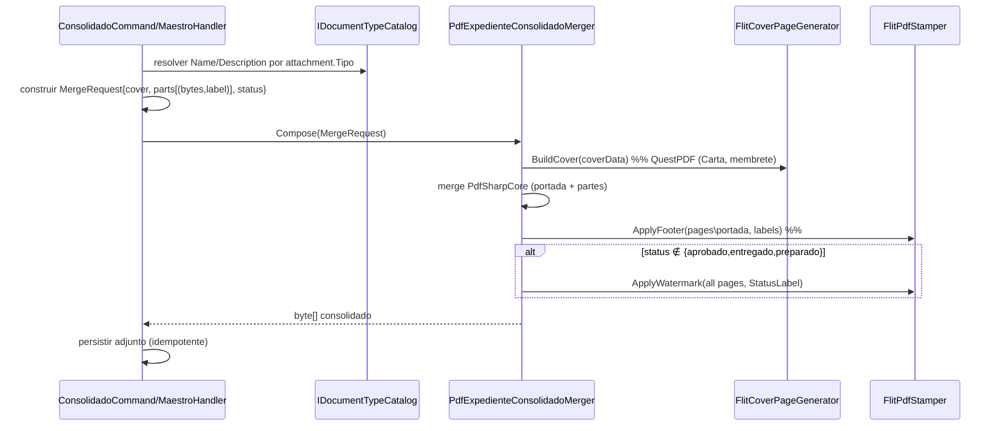
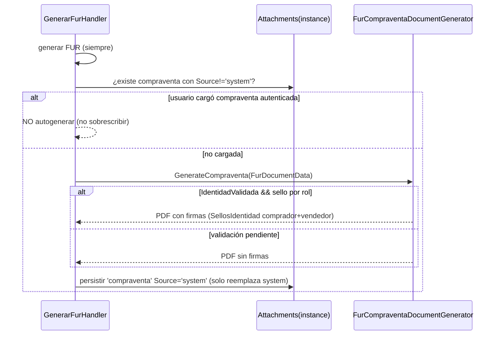
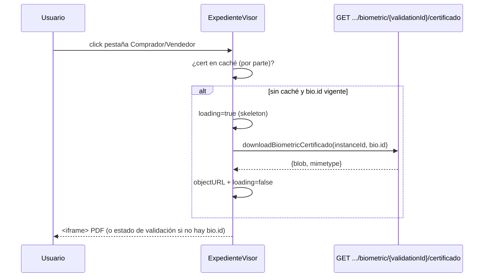
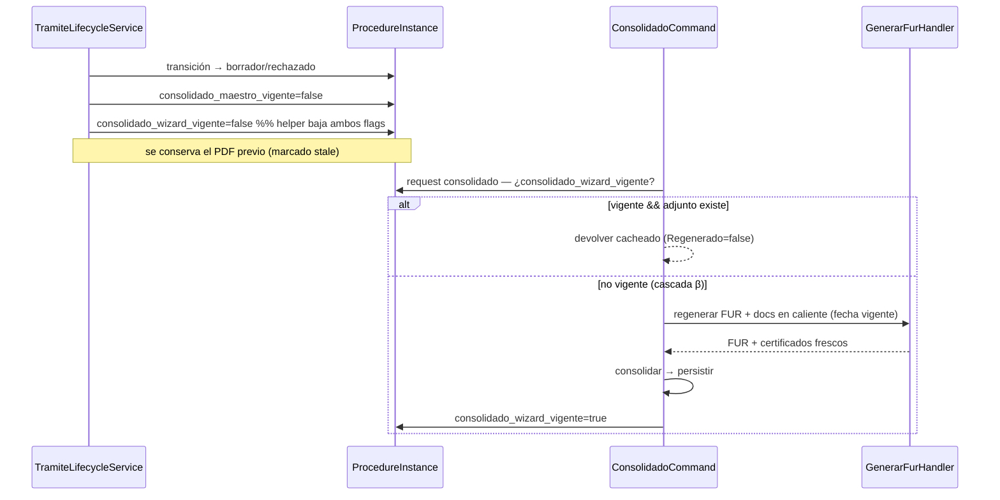

# Diseño técnico — Feature #10852: Ajustes al expediente documental del trámite

> **Feature ADO:** #10852 (New / Sprint 2) · **Fecha:** 2026-07-22 · **Estado:** Propuesto (pendiente aprobación humana)
> **Plan base (análisis de estado actual con file:line):** `docs/plan-ajustes-documentacion-consolidado-membrete.md`
> **ADRs asociados (Propuesto):** ADR-0030, ADR-0031, ADR-0032
> **Rol aplicado:** architecture-agent (desde el hilo principal)

---

## Contexto

El expediente documental de FLIT (PDF consolidado + certificados) hoy carece de identidad visual unificada y de piezas que negocio exige (portada, pie descriptivo, marca de agua de estado). El ensamblador `PdfExpedienteConsolidadoMerger` es un **concatenador de bytes** sin contexto; los generadores de certificados (RUES/RNMC/Identidad) **duplican** estilos y no tienen membrete; SOAT/RTM ni siquiera se generan; la compraventa autogenerada no pinta firmas y sobrescribe la que sube el usuario; y el consolidado del wizard puede quedar **stale** tras un rechazo. Este diseño resuelve los 7 puntos con una **base técnica compartida** que maximiza cohesión y minimiza acoplamiento, sin cambios de contrato API y con una única migración de schema (columna de vigencia del expediente del wizard, punto 7).

**Restricción de decisiones tomadas:** D1 (certificado del proveedor), D2 (crear SOAT/RTM), D3 (todo Carta salvo FUR), D4 (assets SVG). Ver plan base §9.

---

## Decisiones arquitectónicas y alternativas

### Decisión 1 — Base técnica: módulo de marca + merger como compositor (ADR-0030)

**Contexto:** puntos 3, 4, 5 y 6 comparten necesidad de membrete, tipografía Poppins, y estampado de overlays (pie/marca de agua) sobre el consolidado.

#### Opción 1A — Módulo `Documents/Branding/` compartido + merger evolucionado a compositor con contexto **(RECOMENDADA)**
- **Pros:** un único lugar para colores/fuentes/membrete; los generadores dependen del tema, no entre sí; reutilización > 70%; el merger recibe contexto (estado, etiqueta por documento) y compone (portada QuestPDF → merge PdfSharpCore → overlay pie+marca).
- **Contras:** cambia la firma de `IExpedienteConsolidadoMerger.Merge`; toca ambos handlers (`consolidado` y `consolidado_maestro`).
- **Esfuerzo:** M · **Riesgo:** medio (contrato del merger, cubierto por tests).

#### Opción 1B — Estilos inline por generador (sin módulo compartido)
- **Pros:** cero refactor de contrato; cambios locales.
- **Contras:** duplica membrete/fuentes en 4+ generadores; deriva visual; viola DRY; el pie/marca de agua sobre el consolidado igual necesita tocar el merger.
- **Esfuerzo:** M · **Riesgo:** alto de mantenimiento (deriva).

#### Opción 1C — Post-procesar el PDF final con una herramienta externa (CLI/servicio)
- **Pros:** desacopla el estampado del código .NET.
- **Contras:** nueva dependencia/binario; complejidad operativa; latencia; contradice el stack QuestPDF/PdfSharpCore ya presente.
- **Esfuerzo:** L · **Riesgo:** alto (dependencia nueva, ADR regla #3).

**Tradeoff aceptado:** 1A. El costo del cambio de contrato del merger se paga una sola vez y habilita 4 puntos con un solo módulo cohesivo; 1B genera deuda visual y 1C viola la conservación de dependencias.

### Decisión 2 — Compraventa autogenerada firmada (ADR-0031, extiende ADR-0028)

#### Opción 2A — Generación condicional + firma reutilizando `FurDocumentData` **(RECOMENDADA)**
- Autogenerar la compraventa **solo si no hay** adjunto `compraventa` con `Source="user"`; pintar firmas desde `data.SellosIdentidad[rol]`; sin firmas si `!IdentidadValidada`. Proteger del clobber la subida por el usuario.
- **Pros:** los sellos ya viajan en la data (costura mínima); respeta la parametrización `CompanyDocumentParam`; corrige bug de clobber; no bloqueante (coherente con ADR-0028).
- **Contras:** hay que enriquecer el cuerpo jurídico del PDF (validación de negocio).
- **Esfuerzo:** M · **Riesgo:** medio (contenido legal).

#### Opción 2B — Firma electrónica externa (ZapSign/portal) del documento de compraventa
- **Pros:** firma con validez de proveedor.
- **Contras:** ADR-0028 lo aplazó explícitamente hasta que negocio defina; gran esfuerzo; SLA externo.
- **Esfuerzo:** L · **Riesgo:** alto.

#### Opción 2C — Mantener la compraventa sin firmas (solo datos)
- **Pros:** cero cambio en el generador.
- **Contras:** no cumple el requerimiento (firmada por ambas partes).
- **Esfuerzo:** S · **Riesgo:** incumplimiento funcional.

**Tradeoff aceptado:** 2A — cumple el requisito reutilizando la infraestructura de firma del FUR sin depender de proveedor externo, y continúa la "lógica ideal de firmas" que ADR-0028 dejó pendiente, manteniéndola **no bloqueante**.

### Decisión 3 — Regeneración del expediente derivado tras rechazo (ADR-0032) · **ELEGIDA: 3B con cascada β**

> Decisión del Líder Técnico (2026-07-22): caché explícita con **columna nueva** (espejo del maestro) y **regeneración en cascada** del FUR y documentos en caliente, para que salgan con **fecha actualizada**.

#### Opción 3B — Flag `consolidado_wizard_vigente` + cascada FUR→consolidado (β) **(ELEGIDA)**
- Columna `procedure_instances.consolidado_wizard_vigente boolean NOT NULL DEFAULT false` (semántica de **expediente derivado**). Se baja a `false` en los mismos 4 sitios que el maestro; al pedir el consolidado con flag `false`, se **regenera primero el FUR y sus documentos en caliente** (fecha vigente) y luego se consolida; se sube a `true`.
- **Pros:** caché explícita y auditable; simétrica con `consolidado_maestro_vigente` (#10701); conserva el PDF previo en borrador; la cascada garantiza fechas frescas.
- **Contras:** requiere migración (**Fase 2b obligatoria**); acopla consolidado→FUR; falla insegura si un flujo futuro no baja el flag; toggle = UPDATE (bump `row_version` + `audit_log`).
- **Esfuerzo:** M · **Riesgo:** medio (lifecycle + cascada; cubrir con tests).

#### Opción 3A — Invalidar por borrado de derivados en la transición (descartada)
- Sin migración y falla segura, pero asimétrica con el maestro, borra el consolidado en borrador y no garantiza por sí sola la regeneración del FUR. **Esfuerzo:** S.

#### Opción 3C — Regenerar siempre al vuelo (descartada)
- Nunca stale, pero costo de CPU por descarga y cambia el modelo de persistencia. **Esfuerzo:** M · Riesgo alto.

**Tradeoff aceptado:** 3B/β — se acepta la migración y el acoplamiento consolidado→FUR a cambio de consistencia con el precedente del maestro, caché auditable y la garantía de que todo documento en caliente se regenera con fecha vigente en una sola acción. Nomenclatura `consolidado_wizard_vigente` por simetría; su semántica cubre todo el expediente derivado (documentado en el `COMMENT`).

---

## Sequence diagrams

### SD-1 · Generación del consolidado con portada + pie + marca de agua (compositor)

### SD-2 · Compraventa autogenerada firmada (traspaso)

### SD-3 · Punto 1 — visor lazy del certificado de identidad (frontend)

### SD-4 · Punto 7 — invalidación (flag) + regeneración en cascada (β)

---

## Contrato API

**Sin cambios en `contracts/openapi/core-api.v1.yaml`.** Todos los puntos reutilizan endpoints existentes:
- Punto 1 → `GET /instances/{id}/biometric/{validationId}/certificado` (existe).
- Consolidado → `POST /instances/{id}/consolidado` y ruta del maestro (existen).
- FUR/compraventa → `POST /instances/{id}/fur` (existe).

Bajo acoplamiento: los cambios son internos a la capa de generación documental; el contrato público no se altera.

---

## Modelo de datos

**Una migración nueva (opción 3B/β).** Detalle:
- **Punto 7 (nuevo):** columna `tramites.procedure_instances.consolidado_wizard_vigente boolean NOT NULL DEFAULT false`, espejo de `consolidado_maestro_vigente`. Migración **idempotente por SQL crudo** (la tabla es `ExcludeFromMigrations`, patrón `20260715022424_HU10701_ConsolidadoMaestroVigente`): `Up` = `ALTER TABLE ... ADD COLUMN IF NOT EXISTS ... DEFAULT false` + `COMMENT`; `Down` = `DROP COLUMN IF EXISTS`. RLS sin política nueva (columna sobre tabla ya protegida por `tenant_isolation`). Cada toggle es UPDATE → dispara `tr_procedure_instances_row_version` y `tr_procedure_instances_audit`. Backfill: filas existentes quedan `false` (se regeneran una vez limpio).
- **Punto 4:** `DocumentType.Name`/`Description` **ya existen** como columnas; solo se **expone** en `DocumentTypeRule` y su proyección (`DocumentTypeCatalog`). No hay DDL.
- **Recursos (no schema):** fuentes Poppins (OFL) y assets SVG de membrete se embeben como `EmbeddedResource` en `Flit.Infrastructure.csproj`.

**Conclusión Fase 2b (schema):** **REQUERIDA** — una columna (`consolidado_wizard_vigente`) materializada por `database-agent` (modo A/B) y validada con `db-schema-validator` (`OK_TO_MERGE_DB`) durante la implementación de HU-F.

---

## Archivos a crear/modificar por repo

### `services/core-api` (backend)

**Nuevos — módulo Branding (HU-A):**
- `src/Flit.Infrastructure/Documents/Branding/FlitDocumentTheme.cs` (colores, márgenes 2,54cm, `PageSizes.Letter`).
- `src/Flit.Infrastructure/Documents/Branding/FlitLetterhead.cs` (QuestPDF `IComponent`: header/footer + nombre doc #557EFF Poppins 8pt).
- `src/Flit.Infrastructure/Documents/Branding/FlitFonts.cs` (`FontManager.RegisterFont`, patrón `FurFontResolver`).
- `src/Flit.Infrastructure/Documents/Branding/FlitPdfStamper.cs` (overlay PdfSharpCore `XGraphics`: pie + marca de agua).
- `src/Flit.Infrastructure/Documents/Branding/FlitCoverPageGenerator.cs` (portada QuestPDF + SVG).
- `src/Flit.Infrastructure/Documents/Branding/Fonts/Poppins-Regular.ttf`, `Poppins-Medium.ttf`, `Poppins-Bold.ttf`, `OFL-LICENSE.txt`.
- `src/Flit.Infrastructure/Documents/Branding/Assets/*.svg` (Recurso portada + membrete hojas).

**Nuevos — certificados (HU-B):**
- `src/Flit.Infrastructure/Documents/SoatRtmCertificatePdfGenerator.cs`.
- Interfaz `ISoatRtmCertificateGenerator` en `src/Flit.Tramites.Application/Documents/IFurDocumentGenerator.cs` (junto a IRues/IRnmc).

**Modificar:**
- `src/Flit.Infrastructure/Documents/PdfExpedienteConsolidadoMerger.cs` (→ compositor: portada, pie, marca de agua; nuevo contrato).
- `src/Flit.Tramites.Application/Documents/IExpedienteConsolidadoMerger.cs` (contrato `Compose(MergeRequest)` con `parts:(bytes,label)`, `status`, `coverData`).
- `src/Flit.Tramites.Application/UseCases/ProcedureInstances/ConsolidadoCommand.cs` y `ConsolidadoMaestroCommand.cs` (construir MergeRequest, inyectar `IDocumentTypeCatalog`).
- `src/Flit.Tramites.Domain/Tramites/Catalog/IDocumentTypeCatalog.cs` + `src/Flit.Infrastructure/Persistence/Repositories/DocumentTypeCatalog.cs` (exponer Name/Description).
- `src/Flit.Infrastructure/Documents/RuesCertificatePdfGenerator.cs`, `RnmcCertificatePdfGenerator.cs`, `IdentityCertificatePdfGenerator.cs` (Letter + margen 2,54 + FlitLetterhead + Poppins). Coherencia: `ExecutiveSummaryPdfGenerator.cs`.
- `src/Flit.Infrastructure/Documents/Fur/FurCompraventaDocumentGenerator.cs` (cuerpo jurídico + firmas por rol).
- `src/Flit.Tramites.Application/UseCases/ProcedureInstances/FurCommand.cs` (generación condicional + protección de clobber).
- **Punto 7 (flag + cascada β):**
  - `src/Flit.Tramites.Domain/Entities/ProcedureInstance.cs` (propiedad `ConsolidadoWizardVigente`).
  - `src/Flit.Infrastructure/Persistence/Configurations/Tramites/ProcedureInstanceConfiguration.cs` (`HasColumnName("consolidado_wizard_vigente")`).
  - **Nueva migración** `src/Flit.Infrastructure/Migrations/*_HU_ConsolidadoWizardVigente.cs` (SQL idempotente Up/Down) + snapshot.
  - `src/Flit.Tramites.Application/UseCases/ProcedureInstances/Estados/TramiteLifecycleService.cs`, `src/Flit.Infrastructure/Persistence/Repositories/OtClientProcedureRepository.cs`, `src/Flit.Tramites.Application/UseCases/ProcedureInstances/LicenciaTransitoCommand.cs` (bajar ambos flags — idealmente vía helper).
  - `src/Flit.Tramites.Application/UseCases/ProcedureInstances/ConsolidadoCommand.cs` (caché + cascada FUR→consolidado; inyectar el handler de FUR).
- `src/Flit.Infrastructure/InfrastructureExtensions.cs` (DI de `ISoatRtmCertificateGenerator`).
- `*ConsolidadoOrdering.cs` (orden del certificado SOAT/RTM si se adjunta al expediente).
- `Flit.Infrastructure.csproj` (EmbeddedResource fuentes + SVG).

**Tests:** `PdfExpedienteConsolidadoMergerTests`, `FurOverlayDocumentGeneratorTests`, `FurHandlerTests`, `TramiteLifecycleServiceTests`, `ConsolidadoMaestroHandlerTests`, + nuevos de SoatRtm y Branding.

### `frontend`
- `components/operacion/ExpedienteVisor.tsx` (reemplazar grid placeholder por visor iframe lazy; caché por parte; loading).
- Reutiliza `components/shared/DocumentPreviewModal.tsx` y `lib/api/tramites-client.ts:downloadBiometricCertificado` (sin endpoint nuevo).
- Tests: `__tests__/firma-fur-step.test.tsx` (+ nuevo de ExpedienteVisor).

---

## Notas operativas por agente

- **Database Agent (Fase 2b, REQUERIDA):** materializar `consolidado_wizard_vigente` con migración idempotente Up/Down (patrón HU #10701), `COMMENT` con semántica de expediente derivado; validar con `db-schema-validator` (`OK_TO_MERGE_DB`). RLS sin política nueva. Nota: cada toggle audita (`tr_procedure_instances_audit`).
- **Backend Agent:** implementar HU-A primero (bloqueante). Respetar el nuevo contrato del merger en ambos handlers. Verificar licencia OFL de Poppins. Validar render SVG en QuestPDF (fallback PNG @72x). Confirmar que la consulta RUNT expone vigencia SOAT/RTM + avalúo antes del generador SOAT/RTM.
- **Frontend Agent:** lazy-load al montar el panel de pestaña (ya se desmonta al cambiar); `URL.revokeObjectURL` en cleanup; manejar "biométrica no aprobada" mostrando estado, no visor.
- **QA Agent:** matriz de marca de agua por estado (aparece solo en borrador/rechazado/anulado); portada presente en todos los tipos; pie por documento; compraventa con/sin firmas y no-sobrescritura de la subida; regresión de lifecycle (punto 7) y de tamaños de página (FUR vs Carta) en el consolidado.
- **Security Agent:** el certificado de identidad expone datos personales (Habeas Data) — el visor solo consume el endpoint existente con `X-Tenant-Id`; no persistir el blob; revisar que no se loguee. Sin cambios de permisos.
- **Infra Agent:** una migración idempotente/reversible (opción 3B, punto 7) en el pipeline; sin nuevos servicios; assets embebidos (aumenta el tamaño del binario levemente).

---

## Gate

Diseño en estado **Propuesto**. Los ADR-0030/0031/0032 quedan en **Propuesto** hasta el PR de aceptación del Líder Técnico humano (regla ADR #1). Requiere aprobación humana para avanzar a Fase 3 (`/decompose-feature`).
