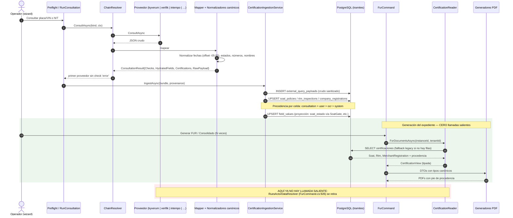

# Plan — Fix definitivo de las tablas certificadoras (SOAT · RTM · RUES)

> Generado: 2026-08-07 · Rama `develop` @ `0d1277b4`
> **Actualizado 2026-08-08: IMPLEMENTADO** en `feature/AB-11301-certificaciones-externas`, un commit
> por HU (#11302 → #11308). Ver §12 para lo que se desvió del plan al implementarlo.
> Decisión de arquitectura: [ADR-0041](../services/core-api/docs/adr/ADR-0041-certificaciones-externas-modelo-canonico-persistido.md) — **`Aceptado` por el Líder Técnico el 2026-08-08**.
>
> **Origen:** bug reportado por el PO — *"no se ven los datos de SOAT, RTM y RUES en las tablas
> certificadoras"*. Requisitos textuales: persistir esa información en base de datos para generar el
> PDF consolidado **sin otra consulta** a servicios externos, **normalizada sin importar la fuente**
> (kyverum, verifik, intempo, …), con **alta cohesión y bajo acoplamiento**.

---

## 1. Diagnóstico: por qué las tablas salen vacías

Tres capas revisadas (proveedores, consolidado, persistencia) sobre `develop`, con capturas reales de
proveedor y cifras medidas en `flit_local`.

### 1.1 El dato nunca llega a existir

No es un fallo de generación ni de fusión del consolidado. Los generadores hacen exactamente lo que se
les pidió: valor ausente ⇒ celda en blanco, sin guion ni "N/A" (regla HU #10856, `Disp()` en ambos
generadores). Lo que falta es el dato.

Filas reales en la BD local, por celda:

| Celda | `field_key` | Filas |
|---|---|---:|
| SOAT · Entidad / Vencimiento | `soat_aseguradora`, `soat_vencimiento` | 28 |
| SOAT · Estado | `soat_estado` | 23 |
| SOAT · N° Póliza / Vigencia | `soat_poliza`, `soat_vigencia` | 14 — **solo donde hubo OCR** |
| SOAT · Expedición | `soat_expedicion` | **0** |
| RTM · Estado / Vencimiento | `rtm_estado`, `rtm_vencimiento` | 6 |
| RTM · N° / Expedición / Entidad / Vigencia | `rtm_numero`, `rtm_expedicion`, `rtm_entidad`, `rtm_vigencia` | **0** |

**Seis de las doce celdas no tienen ni una sola fila en todo el ambiente**, después de que la Feature
#11131 se desplegara con ese objetivo exacto.

### 1.2 Las cuatro causas raíz

| # | Causa | Evidencia |
|---|---|---|
| **C1** | **El modelo del proveedor primario se dedujo de fixtures, no del proveedor.** `KyverumRuntSoat` modela 3 de 12 campos y `KyverumRuntRtm` 3 de 10, con un comentario que afirma que Kyverum "no trae póliza ni fechas de expedición". Las tres consultas reales prueban que **sí las trae, siempre**. | `KyverumRuntVehicleResponse.cs:167-211` vs. `docs/consulta-runt-nzs920-procesamiento.md` §3.4, §6.1, §7.2 |
| **C2** | **El vocabulario de destino es texto libre sin tipo.** `HydratedField(FieldKey, ValueText, ValueJson)` sobre `(instance, field_key)`: cada mapper inventa llaves, formatos de fecha y vocabularios de estado. No cabe el histórico (una llave = un valor). | `ConsultationContracts.cs:58-61` |
| **C3** | **El almacén no admite reparación.** `field_values` es inmutable fuera de borrador. Cuando la HU #11132 corrigió seis mapeos, los trámites vivos quedaron sin arreglo: ni backfill ni reproceso, solo reconsultar (que se cobra). Ese bloqueo es lo que obligó al RUES a consultar **en vivo al generar el PDF**. | trigger vigente en `Migrations/20260729140000_PlateFlowTerminado.cs:32-64`; `FurCommand.cs:926` |
| **C4** | **El wizard corta la consulta RUES.** Si el NIT ya está en el directorio de representantes legales del tenant, la precarga hace `return` y `ruesPersonLookup` **nunca se llama**. Y como el snapshot solo se escribe en esa consulta y solo en borrador, la compañía queda sin datos RUES **de forma permanente**. | `ActorsForm.tsx:907-937`, el `return` en `:936` |

C4 explica la intermitencia que se percibe en operación: **NIT nuevo → certificado completo; NIT
recurrente → depende de que la consulta en vivo del generador funcione** (hoy la repone por detrás, en
cada regeneración y cobrada; si el proveedor falla, el certificado no se emite).

> **Resolución del PO (D1):** C4 **no se corrige**. Se conserva el corte del wizard, se retira la
> consulta en vivo del generador, y para esas compañías simplemente **no se emite certificado RUES**.
> Generar el expediente pasa a costar cero llamadas externas. Ver §8.

### 1.3 Agravantes verificados

- **El fallback nunca se activa por cobertura incompleta.** `ConsultationProviderChainResolver.cs:34-60`
  devuelve el primer proveedor sin check `error`. Kyverum responde bien pero incompleto ⇒ Verifik —que
  sí cubre las 12 celdas— **no se invoca**, y su resultado no se fusiona. Paradoja: el certificado sale
  *más completo* cuando el proveedor primario se cae.
- **El payload crudo no se guarda en ninguna parte** para RUNT ni RUES (sí para biométrica e identidad).
  Sin él no se puede auditar qué mandó el proveedor, ni reprocesar una consulta ya pagada.
- **La precedencia es asimétrica y hoy la consulta pisa al usuario.** `RunConsultationCommand.cs:274-311`
  sobrescribe sin mirar el `source` previo; la única regla documentada (`OcrFieldsCommand.cs:125-133`)
  solo aplica al OCR. Una corrección manual se pierde en la siguiente consulta, en silencio.
- **`AdjustToUniversal` puede correr el día calendario.** `FlitDocumentDate.cs:71` y `RtmCertificado.cs:84`
  normalizan a UTC; con `00:00:00.000-05:00` no muerde, pero un proveedor que mande hora ≥ 19:00 en
  offset `-05:00` imprimiría **el día siguiente** en un certificado.
- **La caché de vehículo nunca ha guardado nada**: se llavea por `plate_or_vin`, llave que el wizard no
  escribe. 8 entradas, todas de persona, `reuse_count` = 0.
- **`value_json` está en NULL en el 100 % de las 1.035 filas.**
- **El guardián de contrato es un grep sobre código fuente**, no una prueba de comportamiento
  (`FieldValueContractGuardTests.cs:28-31`): le basta con que *algún* productor declarado escriba la
  llave en su código. Por eso nunca detectó que el primario no la produce en la ruta real.

### 1.4 Por qué la Feature #11131 no bastó

Corrigió **valores**; el defecto es de **arquitectura de la información**. C1, C2 y C3 son inmunes a un
arreglo campo a campo — y de hecho la Feature añadió llaves que hoy tienen **cero filas**.

---

## 2. La decisión

Modelo **canónico de dominio** independiente del proveedor → **tablas propias** → **payload crudo
conservado**. Detalle y alternativas descartadas en el ADR-0041.

En una frase: *las alternativas más baratas (JSON congelado en `field_values`, o más llaves sueltas)
conservan intacta la propiedad que hizo fracasar el intento anterior — que el dato no se puede reparar
ni completar después de radicar — y ninguna admite el histórico de pólizas y revisiones que el RUNT ya
entrega.*

### 2.1 Modelo canónico

`services/core-api/src/Flit.Tramites.Domain/Certifications/`, sin conocimiento de ningún proveedor:

```csharp
public sealed record CertifiedDate(DateOnly? Value, string? Raw);      // canónico + crudo, SIEMPRE
public enum VigencyStatus { Vigente, Vencido, NoAplica, Unknown }      // mismos literales que SoatGate
public sealed record CertifiedStatus(VigencyStatus Value, string? Raw);
public sealed record CertifiedNumber(string? Value, string? Raw);      // numSoat de 16 dígitos ⇒ texto
public sealed record CertifiedName(string? Value, string? Raw);

public sealed record SoatCertification(...);
public sealed record RtmCertification(...);
public sealed record MerchantRegistration(...);   // incl. representantes legales estructurados
public sealed record VehicleRegistrationFacts(CertifiedDate FechaMatricula);
public sealed record CertificationBundle(...);    // históricos completos
```

**Regla transversal: canónico + crudo, siempre los dos.** Lo no interpretable no se inventa ni se vacía:
`Value = null`, `Raw` intacto, incidencia registrada en `normalization_issues`, y el documento imprime
el crudo.

**Vocabulario de estados** — `APROBADA` **no** es sinónimo de vigente: es el estado del trámite de la
revisión, no su vigencia (caso YNK04A: 4 revisiones `vigente:"NO"` todas `APROBADA`). Se mapea a
`unknown` y no decide nada.

| Canónico | Entradas crudas |
|---|---|
| `vigente` | `VIGENTE` (soat.estado), `SI` (rtm.vigente), `vigente` |
| `vencido` | `VENCIDO`, `NO VIGENTE`, `NO_VIGENTE`, `NO` |
| `no_aplica` | `NO APLICA` |
| `unknown` | todo lo demás, **incluido `APROBADA`** |

### 2.2 Dónde se normaliza

| Momento | Qué ocurre |
|---|---|
| **Al persistir** (una sola vez) | Fechas → `DateOnly` **con offset de Colombia** (no `AdjustToUniversal`). Estados → vocabulario cerrado. Números → texto trim. Nombres → trim + colapso de espacios + comillas envolventes fuera. Se guarda además el crudo. |
| **Al pintar** | Solo formato: `DateOnly → "yyyy/MM/dd"`, estado a mayúscula, `Unknown ⇒ celda vacía`, y **pie de procedencia** por bloque. Cero parsing. |

`FlitDocumentDate.Normalize(string)` queda como ruta legacy para trámites sin filas de certificación.

### 2.3 Procedencia y precedencia

Hoy `source varchar(20)` no dice quién consultó, ni cuándo, ni si vino de un PDF escaneado — mientras el
certificado afirma *"En la consulta realizada al RUNT 2.0 el día X"*. Cada fila declara:

```csharp
public sealed record CertificationProvenance(
    CertificationSourceKind Source,   // Consultation | Ocr | User | System
    string ProviderKey,               // kyverum_runt | verifik | intempo | ocr | manual
    DateTimeOffset ObservedAt,        // cuándo lo dijo la fuente
    Guid? RawPayloadId,
    string MapperVersion);
```

Precedencia **celda a celda**: `consultation (300) > user (200) > ocr (100) > system (50)`, desempate por
`ObservedAt`, y un valor ausente nunca desplaza a uno presente. **Excepción deliberada (D2):** una
corrección manual posterior a la última consulta se conserva — hoy se pierde en silencio.

El certificado deja de afirmar globalmente un RUNT que puede no haber ocurrido y **declara la fuente en
el pie de cada tabla**: `Fuente: RUNT 2.0 vía kyverum_runt · consultado 2026/08/07`.

### 2.4 Dónde encaja la normalización (cohesión / acoplamiento)

**Cada mapper produce el bundle canónico usando normalizadores compartidos; el bundle viaja por un canal
aditivo de `ConsultationResult`; la fusión entre fuentes ocurre en la persistencia.**

```csharp
public sealed record ConsultationResult(
    string Provider, string Overall,
    IReadOnlyList<ConsultationCheck> Checks,
    IReadOnlyList<HydratedField> HydratedFields,
    bool FromCache = false, DateTimeOffset? QueriedAt = null,
    CertificationBundle? Certifications = null,   // NUEVO — aditivo
    RawProviderPayload? RawPayload = null);       // NUEVO — aditivo
```

Por qué esa costura y no otra:

- **No** un normalizador central sobre `HydratedField[]`: perdería lo que el mapper ya sabe y sería un
  segundo mapeo sobre el primero.
- **No** fusión en el chain resolver: fusionar exige llamar a más proveedores, y **cada llamada se
  cobra**. Con el DTO de Kyverum corregido, el primario cubre 11 de las 12 celdas por sí solo. La fusión
  que hace falta es **a lo largo del tiempo** (consulta → OCR → corrección → reconsulta), y vive en el
  almacén.
- **Sí** aditivo sobre `ConsultationResult`: mismo patrón ya usado por la HU #10878 con
  `FromCache`/`QueriedAt`. Un proveedor que no lo implemente devuelve `null` y degrada al camino actual.

Contratos de aplicación:

```csharp
public interface ICertificationIngestionService   // ÚNICO punto de escritura
{ Task IngestAsync(Guid instanceId, Guid tenantId, CertificationBundle b, CertificationProvenance p, CancellationToken ct); }

public interface ICertificationReader             // ÚNICO punto de lectura documental
{ Task<CertificationView> ForDocumentsAsync(Guid instanceId, Guid tenantId, CancellationToken ct); }

public interface ICertificationRepository { /* puerto de persistencia */ }
public static class CertificationPrecedence { public static bool Wins(...); }   // testeable sin BD
```

**Añadir un quinto proveedor** = implementar `IConsultationProvider`, que su mapper devuelva el bundle, y
registrarlo en la cadena. **Cero cambios** en los otros cuatro proveedores, en la ingesta, en el
repositorio, en `FurCommand` ni en los generadores.

### 2.5 Cómo consume el consolidado

La sustitución es quirúrgica, no una reescritura: unas 40 líneas retiradas y 6 añadidas en `FurCommand`.

```csharp
var certs = await certificationReader.ForDocumentsAsync(instance.Id, tenantId, ct);
// :353-380  → SoatRtmCertificateData.From(instance, certs, avaluo, esTraspaso)
// :914-963  → RuesCertificateData.From(instance, certs.RuesPorNit[nit], certs.RuesFuentePorNit[nit])
```

`fv` se conserva para todo lo demás (placa, OT, transformaciones, prenda). El `ICertificationReader`
resuelve internamente: **tabla → fallback legacy (`rues_snapshots_json` → llaves `rues_*` con NIT
coincidente → `field_values` de SOAT/RTM) → nunca consulta en vivo**.

Qué pasa con las llaves actuales:

| Llave | Destino |
|---|---|
| `soat_estado` | **Se sigue escribiendo** como proyección derivada vía `SoatGate.Normalize`. Es gate del OT y el front compara estricto. La excepción del trigger (`plate_flow_status='asignado'`) se conserva tal cual. |
| `soat_vencimiento`, `rtm_vencimiento`, `rtm_estado`, `soat_aseguradora` | Se siguen escribiendo (proyección). Tienen consumidores en el wizard. Deprecación en fase posterior. |
| `soat_poliza`, `soat_expedicion`, `soat_vigencia`, `rtm_numero`, `rtm_expedicion`, `rtm_vigencia`, `rtm_entidad` | Dejan de ser fuente del certificado. Se retiran en fase 2 tras confirmar cero lectores. |
| `vehicle_registration_date` | Se escribe **por primera vez desde Kyverum** (`vehiculo.fechaRegistro`) ⇒ reanima `RtmCertificado.Aplica`. |
| `rues_*` (23) y `rues_snapshots_json` | Dejan de escribirse. Se leen solo como fallback legacy. |

---

## 3. Flujo objetivo



---

## 4. Modelo de datos

Archivo: `services/core-api/src/Flit.Infrastructure/Persistence/Sql/Ddl/59-certificaciones-externas.sql`
(máximo actual: `58-block-procedure-family.sql`). Cuatro tablas en `tramites`, ancladas a
`(tenant_id, procedure_instance_id)`:

| Tabla | Contenido | Notas de diseño |
|---|---|---|
| `external_query_payloads` | Respuesta cruda **sanitizada** del proveedor | `@pii:high`. **Retención indefinida (D6)**: `expires_at` queda nullable y sin job de purga; la columna se conserva por si se acota después. Habilita reprocesar sin volver a pagar. |
| `vehicle_soat_policies` | Histórico completo de pólizas | `is_current` (único parcial por instancia) marca la que va al certificado. |
| `vehicle_rtm_inspections` | Histórico completo de revisiones | ídem. |
| `company_registrations` | Registro mercantil por `(instancia, NIT)` | Sustituye `rues_snapshots_json`. Incluye `legal_representatives jsonb` (hoy se paga y se tira). |

Cada columna de dato lleva su par canónico + crudo (`issued_on` / `issued_on_raw`), más la procedencia
(`source_kind`, `provider_key`, `observed_at`, `raw_payload_id`, `mapper_version`,
`normalization_issues`) y `frozen_at`.

**El congelamiento pasa a ser explícito** (`frozen_at` fijado al radicar) en vez de heredado del trigger
de `field_values`. Es la decisión central del ADR: permite completar y reparar cuando el negocio lo
autorice, que es justo lo que hoy es imposible.

El DDL completo está en el informe de arquitectura y lo **materializa y valida el `database-agent`**
contra `checklist-validacion-schema.md`. Excepciones a documentar: los índices `uq_` naturales no llevan
`tenant_id` primero (la unicidad natural es por instancia), y el uso de `frozen_at` en lugar del trigger
de inmutabilidad.

---

## 5. Archivos a crear y modificar

### Crear — dominio y aplicación

`Flit.Tramites.Domain/Certifications/`: `VigencyStatus.cs`, `CertifiedValues.cs`, `SoatCertification.cs`,
`RtmCertification.cs`, `MerchantRegistration.cs`, `VehicleRegistrationFacts.cs`, `CertificationBundle.cs`,
`CertificationProvenance.cs`, `CertificationPrecedence.cs`, `SoatSelection.cs`, `RtmSelection.cs`,
`Normalization/{ColombianCertificateDate,VigencyStatusNormalizer,EntityNameNormalizer,CertificateNumberNormalizer}.cs`.

`Flit.Tramites.Application/UseCases/Certifications/`: `ICertificationIngestionService.cs` +
implementación, `ICertificationReader.cs` + implementación, `CertificationView.cs`,
`ICertificationRepository.cs`.

### Crear — infraestructura y datos

4 entidades EF + 4 `IEntityTypeConfiguration`, `CertificationRepository.cs`,
`Ddl/59-certificaciones-externas.sql`, `Ddl/60-backfill-certificaciones.sql`, migración EF
`20260807HHMMSS_CertificacionesExternas`.

### Crear — pruebas

`CertificationCoverageGuardTests.cs` — **guardián de cobertura en runtime** que sustituye al estático:
fixture real de cada proveedor → mapper → ingesta → reader, exigiendo que las 12 celdas SOAT/RTM y las
20 RUES lleguen no vacías. Es la prueba que **sí** habría detectado el defecto original.

### Modificar — los que importan

| Archivo | Razón |
|---|---|
| `KyverumRuntVehicleResponse.cs:90-211` | Modelar `numSoat`, `fechaExpediSoat`, `fechaInicioPoliza`, `numeCerti`, `fechaExpedicionRvt`, `nombreCda`, `tipoRevision`, `vehiculo.fechaRegistro`. **Núcleo del fix.** |
| `KyverumRuntVehicleResultMapper.cs`, `VerifikResultMapper.cs`, `IntempoVehicleResultMapper.cs` | Producir el bundle canónico; retirar la búsqueda "tolerante" por `JsonExtensionData`. |
| `VerifikRuesConsultationProvider.cs:150-180,435-445` | Producir `MerchantRegistration` con representantes estructurados; **retirar** `"Sin razón social"` y `"DESCONOCIDO"`. |
| `ConsultationContracts.cs:15-21` | Los dos campos aditivos. |
| `PreflightCommand.cs:199`, `RunConsultationCommand.cs:274-311`, `ValidateSoatViaRuntCommand.cs:113-128`, `OcrFieldsCommand.cs:49-133`, `RuesPersonLookupHandler.cs:81-87` | Enrutar por la ingesta y respetar la precedencia. |
| `FurCommand.cs:147,351-382,908-969` | Leer del reader; corregir `esTraspaso: !esMatricula` (`:368`) y la condición de emisión (`:351`); añadir limpieza de `certificado_soat_rtm` huérfano. |
| `TraspasoConsolidadoOrdering.cs:13-43`, `MatriculaConsolidadoOrdering.cs:11-38` | Añadir `certificado_soat_rtm` y `certificado_rues_vendedor` a `Precedence`. |
| Generadores PDF + DTOs | Tipos canónicos + pie de procedencia + fecha del snapshot RUES (hoy `RuesSnapshots.QueriedAt` no tiene llamador). |
| ~~`frontend/components/operacion/ActorsForm.tsx:907-937`~~ | **Sin cambios, por D1.** El `return` de `:936` se conserva: cuando hay precarga del directorio no se consulta el RUES y, en consecuencia, no se emite certificado para ese actor. **El plan no toca el frontend.** |

---

## 6. Descomposición — CREADA EN ADO (2026-08-07)

**Feature [#11301](https://dev.azure.com/FlitDevOps/FLIT%20-%20EVOLUTION/_workitems/edit/11301)** —
`[BACKEND] - Certificaciones externas SOAT, RTM y RUES persistidas en modelo canónico para el expediente`
· Sprint 3 · `New` · tag `DOR` · `Related` → Feature #11131 (antecedente).

| # | ID | HU | Alcance | SP |
|---|---|---|---|---|
| 1 | **#11302** | Crear el modelo canónico de certificaciones y su almacenamiento propio | Dominio, DDL `59-`, migración, entidades EF, puerto y repositorio. Sustenta ADR-0041. | 8 |
| 2 | **#11303** | Modelar los datos de SOAT y RTM que el RUNT ya envía y no se estaban leyendo | `numSoat`, `fechaExpediSoat`, `fechaInicioPoliza`, `numeCerti`, `fechaExpedicionRvt`, `nombreCda`, `tipoRevision`, `fechaRegistro` + bundle en los 3 mappers de vehículo. | 5 |
| 3 | **#11304** | Centralizar la escritura con precedencia por dato y guardado de la respuesta original | `CertificationIngestionService`, `CertificationPrecedence`, payload crudo sanitizado, enrutado de los 5 escritores. | 8 |
| 4 | **#11305** | Generar el expediente leyendo de BD, sin consultas externas | `CertificationReader` con fallback legacy, `FurCommand`, DTOs y generadores con pie de procedencia. Retira `RuesActorDataResolver`. | 5 |
| 5 | **#11306** | Emitir el certificado de registro mercantil solo cuando hay información persistida | **Por D1/D4.** `RuesPersonLookupHandler` escribe en `company_registrations`; se retiran los fallbacks `"Sin razón social"`/`"DESCONOCIDO"`. **`ActorsForm.tsx:936` no se toca.** | 3 |
| 6 | **#11307** | Corregir la emisión, el orden y la limpieza del certificado de SOAT y RTM | Limpieza del huérfano, condición de emisión (D8), `esTraspaso: !esMatricula`, prelación del consolidado. | 3 |
| 7 | **#11308** | Añadir el guardián de cobertura y trasladar los datos ya guardados | `CertificationCoverageGuardTests`, `Ddl/60-backfill-`, recorte del guardián estático. | 2 |

**Total: 34 SP, todas BACKEND.** Registradas en ADO con `Predecessor/Successor`:
`#11302 → #11303 → #11304 → #11305` es cadena dura; **#11306** depende de #11302 y #11304;
**#11307** y **#11308** no tienen predecesoras y van en paralelo.

**Regla FLIT #9 (PR ≤ 800 líneas): una HU, un PR.** Todas quedan en `New` — la activación de cada una
es gate humano y se hace de a una al arrancar su implementación.

---

## 7. Migración y backfill

**Fase 0 — despliegue neutro.** Tablas vacías, el reader cae al fallback legacy. Cero cambio visible. Las
nuevas consultas empiezan a poblar.

**Fase 1 — backfill de lo ya guardado** (`60-backfill-certificaciones.sql`): una fila `is_current` por
instancia desde las llaves `soat_*`/`rtm_*` existentes, y una fila por entrada de `rues_snapshots_json`.
`provider_key='legacy'`, `mapper_version='legacy'`. **Escribe en tablas nuevas, así que no dispara el
trigger de inmutabilidad** — no hace falta `DISABLE TRIGGER USER`. **No inventa nada**: los huecos
actuales siguen huecos.

**Fase 2 — reproceso desde payload crudo.** Solo hacia adelante: antes del despliegue no existen
payloads. Dicho sin rodeos: **los trámites ya cursados no se pueden reparar sin volver a consultar.** Es
la deuda que deja el diseño anterior y no hay forma de saldarla retroactivamente.

**Sin reconsulta (D7).** No se implementa acción de reconsulta, ni manual ni masiva. Los trámites
actuales se quedan como están y el fix aplica solo a los nuevos. El backfill se mantiene porque no
cuesta nada y no llama a ningún proveedor, pero **solo traslada**: si una celda estaba vacía, sigue
vacía.

**Reversibilidad:** `Down` elimina las cuatro tablas. Como `field_values` se sigue escribiendo en fase 1,
un rollback deja el sistema exactamente como está hoy.

---

## 8. Decisiones — RESUELTAS por el PO (2026-08-07)

| # | Decisión | **Resolución** |
|---|---|---|
| **D1** | La precarga del directorio de RL corta la consulta RUES (`ActorsForm.tsx:936`). | **No se consulta cuando hay precarga, y no se emite el certificado RUES en esos casos.** Consecuencia aceptada a sabiendas: las compañías ya registradas en el directorio **dejan de tener certificado RUES en el expediente**, cuando hoy lo tienen por la consulta en vivo del generador. A cambio, generar el PDF pasa a costar cero llamadas externas. |
| **D2** | ¿Sobrevive una corrección manual a una reconsulta posterior? | **Sí, gana la corrección.** `user` con `observed_at` posterior prevalece sobre `consultation`. |
| **D3** | ¿Llamar al fallback para completar celdas vacías? | **No por defecto.** Flag por tenant, apagado. Con el DTO de Kyverum corregido el primario cubre 11 de 12 celdas. |
| **D4** | ¿Se retira la consulta en vivo del RUES al generar (`FurCommand.cs:926`)? | **Sí, se retira directamente**, sin la precondición de "esperar a que el contador llegue a cero" — con D1 ese contador no bajaría nunca, porque el caso de la precarga es precisamente el que lo alimenta. Queda determinada por D1. |
| **D5** | ¿Se cierra el vocabulario de `registration_status` del RUES? | **Crudo + canónico derivado.** Se guarda el texto tal cual y se deriva el estado para el check; un valor no visto se imprime crudo y no rompe nada. |
| **D6** | Retención del payload crudo (Ley 1581). | **Indefinida (siempre).** ⚠️ Implica almacenar sin plazo la PII que trae el RUES (nombres y documentos de representantes legales dentro del texto de facultades). **Requiere revisión del `security-agent` y finalidad declarada.** Salida intermedia disponible si se quiere acotar después: retención indefinida para el payload de vehículo (verificado: no trae nombre ni dirección del propietario) y plazo solo para el de RUES. |
| **D7** | ¿Reparar los trámites vivos con celdas vacías? | **No se repara nada.** El fix aplica solo hacia adelante. No hay reconsulta manual ni masiva. El backfill sigue haciéndose, pero solo **traslada** a las tablas nuevas lo que ya existe — no rellena huecos. |
| **D8** | Mínimo de celdas para emitir `certificado_soat_rtm`. | **Al menos una celda de SOAT o RTM con dato.** El avalúo solo no basta: si solo hay avalúo, ese bloque va en el FUR y no se emite el certificado. |
| **D9** | ¿Histórico o solo vigente en el PDF? | **Solo la vigente.** El histórico completo se persiste para auditoría y para poder cambiar de criterio sin volver a consultar. |

---

## 9. Riesgos

| # | Riesgo | Mitigación |
|---|---|---|
| R1 | Tabla y proyección `field_values` divergen | Escritor único; la proyección se deriva de la tabla, nunca al revés; test que compara ambas tras la ingesta. |
| R2 | Romper el gate `soat_estado` y bloquear aprobaciones del OT (ya pasó en HU #10973) | La proyección pasa obligatoriamente por `SoatGate.Normalize`; no se toca `lib/tramites/estados.ts` ni `OtClientProcedureRepository`; test con los cinco valores crudos observados. |
| R3 | El payload crudo del RUES filtra PII a logs, PRs o ADO | Sanitización antes de escribir, `@pii:high`, purga por `expires_at`, prohibición de volcarlo en trazas. Revisión del `security-agent`. |
| R4 | Modelar campos nuevos sobre 3 consultas reales y aparecer un cuarto patrón | El payload crudo permite verificarlo a posteriori sin sonda manual; `normalization_issues` deja rastro. |
| R5 | Retirar la consulta en vivo del RUES antes de tiempo | Solo tras confirmar el contador en cero durante N días. |
| R6 | **Por D1, desaparece el certificado RUES de los expedientes de compañías del directorio.** Si el OT lo exige como anexo, la ausencia se notará en radicación. | Medir cuántos trámites quedan sin certificado tras el despliegue (el log de la consulta en vivo ya da la cifra hoy). Si el volumen es alto, reabrir D1 con la opción de una consulta única al registrar. |
| R9 | **Por D6, el payload crudo del RUES se conserva sin plazo** e incluye nombres y documentos de representantes legales (Ley 1581). | Sanitización obligatoria, `@pii:high`, finalidad declarada, y revisión del `security-agent` antes de mergear. Opción de acotar solo el payload de RUES dejando indefinido el de vehículo. |
| R7 | PR gigante (regla FLIT #9) | La descomposición de §6: una HU, un PR. |
| R8 | El backfill altera documentos ya emitidos | Solo inserta filas; los PDFs son adjuntos y no se regeneran salvo acción explícita; `frozen_at` protege la `is_current`. |

---

## 10. Fuera de alcance (registrar aparte)

- **Caché de vehículo nunca usada** (`plate_or_vin`, 0 entradas): es reúso entre trámites, no
  completitud documental. El payload crudo reduce su urgencia.
- **Alias `garantias` / `garantiasPrendas`** (`KyverumRuntVehicleResponse.cs:66`): pertenece a prenda.
- **Pintar los representantes legales del RUES**: se guardan (coste cero, dejan de tirarse); el layout
  es decisión del PO.
- **Etiquetas discutibles del certificado RUES** (`Razón Cancelación` en empresas activas, `Ubicación` =
  cámara de comercio, dirección y correo siempre vacíos) y **mock desalineado con el proveedor real**.
- **RLS decorativo** (0 tablas con `FORCE`, app como owner): las tablas nuevas llevan RLS por
  consistencia, sabiendo que hoy no se evalúa. Es otro frente.
- **Token de Verifik vencido** desde 2026-08-01: es configuración, no código. Tumba RUES, SIMIT, RNMC,
  conductor y el fallback de vehículo.

---

## 11. Documentos relacionados

- `services/core-api/docs/adr/ADR-0041-…` — la decisión de arquitectura (`Aceptado`, 2026-08-08)
- `docs/tablas-certificadoras-consolidado-soat-rtm-rues.md` — qué espera cada celda
- `docs/consulta-runt-nzs920-procesamiento.md` — tres consultas reales al proveedor primario
- `docs/consulta-rues-nits-procesamiento.md` — capturas reales del RUES
- `docs/vehiculo-datos-completos-bd.md` — cómo se ve un vehículo en BD
- `docs/plan-tecnico-tablas-certificadoras.md` — Feature #11131, el intento anterior

---

## 12. Lo que se desvió del plan al implementarlo (2026-08-08)

Cuatro puntos en los que el código no siguió el plan al pie de la letra, y por qué.

### 12.1 D2 estaba enunciada de forma que la dejaba inerte

El plan (§2.3 y §8) enuncia la excepción como *«`user` con `observed_at` **posterior** prevalece sobre
`consultation`»*. Comparar las fechas la vuelve **inoperante**: una reconsulta siempre llega con un
`observed_at` más reciente que la corrección que pretende proteger, así que la corrección se perdería
igual — que es exactamente el defecto que D2 venía a cerrar.

Se implementó la **intención** que el PO enunció (*«¿sobrevive una corrección manual a una reconsulta
posterior? sí, gana la corrección»*), sin comparar fechas entre esas dos fuentes. La excepción sigue
acotada al par `consultation → user`: un OCR posterior no desplaza una corrección manual, y una
corrección manual sí desplaza un OCR. Documentado en `CertificationPrecedence` y cubierto por prueba.

### 12.2 El guardián de precedencia sobre `field_values` va acotado

Aplicar D2 a **todo** `field_values` cambiaría el comportamiento del asistente entero: un VIN tecleado
con una errata dejaría de corregirse con el que devuelve el RUNT, porque el valor del operador es
`user` y ganaría siempre. El guardián se limita a las **doce llaves de certificación**. Fuera de ellas
el comportamiento no cambia.

### 12.3 Los representantes legales del RUES quedan sin modelar

El plan pedía *«producir `MerchantRegistration` con representantes estructurados»*. No hay ninguna
**captura real** que documente la forma de esa lista: el informe de consultas la marca explícitamente
como *no recuperable*. El mock del repositorio sí propone una (`{documentNumber, documentType, name,
role}`), pero un mock es una fixture, y deducir el modelo de fixtures es el defecto que originó este
Feature — el mismo bloque ya escondió durante meses que `legalRepresentatives` es un objeto y no una
cadena. La columna `legal_representatives` existe y queda vacía; el **payload crudo ya se persiste**,
así que modelarla cuando haya una captura real no costará una consulta nueva.

### 12.4 Regresión detectada y corregida durante la implementación

La primera versión de `RtmSelection.Applies` llevaba un umbral propio de **24 meses**, inventado. La
regla real de negocio son **cinco años** y es estricta (en el aniversario todavía no aplica), y ya
vivía en `RtmCertificado`. Se eliminó el umbral duplicado y se delega; `RtmCertificado` ganó una
sobrecarga con la fecha ya interpretada, para no volver a parsear texto en el punto de decisión.

### 12.5 Pendientes que NO cubre esta rama

> **ADR-0041 pasó a `Aceptado` el 2026-08-08** (Líder Técnico). Ya no es un pendiente.

| # | Pendiente | Responsable |
|---|---|---|
| 1 | **Visto bueno de seguridad sobre la retención indefinida del payload crudo** (D6, Ley 1581): PII del RUES sin plazo. | `security-agent` |
| 2 | **Medir el riesgo R6** tras desplegar: cuántos expedientes quedan sin certificado RUES por D1. No lo cubre ninguna de las 7 HUs. | PO |
| 3 | **Validación del DDL contra `checklist-validacion-schema.md`** (excepciones A6 y A11 documentadas en el propio SQL). | `database-agent` |
| 4 | `DocumentBatchClassifierTests.Prompt_descarta_tipos_sin_soporte_ocr` **falla desde `develop` @ `0d1277b4`** — preexistente y ajeno a esta rama. | — |
