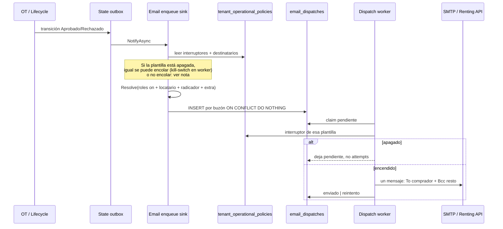

# Plan técnico — Interruptores de aprobación/rechazo y destinatarios múltiples (BCC)

**Fecha:** 2026-08-24  
**Superficie:** Admin → Compañías → Configuración Empresa  
**Alcance de envío:** plantillas `tramites.aprobado` y `tramites.rechazado` (ruta de radicación / gestión OT)  
**Estado:** plan de implementación (sin código). Feature y HUs en ADO: pendientes de registro.

---

## 1. Qué pide el requerimiento

1. **Separar el interruptor único** de «Avisos de correo al cambio de estado» en dos:
   - enviar (o no) el correo de **aprobación**;
   - enviar (o no) el correo de **rechazo**.
   - **Empresas nuevas y existentes** nacen / migran con **ambos** interruptores encendidos y con **todos los perfiles** (comprador, vendedor/propietario, radicador) encendidos. El correo extra sigue vacío hasta que lo capturen.
2. **Destinatarios en checkboxes** (combinables, no un radio):
   - Comprador
   - Vendedor / propietario (el segundo nombre aplica a trámites que no son traspaso)
   - Radicador (usuario de la compañía que crea el trámite)
   - Un **campo abierto** de correo adicional
3. El aviso sale **solo a los cupos encendidos** por la empresa.
4. Si está encendido comprador o vendedor/propietario, el envío cubre la parte **sea persona natural, jurídica o locatario** (mismos cupos de ADR-0045: natural → persona; jurídica → empresa + representante legal).
5. **Destinatario principal y copia oculta (PO 2026-08-24):** si hay **más de un** buzón resoluble, el **comprador** va en la casilla de destinatario principal (`To` / `Recipients[0]` de Renting) y **el resto en BCC**. Un solo buzón → solo `To`, sin BCC. Los de BCC no se ven entre sí; sí pueden ver al comprador en `To` (comportamiento SMTP/MIME estándar).

---

## 2. Hallazgo: cómo está hoy

### 2.1 Interruptor

Un solo boolean `admin.tenant_operational_policies.tramite_state_emails_enabled` (HU #11469), default `true`.

Lo evalúa el **worker**, no el sink de encolado:

- `ProcedureStateChangeEmailDispatchProcessor` (aprobado / rechazado)
- `PlateAssignmentEmailDispatchProcessor` (asignación de placa; **mismo** interruptor)

Si está apagado, la fila queda `pendiente` **sin** incrementar `attempts` y se reanuda al reactivar.

La UI es un único `ToggleSwitch` (`avisosCambioEstadoActivos`) en `ConfiguracionEmpresaTab.tsx`.

### 2.2 Destinatario configurado vs destinatario real

El select `notificationTarget` (`COMPRADOR` | `RADICADOR` | `NINGUNO`) **sí se persiste** en `notification_target`, se audita y se muestra en el diff de cambios.

**No gobierna el envío productivo.** El sink `ProcedureStateChangeEmailEnqueueNotifier` llama a `TramiteNotificationRecipientResolver.Resolve` **sin leer la política del tenant**. El resolver siempre notifica:

| Rol | Cuándo |
|-----|--------|
| `comprador` | Siempre |
| `vendedor` | Solo si `ModalidadEntrada == "traspaso"` |

Cupos por tipo de persona (ADR-0045, Aceptado):

- Natural → 1 correo (`persona`)
- Jurídica → 2 correos (`empresa` + `representante_legal`)

No resuelve:

- **Radicador** (`ProcedureInstance.CreatedByUserId` → `identity.users.email`)
- **Locatario** (`ActorType = "locatario"`)
- **Propietario** como tipo de actor: en trámites **no existe** `ActorType = "propietario"`; el titular vive como `vendedor` y el FUR lo etiqueta como propietario.
- **Correo extra** de la compañía

### 2.3 Visibilidad entre destinatarios

Hoy hay **una fila de cola y un `EmailMessage` por buzón**. SMTP pone al destinatario en **`To:`** (`SmtpEmailSender`). Como cada envío es un mensaje distinto, en la práctica no se ven entre sí, pero:

- no cumple el requisito explícito de BCC;
- el canal Renting (`RentingSendEmailRequest`) ya modela `BccRecipients` y no se usa en este flujo;
- un envío agrupado futuro (varios `To` en el mismo MIME) **sí** los expondría.

### 2.4 Alta de compañía

`TenantSettings.Default`:

- `TramiteStateEmailsEnabled = true`
- `NotificationTarget = Radicador` (el envío real, igual, ignora este valor)

La fila de política se materializa en el primer PUT o al persistir settings (`TenantSettingsRepository`). Los defaults de columna en DDL también aplican.

---

## 3. Decisiones de producto

**Cerrado 2026-08-24 (PO):** empresas **nuevas y existentes** inician con **todas las banderas en `true`**:

- Respuesta del trámite: **aprobación** y **rechazo**.
- Perfiles: **comprador**, **vendedor/propietario** y **radicador**.

El campo de correo extra **no** es una bandera: nace **vacío** (`null`). No se inventa un buzón.

No se respeta el valor previo de `tramite_state_emails_enabled` ni de `notification_target` (incluido `NINGUNO` o el interruptor apagado): el backfill **fuerza** el estado inicial descrito arriba. Después del deploy, cada compañía puede apagar lo que quiera desde Configuración Empresa.

| # | Tema | Estado | Decisión |
|---|------|--------|----------|
| A | Defaults empresa **nueva** | **Cerrado** | Interruptores aprobación/rechazo `true`. Checkboxes comprador, vendedor/propietario y radicador `true`. `extraEmail` vacío. |
| B | Migración empresas **existentes** | **Cerrado** | Igual que A. No copiar el interruptor viejo ni el select. |
| C | Correo extra | **Cerrado (no bloquea)** | Un input; si está vacío no hay cupo. Sin checkbox extra. |
| D | Placa asignada (ADR-0046) | **Cerrado (no bloquea)** | Sigue fuera del Feature de UI. El worker de placa lee `tramite_approved_emails_enabled` (aviso «positivo»). |
| E | Locatario | **Cerrado (no bloquea)** | Cuelga del checkbox **Comprador**. Si hay comprador y locatario, el comprador es `To` y el locatario va en BCC. |
| F | Todos los checkboxes off y correo vacío | Cerrado | Equivale a «no notificar». |
| G | Interruptores apagados | Cerrado | Filas pendientes se conservan hasta reactivar esa plantilla. |
| H | `To` + BCC | **Cerrado (PO)** | ≥2 buzones: `To` = comprador; BCC = resto. 1 buzón: solo `To`. |

---

## 4. Diseño recomendado (opción A)

### 4.1 Interruptores

Reemplazar `tramite_state_emails_enabled` por dos columnas:

```text
tramite_approved_emails_enabled  boolean NOT NULL DEFAULT true
tramite_rejected_emails_enabled  boolean NOT NULL DEFAULT true
```

Worker: ramificar por `template_key`:

- `tramites.aprobado` → `tramite_approved_emails_enabled`
- `tramites.rechazado` → `tramite_rejected_emails_enabled`
- Ausencia de fila de política → ambos `true` (paridad con HU #11469)

Alta de compañía / `TenantSettings.Default` / DEFAULT de columna: ambos `true` (decisión PO §3 A).

### 4.2 Destinatarios

Sustituir el enum único por un objeto persistido (jsonb) en `admin.tenant_operational_policies`:

```json
{
  "comprador": true,
  "vendedorOPropietario": true,
  "radicador": true,
  "extraEmail": null
}
```

Nombre de columna propuesto: `tramite_state_email_recipients jsonb NOT NULL` con DEFAULT igual al JSON de arriba (tres perfiles `true`, `extraEmail` null). El mismo objeto es el de `TenantSettings.Default`.

**Por qué jsonb y no cuatro columnas:** un solo campo auditable (`SettingsDiff`), un contrato API estable, y el correo extra viaja junto a los flags. El checklist de schema exige comentario de finalidad (Ley 1581) sobre `extraEmail`.

Validación API (422):

- `extraEmail` null o vacío → OK
- si viene texto → email RFC básico, trim, max 320, un solo buzón
- no se aceptan listas separadas por coma (evita copiar CC accidental)

Wire (OpenAPI / PUT settings), ejemplo:

```json
{
  "avisosAprobacionActivos": true,
  "avisosRechazoActivos": true,
  "destinatariosNotificacion": {
    "comprador": true,
    "vendedorOPropietario": true,
    "radicador": true,
    "extraEmail": "operaciones@empresa.com"
  }
}
```

Deprecar `notificationTarget` y `avisosCambioEstadoActivos` en el contrato: **romper el PUT** de settings en la misma HU de API (el admin es SuperAdmin; no hay clientes externos conocidos de este DTO). Mapear lectura antigua no es necesario si el frontend se despliega junto.

### 4.3 Resolución de destinatarios (sink)

Extender `ITramiteNotificationRecipientResolver` (o un orquestador fino delante) para que reciba la política del tenant:

```text
Resolve(instance, actors, participants, policy) → Recipients + Gaps
```

Reglas:

| Checkbox / campo | Actores / fuente | Familia |
|------------------|------------------|---------|
| Comprador | `ActorType = comprador` | Todas |
| Comprador | `ActorType = locatario` si existe | Leasing / cambio de locatario / matrícula leasing |
| Vendedor / propietario | `ActorType = vendedor` | Traspaso y el resto (titular) |
| Radicador | usuario `CreatedByUserId` → email de identidad del tenant | Todas |
| Correo extra | valor de política, kind nuevo `correo_extra`, role `configuracion_empresa` | Todas |

Para comprador, vendedor y locatario **reutilizar** `TreatAsJuridical` / `ResolveNatural` / `ResolveJuridical` (ADR-0045). Locatario no es un tercer PersonType: es un **rol de actor** que puede ser natural o jurídica.

Radicador: un cupo `persona` (o kind `radicador`). Si el usuario no tiene email → fila `omitido` («Sin correo para el radicador»). No inventar buzones.

Deduplicación: se mantiene `UNIQUE (outbox_id, lower(recipient))`. Si comprador y extraEmail coinciden, un solo envío.

Orden de inserción propuesto: comprador → locatario → vendedor → radicador → extra.

### 4.4 Destinatario principal (`To`) y copia oculta (BCC)

**Regla de producto (no bloquea desarrollo):** un **solo envío MIME/API por evento** (un `outbox_id` + plantilla), no un correo por buzón.

| Buzones resolubles | `To` (principal) | BCC |
|--------------------|------------------|-----|
| 1 | Ese único buzón (aunque no sea comprador) | vacío |
| ≥ 2 y hay al menos un correo de rol **comprador** | Comprador (ver desempate PJ abajo) | Todos los demás, índice incremental |
| ≥ 2 y **no** hay correo de comprador (checkbox apagado o sin email) | Primer buzón del orden vendedor → radicador → extra | El resto |

Desempate **persona jurídica del comprador** (ADR-0045, dos cupos): `To` = **empresa**; representante legal y el resto → BCC. Si la empresa no tiene email y el RL sí: `To` = RL. Locatario nunca es principal si existe comprador con correo.

**Cola (ADR-0045 intacto a nivel de evidencia):** el sink sigue insertando **una fila por buzón** (idempotencia `UNIQUE (outbox_id, lower(recipient))` + `omitido` por cupo). El worker **reclama todas las `pendiente` del mismo `outbox_id` en una transacción**, arma un único mensaje y marca **todas** `enviado` o reintenta el lote. Un fallo de SMTP/Renting no deja un BCC enviado y el `To` no.

**Mapeo de transporte (ya existe en código; no hay duda de integración):**

| Canal | Principal | Copia oculta |
|-------|-----------|----------------|
| FLIT SMTP (`SmtpEmailSender`) | `MimeMessage.To` = comprador (MailboxAddress email + nombre) | `MimeMessage.Bcc` = resto |
| API Renting (`RentingSendEmailRequest`) | `Recipients[0].Email` + `Recipients[0].UserName` = comprador | `bccRecipients[i].Email` = resto (`i` incremental; el contrato **no** lleva nombre en BCC) |

`EmailMessage` hoy solo modela un `ToEmail`. Hay que extenderlo (lista BCC y/o un request Renting directo en el router) **solo** para `tramites.aprobado` / `tramites.rechazado`. Invitaciones, reset y reportes no cambian.

**Desvío a buzón de control (ADR-0044, no productivo):** `RentingRecipientOverride` ya sustituye `Recipients` por el buzón de control y **vacía** `BccRecipients`. Se mantiene: en DEV/QA no se mandan BCC reales.

**Qué ven los destinatarios:** el de `To` no ve la lista BCC. Quien va en BCC **sí puede ver** el correo del comprador en `To`. Eso es lo pedido («casilla de destinatario principal»). No es el anonimato total del diseño anterior.

**Cuerpo del correo:** un HTML (el del trámite); no se personaliza el saludo por cada BCC.

### 4.5 UI (Configuración Empresa)

Reemplazar el toggle único y el `<select>` por:

1. Dos `ToggleSwitch`: «Avisos al aprobar trámite» y «Avisos al rechazar trámite».
2. Fieldset «Destinatarios de avisos de estado» con checkboxes (mismo patrón visual que Métodos de recaudo).
3. Input `type="email"` «Correo adicional» (deshabilitado o opcionalmente oculto si se prefiere checkbox+campo; ver §3 C).
4. Copy: indicar que comprador/vendedor incluyen persona natural, jurídica (empresa + RL) y locatario cuando exista; y que los envíos van en copia oculta.

Estados: vacío no aplica (siempre hay toggles). Error de email: mensaje bajo el campo. Carga: el formulario ya existente. Lleno: checkboxes + email.

Auditoría: `SettingsDiff` debe registrar cada flag y el extra email (el extra es PII: no loguear el valor en Application logs; sí en `tenant_config_audit_logs` como el resto de settings, con la misma política de retención ya usada).

---

## 5. Alternativas (obligatorio: 2–3)

### Opción A — Dos booleanos + jsonb + un MIME por evento (`To` comprador, BCC resto) (recomendada)

Pros: cumple la casilla principal; Renting ya tiene `Recipients[]` + `bccRecipients[]`; la cola por buzón se conserva para evidencia e idempotencia; el worker envía un lote.

Contras: el reintento es por evento, no por BCC suelto; hay que reclamar todas las filas del `outbox_id` juntas.

Esfuerzo: **M**.

### Opción B — Cuatro columnas boolean + `extra_email varchar`

Pros: defaults SQL triviales.

Contras: peor auditoría/diff; el correo extra queda separado de los flags.

Esfuerzo: **M**.

### Opción C — Un correo por buzón, todos en BCC con `To` técnico

Descartada: contradice la regla de «destinatario principal = comprador».

---

## 6. Migración de datos

Decisión PO (§3 A/B): **no** copiar el interruptor ni el select vigentes. Todas las filas de `admin.tenant_operational_policies` quedan en el estado inicial «todo encendido».

1. Añadir columnas nuevas + jsonb con DEFAULT `true` / JSON de tres perfiles `true`.
2. Backfill explícito (por si alguna fila se insertó a mitad de migración o el DEFAULT no aplica a `UPDATE`):
   ```sql
   UPDATE admin.tenant_operational_policies
   SET
     tramite_approved_emails_enabled = true,
     tramite_rejected_emails_enabled = true,
     tramite_state_email_recipients = jsonb_build_object(
       'comprador', true,
       'vendedorOPropietario', true,
       'radicador', true,
       'extraEmail', null
     );
   ```
   Ignorar `tramite_state_emails_enabled` y `notification_target`.
3. Empresas **nuevas** (INSERT posterior): mismos DEFAULT de columna; `TenantSettings.Default` alineado.
4. Drop de `tramite_state_emails_enabled` en la **misma** migración (evitar dos fuentes de verdad). `notification_target` se puede dejar una release como columna huérfana y dropear en la siguiente, o dropear ya si el PUT deja de enviarla.

Consecuencia aceptada: un tenant que tenía el interruptor **apagado** o el select en **NINGUNO** **volverá a enviar** avisos de aprobación y rechazo a comprador, vendedor/propietario y radicador hasta que el SuperAdmin los apague a mano.

**Asignación de placa (§3 D):** el worker de placa lee `tramite_approved_emails_enabled`. Sin cambio de UI de placa en este Feature.

---

## 7. Diagrama de secuencia (envío)



**Nota de encolado vs kill-switch:** hoy se encola siempre y el worker pausa. Mantenerlo: si apagan «aprobación» a mitad de cola, los pendientes no se pierden. El filtro de checkboxes **sí** debe ocurrir en el **sink** (no tiene sentido encolar radicador si nunca estuvo on).

---

## 8. Archivos a crear o modificar (lista exacta)

### Schema / persistencia

- `services/core-api/src/Flit.Infrastructure/Persistence/Sql/Ddl/` — script `ADD COLUMN` + `COMMENT ON COLUMN` (PII de `extraEmail`)
- Nueva migración EF (`Flit.Infrastructure/Migrations/`)
- `Persistence/Entities/Admin/TenantOperationalPolicy.cs`
- `Persistence/Configurations/Admin/TenantOperationalPolicyConfiguration.cs`
- `tests/Flit.Infrastructure.Tests/Persistence/TramiteStateEmailsEnabledSchemaTests.cs` (reemplazar / extender)

### Dominio y aplicación admin

- `Flit.Admin.Domain/Companies/Settings/TenantSettings.cs` (quitar enum único; dos bool + record destinatarios; `Default`)
- `NotificationTarget.cs` — deprecar o eliminar cuando no queden referencias
- `TenantSettingsCodes.cs`, `SettingsWire.cs`, `SettingsMapper.cs`, `SettingsDiff.cs`
- `TenantSettingsResponse.cs`, `UpdateTenantSettingsHandler.cs` (+ request DTO)
- `TenantSettingsRepository.cs`
- `tests/Flit.Admin.Tests/Companies/Settings/*`

### Envío trámites

- `ITramiteNotificationRecipientResolver.cs`, `TramiteNotificationRecipientResolver.cs`, `TramiteRecipientModels.cs` (kind `CorreoExtra` / role radicador)
- `ProcedureStateChangeEmailEnqueueNotifier.cs` (leer política; filtrar roles)
- `ProcedureStateChangeEmailDispatchProcessor.cs` (kill-switch por plantilla; BCC)
- `PlateAssignmentEmailDispatchProcessor.cs` (solo el mapeo del interruptor, si se confirma §3 D)
- `IEmailSender` / `EmailMessage` + `SmtpEmailSender` + ruta Renting (`TenantChannelEmailRouter` / mapping a `BccRecipients`)
- Tests: `TramiteNotificationRecipientResolverTests`, `ProcedureStateChangeEmailEnqueueNotifierTests`, `ProcedureStateChangeEmailDispatchProcessorTests`, `SmtpEmailSenderTests`, tests Renting BCC

### Contrato y frontend

- `contracts/openapi/core-api.v1.yaml` (`TenantSettings` / `TenantSettingsUpdate`)
- `frontend/lib/api/types.ts`
- `frontend/components/admin/companies/settingsForm.ts`
- `frontend/components/admin/companies/tabs/ConfiguracionEmpresaTab.tsx`
- Tests de tabs / page companies (`CompanyConfigTabs.test.tsx`, defaults en `[tenantId]/page.tsx`)

### ADR

- Addendum o ADR nuevo **Propuesto** que **extiende** ADR-0045 (filtro por política + BCC) y no lo contradice: la cola sigue siendo una fila por buzón.

---

## 9. Descomposición propuesta de HUs

| HU | Capa | Alcance |
|----|------|---------|
| HU-DB | `[BACKEND]` | Migración, defaults, comentarios PII, tests de schema |
| HU-API-CFG | `[BACKEND]` | GET/PUT settings, validación extraEmail, auditoría, alta compañía |
| HU-RESOLVER | `[BACKEND]` | Política → cupos (comprador, locatario, vendedor, radicador, extra); tests Gherkin de roles y PJ/PN |
| HU-BCC | `[BACKEND]` | Un envío por evento: `To` = comprador, BCC = resto; SMTP + `Recipients[0]` / `bccRecipients[i]` Renting; kill-switch por plantilla |
| HU-UI | `[FRONTEND]` | Toggles separados, checkboxes, campo email, copy, WCAG, tests RTL |

Orden: DB → API-CFG → RESOLVER → BCC → UI (la UI puede ir en paralelo a BCC si el contrato GET ya existe).

---

## 10. Criterios funcionales (borrador Feature)

1. El SuperAdmin puede encender o apagar de forma independiente los avisos de **aprobación** y de **rechazo**.
2. Una compañía **nueva** y una **existente** (tras la migración) inician con interruptores de **aprobación y rechazo** encendidos y con checkboxes de **comprador, vendedor/propietario y radicador** encendidos. El correo extra nace vacío.
3. El SuperAdmin puede apagar o encender esos cupos y capturar un correo adicional.
4. Al aprobar o rechazar un trámite, el sistema encola un aviso por cada cupo encendido que tenga email resoluble (natural, jurídica empresa+RL, locatario).
5. El radicador es el usuario de la compañía que creó el trámite (`CreatedByUserId`).
6. Si hay más de un destinatario resoluble, el **comprador** va en destinatario principal y el resto en **copia oculta**. Un solo destinatario va solo en principal.
7. Sin cupos encendidos y sin correo extra, no hay envíos `pendiente`.
8. Si el interruptor de esa plantilla está apagado, los avisos no salen (filas pendientes se conservan).

---

## 11. Riesgos

- **Habeas Data:** `extraEmail` es dato personal; finalidad = aviso operativo de estado del trámite; no usarlo en logs de aplicación.
- **Cambio de comportamiento (aceptado por PO):** el backfill pone todo en `true`. Quienes tenían el aviso apagado o `NINGUNO` empiezan a recibir (y el radicador, que hoy no recibía, **pasa a recibir**). Hay que avisarlo en el deploy a SuperAdmin.
- **Reintento de lote:** un 5xx de Renting/SMTP reintenta To+BCC juntos (aceptable).
- **PRs ≤ 800 líneas:** partir por HU.

---

## 12. Fuera de alcance

- Banco de plantillas admin (`/admin/plataforma/notificaciones`) y el selector de tipo de trámite (Feature previo).
- SMS, webhooks OT, reflejo ICT.
- Cambiar el copy del cuerpo del correo.
- Hacer que `notification_target` legado siga siendo el único campo (se sustituye).

---

## 13. Siguiente paso (orquestación)

Workflow: **requirement-to-delivery**.

1. Diseño **desbloqueado** para desarrollo (§3 A–H). No quedan preguntas de integración Renting ni de casilla `To`/BCC.
2. Registrar Feature + HUs en ADO (`tech-lead-agent` modos A/B) — o borrador local si se pide igual que el Feature de tipo de trámite.
3. ADR Propuesto (`architecture-agent` + `flit-adr-generator`).
4. `database-agent` materializa la migración.
5. Implementación por HU con gate **Active** en ADO.

No se implementa código hasta confirmación explícita de este plan y del alta de work items.
