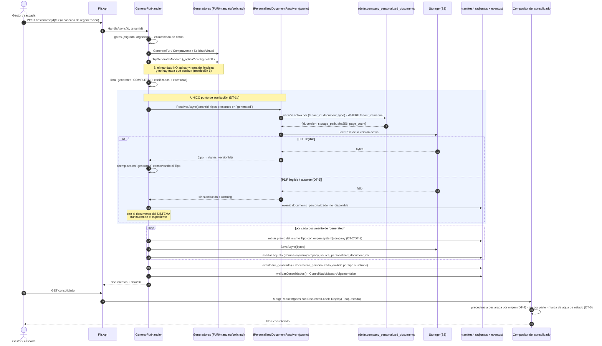

# Plan técnico — Documentos personalizados por compañía (Feature #11309)

> Generado: 2026-08-10 · Autor: `architecture-agent` · ADR: `ADR-0042-documentos-personalizados-por-compania.md` (**Propuesto**)
>
> Alcance funcional **cerrado por el PO**: no se reabre. Este documento resuelve solo las decisiones
> **técnicas** (DT-1 a DT-7) y entrega el mapa que siguen Database, Backend, Frontend y QA. No descompone
> en HUs y no contiene código de producción ni DDL definitivo.

---

## 1. Contexto y costuras verificadas

El expediente se ensambla en **un único punto**: `GenerarFurHandler`
(`services/core-api/src/Flit.Tramites.Application/UseCases/ProcedureInstances/FurCommand.cs`). El handler
construye una lista `generated` de `GeneratedDocument` (FUR, compraventa, solicitud virtual, mandato,
certificados de identidad/RUES/RNMC/SOAT-RTM, escrituras) y después la persiste en un bucle que, por cada
documento, **borra el adjunto previo del mismo `Tipo` cuyo `Source` sea `"system"`** y escribe el nuevo con
`Source = "system"`.

Hechos del repositorio que condicionan cada decisión:

| Hecho | Dónde | Consecuencia |
|---|---|---|
| El pie de página de cada parte del consolidado sale de `DocumentLabels.Display(a.Tipo)` | `ConsolidadoMaestroCommand.cs` (construcción del `MergeRequest`) | Conservar el `Tipo` da el pie correcto **gratis** |
| La marca de agua se aplica al PDF ya fusionado, salvo en `aprobado`/`entregado`/`preparado` | `PdfExpedienteConsolidadoMerger.Compose` / `EstadosSinMarcaAgua` | El personalizado la hereda sin tocar nada |
| `source` es `varchar(20)` **sin `CHECK`**, default `'user'` | `ProcedureInstanceAttachmentConfiguration.cs`, DDL de adjuntos | Un valor nuevo no exige migración de restricciones |
| La deduplicación del consolidado conserva el **`UploadedAt` más reciente** | `GenerarConsolidadoHandler.SanitizeConsolidadoParts` | Con dos filas del mismo `Tipo` el resultado es una **carrera** |
| El gate de mandatario deduce «el mandato aplica **sii** existe un adjunto `Tipo='mandato'`» | `MandatoApprovalHandler` | Sin excluir el origen nuevo, el aprobador recibe un 409 por un mandatario que el documento no usa |
| Las ramas «generar-o-limpiar» borran por `Tipo` **sin filtrar `Source`** y hacen `storage.Delete` | `FurCommand.cs`: `mandato`, `certificado_identidad*`, `certificado_rues*`, `certificado_rnmc` (y, con la misma forma, `certificado_soat_rtm` y escrituras) | **Bug #11310**, preexistente |
| `IAttachmentStorage` llavea por trámite; el precedente a nivel compañía es `IDeedDocumentStorage` | `Flit.Admin.Application/Companies/Deeds/`, `Flit.Infrastructure/Storage/DeedDocumentStorage.cs` | Hay patrón que copiar; no hay que inventarlo |
| El aislamiento real es el `WHERE tenant_id` **manual** (RLS decorativo) y `CompanyOwnTenantFilter` identifica el tenant por el **primer `Guid` de la firma** del handler | `CompanyOwnTenantFilter.cs`, `CompanyTenantAccess.cs` | El **orden de parámetros** de cada handler es funcional |
| El canal vive en `admin.tenant_operational_policies.notification_channel` (`flit_smtp` \| `tenant_api`) | `07-HU10154-admin-tenants.sql`, `TenantSettingsCodes.cs`, `SettingsWire.cs` | Fuente única de verdad del interruptor de visibilidad |
| Última migración en esta rama: `20260808110000_BackfillCertificaciones` | `Flit.Infrastructure/Migrations/` | Toda migración nueva se ordena **después** |

---

## 2. DT-1 · Mecánica de sustitución en el pipeline

### Alternativas

**(a) Resolver dentro del generador** — `IMandatoGenerator` / `ISolicitudVirtualGenerator` devuelven el PDF de
la compañía en lugar del compuesto.
*Pros:* el bucle de `generated` no se toca; el `Tipo` y el flujo quedan idénticos.
*Cons:* obliga a modificar **dos** generadores de Infrastructure (rompe la restricción de entregabilidad de
«una sola HU toca el bucle» convirtiéndola en «dos HUs tocan dos generadores»); los generadores son piezas de
render puro y tendrían que consultar el módulo Admin; el mandato seguiría pagando la resolución del mandatario,
del convenio y de la firma del baúl **antes** de descartarse; y no queda ningún punto donde capturar la
referencia de versión para persistirla en el adjunto.
*Esfuerzo:* M · *Riesgo:* acopla render con configuración; la traza se pierde.

**(b) Interceptar la lista `generated` una vez completa** — un único paso
`AplicarDocumentosPersonalizados(generated, tenantId, …)` inmediatamente después del bloque de escrituras y
antes de `instance.ConsolidadoMaestroVigente = false`, que reemplaza en la lista el `GeneratedDocument` cuyo
`Tipo` esté personalizado y devuelve el mapa `Tipo → versión usada` (espejo exacto de `deedIdPorTipo`).
*Pros:* **un solo punto** de intervención en el bucle ⇒ cabe en una HU y el diff es auditable; respeta por
construcción la restricción 6 (si el trámite no generó el documento, no hay nada que sustituir: el mandato que
no aplica ya salió por la rama `else`); el `Tipo` no cambia, así que pie, matriz, checklist y orden se heredan;
hay dónde capturar la referencia de versión y dónde escribir el evento.
*Cons:* el PDF del sistema se genera y se descarta (CPU, sin llamadas salientes nuevas); el bucle de
persistencia debe aprender a escribir dos orígenes distintos.
*Esfuerzo:* S/M · *Riesgo:* bajo, acotado a un método nuevo y a dos líneas del bucle.

**(c) Resolver al componer el consolidado** — sustituir la parte en `GenerarConsolidadoHandler` /
`ConsolidadoMaestroCommand`.
*Pros:* no toca la generación en absoluto.
*Cons:* **dos** caminos de consolidado más el envío por el canal de radicación ⇒ tres sitios, no uno; el
documento **descargable individualmente** seguiría siendo el del sistema (el cliente vería el mandato de FLIT en
la lista de adjuntos); no queda adjunto, así que no hay `sha256` ni traza del hecho, lo que incumple las
restricciones 12 y el oráculo CF-02; y el checklist seguiría contando el documento del sistema.
*Esfuerzo:* M · *Riesgo:* alto; incumple restricciones cerradas.

### Elección: **(b)**

Es la única que satisface a la vez «un solo punto en el bucle», «sustituye donde el trámite lo habría generado»
y «queda traza por trámite». El coste (generar para descartar) se acepta explícitamente: la **corrección de la
aplicabilidad** manda sobre el ahorro, porque decidir «¿aplica el mandato?» está hoy entrelazado con generarlo
(`TryGenerateMandatoAsync` devuelve `null` cuando no aplica). Afinado **opcional** y posterior: pasar la decisión
de personalización —resuelta una sola vez por tenant al principio del handler— a `TryGenerateMandatoAsync` para
que evalúe la aplicabilidad pero se salte la resolución de firma del mandatario. No es requisito de entrega.

**Persistencia.** El bucle final escribe `Source = "company"` (en vez de `"system"`) y
`SourcePersonalizedDocumentId = versión` cuando el tipo fue sustituido, y borra el previo con la guarda de DT-3.

---

## 3. DT-2 · Origen (`Source`) del adjunto personalizado

### Alternativas

**(a) Reutilizar `"system"`.**
*Pros:* cero filtros a revisar; el borrado idempotente lo reemplaza solo.
*Cons:* el documento queda **indistinguible** del generado: el gate de mandatario no puede excluirlo, la
interfaz no puede etiquetarlo, la precedencia de DT-4 no se puede expresar y la guarda de DT-3 no tiene con qué
discriminar. Además queda expuesto a que cualquier limpieza futura por tipo lo borre.
*Esfuerzo:* S · *Riesgo:* alto (pierde toda capacidad de discriminación).

**(b) Valor nuevo `"company"`.**
*Pros:* discriminador de una sola lectura, que es justo lo que los filtros existentes ya leen; cabe en
`varchar(20)`; no hay `CHECK` que ampliar.
*Cons:* obliga a revisar cada consumidor que asuma la lista cerrada de orígenes.
*Esfuerzo:* S · *Riesgo:* medio, acotado a la lista enumerada abajo.

**(c) Mantener `"system"` + columna FK `source_personalized_document_id`** (espejo de `source_deed_id`).
*Pros:* traza exacta de la versión; reutiliza un precedente vivo; el borrado idempotente sigue siendo correcto.
*Cons:* discriminar exige leer una segunda columna en cada consumidor (gate de aprobación, interfaz, precedencia);
más costoso que un `Source` distinto para el mismo efecto.
*Esfuerzo:* S · *Riesgo:* medio (la lógica se dispersa en joins).

### Elección: **(b) + la columna de (c)**

`Source = "company"` **como discriminador** (barato de leer en cada guarda) y
`source_personalized_document_id` **como traza** (qué versión exacta entró, oráculo de CF-02 y soporte de la
restricción 12). No son redundantes: uno responde «¿de dónde viene?», la otra «¿cuál era?».

### Filtros y consumidores a revisar — lista completa

| # | Punto | Qué hay que hacer |
|---|---|---|
| 1 | `FurCommand.cs` — bucle de persistencia idempotente (`Source == "system"`) | Ampliar a `system` **o** `company` para el tipo que se está escribiendo: si no, la fila `company` anterior sobrevive y quedan **dos** filas del mismo `Tipo` |
| 2 | `FurCommand.cs` — rama de limpieza de `mandato` (borra por `Tipo`, sin filtrar origen) | Guarda de DT-3: el personalizado no se retira por esta vía |
| 3 | `FurCommand.cs` — ramas de `certificado_identidad*`, `certificado_rues*`, `certificado_rnmc`, `certificado_soat_rtm`, escrituras | No afectan a estos dos tipos, pero **comparten la guarda** que crea este Feature (ver DT-3 / Bug #11310) |
| 4 | `MandatoApprovalHandler` — «exige mandato **sii** existe adjunto `Tipo='mandato'`» | **Excluir `Source == "company"`**; si no, 409 `mandatario_requerido` / `mandatario_identidad_requerida` sobre un documento sin mandatario |
| 5 | `GenerarConsolidadoHandler.SanitizeConsolidadoParts` (usada también por `ConsolidadoMaestroCommand`) | Precedencia declarada de DT-4 |
| 6 | `AttachmentsCommand.cs` — DTO de listado expone `Source` tal cual | El valor nuevo llega al contrato; el front debe etiquetarlo («Documento de la compañía») y no asumir el conjunto anterior |
| 7 | `DeleteAttachmentHandler` — borra cualquier adjunto en estados de edición sin mirar `Source` | Comportamiento aceptado: el gestor puede borrarlo y **vuelve** en la siguiente regeneración; ojo a `ChecklistEstadoJson.AutoUnmark`, que desmarca el ítem al borrarlo |
| 8 | `ProcedureInstanceAttachmentConfiguration.cs` — `HasMaxLength(20)`, default `"user"` | `"company"` (7 caracteres) cabe; **verificado: no hay `CHECK` en el DDL de la columna** |
| 9 | Vistas/consultas analíticas sobre adjuntos | **Verificado: 0 predicados sobre `source` de adjuntos** en `Persistence/Sql` y repositorios; nada que ampliar |
| 10 | `ChecklistEngine.Compute(codigo, manual, docTipos)` | Solo consume `Tipo`: no se toca (y por eso el checklist sigue satisfecho al sustituir) |
| 11 | Frontend | **Verificado: ninguna vista filtra adjuntos por `source`** (el único `'system'` del front está en un test de preflight) |
| 12 | `TramiteFirmaAplicador` (parte «mandatario») | Solo dispara una regeneración: no requiere cambio, pero su efecto sobre un mandato personalizado es nulo (R-3) |

---

## 4. DT-3 · Guarda de las ramas de limpieza

Estado verificado: las ramas «generar-o-limpiar» borran **por `Tipo`, sin filtrar `Source`**, y ejecutan
`storage.Delete`. Afecta a `mandato`, `certificado_identidad*`, `certificado_rues*` y `certificado_rnmc` (y por
la misma forma a `certificado_soat_rtm` y a las escrituras). Radicado como **Bug #11310** (preexistente,
independiente de este Feature).

### Alternativas

**(a) Añadir `&& a.Source == "system"` en cada rama.**
*Pros:* mínimo diff, cero abstracción nueva.
*Cons:* duplica la regla en 4–6 sitios; el séptimo documento generado la olvidará. Es la misma clase de deriva
que ya obligó a centralizar la decisión de firma en un único predicado compartido.
*Esfuerzo:* S · *Riesgo:* la regla se separa con el tiempo.

**(b) Un helper compartido de retirada** — `AttachmentCleanup.RetirarGenerados(instance, repo, storage, predicadoDeTipo)`,
que encapsula «solo se retira lo que **generó el sistema**» y se usa en todas las ramas.
*Pros:* una sola definición de la regla; el próximo documento generado la hereda por construcción; testeable
aislada; es la pieza que el Bug #11310 necesita.
*Cons:* introduce un helper nuevo en el handler más caliente del sistema.
*Esfuerzo:* S · *Riesgo:* bajo.

**(c) Reconciliación al final** — calcular el conjunto de tipos generados que deben existir y reconciliar los
adjuntos una sola vez al cierre, eliminando las seis ramas.
*Pros:* la solución conceptualmente limpia; elimina el patrón repetido de raíz.
*Cons:* reescribe toda la cola del handler y **cambia seis comportamientos a la vez** (incluidos el congelado de
escrituras tras entrega y el «si aplicaba y la generación falló, se conserva el previo», que son excepciones
deliberadas); regresión de alto riesgo sobre un handler con pruebas repartidas.
*Esfuerzo:* L · *Riesgo:* alto.

### Elección: **(b)**, con el reparto de responsabilidad explícito

| Qué | Dueño |
|---|---|
| Crear el helper compartido de retirada | **Feature #11309** |
| Aplicarlo a la rama de `mandato` para que el documento personalizado **sobreviva** a la limpieza | **Feature #11309** |
| Ampliar el borrado idempotente para que reemplace también la fila `company` previa del mismo tipo | **Feature #11309** |
| Aplicar el helper a `certificado_identidad*`, `certificado_rues*`, `certificado_rnmc`, `certificado_soat_rtm` y escrituras, para que **no se pierda nada de origen externo** (`user`, `ot`, `ocr`, `portal`, `consultation`, `ict`) | **Bug #11310** |

El Feature **no** arregla el Bug de tapadillo: el Bug tiene su propio work item y sus propias pruebas de
regresión por tipo. Lo que el Feature aporta es la pieza que el Bug va a usar, y lo declara aquí para que no se
implemente dos veces.

`tramite_virtual` **no tiene** rama de limpieza (se genera siempre), así que en este Feature la guarda solo hace
falta para `mandato`.

---

## 5. DT-4 · Precedencia por origen y por tipo

**El problema, exacto.** `SanitizeConsolidadoParts` deduplica por `Tipo` conservando el `UploadedAt` más
reciente. En el bucle de persistencia todos los documentos se escriben con **el mismo `now`**, así que ante dos
filas del mismo `Tipo` el `OrderByDescending(UploadedAt).First()` desempata por orden de llegada de la consulta:
no determinista. Esto es lo que mató el diseño anterior y no puede quedar implícito.

### Alternativas

**(a) Precedencia declarada por grado de especificidad del origen.**
*Pros:* determinista, verificable con una tabla, e independiente del orden de escritura; arregla de paso la
carrera que hoy existe entre la compraventa del sistema y la del usuario.
*Cons:* cambia el desempate para **todos** los tipos, no solo para estos dos.
*Esfuerzo:* S · *Riesgo:* medio (efecto colateral intencionado; exige pruebas de composición).

**(b) Garantizar por construcción que nunca haya dos filas** — la sustitución elimina la fila `system` en el
mismo bucle.
*Pros:* trivial; sin regla nueva.
*Cons:* no cubre las filas `user`/`ot`/`ict`, que **coexisten a propósito** con las del sistema
(`ADR-0035-compraventa-autogenerada-siempre-y-sin-membrete`), así que la carrera sobrevive; y hace que el
consolidado dependa del orden de los efectos secundarios en vez de una regla legible.
*Esfuerzo:* S · *Riesgo:* deja el problema a medias.

**(c) Tipo documental distinto para el personalizado.** Descartada por la restricción funcional 5.

### Elección: **(a) + la higiene de (b)**

1. **Higiene:** la sustitución retira la fila `system` del mismo `Tipo` en el mismo bucle ⇒ por construcción no
   hay duplicados de origen generado.
2. **Regla declarada** en la deduplicación, aplicada a los **dos** caminos de consolidado:

| Grado | Orígenes | Semántica |
|---|---|---|
| **1 (gana)** | `ot`, `user`, `ict`, `portal`, `ocr`, `consultation` | **Hecho del trámite**: alguien cargó o importó ese documento para *este* expediente |
| **2** | `company`, y cualquier valor **no declarado** | **Configuración de la compañía**: vale para todos sus trámites |
| **3 (pierde)** | `system` | **Plantilla del sistema**: el default genérico |

Desempate **dentro** del mismo grado: el `UploadedAt` más reciente (comportamiento actual, ahora acotado).
Un origen no declarado cae al grado 2 a propósito: no puede desplazar un hecho del trámite, ni quedar por debajo
de una plantilla genérica.

**Resultado para los dos tipos de este Feature:** una carga del gestor o del organismo (grado 1) gana sobre el
documento personalizado (grado 2), que gana sobre el generado (grado 3). Es la lectura de especificidad: el acto
concreto sobre este trámite manda sobre la configuración de la compañía, y esta sobre la plantilla.

**Efecto colateral declarado:** en `compraventa`, la del usuario pasa a ganar **siempre** en lugar de «la más
reciente». Es exactamente lo que `ADR-0035-compraventa-autogenerada-siempre-y-sin-membrete` quiso decir; hasta
hoy dependía de cuál se escribiera después. Se entrega como cambio separado del que toca el bucle de `generated`,
con sus propias pruebas.

---

## 6. DT-5 · Composición del PDF cargado

**Decisión:** el personalizado entra al compositor **completo**, como cualquier otra parte
(`ADR-0030-marca-documental-compartida-y-merger-compositor`):

- **Pie con el nombre del documento:** se estampa por parte antes del merge, con la etiqueta que resuelve
  `DocumentLabels.Display(Tipo)`. Al conservar el `Tipo`, el pie dice «Mandato» / «Solicitud de trámite virtual»
  sin registrar nada nuevo. Este es el **pago técnico** de la restricción 5.
- **Marca de agua de estado:** se aplica al PDF ya fusionado, con la excepción vigente en
  `aprobado`, `entregado` y `preparado`. El personalizado no puede eximirse: la marca es del expediente, no de la
  parte.
- **Portada institucional:** se antepone al consolidado, sin cambio.
- **Tamaño de página:** se preserva tal cual (importación PdfSharpCore). Un PDF en Oficio o A4 conserva su tamaño
  dentro del consolidado, igual que hoy el FUR — «lo que se pierde» ya asumido en
  `ADR-0030-marca-documental-compartida-y-merger-compositor`.

**Qué verá el cliente en borrador — explícito:**

| Vista | Qué ve |
|---|---|
| Consolidado del wizard / maestro, trámite en `borrador` | Su PDF con el **pie FLIT** («Mandato») y la **marca de agua diagonal `BORRADOR`** |
| Consolidado, trámite en `aprobado` / `entregado` / `preparado` | Su PDF con el pie FLIT y **sin marca de agua** |
| Descarga individual del adjunto (`GET .../attachments/{id}`) | Los **bytes verbatim** que cargó: sin pie y sin marca de agua — el estampado ocurre solo en `Compose`, exactamente igual que hoy con el FUR |
| Vista previa desde la configuración de la compañía | Los **bytes verbatim** (presigned inline) |

**Riesgo de render a verificar:** `FlitPdfStamper.ApplyDocumentName` estampa sobre el `/MediaBox` de cada
página; un PDF con páginas **rotadas** o con `/MediaBox` desplazado puede recibir el pie sobre el contenido. Es
punto de verificación (§11), no bloqueante: el pie no puede romper el merge.

---

## 7. DT-6 · Storage a nivel compañía

`IAttachmentStorage` llavea el artefacto por trámite y no sirve. El precedente es `IDeedDocumentStorage`
(escrituras por compañía), que delega en `IAttachmentStorage` usando el **tenant como clave de agrupación**.

### Alternativas

**(a) Puerto nuevo acotado `ICompanyPersonalizedDocumentStorage`**, espejo de `IDeedDocumentStorage`
(`CreateUploadAsync(tenantId)` → presigned POST; `GetViewUrlAsync(storagePath)` → presigned GET inline), con
implementación en Infrastructure que delega en `IAttachmentStorage`.
*Pros:* aísla el módulo Admin de Trámites igual que hoy; patrón conocido; presigned de subida y de vista ya
soportados.
*Cons:* una interfaz más de dos métodos.
*Esfuerzo:* S · *Riesgo:* bajo.

**(b) Reutilizar `IDeedDocumentStorage`.**
*Pros:* cero código nuevo.
*Cons:* el puerto tiene el `tipo` `"escritura"` fijo y el filename `escritura.pdf`; se acaban mezclando dos
features en el mismo namespace de objetos y en la misma retención.
*Esfuerzo:* S · *Riesgo:* contaminación semántica.

**(c) Guardar el PDF en BD (`bytea`).**
*Cons:* blobs de megas en la tabla de configuración, backups inflados, sin presigned preview, y contradice todos
los precedentes (baúl, escrituras). Descartada.

### Elección: **(a)**

- **Rutas / claves.** Agrupación por `tenantId` (mismo criterio que el baúl y las escrituras); `tipo` del
  artefacto `documento_personalizado`; filename `mandato.pdf` / `tramite_virtual.pdf`. El `storage_path` que
  devuelve el backend es opaco y es lo único que se guarda en BD, junto al hash.
- **Flujo de carga en dos pasos** (necesario: en el alta el binario **todavía no existe**, igual que en
  escrituras):
  1. `POST` crea la fila en estado `pendiente` y devuelve la presigned POST policy. El cliente sube el PDF
     directo al storage.
  2. `POST /{id}/confirm` es donde ocurre la **validación real** (única oportunidad de ver los bytes):
     - relee el objeto y **recalcula el SHA-256**; si no coincide con el declarado ⇒ `sha256_mismatch`;
     - **magic bytes** `%PDF-` (no el `content-type` que declara el cliente) ⇒ `no_es_pdf`;
     - **abre el PDF** con PdfSharpCore en modo importación: si lanza, `pdf_ilegible`; si trae cifrado/permisos,
       `pdf_cifrado` (un PDF cifrado no se puede fusionar y reventaría el consolidado);
     - **páginas** (`PageCount`): máximo **30** ⇒ `excede_paginas`;
     - **tamaño**: máximo **20 MB**, en paridad con `document_types.max_size_bytes` del catálogo
       (`20971520`) ⇒ `excede_tamano`.
     Solo al pasar todo, la versión pasa a `activo` y la anterior a `historico`.
- **Retención.** Ninguna versión se borra (restricción 9): el binario vive mientras exista la fila. Las versiones
  `pendiente` que nunca se confirmen quedan como basura recuperable (limpieza operativa, no funcional). Sin cuota
  dura: se recomienda alerta operativa por encima de ~20 versiones por `(tenant, tipo)`.
- **Descarga / preview.** `GET /{id}/view` → `{ url, expiresAt }` presigned GET con
  `Content-Disposition: inline` y TTL ≈ 10 min (`ADR-0029-preview-presigned-get-inline`). **Ownership antes de
  firmar**; nunca loguear la URL completa (lleva firma HMAC).
- **Aislamiento del fallo (obligatorio).** Si la versión activa no se puede leer o abrir en el momento de
  generar:
  1. el resolutor devuelve `null` (best-effort, patrón del baúl y de las escrituras);
  2. el pipeline usa el **documento del sistema**;
  3. se registra `warning` estructurado (tenant + id de versión, **sin** URL ni contenido);
  4. se escribe un evento `documento_personalizado_no_disponible` en el trámite, con el id de versión.
  Nunca un 500, nunca un consolidado roto, nunca un expediente sin ese documento.

---

## 8. DT-7 · Endpoints y aislamiento multi-tenant

### Decisión

Grupo `/api/v1/admin/companies/{tenantId:guid}/personalized-documents`, con
`AdminAuthorization.AdminCompanyPolicy` + `CompanyOwnTenantFilter` — **exactamente** el par que ya protege las
escrituras. Eso cubre la restricción 11 (administrador de la compañía y superadmin de FLIT) **sin política
nueva**: `CompanyTenantAccess.ForbidIfForeignTenant` deja pasar libre al SuperAdmin y acota al AdminCompany a su
`tenant_id` del JWT.

> **Regla de firma no negociable:** `CompanyOwnTenantFilter` toma **el primer `Guid` de la firma del handler**.
> Por tanto `Guid tenantId` va **siempre primero**, y cualquier `Guid id` después. Invertirlos hace que el filtro
> valide el id del recurso como si fuera un tenant, y el aislamiento se cae en silencio.

### Contrato

| Verbo | Ruta | Payload / respuesta | Códigos |
|---|---|---|---|
| `GET` | `""` | `{ documents: [{ documentType, active: { id, version, filename, sha256, pageCount, activatedAt } \| null, history: [{ id, version, status, filename, sha256, pageCount, createdAt, activatedAt, deactivatedAt }] }] }` | 200 · 401 · 403 |
| `POST` | `""` | req `{ documentType: "mandato"\|"tramite_virtual", filename, sha256, sizeBytes }` → 201 `{ id, version, upload: { storagePath, url, fields } }` | 201 · 401 · 403 · 409 · 422 |
| `POST` | `"/{id:guid}/confirm"` | → 200 `{ id, version, status: "activo", sha256, pageCount }` | 200 · 401 · 403 · 404 · 409 · 422 |
| `POST` | `"/{id:guid}/activate"` | reactiva una versión histórica → 200 `{ id, version, status: "activo" }` | 200 · 401 · 403 · 404 · 409 |
| `DELETE` | `"/{documentType}"` | volver al documento del sistema (desactiva la activa, **conserva** historial), idempotente | 204 · 401 · 403 · 409 |
| `GET` | `"/{id:guid}/view"` | → 200 `{ url, expiresAt }` presigned inline | 200 · 401 · 403 · 404 |

**Errores.**
- `403` `{ error: "FORBIDDEN_TENANT", … }` — tenant ajeno (lo emite el filtro existente).
- `409 canal_no_habilitado` — el tenant no tiene `notification_channel = tenant_api`. Se evalúa en **escritura**
  (`POST`, `confirm`, `activate`, `DELETE`); el `GET` sigue respondiendo para que el historial se pueda consultar
  después de volver a `FLIT_SMTP` (restricción 9).
- `409 version_no_activable` — reactivar una versión `pendiente` o `rechazada`.
- `422 { errors: [{ field, code, message }] }` con `tipo_documento_invalido`, `sha256_mismatch`, `no_es_pdf`,
  `pdf_cifrado`, `pdf_ilegible`, `excede_tamano`, `excede_paginas`. **Nunca** PII ni fragmentos del PDF en el
  mensaje.

**Fuente única de verdad del interruptor.** El canal se lee del lector de configuración del tenant
(`admin.tenant_operational_policies.notification_channel`) y **no se copia** a la tabla nueva. El «interruptor»
de la funcionalidad **es** la existencia de una versión activa por `(tenant, tipo)`: no hay booleano paralelo que
pueda contradecirla.

**Consumo desde Trámites.** Ninguno expuesto: el wizard no necesita saberlo. El pipeline resuelve por puerto
interno, llaveando por `instance.TenantId` (no por el tenant del usuario autenticado). No hace falta tocar
`TenantEnforcementMiddleware`.

### Tests de aislamiento exigidos

1. AdminCompany del tenant **B** llamando con el `tenantId` de **A** ⇒ **403** en las seis rutas (el filtro).
2. SuperAdmin puede operar cualquier tenant ⇒ 200/201.
3. Cada una de las consultas nuevas filtra `WHERE tenant_id` **manualmente**: test que consulta una versión
   existente con el tenant equivocado y espera **cero filas / 404**. Es obligatorio precisamente porque las
   políticas RLS **no se evalúan** (sin `FORCE ROW LEVEL SECURITY`, aplicación owner): sin el `WHERE` explícito, la
   fila se devuelve.
4. El resolutor del pipeline llavea por `instance.TenantId`: un trámite de **A** nunca toma el documento de **B**,
   aunque el usuario que dispara la generación pertenezca a **B**.
5. La presigned view URL de una versión de **A** no se emite a un usuario de **B** (ownership **antes** de firmar,
   `ADR-0029-preview-presigned-get-inline`).
6. Con `notification_channel = flit_smtp`, las escrituras responden 409 y la generación es **byte a byte** la
   actual (test de paridad sobre el `sha256` del `mandato` generado).

---

## 9. Diagrama de secuencia — generación con sustitución

---

## 10. Modelo de datos conceptual

> Sin DDL definitivo — lo materializa el `database-agent` según
> `.claude/skills/db-schema-validator/checklist-validacion-schema.md`.

### `admin.company_personalized_documents` (nueva)

Versiones del documento personalizado. Patrón de `admin.company_deeds`.

| Columna | Tipo conceptual | Notas |
|---|---|---|
| `id` | uuid, PK | `uuidv7()` |
| `tenant_id` | uuid, FK `identity.tenants` | `ON DELETE RESTRICT ON UPDATE CASCADE` |
| `document_type` | varchar corto | `CHECK` en `('mandato','tramite_virtual')` — **el mismo vocabulario del `Tipo` del adjunto**, no un catálogo nuevo |
| `version` | entero | incremental por `(tenant_id, document_type)` |
| `status` | varchar corto | `pendiente` \| `activo` \| `historico` \| `rechazado` |
| `is_active` | boolean | derivado de `status='activo'`; sostiene el único parcial |
| `filename` | varchar | nombre original (no es PII, pero puede llevar razón social) |
| `storage_path` | varchar | id opaco del backend de almacenamiento |
| `storage_sha256` | char(64) | recalculado **en servidor** al confirmar |
| `size_bytes` | bigint | verificado al confirmar |
| `page_count` | entero | verificado al confirmar; alimenta el oráculo CF-02 |
| `notes` | varchar | opcional, del administrador |
| `activated_at` / `activated_by` | timestamptz / uuid | |
| `deactivated_at` / `deactivated_by` | timestamptz / uuid | |
| `row_version`, `created_at/by`, `updated_at/by` | | triggers estándar |

**Restricciones e índices**

- Único parcial: **una sola** fila con `is_active` por `(tenant_id, document_type)` — patrón
  `uq_mandate_signer_companies_active`.
- Único: `(tenant_id, document_type, version)`.
- Índice de lectura del pipeline: `(tenant_id, document_type)` `WHERE is_active`.
- RLS `tenant_isolation` por paridad (decorativa: el aislamiento efectivo es el `WHERE tenant_id` manual).
- Triggers `trg_row_version` y `trg_audit_log` ⇒ **la auditoría de la restricción 10 sale de aquí** (`audit_log`),
  complementada por `IAdminAuditWriter` para el verbo de la operación desde el API. **No** se usa `SettingsDiff`.

### `tramites.procedure_instance_attachments` (ampliación)

| Columna | Notas |
|---|---|
| `source_personalized_document_id` | uuid **nullable**, FK a la tabla nueva, `ON DELETE SET NULL`. Espejo exacto de `source_deed_id`. Traza **qué versión** entró al expediente ⇒ restricción 12 y oráculo CF-02 |
| `source` | **sin cambio de tipo ni de restricción**: `varchar(20)` sin `CHECK`. Valor nuevo admitido: `company` |

### Eventos de trámite (vocabulario nuevo, tabla existente)

| Tipo de evento | Payload | Cuándo |
|---|---|---|
| `documento_personalizado_emitido` | `{ tipo, company_personalized_document_id, version, sha256, paginas }` | Por cada tipo sustituido en una generación |
| `documento_personalizado_no_disponible` | `{ tipo, company_personalized_document_id, motivo }` | Fallback al documento del sistema (DT-6) |

### Migración

- DDL: `services/core-api/src/Flit.Infrastructure/Persistence/Sql/Ddl/61-company-personalized-documents.sql`
  (idempotente: `CREATE ... IF NOT EXISTS` + guardas de índices/políticas/triggers).
- EF: `20260811100000_CompanyPersonalizedDocuments` — **posterior** a `20260808110000_BackfillCertificaciones`.
  Generar con `Flit.Infrastructure` como startup y con `Flit.Api` detenido.
- **No** hay backfill: sin versiones activas, el comportamiento es el actual.

---

## 11. Archivos a crear y modificar

### `services/core-api` — crear

| Ruta | Qué |
|---|---|
| `docs/adr/ADR-0042-documentos-personalizados-por-compania.md` | (ya creado) |
| `src/Flit.Admin.Domain/Companies/PersonalizedDocuments/PersonalizedDocumentType.cs` | vocabulario `mandato` \| `tramite_virtual` + mapeo wire↔BD |
| `src/Flit.Admin.Domain/Companies/PersonalizedDocuments/CompanyPersonalizedDocument.cs` | entidad de versión + estados |
| `src/Flit.Admin.Application/Companies/PersonalizedDocuments/ICompanyPersonalizedDocumentStorage.cs` | puerto (upload ticket + view URL), espejo de `IDeedDocumentStorage.cs` |
| `src/Flit.Admin.Application/Companies/PersonalizedDocuments/ICompanyPersonalizedDocumentRepository.cs` | consultas con `WHERE tenant_id` explícito |
| `src/Flit.Admin.Application/Companies/PersonalizedDocuments/{List,Create,Confirm,Activate,Deactivate,GetView}/…Handler.cs` | seis handlers + comandos/queries + errores de validación |
| `src/Flit.Admin.Application/Companies/PersonalizedDocuments/PdfIntegrityValidator.cs` | magic bytes, cifrado, parseable, páginas, tamaño |
| `src/Flit.Infrastructure/Storage/CompanyPersonalizedDocumentStorage.cs` | implementación del puerto sobre `IAttachmentStorage` |
| `src/Flit.Infrastructure/Persistence/Configurations/Admin/CompanyPersonalizedDocumentConfiguration.cs` | mapeo EF |
| `src/Flit.Infrastructure/Persistence/Repositories/CompanyPersonalizedDocumentRepository.cs` | repositorio |
| `src/Flit.Infrastructure/Persistence/Sql/Ddl/61-company-personalized-documents.sql` | DDL idempotente |
| `src/Flit.Infrastructure/Migrations/20260811100000_CompanyPersonalizedDocuments.cs` | migración EF (posterior al backfill de certificaciones) |
| `src/Flit.Api/Endpoints/AdminPersonalizedDocumentsEndpoints.cs` | seis endpoints; **`Guid tenantId` primero en cada firma** |
| `src/Flit.Tramites.Application/Documents/IPersonalizedDocumentResolver.cs` | puerto + `NullPersonalizedDocumentResolver` (default seguro), forma de `IProcedureDeedResolver.cs` |
| `src/Flit.Tramites.Application/UseCases/ProcedureInstances/AttachmentCleanup.cs` | guarda compartida «solo se retira lo generado por el sistema» (DT-3) |
| `src/Flit.Tramites.Domain/Documents/AttachmentSourcePrecedence.cs` | los tres grados de DT-4 (dominio puro, testeable aislado) |
| `src/Flit.Infrastructure/Documents/PersonalizedDocumentResolver.cs` | adaptador que cruza Admin + storage sin acoplar módulos |

### `services/core-api` — modificar

| Ruta | Cambio |
|---|---|
| `src/Flit.Tramites.Application/UseCases/ProcedureInstances/FurCommand.cs` | **un** punto de sustitución tras completar `generated`; bucle de persistencia escribe `Source`/`source_personalized_document_id`; retirada con la guarda compartida; eventos nuevos |
| `src/Flit.Tramites.Application/UseCases/ProcedureInstances/ConsolidadoCommand.cs` | `SanitizeConsolidadoParts` aplica la precedencia declarada (DT-4) |
| `src/Flit.Tramites.Application/UseCases/ProcedureInstances/Estados/MandatoApprovalHandler.cs` | «exige mandato» **excluye** `Source='company'` |
| `src/Flit.Tramites.Domain/Entities/ProcedureInstanceAttachment.cs` | propiedad `SourcePersonalizedDocumentId` |
| `src/Flit.Infrastructure/Persistence/Configurations/Tramites/ProcedureInstanceAttachmentConfiguration.cs` | mapeo de la columna nueva |
| `src/Flit.Tramites.Application/DependencyInjection.cs` · `src/Flit.Admin.Application/DependencyInjection.cs` · `src/Flit.Infrastructure/InfrastructureExtensions.cs` · `src/Flit.Infrastructure/AdminInfrastructureExtensions.cs` | registro de handlers, puertos y adaptadores |
| `src/Flit.Api/Program.cs` (o el registrador de endpoints) | `MapAdminPersonalizedDocumentsEndpoints()` |
| `src/Flit.Infrastructure/Persistence/FlitDbContext.cs` | `DbSet` nuevo |

### `frontend` — modificar / crear

| Ruta | Cambio |
|---|---|
| `frontend/lib/api/admin-personalized-documents.ts` | **crear** cliente (listar, crear+subir, confirmar, activar, desactivar, ver) |
| `frontend/components/admin/companies/PersonalizedDocumentsPanel.tsx` | **crear** panel por tipo: estado vigente, carga, preview, historial con reactivación y «volver al documento del sistema» |
| Ficha de configuración de la compañía (pestañas de `admin/companies`) | montar la sección **solo si** el canal del tenant es `TENANT_API`, leyendo la configuración existente |
| `frontend/lib/api/types/procedure-runtime.ts` | etiquetar el valor `company` de `source` en el listado de adjuntos |

### Pruebas (crear)

- `Flit.Tramites.Application.Tests` — sustitución por tipo; no sustitución cuando el documento no aplica;
  idempotencia en dos regeneraciones; fallback por PDF ilegible; supervivencia a la rama de limpieza de `mandato`.
- `Flit.Tramites.Domain.Tests` — los tres grados de precedencia, incluido el origen no declarado.
- `Flit.Api.Tests` — aislamiento cross-tenant (los seis tests de §8), 409 `canal_no_habilitado`, los siete `422`.
- `Flit.Infrastructure.Tests` — validador de PDF (cifrado, corrupto, 31 páginas, 21 MB, hash distinto).
- Frontend (`vitest`) — visibilidad de la sección por canal; historial; reactivación.

---

## 12. Puntos de verificación por criterio (con oráculo)

Todo oráculo es **objetivo y consultable** (BD, hash o evento). Una advertencia en pantalla de administración no
es traza (restricción 12).

| Criterio | Qué exige | Oráculo |
|---|---|---|
| **CF-01** Invisibilidad con `FLIT_SMTP` | El comportamiento documental es idéntico al actual | El `sha256` del adjunto `mandato` generado sobre el mismo trámite coincide antes y después del despliegue; las rutas de escritura responden 409 `canal_no_habilitado` |
| **CF-02** Sustitución efectiva y trazable | El expediente lleva el PDF de la compañía y se sabe **cuál** | (1) `procedure_instance_attachments.sha256` del `mandato` == `company_personalized_documents.storage_sha256` de la versión activa; (2) `source = 'company'` y `source_personalized_document_id` = id de esa versión; (3) el evento `consolidado_generado.paginas_incluidas` contiene `mandato` **exactamente una vez**; (4) el consolidado tiene `page_count` de la versión + páginas del resto (cuadratura de páginas) |
| **CF-03** El `Tipo` no cambia | Cero registros nuevos en el catálogo | `SELECT DISTINCT tipo` de los adjuntos del trámite no contiene ningún valor nuevo; `document_types` sin filas añadidas |
| **CF-04** Sustituye, no inyecta | Solo donde el trámite habría generado el documento | Trámite de persona natural en un OT que **no** exige mandato, con versión activa cargada ⇒ **no** existe adjunto `mandato` |
| **CF-05** Nivel compañía = tenant B2B | `admin.represented_companies` fuera de juego | La tabla nueva no tiene FK a `represented_companies`; test que carga en el tenant A y verifica que un trámite de B no lo toma |
| **CF-06** Interruptor con fuente única | No hay booleano paralelo | No existe columna nueva en `tenant_operational_policies`; desactivar = `is_active=false` y el pipeline vuelve al sistema en la siguiente generación |
| **CF-07** Composición | Pie + marca de agua heredados | Consolidado en `borrador`: el texto del pie de la página del mandato es la etiqueta de `DocumentLabels.Display('mandato')` y hay marca `BORRADOR`; en `aprobado`, pie sí y marca **no**. Verificar además un PDF con páginas rotadas (el pie no debe caer sobre el contenido) |
| **CF-08** Descarga individual verbatim | El cliente recibe sus bytes | `GET /attachments/{id}` devuelve un PDF cuyo `sha256` == `storage_sha256` de la versión (sin pie ni marca) |
| **CF-09** Idempotencia | Dos regeneraciones consecutivas no ensucian el expediente | Ejecutar `GenerarFurHandler` **dos veces seguidas** sobre la misma instancia y comprobar: (1) exactamente **una** fila `tipo='mandato'`; (2) el **mismo** `sha256` en ambas; (3) `source='company'` en ambas; (4) `storage.Delete` invocado **una** vez sobre el path anterior; (5) ninguna fila de origen `user`/`ot`/`ict` del mismo tipo desaparece |
| **CF-10** Historial reversible | Ninguna carga borra | Tras 3 cargas: 3 filas, una `activo` y dos `historico`; reactivar la v1 ⇒ v1 `activo`, v3 `historico`, **0 filas borradas**; volver al sistema ⇒ 0 `activo` y 3 filas intactas |
| **CF-11** Cambio de canal a `FLIT_SMTP` | Se desactiva el reemplazo, se conserva el historial | Tras el cambio: la generación produce el documento del sistema y `GET` sigue devolviendo el historial completo |
| **CF-12** Aislamiento del fallo | Un PDF ilegible no rompe nada | Corromper el objeto de la versión activa ⇒ el consolidado se genera con el documento del **sistema**, existe el evento `documento_personalizado_no_disponible`, y la respuesta es 200 (nunca 500) |
| **CF-13** Auditoría | Cada operación deja rastro | Cada `POST`/`confirm`/`activate`/`DELETE` produce fila en `audit_log` (trigger) **y** fila de `IAdminAuditWriter` con actor, IP y resultado; **cero** filas en el diff de configuración del tenant |
| **CF-14** Aislamiento multi-tenant | El `WHERE tenant_id` manual está en todas las consultas | Los seis tests de §8, incluido el que consulta con el tenant equivocado y espera cero filas (RLS **no** protege) |
| **CF-15** Precedencia determinista | El consolidado no depende del orden de escritura | Con `system` + `company` + `user` del mismo tipo y **el mismo `uploaded_at`**, el consolidado incluye siempre el de origen `user`; repetir 20 veces ⇒ mismo resultado. Regresión declarada: en `compraventa`, gana siempre la del usuario |

---

## 13. Notas operativas por agente

- **Database Agent** — tabla nueva + columna nueva + índices/único parcial + RLS por paridad + triggers estándar;
  migración **posterior** a `20260808110000_BackfillCertificaciones`; sin backfill. Validar contra
  `checklist-validacion-schema.md` §A.
- **Backend Agent** — el orden de trabajo importa: (1) tabla + puerto de storage + endpoints de configuración;
  (2) guarda compartida de retirada; (3) puerto resolutor + **el** punto de sustitución en el bucle (la HU que
  toca `FurCommand.cs`, sola); (4) exclusión en el gate de mandatario; (5) precedencia declarada en la
  deduplicación del consolidado (HU aparte, por el efecto colateral en `compraventa`).
- **Frontend Agent** — visibilidad por canal leída de la configuración existente; subida directa a storage con la
  presigned policy (los campos van **antes** del `file` en el multipart); preview en modal con la presigned
  inline; aplicar `flit-design-guardian`.
- **QA Agent** — los 15 criterios de §12 con sus oráculos; especial atención a CF-09 (dos regeneraciones) y a
  CF-15 (determinismo con fechas iguales).
- **Security Agent** — PII en el PDF (Ley 1581): no loguear contenido ni presigned URL; ownership antes de firmar;
  validación en servidor sin confiar en el cliente; y la verificación explícita de que el `WHERE tenant_id` está
  en las seis consultas, porque las políticas RLS **no se evalúan**.
- **Infra Agent** — sin dependencias nuevas; vigilar crecimiento del bucket por tenant (versiones no se borran) y
  la basura de versiones `pendiente` nunca confirmadas.

---

## 14. Fuera de alcance de este documento

- Descomposición en HUs y estimación (es del `tech-lead-agent`).
- DDL definitivo (es del `database-agent`).
- Bug **#11310** en su totalidad: este Feature solo aporta la guarda compartida y la aplica a la rama de
  `mandato`; extenderla a las otras cinco ramas es trabajo del Bug, con sus propias pruebas de regresión.
- Anclaje/congelado de la versión por trámite: cerrado por el PO (riesgo R-1 aceptado).
