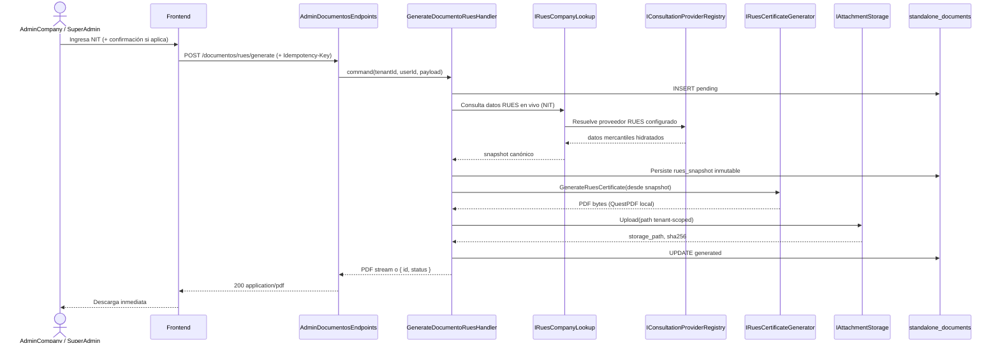
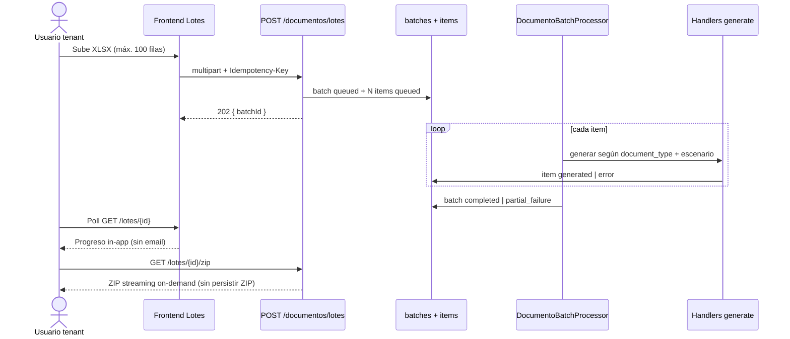

# Plan técnico — Generación masiva de documentos standalone (Transferencia de Dominio y Certificado RUES)

> Generado: 2026-09-08 · revisado: 2026-09-08 (decisiones cerradas sesión architecture-agent) ·
> origen: `docs/DOCUMENTACION-generacion-masiva-docs.md` (borrador Feature PO) + brief explore
> (RUES QuestPDF acoplado, transferencia greenfield, S3/RBAC/improntas reutilizables, sin infra batch actual).
>
> **Prerrequisito vigente:** `docs/plantilla-transferencia-dominio.md` (dictamen expert-doc-engine, escenarios A/B/C).
> **ADR:** entregable futuro en estado **Propuesto** (nombre por asignar al redactar; no numerado en este plan).

---

## 0. Resumen ejecutivo

El Feature pide un **módulo admin autónomo** (sin `ProcedureInstance`) para generar **Certificado RUES**
y **Transferencia de Dominio**, con historial tenant-scoped, generación individual y — en una fase posterior —
carga masiva vía XLSX (máx. **100 filas** por lote) con seguimiento in-app y descarga ZIP streaming.

**Diagnóstico:** no es un clon de improntas. Reutiliza el **patrón UX/RBAC** de improntas, pero exige
persistencia en **S3** (no BYTEA), **RLS por tenant**, generador standalone de transferencia (greenfield)
y desacople de generadores hoy acoplados al pipeline FUR.

**RUES standalone (decisión cerrada):** consulta de **datos en vivo** → **snapshot inmutable** → PDF local
vía **QuestPDF** (`IRuesCertificateGenerator`). **No** se usa PDF del proveedor externo ni
`IRuesExternalClient` en este flujo.

**Decisión arquitectónica:** **Opción 1 incremental** — tres releases:

| Release | Alcance | SP acumulado |
|---------|---------|--------------|
| **v1.0** | Shell + RUES individual + historial + RBAC | 13 |
| **v1.1** | Transferencia escenarios A/B/C | +13 |
| **v2.0** | Batch XLSX async + seguimiento in-app + ZIP streaming | +13 |

**8 HUs · 39 SP · 4 PRs principales** (≤800 líneas c/u). Defaults de producto: XLSX, seguimiento in-app
(sin email push), generación solo en tenant propio del JWT.

---

## 1. Estado actual y reutilización

### 1.1 Lo que existe

| Pieza | Ubicación | Reutilizable |
|-------|-----------|--------------|
| Generador RUES QuestPDF | `RuesCertificatePdfGenerator` + `IRuesCertificateGenerator` | **Parcial** — DTO acoplado a trámite (`ProcedureInstanceId`, `ReferenceNumber`) |
| Consulta datos RUES en vivo | `IConsultationProviderRegistry` + núcleo `RuesActorJuridicalLookup` | **Parcial** — `RuesPersonLookupHandler` exige una instancia; extraer una fachada standalone que reutilice el proveedor |
| Compraventa / transferencia | `FurCompraventaDocumentGenerator` | **Parcial** — solo vía `FurDocumentData`; tipo catálogo `transferencia_dominio` sin generador standalone |
| Plantilla normativa transferencia | `docs/plantilla-transferencia-dominio.md` | **Sí** — prerrequisito actual HU-05/06 |
| Storage S3 | `IAttachmentStorage` → `FileManagerAttachmentStorage` | **Sí** |
| Presigned download | `ADR-0029-preview-presigned-get-inline.md` | **Sí** |
| Módulo improntas (tabs, historial) | `frontend/app/admin/improntas/*`, `AdminImprontasEndpoints` | **Patrón UX/API** — no copiar BYTEA ni SuperAdmin-only |
| RBAC tenant | `AdminCompanyPolicy` + `CompanyOwnTenantFilter` | **Sí** |
| Outbox / BackgroundService | `IdentityValidationOutboxProcessor`, email dispatch | **Patrón v2** — no batch documental hoy |

### 1.2 Lo que no existe

- Módulo `/admin/documentos` ni permisos `documentos.*`
- Tablas `admin.standalone_documents` / batches / items
- Generador standalone de transferencia (greenfield; plantilla normativa ya disponible)
- Parser XLSX, jobs de lote, ZIP streaming de lote
- Infra de notificación de batch (default acordado: **solo in-app**)

### 1.3 ADRs y artefactos relacionados (solo nombre verificado)

| Artefacto | Implicación standalone |
|-----------|------------------------|
| `ADR-0037-snapshot-rues-congelado-por-tramite.md` | Snapshot por trámite — standalone replica el **patrón** con `rues_snapshot` propio inmutable al generar |
| `ADR-0035-compraventa-autogenerada-siempre-y-sin-membrete.md` | Sellos de identidad en trámite — standalone define reglas propias (sin pipeline identidad) |
| `ADR-0051-traspaso-unilateral-capacidades-declaradas.md` | Capacidades unilateral — referencia técnica escenario **B** (no extender exenciones FUR al PDF) |
| `ADR-0029-preview-presigned-get-inline.md` | Redescarga vía presigned URL |
| `ADR-0023-catalogo-global-roles.md` | Roles SuperAdmin / AdminCompany |
| `ADR-0042-documentos-personalizados-por-compania.md` | NA en v1 salvo plantilla personalizada por compañía (futuro) |
| `docs/plantilla-transferencia-dominio.md` | Campos, firmas y escenarios A/B/C — fuente normativa de HU transferencia |

---

## 2. Alternativas evaluadas y decisión

### Opción 1 — Improntas++ incremental *(elegida)*

Entrega valor por fases: individual + historial primero; transferencia con plantilla vigente; batch al final.

**Pros:** menor riesgo; reutiliza patrones UX/RBAC/S3/improntas; S3 desde v1; no bloquea por infra batch.  
**Contras:** CF masivo no en primer release; refactor generadores igualmente necesario.  
**Esfuerzo:** M → L en 3 incrementos. **Riesgo:** expectativa PO de «masiva» en v1.

### Opción 2 — Job-first (batch ciudadano de primera clase)

Diseña jobs/items antes que formularios; individual = job de 1 fila.

**Pros:** CF-10…13 nativos; estados unificados.  
**Contras:** time-to-market alto; transferencia greenfield bloquea todo el pipeline.  
**Esfuerzo:** L–XL. **Riesgo:** jobs colgados, ZIP en memoria.

### Opción 3 — Solo RUES standalone; transferencia upload manual

**Pros:** entrega rápida mitad del Feature.  
**Contras:** incumple objetivo de transferencia autogenerada.  
**Descartada** salvo recorte explícito del PO.

### Decisión

**Opción 1** con split v1.0 / v1.1 / v2.0 documentado en HUs y criterios de finalización por release.

---

## 3. Arquitectura

### 3.1 Diagrama de componentes

```mermaid
flowchart TB
  subgraph FE["Frontend · /admin/documentos"]
    Tabs[Tabs: RUES | Transferencia | Lotes | Historial]
    Forms[Formularios + 4 estados UI]
    Hist[Historial filtrable]
    BatchUI[Upload XLSX + seguimiento v2]
  end

  subgraph API["core-api · Flit.Admin"]
    EP["/api/v1/admin/documentos/*"]
    HRues[GenerateDocumentoRuesHandler]
    HTd[GenerateDocumentoTransferenciaHandler]
    HList[ListDocumentosHandler]
    HDl[GetDocumentoDownloadHandler]
    HBatch[CreateBatchHandler v2]
    HBatchGet[GetBatchStatusHandler v2]
  end

  subgraph Gen["Generadores desacoplados"]
    RuesLookup[IRuesCompanyLookup · fachada standalone nueva]
    Registry[IConsultationProviderRegistry · proveedor RUES]
    RuesQ[IRuesCertificateGenerator · QuestPDF]
    TdGen[IStandaloneTransferGenerator · nuevo]
  end

  subgraph Infra["Infraestructura"]
    S3[IAttachmentStorage → S3]
    DB[(admin.standalone_documents\n+ batches + items v2)]
    Proc[DocumentoBatchProcessor · v2]
  end

  Tabs --> EP
  Forms --> HRues & HTd
  Hist --> HList
  BatchUI --> HBatch & HBatchGet
  HRues --> RuesLookup
  RuesLookup --> Registry
  HRues --> RuesQ
  HTd --> TdGen
  HRues & HTd --> S3 & DB
  HList & HDl --> DB & S3
  HBatch --> Proc
  Proc --> HRues & HTd
```

### 3.2 Sequence — generación individual RUES



### 3.3 Sequence — batch v2 (referencia)



---

## 4. Contratos API conceptuales

Base: **`/api/v1/admin/documentos`**. Autorización: `AdminCompanyPolicy` + `CompanyOwnTenantFilter`.
SuperAdmin: lectura metadata global; generación y descarga de contenido **solo tenant del JWT**.

### 4.1 Individual

| Método | Ruta | Descripción | Release |
|--------|------|-------------|---------|
| `POST` | `/rues/generate` | Genera certificado RUES; body = NIT (+ campos mínimos); respuesta PDF o `{ id, status }` | v1.0 |
| `POST` | `/transferencia/generate` | Genera transferencia; body incluye `escenario`: `A` \| `B` \| `C` | v1.1 |
| `GET` | `` | Listado paginado historial (`documentType`, `status`, `userId`, fechas, `page`) | v1.0 |
| `GET` | `/{id}` | Detalle metadata (sin bytes PDF) | v1.0 |
| `GET` | `/{id}/download` | Presigned URL TTL ~10 min; **audita** `downloaded_at` en la misma operación | v1.0 |

**Headers comunes:** `Idempotency-Key` (opcional v1, recomendado batch).

**Errores normalizados:** `validation_failed` (422), `provider_unavailable` (502), `forbidden_tenant` (403), `not_found` (404).

### 4.2 Batch (v2)

| Método | Ruta | Descripción |
|--------|------|-------------|
| `POST` | `/lotes` | `multipart/form-data`: XLSX (máx. **100 filas**); 202 `{ batchId, status: queued }` |
| `GET` | `/lotes/{batchId}` | Estado agregado + contadores (`total`, `generated`, `error`, `pending`) |
| `GET` | `/lotes/{batchId}/items` | Detalle paginado por fila |
| `GET` | `/lotes/{batchId}/zip` | ZIP **streaming on-demand** desde PDFs en S3; no se persiste archivo ZIP |

### 4.3 OpenAPI

Actualizar `contracts/openapi/core-api.v1.yaml` en cada HU que toque endpoints (gate code-review).

---

## 5. Modelo de datos conceptual

**Schema:** `admin`. **RLS:** `ENABLE ROW LEVEL SECURITY` + policy `tenant_id = current_setting('app.current_tenant_id')`.
SuperAdmin cross-tenant: **solo SELECT de columnas metadata** vía rol bypass o vista `standalone_documents_audit`
sin join a paths S3 ajenos.

**FKs:** `tenant_id` → `identity.tenants(id)`; `flit_user_id` → `identity.users(id)` *(verificar nombres exactos
de tablas/columnas con database-agent antes de migración)*.

### 5.1 Entidades

```
standalone_documents (1) ←── (N) standalone_document_batch_items [v2]
standalone_document_batches (1) ←── (N) standalone_document_batch_items [v2]
```

### 5.2 Pseudo-DDL conciso

```sql
-- v1.0
CREATE TABLE admin.standalone_documents (
  id              UUID PRIMARY KEY,
  tenant_id       UUID NOT NULL,  -- FK → identity.tenants(id) [por verificar]
  flit_user_id    UUID NOT NULL,  -- FK → identity.users(id) [por verificar]
  document_type   TEXT NOT NULL CHECK (document_type IN ('certificado_rues','transferencia_dominio')),
  escenario       TEXT NULL CHECK (escenario IS NULL OR escenario IN ('A','B','C')),
  status          TEXT NOT NULL CHECK (status IN ('pending','processing','generated','error')),
  error_code      TEXT NULL,
  storage_path    TEXT NULL,
  sha256          CHAR(64) NULL,
  size_bytes      BIGINT NULL,
  filename        TEXT NULL,
  idempotency_key TEXT NULL,
  input_summary   JSONB NOT NULL,
  rues_snapshot   JSONB NULL,         -- inmutable post-generación; fuente del QuestPDF
  downloaded_at   TIMESTAMPTZ NULL,     -- seteado en GET /download
  created_at      TIMESTAMPTZ NOT NULL DEFAULT now()
);
CREATE INDEX ix_standalone_documents_tenant_created
  ON admin.standalone_documents (tenant_id, created_at DESC);
CREATE UNIQUE INDEX uq_standalone_documents_tenant_idempotency
  ON admin.standalone_documents (tenant_id, idempotency_key)
  WHERE idempotency_key IS NOT NULL;
-- RLS + policy tenant; NO pdf BYTEA

-- v2.0
CREATE TABLE admin.standalone_document_batches (
  id              UUID PRIMARY KEY,
  tenant_id       UUID NOT NULL,
  flit_user_id    UUID NOT NULL,
  status          TEXT NOT NULL CHECK (status IN ('queued','processing','completed','partial_failure','failed')),
  source_filename TEXT NOT NULL,
  source_storage_path TEXT NOT NULL,
  source_sha256   CHAR(64) NOT NULL,
  total_items     INT NOT NULL DEFAULT 0 CHECK (total_items <= 100),
  generated_count INT NOT NULL DEFAULT 0,
  error_count     INT NOT NULL DEFAULT 0,
  created_at      TIMESTAMPTZ NOT NULL DEFAULT now(),
  completed_at    TIMESTAMPTZ NULL
);

CREATE TABLE admin.standalone_document_batch_items (
  id                     UUID PRIMARY KEY,
  batch_id               UUID NOT NULL REFERENCES admin.standalone_document_batches(id),
  tenant_id              UUID NOT NULL,
  row_number             INT NOT NULL,
  document_type          TEXT NOT NULL,
  escenario              TEXT NULL,
  status                 TEXT NOT NULL,
  standalone_document_id UUID NULL REFERENCES admin.standalone_documents(id),
  error_code             TEXT NULL,
  validation_errors      JSONB NOT NULL DEFAULT '[]',
  UNIQUE (batch_id, row_number)
);
```

**Reglas:**

- PDF **nunca** en BYTEA (contraste adversarial con `impronta_generations`).
- `rues_snapshot` se escribe una vez al pasar a `generated`; updates posteriores prohibidos por trigger o capa dominio.
- SuperAdmin list global: repositorio sin filtro tenant **solo** sobre metadata; endpoint download valida `tenant_id == JWT tenant`.
- **Límite batch:** máximo **100 filas** por XLSX (validación API + CHECK en `total_items`).
- El XLSX fuente permanece cifrado en S3 durante la retención del lote; los ítems no duplican la fila cruda
  en JSONB. Para reintentar, el worker vuelve a leer y validar la fila indicada por `row_number`.

---

## 6. Taxonomía transferencia (escenarios normativos)

> **Corrección explícita:** A/B/C son **escenarios legales**, no tipos de persona (PN/PJ) ni copropiedad.
> Fuente canónica: `docs/plantilla-transferencia-dominio.md` §3–4.

| Código | Nombre | Referencia | Notas diseño |
|--------|--------|------------|--------------|
| **A** | Traspaso ordinario | Art. 5.3.2.1 | Transferente + adquirente; firmas de ambas partes en el documento |
| **B** | Unilateral financiera → locatario | Art. 5.3.2.2 | La **entidad financiera** transfiere unilateralmente al locatario. Las exenciones normativas de firma del art. 5.3.2.2 aplican al **FUR**, no se «extienden» al PDF: el documento unilateral **no incluye firma del locatario por diseño** (solo firma la entidad financiera; locatario en cláusula declarativa) |
| **C** | Entidad financiera → tercero (sin exenciones) | Art. 5.3.2.1 sin 5.3.2.2 | Financiera vende a tercero que **no** es locatario; reglas ordinarias: RTM, QR/improntas, paz y salvo, firmas de **financiera + tercero adquirente** |

PN/PJ/copropiedad son **dimensiones transversales** del formulario (partes), no sustitutos de A/B/C.

---

## 7. Seguridad, PII y cumplimiento

- **Aislamiento tenant:** RLS + `WHERE tenant_id` en repositorio (defensa en profundidad; RLS no enforced globalmente hoy).
- **SuperAdmin:** consulta metadata cross-tenant; **no** presigned de PDF ajeno; generación atada al tenant del token.
- **PII en listados:** `input_summary` sin direcciones completas ni emails; detalle acotado por permiso.
- **Presigned URLs:** no loguear URL completa (`ADR-0029-preview-presigned-get-inline.md`); TTL corto; ownership check previo.
- **Auditoría descarga:** `downloaded_at` se actualiza dentro de `GET /{id}/download` (primera descarga o cada redescarga — definir en implementación; sin endpoint POST separado).
- **Snapshots RUES:** datos mercantiles; retención alineada a política tenant; Ley 1581 — sin export masivo sin auditoría.
- **XLSX batch:** máx. 100 filas; límite tamaño archivo; validación fila a fila.

---

## 8. Flujos funcionales

### 8.1 Individual (v1.0 RUES · v1.1 Transferencia)

1. Usuario elige tab → completa formulario → `POST .../generate`.
2. **RUES:** `pending` → fachada standalone sobre el registro/proveedor RUES → snapshot inmutable → QuestPDF → S3 → `generated`.
3. **Transferencia:** datos según `docs/plantilla-transferencia-dominio.md` + `escenario` → QuestPDF → S3 → `generated`.
4. Respuesta: PDF inline **o** redirect a historial con descarga.
5. Re-descarga: `GET /{id}/download` (presigned + auditoría `downloaded_at`).

**Idempotencia:** `(tenant_id, idempotency_key)` devuelve registro existente si `generated`.

### 8.2 Batch (v2.0)

1. Upload XLSX (≤100 filas) con columnas: `document_type`, `escenario` (si transferencia), campos por tipo.
2. API valida esquema → crea batch + items `queued` → 202.
3. `DocumentoBatchProcessor` (BackgroundService) procesa con concurrencia limitada.
4. UI polling in-app en tab **Lotes** (sin email; CF «notifica» resuelto por default producto).
5. ZIP: `GET /lotes/{id}/zip` arma stream on-demand desde PDFs individuales en S3; **no** persiste ZIP.

---

## 9. UX / UI

### 9.1 Patrón

- **AppShell** admin existente; módulo hermano de improntas (`/admin/documentos`).
- **Tabs:** Generar RUES · Generar Transferencia · Lotes (v2) · Historial — barra local tipo `ImprontasTabs`.
- **4 estados obligatorios:** vacío, cargando, error, lleno (`UiStateBoundary` / `flit-design-guardian`).
- **WCAG 2.1 AA:** labels, focus visible, mensajes de error asociados a campos, contraste tokens FLIT.

### 9.2 Pantallas

| Tab | v1.0 | v1.1 | v2.0 |
|-----|------|------|------|
| RUES | Form + descarga | — | — |
| Transferencia | Placeholder / disabled | Form escenario A/B/C | — |
| Historial | Tabla filtrable + redescarga | + columna escenario | + link a lote |
| Lotes | — | — | Upload + progreso + ZIP |

---

## 10. Historias de usuario, SP y dependencias

Story Points: Fibonacci (1, 2, 3, 5, 8).

| HU | Título | SP | Release | Dependencias |
|----|--------|----|---------|--------------|
| **HU-01** | Shell módulo documentos (nav, tabs, permisos, 4 estados) | 3 | v1.0 | — |
| **HU-02** | Backend `standalone_documents` + POST RUES (live + snapshot + QuestPDF) + S3 | 5 | v1.0 | HU-01 |
| **HU-03** | Historial tenant-scoped, filtros y redescarga presigned | 3 | v1.0 | HU-02 |
| **HU-04** | RBAC AdminCompany + SuperAdmin metadata global | 2 | v1.0 | HU-02 |
| **HU-05** | Transferencia escenario **A** (art. 5.3.2.1) | 5 | v1.1 | HU-02, `plantilla-transferencia-dominio.md` |
| **HU-06** | Transferencia escenarios **B** y **C** (art. 5.3.2.2 + tercero sin exenciones) | 8 | v1.1 | HU-05 |
| **HU-07** | Batch XLSX async (batches/items + processor, máx. 100 filas) | 8 | v2.0 | HU-02, HU-05/06 para mixto |
| **HU-08** | Seguimiento in-app lotes + descarga ZIP streaming | 5 | v2.0 | HU-07 |

**Total: 39 SP.**

**Cadena crítica:** HU-01 → HU-02 → HU-03/HU-04 → HU-05 → HU-06 → HU-07 → HU-08.

**PRs sugeridos:**

1. PR-1 (v1.0): HU-01 + HU-02 + HU-04 — backend core + shell + RUES.
2. PR-2 (v1.0): HU-03 — historial FE/BE.
3. PR-3 (v1.1): HU-05 + HU-06 — transferencia.
4. PR-4 (v2.0): HU-07 + HU-08 — batch.

---

## 11. Lista de archivos por incremento

### v1.0 — RUES + historial + RBAC

**Crear (backend)**

```
services/core-api/src/Flit.Admin.Domain/Documentos/StandaloneDocument.cs
services/core-api/src/Flit.Admin.Domain/Documentos/IStandaloneDocumentRepository.cs
services/core-api/src/Flit.Admin.Domain/Documentos/StandaloneDocumentFilter.cs
services/core-api/src/Flit.Admin.Application/Documentos/GenerateRues/*
services/core-api/src/Flit.Admin.Application/Documentos/GenerateRues/IRuesCompanyLookup.cs
services/core-api/src/Flit.Admin.Application/Documentos/List/*
services/core-api/src/Flit.Admin.Application/Documentos/Download/*
services/core-api/src/Flit.Infrastructure/Persistence/Entities/Admin/StandaloneDocumentEntity.cs
services/core-api/src/Flit.Infrastructure/Persistence/Configurations/Admin/StandaloneDocumentEntityConfiguration.cs
services/core-api/src/Flit.Infrastructure/Persistence/Repositories/StandaloneDocumentRepository.cs
services/core-api/src/Flit.Infrastructure/Documents/Standalone/StandaloneRuesDataMapper.cs
services/core-api/src/Flit.Infrastructure/Consultations/StandaloneRuesCompanyLookup.cs
services/core-api/src/Flit.Api/Endpoints/AdminDocumentosEndpoints.cs
services/core-api/tests/Flit.Admin.Tests/Documentos/*
```

**Modificar (backend)**

```
services/core-api/src/Flit.Tramites.Application/Documents/IFurDocumentGenerator.cs  -- RuesCertificateData standalone-friendly
services/core-api/src/Flit.Infrastructure/Documents/RuesCertificatePdfGenerator.cs
services/core-api/src/Flit.Admin.Application/DependencyInjection.cs
services/core-api/src/Flit.Api/Program.cs
services/core-api/src/Flit.Infrastructure/Security/DevelopmentAuthSeeder.cs
contracts/openapi/core-api.v1.yaml
```

**Crear (frontend)**

```
frontend/app/admin/documentos/layout.tsx
frontend/app/admin/documentos/page.tsx
frontend/app/admin/documentos/historial/page.tsx
frontend/components/admin/documentos/documentos-nav.ts
frontend/components/admin/documentos/DocumentosTabs.tsx
frontend/components/admin/documentos/RuesFormPanel.tsx
frontend/components/admin/documentos/DocumentosHistorialSection.tsx
frontend/components/admin/documentos/DocumentosHistorialTable.tsx
frontend/lib/api/admin-documentos.ts
frontend/lib/api/types-documentos.ts
frontend/components/admin/documentos/__tests__/*
```

### v1.1 — Transferencia A/B/C

**Crear**

```
services/core-api/src/Flit.Admin.Application/Documentos/GenerateTransferencia/*
services/core-api/src/Flit.Infrastructure/Documents/Standalone/StandaloneTransferDocumentGenerator.cs
services/core-api/src/Flit.Infrastructure/Documents/Standalone/TransferenciaEscenarioA.cs
services/core-api/src/Flit.Infrastructure/Documents/Standalone/TransferenciaEscenarioB.cs
services/core-api/src/Flit.Infrastructure/Documents/Standalone/TransferenciaEscenarioC.cs
frontend/components/admin/documentos/TransferenciaFormPanel.tsx
frontend/components/admin/documentos/__tests__/TransferenciaFormPanel.test.tsx
```

**Modificar**

```
services/core-api/src/Flit.Infrastructure/Documents/Fur/FurCompraventaDocumentGenerator.cs  -- extraer primitivas compartidas
services/core-api/src/Flit.Api/Endpoints/AdminDocumentosEndpoints.cs
contracts/openapi/core-api.v1.yaml
frontend/app/admin/documentos/page.tsx  -- segunda tab activa
```

### v2.0 — Batch + ZIP streaming

**Crear**

```
services/core-api/src/Flit.Admin.Domain/Documentos/StandaloneDocumentBatch*.cs
services/core-api/src/Flit.Admin.Application/Documentos/Batches/*
services/core-api/src/Flit.Infrastructure/Messaging/DocumentoBatchProcessor.cs
services/core-api/src/Flit.Infrastructure/Documentos/StandaloneDocumentXlsxParser.cs
services/core-api/src/Flit.Infrastructure/Documentos/StandaloneDocumentZipStreamer.cs
frontend/app/admin/documentos/lotes/page.tsx
frontend/components/admin/documentos/BatchUploadPanel.tsx
frontend/components/admin/documentos/BatchProgressPanel.tsx
```

### Entregable futuro (no en scope implementación)

```
services/core-api/docs/adr/ADR-*-standalone-document-generation.md  -- estado Propuesto; numeración al redactar
```

---

## 12. Estrategia de pruebas y gates

### 12.1 Por nivel

| Nivel | Alcance | Responsable |
|-------|---------|-------------|
| **Unit** | Handlers, mapper RUES, idempotencia, parser XLSX (100 filas), generadores por escenario, ZIP streamer | dev-tester (encadenado HU) |
| **Integration** | Repositorio + RLS, upload S3 fake, processor batch | backend tests |
| **OpenAPI** | Contrato `/admin/documentos/*` vs implementación | code-review |
| **API** | Auth 401/403, tenant isolation, presigned ownership, `downloaded_at` en GET download | Admin.Tests |
| **Component** | Formularios, tabs, 4 estados, filtros historial | Jest + Testing Library |
| **E2E** | Flujo feliz RUES → historial → redescarga; batch mixto v2 | qa-agent + Playwright |

### 12.2 Regresión obligatoria

- **FUR / RUES trámite:** `FurHandlerTests`, `RuesPersonLookupHandlerTests` — refactor no debe alterar expediente ni consulta live del asistente.
- **Tenant isolation:** AdminCompany no lista/descarga otro tenant; SuperAdmin no descarga PDF ajeno.
- **Jobs v2:** items atascados, `partial_failure`, rechazo XLSX >100 filas, ZIP streaming sin persistencia.

### 12.3 Gates FLIT

- DoR: `docs/plantilla-transferencia-dominio.md` vigente antes de HU-05/06 Active.
- PR ≤800 líneas; target `develop`; reviewer humano; build verde.
- Evidencias unitarias en ADO al cerrar cada HU (flujo estándar FLIT).

---

## 13. Riesgos y mitigaciones

| Riesgo | Prob. | Impacto | Mitigación |
|--------|-------|---------|------------|
| Transferencia standalone sin equivalencia legal al trámite | M | Alto | Plantilla normativa vigente; disclaimer en PDF |
| Costo RUES live en batch (100 consultas/lote) | M | Alto | Snapshot obligatorio por fila; límite 100 filas; monitoreo costos |
| Scope creep v1 incluye batch | M | Alto | Split releases; PO sign-off criterios §15 |
| Fuga cross-tenant | B | Alto | Tests autorización + RLS + no presigned ajeno |
| Jobs colgados v2 | M | Medio | Timeout processor; reaper; idempotencia items |
| ZIP streaming memoria con lotes grandes | M | Medio | Stream por archivo; límite 100 PDFs |

---

## 14. Decisiones cerradas

| Tema | Decisión |
|------|----------|
| **Fuente RUES standalone** | Consulta datos **en vivo** → snapshot inmutable → **QuestPDF local**. Sin PDF proveedor / sin `IRuesExternalClient` en este módulo |
| **Límite batch** | Máximo **100 filas** por XLSX |
| **Auditoría descarga** | Dentro de `GET /{id}/download`; sin `POST /marcar-descargado` |
| **ZIP lote** | Streaming on-demand; **no** `zip_storage_path` |
| **Plantilla transferencia** | `docs/plantilla-transferencia-dominio.md` — prerrequisito **actual** |

## 15. Decisiones abiertas (no bloqueantes para v1.0)

1. **Respuesta generate:** ¿siempre PDF inline o `{ id }` + descarga desde historial?
2. **SuperAdmin list:** ¿filtro opcional `tenantId` en query o vista agregada sin filtro?
3. **Concurrencia processor batch:** paralelismo máximo (escalar a LT).
4. **Plantillas por compañía:** ¿aplica a transferencia standalone en v2? (ver `ADR-0042-documentos-personalizados-por-compania.md`)

---

## 16. Criterios de finalización

### v1.0 — Done

- [ ] Módulo `/admin/documentos` accesible con permiso `documentos.read` / `documentos.generate`.
- [ ] RUES individual: consulta live → snapshot → QuestPDF → S3 → historial tenant-scoped.
- [ ] Redescarga vía presigned; `downloaded_at` auditado en GET download; estados `generated` / `error` visibles.
- [ ] AdminCompany aislado por tenant; SuperAdmin ve metadata global sin descargar PDF ajeno.
- [ ] Tests unitarios + API autorización verdes; regresión FUR/RUES trámite verde.
- [ ] OpenAPI actualizado.

### v1.1 — Done

- [ ] Escenarios A, B, C generan PDF distinto según `escenario` y `plantilla-transferencia-dominio.md`.
- [ ] Escenario B: solo firma entidad financiera; locatario sin firma en documento (por diseño normativo).
- [ ] Tests por escenario + componente formulario transferencia.

### v2.0 — Done

- [ ] XLSX ≤100 filas crea batch; processor completa con seguimiento in-app.
- [ ] ZIP streaming descargable; `partial_failure` manejado en UI; sin ZIP persistido.
- [ ] E2E batch feliz + regresión tenant isolation jobs.

### Feature completo (PO)

Todos los criterios de `docs/DOCUMENTACION-generacion-masiva-docs.md` cubiertos en v1.0+v1.1+v2.0, con default in-app (sin email) documentado como desviación explícita del CF «notifica».

---

## 17. Notas operativas por agente

| Agente | Acción |
|--------|--------|
| **expert-doc-engine** | Custodia `plantilla-transferencia-dominio.md`; cambios normativos en el mismo PR |
| **database-agent** | Migración tablas §5.2, FKs `identity.*`, RLS, índice parcial idempotency, trigger snapshot inmutable |
| **backend-agent** | Handlers, endpoints, desacople generadores, processor + ZIP streamer v2 |
| **frontend-agent** | UX improntas-like, WCAG, tabs, estados |
| **qa-agent** | TCs Gherkin por HU; E2E v2; regresión trámite |
| **security-agent** | Tenant isolation audit; PII en JSONB |
| **LT** | Aprobar ADR standalone Propuesto cuando se redacte (sin numeración fija en este plan) |

---

*Documento de diseño — no implica activación de HU ni merge.*
