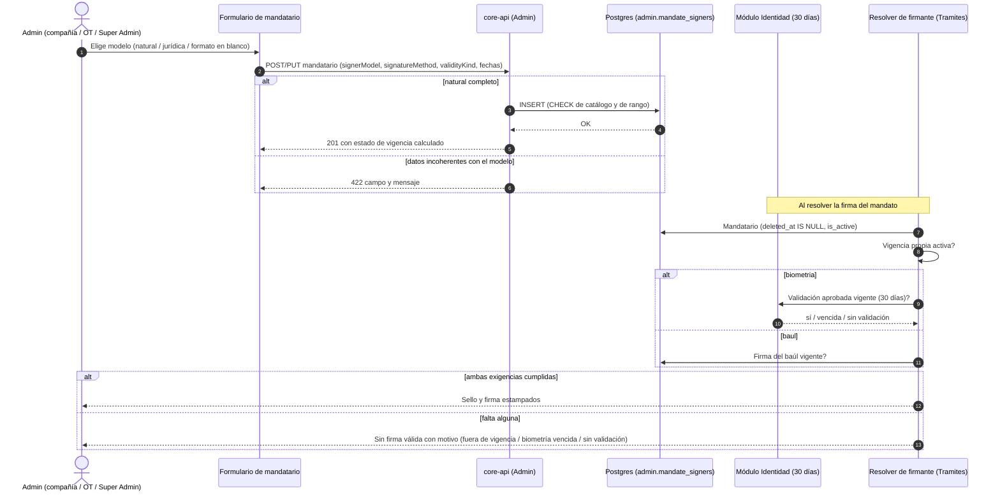

# ADR-0061: Modelo del mandatario, forma de firma, vigencia propia, origen de la configuración y baja lógica

**Fecha**: 2026-09-30
**Status**: Propuesto
**Deciders**: Líder Técnico FLIT (aceptación exclusiva humana, regla FLIT 15) · Product Leader (decisiones ya cerradas, ver Contexto) · Architecture Agent (autor)
**Tags**: arquitectura, backend, modulo-admin-ot, modulo-companias, modulo-tramites, mandatarios, feature-13114, epica-13090
**HU origen**: F2-HU1 #13127 (Feature #13114, Épica #13090, proyecto ADO FLIT - EVOLUTION)
**Supersedes**: ninguno. No deroga ningún ADR Aceptado (ver «Impacto sobre ADR vigentes»: solo añade atributos y precisa una precedencia que ya estaba cubierta por un ADR Propuesto).
**Enmienda**: [ADR-0050] §5 (precedencia baúl > identidad, únicamente para mandatarios) · [ADR-0023] §Decisión 3 (terminología «inactivar = soft-delete»)
**Insumo de**: F2-HU2 #13128 (esquema, DDL 122), F2-HU3 #13129, F2-HU4 #13130, F2-HU5 #13131, F2-HU6/7 #13132-#13133, ADR de prelación de F4 (#13116) y F3/F7.

## Contexto

Hoy un mandatario (`admin.mandate_signers`, [ADR-0023]/[ADR-0036]) es «nombre + documento + firma del baúl o identidad». No declara **qué tipo de mandatario es**, **con qué forma firma**, **hasta cuándo aplica** ni **quién lo configuró**, y «eliminar» no existe (solo `is_active`). Consecuencias: la firma física se acepta por organismo como exención (`mandate_signer_transit_offices.signs_physically`), la vigencia efectiva solo la da la biometría de 30 días, y la prelación OT → compañía → default no puede distinguir quién configuró qué.

Decisiones del PO ya cerradas (rondas 1 y 2, 29 y 30-sep-2026), que este ADR **no reabre**:

- **P1** Modelo del mandatario (se elige al crear la persona): Persona natural, Persona jurídica, Formato en blanco. Es **distinto** del tipo de mandato compañía×OT (`assignment_mode`: signer, institutional, open; rotulados Persona natural, Persona jurídica, Mandato abierto desde #13125). Formato en blanco y Mandato abierto **no son lo mismo**.
- **P3** Persona jurídica = entidad (OT, UT) con nombre y NIT; sin firma personal ni biometría.
- **P4** Se retira la firma física; solo baúl o biometría. Migrar antes de bloquear en PDN.
- **P5 y ronda 2 §4** Vigencia propia del mandatario: fija o por rango; «por vencer» a 7 días. **Convive** con la vigencia biométrica de 30 días del módulo de identidad: una persona natural firma solo si se cumplen **ambas**; la épica no modifica esa regla. *(Enmendado el 01-oct: al mandatario ya no se le exige la ventana de 30 días, solo una aprobación; ver «Enmienda del PO».)*
- **P2** Prelación OT → compañía → [asociado de otra compañía, F7] → default del OT → bloqueo.
- **P8** Eliminar oculta sin borrar historial; los trámites aprobados conservan quién firmó.
- **Ronda 2 §3** Formato en blanco: el sistema solo entrega el PDF sin firma; la firma es presencial, sin flujo digital.

Estado de F1 ya implementado en esta rama: el correo deja de contar como medio de firma (#13122, `dff2170e`) y el alta del OT resuelve en servidor baúl o biometría aprobada (#13123, `edffcb89`).

## Decisión

**Se modelan los cuatro atributos como columnas explícitas y con CHECK sobre las tablas existentes, sin tablas nuevas: el modelo, la forma de firma, la vigencia y la baja lógica en `admin.mandate_signers`; el origen (`configured_by_scope`) en las tablas que guardan la configuración.** Persona jurídica se guarda como **fila de mandatario con NIT** (no reutiliza la familia `individuo/organismo_transito`), y Formato en blanco como fila de mandatario sin firma ni vigencia.

### Catálogos (valores almacenados)

| Atributo | Columna | Valores | Etiqueta en UI |
|---|---|---|---|
| Modelo del mandatario | `mandate_signers.signer_model` | `natural`, `juridica`, `formato_blanco` | Persona natural, Persona jurídica, Formato en blanco |
| Forma de firma | `mandate_signers.signature_method` | `baul`, `biometria` (nulo permitido en BD) | Baúl de firmas, Validación de identidad |
| Vigencia | `mandate_signers.validity_kind` | `fixed`, `range` | Fija, Rango de fechas |
| Origen | `configured_by_scope` | `organismo`, `compania`, `super_admin` | Organismo de tránsito, Compañía, Super Admin |

Nota de nomenclatura: el texto de #13127 AC1 nombra la vigencia como «fija, rango» y #13128 la persiste como `fixed`/`range`. Este ADR fija **`fixed`/`range` como valor almacenado y de API** y «Fija/Rango de fechas» como etiqueta; ver duda D-1.

### Distinción obligatoria: modelo del mandatario vs tipo de mandato

| | Modelo del mandatario | Tipo de mandato |
|---|---|---|
| Qué describe | Qué es la persona/entidad que firma | Cómo resuelve la compañía×OT el mandato |
| Dónde vive | `admin.mandate_signers.signer_model` | `admin.company_ot_mandate_rules.assignment_mode` y `admin.transit_office_mandate_config.assignment_mode` |
| Valores | natural, juridica, formato_blanco | signer, institutional, open |
| Quién lo fija | Quien crea el mandatario (Admin compañía, Admin OT, Super Admin) | Super Admin (Plataforma) y hub OT |
| No confundir | Formato en blanco: mandatario **seleccionable** que emite el PDF con línea de firma sin diligenciar | Mandato abierto: **no hay mandatario**; bloque con `___`, plantilla genérica ([ADR-0052]) |

Los valores de `assignment_mode` **no cambian** (solo sus rótulos, #13125). La columna `mandatary_family` (`individuo`/`organismo_transito`, HU #11204) tampoco cambia.

### Reglas del modelo (contrato para #13129 y #13130)

| Modelo | `signature_method` | Vigencia | Identidad | Notas |
|---|---|---|---|---|
| `natural` | obligatoria: `baul` (exige `signature_vault_id`) o `biometria` | `fixed` o `range` (con `valid_from` y `valid_to`) | Solo con `biometria`; se exige una validación biométrica **aprobada**, sin renovación (enmienda 01-oct, ver abajo) | Firma válida solo si vigencia propia activa **y** (baúl vigente **o** biometría aprobada) |
| `juridica` | nulo | `fixed`, sin fechas | Nunca se envía ni se asocia | `document_type = NIT`, `full_name` = razón social; el contrato muestra nombre y NIT de la entidad |
| `formato_blanco` | nulo | `fixed`, sin fechas | Nunca | El sistema entrega el PDF sin firma capturada; la firma es presencial |

- Cada modelo distinto de `natural` con `signature_method`, fechas o correo de validación responde **422** (`#13129`).
- **Estado de vigencia** (calculado en servidor, no persistido): `inactivo` (si `is_active = false`, sin importar el rango) > `vencido` (`range` y hoy > `valid_to`) > `por_vencer` (`range` y faltan ≤ 7 días para `valid_to`) > `vigente`. Un rango de un solo día es vigente ese día y vencido al siguiente. Las fechas son `date` y «hoy» se evalúa en America/Bogota.
- **Las dos condiciones son independientes.** `BiometricRules.VigenciaDias` (30) y su cálculo **no se tocan**: siguen rigiendo el trámite. Un mandatario puede tener biometría aprobada y estar fuera de su vigencia propia (sin firma válida, motivo mandatario fuera de vigencia) o estar vigente sin ninguna aprobación (motivo sin validación aprobada).

> **Enmienda del PO, 01-oct (HU #13130b), confirmada por el Líder Técnico humano.** Para el mandatario persona natural que firma con biometría, «identidad vigente» = una validación biométrica **APROBADA**, **sin renovación** mientras su vigencia propia esté activa: la ventana de 30 días **ya no se le exige**. Es el «criterio de trabajo» que el Feature #13114 anotaba y reemplaza lo que pedían AC3 y AC6 de la HU #13130 (que exigían la vigencia biométrica de 30 días). Consecuencias: (1) el motivo `biometria_vencida` desaparece del contrato (quedan `mandatario_fuera_de_vigencia`, `mandatario_inactivo` y `sin_validacion_aprobada`); (2) la aprobación más reciente cuenta aunque una validación posterior esté en curso o rechazada; (3) la resolución del mandatario usa una variante propia (`IdentityVigenciaPorDocumentoResolver.Resolve*Mandatario*`) y el estado `valid` del mandatario no trae fecha de fin; (4) **no cambia** la validación del trámite (`BiometricRules.VigenciaDias`, gate de comprador/vendedor, prevalidación) ni la precedencia baúl/biometría (la forma de firma explícita sigue igual); (5) vigencia propia vencida, inactiva o no vigente sigue mandando antes que la biometría. Este ADR permanece en **Propuesto**.

### Persona jurídica (AC2 de #13127): fila de mandatario con NIT

Se evaluó reutilizar la familia `individuo/organismo_transito` de #11204 para Persona natural/jurídica. **Se descarta** porque:

1. Es un atributo de la **configuración** (por OT y por compañía×OT) que decide la **redacción** del contrato, no de cada mandatario; no distingue a dos mandatarios de un mismo OT.
2. Solo tiene dos valores y no admite `formato_blanco`.
3. Su eje ya se expresa con `assignment_mode` (institutional = Persona jurídica como tipo de mandato); reutilizarla mezclaría los dos conceptos que el PO pidió separar (P1).
4. Los datos institucionales de la configuración (`institutional_mandatary_name/nit`) no son seleccionables en el directorio ni participan en la prelación por origen ni en baja lógica.

Persona jurídica se guarda en `mandate_signers` con `signer_model='juridica'`, `document_type='NIT'`, `document_number` = NIT (reutiliza el caso NIT ya contemplado en [ADR-0050]: a un NIT no se le envía prevalidación) y `full_name` = razón social. Los datos institucionales de la configuración se **conservan** para el tipo de mandato institucional (sin cambio de comportamiento); su convergencia con filas `juridica` queda para F4/F8 (duda D-3).

### Formato en blanco (AC2)

Mantiene el comportamiento actual: mandatario sin firma ni vigencia, contrato con línea de firma sin diligenciar. Sin validación de identidad ni flujo digital de firma. Como `full_name` y `document_number` son `NOT NULL` hoy, ver duda D-2.

### Origen de la configuración

`configured_by_scope` (`organismo` | `compania` | `super_admin`, `NOT NULL`, con CHECK) en:

- `admin.company_ot_mandate_rules` y `admin.transit_office_mandate_config` (alcance de #13128).
- **Ampliación propuesta (requiere confirmación del Líder Técnico y enmienda de #13128):** `admin.mandate_signer_companies` (la asignación mandatario↔compañía). Razón: hoy las reglas guardan una sola fila por `(company_tenant_id, transit_office_id)` (`uq_company_ot_mandate_rules`) con un único `default_mandate_signer_id`; una sola fila no puede representar a la vez «lo configuró el OT» y «lo configuró la compañía», que es justo lo que la prelación OT → compañía y el candado necesitan. La asignación es el hecho que hoy crean por separado el hub OT y el panel de la compañía. Sin esta columna, F4 solo puede resolver «gana el último que escribió».

Backfill: `super_admin` cuando el autor (`created_by`/`updated_by`) resuelve a un Super Admin; `organismo` en los demás casos, incluidos los autores no resolubles. Nunca nulo. El candado (quién puede modificar qué origen) es de F3 y no se decide aquí.

### Baja lógica

- `mandate_signers.deleted_at timestamptz NULL` y `deleted_by uuid NULL`: «Eliminar» oculta de **todas** las listas y selectores y conserva la fila y sus referencias (`procedure_instances.mandate_signer_id`, contrato ya generado, hash). No hay borrado físico ni restauración desde la UI.
- `is_active` **sigue siendo** «inactivar» (reversible, visible como Inactivo, libera compañías según [ADR-0023]). Son dos conceptos distintos: inactivar no es eliminar.
- Índice parcial `WHERE deleted_at IS NULL` para las consultas de listas y selectores.
- Como la baja es lógica, **`ON DELETE SET NULL` de `default_mandate_signer_id` no se dispara**: el resolver y las listas deben filtrar `deleted_at IS NULL` y el handler de eliminación debe limpiar o ignorar los defaults que apunten al mandatario eliminado.

### Retiro de la firma física (AC5)

La firma física es hoy `mandate_signer_transit_offices.signs_physically` (exención por organismo). Se retira en **fases**, sin perder datos:

1. **F2 (#13131):** la firma física deja de ofrecerse y de persistirse en altas y ediciones; las filas con `signs_physically = true` **no se borran** y el resolver mantiene su comportamiento actual (sigue honrándola).
2. **Reporte de migración** (Super Admin, filtrable por organismo, exportable): mandatarios activos que dependen solo de firma física (sin baúl y sin biometría aprobada) con compañía, organismo, forma actual y dato faltante; sin documento ni correo.
3. **Migración operativa:** vincular baúl o aprobar biometría hasta que el reporte quede vacío.
4. **Bloqueo:** el gate de F4 pasa a `block` en PDN **solo después** de completar el paso 3 y con confirmación del Líder Técnico. Antes, DEV/QA en `warn`.
5. **Retiro físico** de la columna `signs_physically`: F8, no antes.

Riesgo operativo: los tres VPS corren con `ASPNETCORE_ENVIRONMENT=Development`, así que «PDN» no se puede distinguir por ese valor; el interruptor de F4 debe ser una configuración explícita por ambiente (patrón de #10970).

## Modelo de datos propuesto (DDL 122, reservado para #13128)

Referencia conceptual; el DDL final lo materializa el `database-agent` en `Ddl/122-HU13128-*.sql` (embebido, idempotente `IF NOT EXISTS`, con Down) y lo valida con `db-schema-validator`.

**`admin.mandate_signers`** (tabla trackeada por EF: requiere snapshot):

| Columna | Tipo | Nulo | Default | Restricción |
|---|---|---|---|---|
| `signer_model` | varchar(20) | NOT NULL | `'natural'` | CHECK IN (`natural`,`juridica`,`formato_blanco`) |
| `signature_method` | varchar(20) | NULL | — | CHECK `IS NULL OR IN ('baul','biometria')` |
| `validity_kind` | varchar(10) | NOT NULL | `'fixed'` | CHECK IN (`fixed`,`range`) |
| `valid_from` | date | NULL | — | |
| `valid_to` | date | NULL | — | |
| `deleted_at` | timestamptz | NULL | — | |
| `deleted_by` | uuid | NULL | — | |

- CHECK de coherencia de fechas (#13128 AC5): `validity_kind <> 'range' OR (valid_from IS NOT NULL AND valid_to IS NOT NULL AND valid_to >= valid_from)`. Recomendado añadir: `validity_kind <> 'fixed' OR (valid_from IS NULL AND valid_to IS NULL)`.
- Recomendado (seguro con el backfill, todos `natural`): `signer_model = 'natural' OR (signature_method IS NULL AND validity_kind = 'fixed' AND valid_from IS NULL AND valid_to IS NULL)`. La obligatoriedad de `signature_method` para `natural` **no** va en BD (los mandatarios legados quedan con nulo); la exige la API (#13129).
- Índice parcial: `ix_mandate_signers_alive (transit_office_id, is_active) WHERE deleted_at IS NULL`.
- Backfill: `signer_model='natural'`, `validity_kind='fixed'`, sin fechas; `signature_method='baul'` si `signature_vault_id IS NOT NULL`, `'biometria'` si `identity_validation_ref IS NOT NULL` (y sin baúl), nulo en los demás. Si tiene ambos, gana `baul`.
- Sin FK nuevas; `deleted_by` sin FK (patrón de auditoría del repo).

**`admin.company_ot_mandate_rules`** y **`admin.transit_office_mandate_config`** (ambas `ExcludeFromMigrations`, DDL embebido): `configured_by_scope varchar(20) NOT NULL DEFAULT 'organismo'` con CHECK IN (`organismo`,`compania`,`super_admin`), tras el backfill descrito.

**`admin.mandate_signer_companies`** (ampliación propuesta): igual columna y CHECK. Backfill por el `created_by` del mandatario (Super Admin → `super_admin`; usuario de tenant OT → `organismo`; de compañía → `compania`; sin resolver → `organismo`).

**Sin RLS nuevo** (no se crean tablas). Sin `DROP`/`ALTER TYPE`. `signs_physically` no se toca.

### Migración EF (obligatorio)

Toda migración EF necesita **`Designer.cs` o los atributos `[DbContext(typeof(FlitDbContext))]` y `[Migration("<id>")]` inline**; sin ellos EF no la descubre y no corre al arrancar (causó `gate_profile does not exist`). Como `mandate_signers` está trackeada, actualizar también `FlitDbContextModelSnapshot.cs`. La migración ejecuta el DDL 122 embebido y se valida en DEV, QA y PDN con `ASPNETCORE_ENVIRONMENT=Development`. En Windows local, `dotnet ef database update` antes de probar.

## Alternativas consideradas

### Opción 1: Columnas explícitas con CHECK en las tablas existentes; Persona jurídica como fila con NIT (elegida)

**Pros:**
- Sin tablas nuevas ni RLS nuevo; cambio aditivo e idempotente sobre tablas que el resolver y los listados ya consultan.
- Los CHECK impiden en BD valores fuera de catálogo y rangos incoherentes, aunque falle la API.
- Un solo lugar (`mandate_signers`) para modelo, firma y vigencia; los listados calculan el estado sin joins.
- Reutiliza el caso NIT ya previsto en ADR-0050 y la baja lógica ya conocida (`is_active` + `deleted_at`).

**Cons:**
- `mandate_signers` gana 7 columnas, varias solo aplicables a `natural`.
- El origen por fila de reglas/config admite un solo origen por `(compañía, OT)`; requiere la ampliación en `mandate_signer_companies` para la prelación.
- La obligatoriedad de `signature_method` para `natural` depende de la API (los legados quedan nulos).

**Esfuerzo:** M
**Riesgos:** backfill del origen con autores no resolubles (se asume `organismo`); mandatarios `natural` legados sin forma de firma hasta migrar.

### Opción 2: Reutilizar la familia `individuo/organismo_transito` y los datos institucionales de la configuración

Ampliar `mandatary_family` con `formato_blanco` y guardar Persona jurídica solo en `institutional_mandatary_*`.

**Pros:**
- Cero columnas en `mandate_signers` para el modelo; reutiliza la HU #11204.
- Persona jurídica ya tiene nombre y NIT en la configuración.

**Cons:**
- Es un atributo de la configuración, no del mandatario: no permite dos mandatarios de modelos distintos en un OT.
- Mezcla el modelo del mandatario con el tipo de mandato, lo que el PO pidió separar (P1).
- Persona jurídica no sería seleccionable ni auditable ni eliminable como mandatario.
- Igual habría que añadir forma de firma, vigencia y baja lógica al mandatario.

**Esfuerzo:** S (aparente) a M (real)
**Riesgos:** ambigüedad semántica permanente entre familia, `assignment_mode` y modelo.

### Opción 3: Tablas satélite normalizadas (vigencias y orígenes por asignación)

`admin.mandate_signer_validities` (1:N, historial de vigencias) y `admin.mandate_scope_assignments` (origen por asignación, reemplaza `mandate_signer_companies` y los defaults).

**Pros:**
- Historial completo de vigencias y varios orígenes simultáneos por `(compañía, OT)` sin colisión.
- Modelo más puro para la prelación de F4 y el candado de F3.

**Cons:**
- Tablas nuevas con RLS, repositorios y migración de datos; toca el resolver, los listados y el generador del mandato.
- Supera el alcance y los SP de F2 (24) y de #13128 (5).
- Sin necesidad hoy: el PO pidió una vigencia vigente por mandatario, no historial.

**Esfuerzo:** L
**Riesgos:** regresión en el resolver y en el mandato ya generado; retrasa F3/F4.

## Tradeoff aceptado

Se elige la Opción 1 porque el PO fijó atributos por mandatario (un modelo, una forma, una vigencia) y la reutilización gana: las tablas y consumidores ya existen y el cambio es aditivo, idempotente y reversible. Se acepta que `mandate_signers` tenga columnas que solo aplican a `natural` y que la exigencia de forma de firma viva en la API, a cambio de no migrar datos ni reescribir el resolver. La Opción 2 se descarta por mezclar dos conceptos que el PO pidió separar; la Opción 3 es sobredimensionada y solo se retoma si el PO pide historial de vigencias o varios orígenes por asignación más allá del alcance actual.

## Impacto sobre ADR vigentes (AC3)

| ADR (estado) | Contradicción o ajuste | Tratamiento |
|---|---|---|
| **ADR-0023** (Propuesto; exclusividad derogada por 0036) | (1) Llama «baja lógica/soft-delete» a **inactivar**; este ADR reserva «baja lógica» para **eliminar** (`deleted_at`) y deja `is_active` como inactivar. (2) Su modelo de datos no tiene modelo, forma de firma, vigencia ni origen. | Ajuste de terminología; columnas aditivas. Sin contradicción de fondo. |
| **ADR-0036** (Aceptado) | (1) Autoriza N mandatarios activos por `(OT, compañía)` (índice de 3 columnas); la P2 del PO dice «solo un mandatario activo por compañía y organismo (regla actual)»: hoy la unicidad real es por `(OT, compañía, mandatario)`, no por par. (2) Su cotejo `user_id == usuario autenticado` y el `NULL` de `user_id` no cambian. (3) Su reuso de ADR-0034 para identidad ya lo reemplaza ADR-0050. (4) Añade atributos a `mandate_signers` y a la configuración sin modificar su decisión. | (1) **No se resuelve aquí**: no se contradice un Aceptado sin ADR con `Supersedes`; se decide en el ADR de prelación de F4 (duda D-4). (2)-(4) Sin conflicto. |
| **ADR-0034** (Aceptado; supersedido por 0050, Propuesto) | Establece «reutilizable 30 días» y una validación admin propia. Este ADR: la vigencia propia **convive** con la biometría; desde la enmienda del 01-oct al mandatario no se le exige la ventana de 30 días (solo una aprobación), y la regla de identidad (`BiometricRules.VigenciaDias`) no se modifica: rige el trámite. La forma `biometria` se resuelve por el módulo Identidad según 0050, no por la tabla admin. | La regla de 30 días se conserva íntegra. Si el Líder Técnico rechaza 0050, `biometria` volvería a leer la tabla admin (duda D-5). |
| **ADR-0050** (Propuesto) | (1) §5 «la precedencia baúl > identidad no cambia»: para mandatarios, `signature_method` es una **elección explícita**; no hay caída de un método al otro. D8 de ADR-0025 sigue vigente para los actores comprador y vendedor. (2) Regla NIT de 0050 coincide con Persona jurídica. (3) Las cuatro etapas de identidad de 0050 (sin validación, en curso, vigente, vencida) son un indicador **distinto** de los cuatro estados de vigencia del mandatario (vigente, por vencer, vencido, inactivo): no se fusionan. (4) «Si nadie prevalida, el correo se corre al radicar» sigue siendo asunto del gate de F4. | Enmienda (1) en el encabezado; (2)-(4) consistentes. |
| **ADR-0052** (Propuesto) | No contradice: `assignment_mode` y su significado quedan igual; solo se documenta la diferencia con el modelo del mandatario (Formato en blanco vs Mandato abierto). | Sin cambio. |
| **ADR-0025** (Aceptado) | D8 (baúl > identidad > manual) aplica al actor del trámite; para el mandatario, la forma la declara el administrador. | Enmienda acotada a mandatarios. |
| **ADR-0033** (Aceptado) | Representante legal por compañía es otro concepto (llave compañía+NIT); no se toca. | Sin cambio. |
| **Retiro de la firma física** | Contradice el mecanismo vigente `signs_physically` (HU #11201, exención por organismo) y su uso en `MandatoFirmaPolicy`, `MandateSignerDirectory` y `FirmaPosteriorCommand`. | Retiro por fases (sección propia); comportamiento sin cambio hasta que F4 active el bloqueo en PDN. |

## Consecuencias

### Lo que se gana
- Un mandatario declara qué es, cómo firma, hasta cuándo aplica y quién lo configuró; el resolver y los listados dejan de inferirlo.
- Las dos vigencias quedan definidas sin tocar la regla de identidad.
- «Eliminar» conserva el historial de trámites y del contrato ya generado.
- Ruta explícita, con reporte, para retirar la firma física sin dejar a nadie sin firma.

### Lo que se pierde
- Mandatarios `natural` legados solo con firma física quedarán sin forma de firma válida en cuanto F4 active el bloqueo; hay que migrarlos antes.
- Más columnas en `mandate_signers`, algunas inaplicables a `juridica` y `formato_blanco`.
- La convergencia entre datos institucionales de la configuración y filas `juridica` queda pendiente.

### Cambios operacionales
- Migración con DDL 122 y Designer.cs (o atributos inline) verificada en los tres ambientes.
- Reporte de migración de firma física ejecutado por el Super Admin antes del bloqueo en PDN, con comunicación previa a los clientes afectados.
- Interruptor block/warn/off de F4 como configuración explícita por ambiente.

## Diagrama de secuencia

## Archivos a crear o modificar (para las HU que consumen este ADR)

Este ADR no toca código. Referencia para el equipo, por HU:

- **Crear (esta HU):** `services/core-api/docs/adr/ADR-0061-modelo-del-mandatario-y-origen.md`.
- **#13128 (database-agent):** `services/core-api/src/Flit.Infrastructure/Persistence/Sql/Ddl/122-HU13128-mandatario-modelo-vigencia-origen.sql` (nuevo) · migración EF nueva con `Designer.cs` o `[DbContext]`/`[Migration]` inline + `FlitDbContextModelSnapshot.cs` · `Persistence/Entities/Admin/MandateSigner.cs`, `MandateSignerCompany.cs`, `CompanyOtMandateRuleEntity.cs`, `TransitOfficeMandateConfigEntity.cs` · `Persistence/Configurations/Admin/MandateSignerConfiguration.cs` (más las tres de reglas, config y asignación) · prueba en `tests/Flit.Integration.Tests`.
- **#13129/#13130/#13131 (backend-agent):** `Flit.Admin.Application/Companies/MandateSigners/*` (`MandateSignerValidation`, `MandateSignerSigningCapability`, Create/Update/List, `CompanyMandateSignerHandlers`) · `Flit.Infrastructure/OtRules/MandateSignerDirectory.cs`, `MandatoFirmaPolicy.cs` · `Persistence/Repositories/DbMandateSignerReader.cs`, `MandateSignerRepository.cs` · `Flit.Api/Endpoints/AdminMandateSignersEndpoints.cs` · `contracts/openapi/core-api.v1.yaml` (campos aditivos).
- **#13132/#13133 (frontend-agent):** `frontend/components/admin/companies/mandate-signers/*`, `frontend/lib/api/admin-mandate-signers.ts`, `frontend/lib/plataforma/mandatario-firma.ts`.

## ADRs relacionados

- [ADR-0023-firmante-mandato-exclusividad-modelo] — modelo base del mandatario (exclusividad derogada por 0036).
- [ADR-0036-mandatarios-multiples-y-mandato-por-ot] — multiplicidad, config por OT, `user_id` (Aceptado).
- [ADR-0034-validacion-identidad-admin-desacoplada] — vigencia de 30 días; sustituido por 0050.
- [ADR-0050-identidad-fuente-unica-y-disparo-unico] — fuente única de identidad (Propuesto; regla NIT).
- [ADR-0052-resolucion-mandato-ot-abierto-y-cliente-generico] — `assignment_mode` y Mandato abierto.
- [ADR-0025-baul-firmas-custodia-y-consumo] — baúl de firmas.
- [ADR-0033-representantes-legales-y-escrituras-por-compania] — concepto distinto (representante legal).
- [ADR-0066-prelacion-del-mandatario-y-gate-de-radicacion] — prelación y gate de F4 (#13116, Propuesto): consume el origen y el modelo definidos aquí y resuelve la duda D-4.

## Notas para agentes

- **Database Agent (#13128)**: DDL 122 (reservado) con `IF NOT EXISTS`, Down que elimina solo lo agregado, CHECK de catálogo y rango, índice parcial `deleted_at IS NULL`, backfill según este ADR; migración EF con `Designer.cs` o atributos inline y snapshot actualizado; validar con `db-schema-validator`. Decidir D-1 y D-2 antes de codificar.
- **Backend Agent**: la API impone que `natural` tenga forma de firma y vigencia completas; `juridica`/`formato_blanco` sin ellas (422); estado de vigencia en servidor con hoy en America/Bogota; listas y selectores filtran `deleted_at IS NULL`; no modificar `BiometricRules.VigenciaDias`; ignorar `signs_physically` en altas pero honrarlo en el resolver hasta F4.
- **Frontend Agent**: campos por modelo; estados con texto y color (accesibilidad); aviso al pasar de `natural` a otro modelo; sin opción de firma física.
- **QA Agent**: matriz modelo × forma × vigencia; borde de un día; biometría vencida con mandatario vigente y al revés; 422 por modelo; eliminado no aparece pero el trámite firmado conserva referencia; reporte de firma física con otro tenant (403).
- **Security Agent**: `document_number` y correo son PII (Ley 1581), fuera de logs, reporte y errores; el reporte de migración es solo Super Admin y no expone datos de otros tenants; `deleted_by` no debe filtrarse a roles sin permiso.
- **Infra Agent**: verificar la migración en DEV, QA y PDN; el interruptor del gate de F4 no puede depender de `ASPNETCORE_ENVIRONMENT`.

## Dudas abiertas para el Líder Técnico

- **D-1** Valores de `validity_kind`: #13127 AC1 dice «fija, rango» y #13128 usa `fixed`/`range`. Este ADR propone `fixed`/`range`; alinear el texto de una de las dos HU.
- **D-2** `formato_blanco` con `full_name` y `document_number` `NOT NULL`: proponer un valor centinela definido por backend (por ejemplo etiqueta «Formato en blanco» y documento `N/A`) o relajar `document_number`; no está en #13128.
- **D-3** Convergencia de los datos institucionales de la configuración con filas `juridica` (F4/F8).
- **D-4** «Un solo mandatario activo por compañía y organismo» (P2) frente a los N de ADR-0036 (Aceptado): interpretarlo como un default por origen o superar 0036 con un ADR de F4 con `Supersedes`.
- **D-5** Aceptación de ADR-0050: si se rechaza, la forma `biometria` volvería a leer la tabla admin.
- **D-6** Mandatario con rango que aún no empieza (`hoy < valid_from`): los 4 estados del PO no lo cubren; se propone que no aplique en la resolución y se muestre como no vigente hasta definir etiqueta con el PO.
- **D-7** Ampliación de origen a `mandate_signer_companies` (sección Origen): requiere enmienda de #13128.
- **D-8** Backfill de `signature_method` con `identity_validation_ref`: tras ADR-0050 ese vínculo ya no se escribe; mandatarios validados solo en el módulo Identidad por documento quedarían con nulo aunque tengan biometría vigente.

## Enmienda del 01-oct-2026 (Feature #13245, HU #13249): validación de identidad exclusiva del mandatario

> Esta enmienda **no cambia el estado**: el ADR sigue en **Propuesto**. Complementa la enmienda de #13130b (vigencia sin renovación) y la del `ADR-0050` (excepción acotada del disparo admin). Decisiones del Líder Técnico del 01-oct-2026.

1. **Validación exclusiva.** Para el mandatario con forma `biometria` solo cuentan validaciones lanzadas **para ese mandatario**: `party_role = 'mandatario'` y referencia a la ficha. Las de comprador, vendedor o prevalidación con el mismo documento **no cuentan**. Esto precisa el criterio de «identidad vigente» de la enmienda de #13130b: es la validación propia **más reciente cuyo documento coincide con el documento actual** del mandatario; si está aprobada, vale sin ventana de 30 días ni fecha de fin. Al lanzar una nueva se cierra (`expirado`) la que estuviera en vuelo.
2. **Disparos.** Se origina al **crear** un mandatario persona natural con `biometria` (compañía y hub OT, mismo flujo que un trámite: enlace de Kyverum por correo, captura y webhook); con **«Reenviar validación»** (compañía y hub OT; ruta nueva `POST …/mandate-signers/{id}/identity-validation/resend` bajo `/api/v1/admin/companies/{tenantId}` y `/api/v1/admin/transit-offices/{transitOfficeId}`; las rutas `identity/*` viejas siguen en 410); al **editar tipo o número de documento** (la validación anterior deja de contar); y al **pasar de baúl a biometría**. **No** se dispara al reactivar. El tenant de la validación es el de la compañía del mandatario (#13121), también cuando lo crea el OT.
3. **Correo obligatorio con biometría**; con baúl, opcional. El correo es el destino del enlace, no un medio de firma (#13122).
4. **Vigencia sin renovación.** La vigencia es la propia del mandatario (fija o rango); no se renueva cada 30 días (#13130b). `BiometricRules.VigenciaDias` sigue rigiendo solo el trámite.
5. **Existentes pierden la firma, sin backfill.** Los mandatarios `natural` con `biometria` sin validación propia aprobada quedan sin firma válida (motivo `sin_validacion_aprobada`, que ahora significa «sin validación propia aprobada»; no se creó un código nuevo) hasta validarse por el flujo nuevo. No se migra ni se reinterpreta lo que hubiera en `identity_validation_ref` ni validaciones de otro rol (cierra la duda D-8 en ese sentido). Se entrega el reporte de afectados (incluye el correo, PII visible solo para Super Admin) y aviso en la ficha. Riesgo de despliegue: correr el reporte y avisar a los afectados antes de PDN.
6. **Baúl sin cambios.** La regla de forma de firma `baul` no cambia.
7. **Esquema (DDL 129, aditivo).** Columna `mandate_signer_id` en `tramites.procedure_instance_biometric_validations` (FK `RESTRICT` a `admin.mandate_signers`); `party_role = 'mandatario'` si y solo si hay `mandate_signer_id` (CHECK); la ficha pasa a ser ancla válida junto a persona y trámite; a lo sumo una validación en vuelo por mandatario, sin bloquear a un comprador con la misma cédula. Se reutiliza el almacén del módulo Identidad, no se crea tabla.
   **Reporte de afectados:** `GET /api/v1/admin/mandate-signers/identity-validation-report` (solo Super Admin, filtrable por organismo, exportable a CSV).
8. **Alternativas descartadas.** (a) Seguir leyendo por documento sin importar el rol: el mandatario aparecería validado por la identidad de otro rol. (b) Backfill desde validaciones de otros roles: reproduce el mismo defecto. (c) Crear una persona en el módulo Identidad por cada mandatario: se relajó en cambio el ancla de la validación (persona, trámite o ficha). (d) Reutilizar `identity/send|resend|link`: son las rutas retiradas del `ADR-0050` (retiro físico en #13159, en espera).

## Estado y aceptación

Este ADR queda en **Propuesto**. Pasa a **Aceptado** solo mediante decisión del Líder Técnico humano (regla FLIT 15); ningún agente puede cambiar el estado.

## Referencias externas

- Ley 1581 de 2012 — protección de datos personales (PII del mandatario).
- Resolución 12379 de 2012 (Art. 5) y Resolución 20233040017145 de 2023 — marco del mandato citado en las plantillas.
