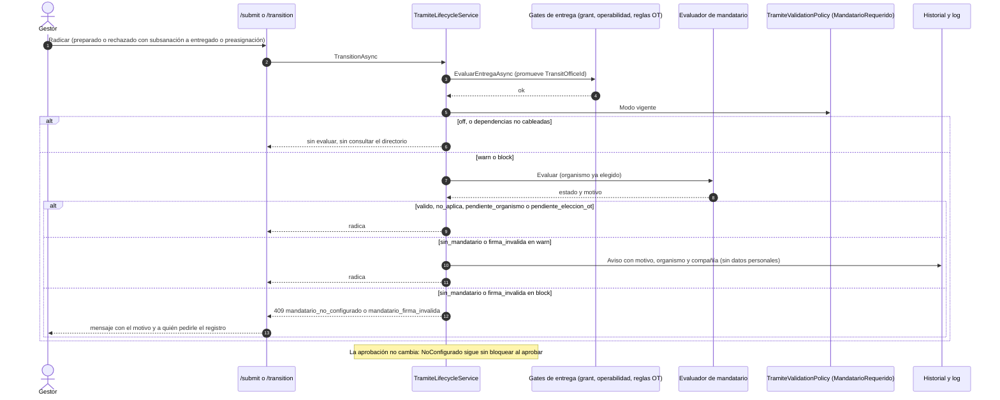

# ADR-0066: Prelación del mandatario (OT → compañía → asociado → default del OT → bloqueo) y gate de radicación por ambiente

**Fecha**: 2026-09-30
**Status**: Propuesto
**Deciders**: Líder Técnico FLIT (aceptación exclusiva humana, regla FLIT 15) · Product Leader (decisiones P2, P4, P5 ya cerradas, ver Contexto) · Architecture Agent (autor)
**Tags**: arquitectura, backend, frontend, modulo-tramites, modulo-admin-ot, mandatarios, feature-13116, epica-13090
**HU origen**: F4-HU1 #13141 (Feature #13116, Épica #13090, proyecto ADO FLIT - EVOLUTION)
**Supersedes**: ninguno (no se sustituye un ADR completo).
**Enmienda parcial de [ADR-0036]** (**Aceptado**): (1) deroga la multiplicidad «N mandatarios activos por (OT, compañía)» y la sustituye por **un solo activo por (OT, compañía, origen)**; (2) el cotejo «firmante = usuario que aprueba» (§D9) deja de ser regla y pasa a **desempate**. La decisión de ADR-0036 sobre `user_id`, config del OT y aplicabilidad del mandato **se conserva**. Esta enmienda requiere que el Líder Técnico humano la acepte; hasta entonces ADR-0036 sigue vigente.
**Enmienda**: [ADR-0052] (el «default del OT» y el modo `open`/`institutional` fijan las exclusiones del gate) · [ADR-0061] (consume origen, vigencia, baja lógica y `MandateSignerFirmaValidez`; cierra sus dudas D-4 y D-2 en lo que toca a F4).
**Relacionado**: [ADR-0023] · [ADR-0025] · [ADR-0042] · [ADR-0050-identidad-fuente-unica-y-disparo-unico] · [ADR-0050-tipo-de-tramite-fuente-unica-de-conformacion]

> Nota de numeración: el repositorio ya tiene **dos** `ADR-0050`, **dos** `ADR-0036` y dos `ADR-0053`/`0059`/`0060`/`0061` entre `services/core-api/docs/adr`, `docs/decisions` y `docs/suite/adr-borradores`. Este ADR toma **0066**, el primer número libre en todas las ramas remotas y carpetas. Donde este texto cita «ADR-0036» se refiere a `ADR-0036-mandatarios-multiples-y-mandato-por-ot` (el Aceptado) y no a `ADR-0036-prevalidacion-natural-tracking-desacoplado-instancia`. Resolver los duplicados es un pendiente del Líder Técnico (duda D-9).

## Contexto

Hoy el firmante del mandato se decide en tres sitios con reglas distintas: la pantalla (`ListMandateSignerOptionsHandler`), el PDF (`GenerarFurHandler`) y la aprobación (`TramiteLifecycleService` y `MandatoApprovalHandler`). Los tres usan `MandateSignerDefaultResolver.Resolve`, que prefiere el default de la compañía sobre el del OT, y `MandateSignerSelector`, que con N candidatos y sin cotejo de usuario pide elegir (409 `mandatario_requerido`, con un texto engañoso cuando hay cero). Nada impide radicar un trámite cuyo mandato no podrá firmarse. Además ADR-0036 permite N mandatarios activos por (OT, compañía), lo que hace ambigua cualquier prelación.

Decisiones del PO ya cerradas (Épica #13090, rondas 1 y 2), que este ADR **no reabre**:

- **P2** Prelación: 1) mandatario que el OT configuró para la compañía, 2) el propio de la compañía, 3) el de otra compañía asociado a ella (lo agrega F7-HU5 #13180), 4) default del OT, 5) bloqueo. **Un solo mandatario activo por compañía y organismo para cada origen.**
- Cada nivel solo cuenta si el mandatario está activo, no eliminado, vigente y con firma válida (baúl vigente o biometría vigente de 30 días). Si no, se pasa al siguiente nivel.
- **P4** Se retira la firma física; las marcas `signs_physically` se siguen honrando hasta el paso a `block`.
- Gate al radicar con modo `block`/`warn`/`off` por ambiente, **configuración explícita** (los tres VPS corren con `ASPNETCORE_ENVIRONMENT=Development`); arranca en `warn` en DEV y QA; `block` en PDN solo tras migrar a quienes dependen de la firma física (reporte #13131) y con confirmación del Líder Técnico.
- **P8** Trámites radicados sin aprobar cuyo mandatario se elimina: se reasignan con la misma prelación (F3 #13137); si no queda nadie, decide el OT al aprobar.

Base: [ADR-0061] (origen `configured_by_scope` en `company_ot_mandate_rules`, `transit_office_mandate_config` y `mandate_signer_companies`; vigencia propia; `MandateSignerFirmaValidez`, commit `b6d23498`; estado `no_vigente`).

## Decisión

**(1) Un resolver único y puro de cinco niveles, con unicidad por origen.** `MandateSignerDefaultResolver` (mismo nombre, lo extiende F7) resuelve `Explícita → OtParaCompania → PropioDeCompania → AsociadoDeOtraCompania (HU #13180) → DefaultDelOt → Ninguno`. El origen del nivel 1 y 2 sale de `mandate_signer_companies.configured_by_scope`. Se impone **un solo vínculo activo por (organismo, compañía, grupo de origen)**, donde el grupo `organismo` agrupa `organismo` y `super_admin`, y el grupo `compania` es `compania`. Esto enmienda ADR-0036.

**(2) El punto de validación es el gate final de radicación** (`TramiteLifecycleService.EvaluarEntregaAsync`, `esRadicacion`), tras los gates de grant, operabilidad y reglas OT; **no** el preflight del paso 1 ni `SubmitGate`/`DynamicGateEvaluator`. Un **evaluador único** en Application decide aplica/no aplica, mandatario, nivel, forma de firma y motivo, y lo reutilizan el gate, el firmante previsto (#13145) y los candidatos del 409.

**(3) Interruptor por configuración explícita**: `TramiteValidations:MandatarioRequerido:Mode` (`block`/`warn`/`off`), con `warn` escrito en `appsettings.json` y `docker-compose.prod.yml`; ausente o inválido resuelve a `Block` en código (fail-safe de #10970). El paso a `block` en PDN es un cambio de variable de entorno, sin despliegue.

## Alternativas consideradas

### D1 — Cómo se modela la prelación y la unicidad

#### Opción 1: Origen en el vínculo + un activo por origen + resolver puro de niveles (elegida)

**Pros:**
- Representa a la vez «lo configuró el OT» y «lo configuró la compañía» para la misma compañía y organismo (dos vínculos de origen distinto), que es lo que pide P2.
- Reutiliza `mandate_signer_companies` y la columna `configured_by_scope` que ya creó F2 (#13128): cero tablas y cero columnas nuevas; solo un índice y una migración de datos.
- Determinista: la pantalla, el PDF y la aprobación devuelven el mismo firmante (un solo método).
- Elimina la causa del 409 «Hay varios mandatarios» para los casos normales.

**Cons:**
- Enmienda un ADR Aceptado (ADR-0036) y exige migrar los casos N>1 existentes.
- Necesita un índice único por expresión (grupo de origen), que EF no modela de forma nativa.
- Hasta que F3 escriba el origen en cada alta, las altas nuevas caen en el default `organismo` (ver Consecuencias).

**Esfuerzo:** M
**Riesgos:** colapso de datos que deje a una compañía sin su mandatario preferido; mitigado con reporte previo, sin borrado y reversible.

#### Opción 2: Mantener N vínculos por par y designar dos defaults en la regla (`ot_default_signer_id` y `company_default_signer_id`)

**Pros:**
- No contradice ADR-0036 ni requiere colapsar datos.
- Mantiene el directorio completo como conjunto de candidatos.

**Cons:**
- Contradice la decisión P2 del PO («un solo activo por compañía y organismo por origen») y el texto de F3-HU3.
- Exige columnas nuevas en `company_ot_mandate_rules` (F2 ya cerró su DDL) y dos defaults que hay que limpiar en cada baja.
- Conserva el conjunto N>1, así que sigue existiendo el 409 «varios mandatarios» y la ambigüedad para F7.
- La fila de la regla ya tiene un solo `configured_by_scope`, que ADR-0061 descartó por insuficiente.

**Esfuerzo:** M
**Riesgos:** dos fuentes de verdad (vínculos y defaults) que divergen.

#### Opción 3: Prelación solo como orden de presentación, sin unicidad (el OT elige al aprobar)

**Pros:**
- Sin migración ni índice; ADR-0036 intacto.
- La más simple de construir.

**Cons:**
- No resuelve nada de forma automática: el firmante de la pantalla y del PDF no queda determinado.
- Contradice P2 y el objetivo de la Feature («siempre se sepa quién firma»).
- El gate solo podría validar «existe algún candidato», no «firma este».

**Esfuerzo:** S
**Riesgos:** la ambigüedad se traslada a la aprobación y se repite el 409 que hoy molesta.

### D2 — Dónde se valida «hay mandatario activo, vigente y con firma válida»

#### Opción A: Gate final de radicación, en `EvaluarEntregaAsync` (elegida)

**Pros:**
- Ahí el organismo ya está elegido y promovido (`TransitOfficeId`), y corre SIEMPRE, también en re-radicación desde subsanación (`EsRadicacion`: `preparado|rechazado → entregado|preasignacion`).
- No depende del tipo de trámite: sobrevive a ADR-0050 (`gate_profile`), que elimina la rama estática de `SubmitGate`.
- Cubre los dos destinos de `/submit` (entregado y preasignación) y `/transition`, porque ambos pasan por `TramiteLifecycleService`.
- No altera el gate de aprobación (`NoConfigurado` sigue sin bloquear al aprobar).

**Cons:**
- El gestor se entera al final si no tiene indicador; se mitiga con el indicador de solo lectura de F4 (#13145/#13146).
- Un error más en la última comprobación de la radicación.

**Esfuerzo:** S
**Riesgos:** el orden respecto de los demás gates; se ubica después de los de organismo para no tapar sus mensajes.

#### Opción B: Preflight del paso 1 (`PreflightCommand`)

**Pros:**
- Aviso temprano.

**Cons:**
- El organismo puede no estar elegido aún (en traspaso lo fija el RUNT; en matrícula se elige después): el chequeo no podría evaluarse o daría falsos positivos.
- El estado del mandatario puede cambiar entre el paso 1 y la radicación: no sería definitivo.
- Es una consulta sin trámite creado; no tiene `MandateSignerId` ni compañía gestora resuelta.

**Esfuerzo:** S
**Riesgos:** bloquear por un organismo que luego cambia.

#### Opción C: Gate de preparación (`SubmitGate` / `DynamicGateEvaluator`, borrador → preparado)

**Pros:**
- Mismo punto que identidad y documentos.

**Cons:**
- ADR-0050 (tipo de trámite) elimina la rama estática y mueve el gate de preparación a `gate_profile`: habría que migrar la regla.
- No corre en la re-radicación de subsanación salvo que el diff toque `PreparationGate`; el mandatario podría vencer entre ambos momentos.
- El mandatario se evalúa antes de que el organismo esté promovido.

**Esfuerzo:** M
**Riesgos:** duplicar la regla si se evalúa también al radicar.

### D3 — Interruptor por ambiente (resumen)

| Opción | Veredicto | Motivo |
|---|---|---|
| **A. Sección `TramiteValidations` de #10970, con clave nueva `MandatarioRequerido` (elegida)** | Elegida | Mismo patrón, mismo `.env` por VPS, fail-safe a `Block`, sin dependencia nueva. |
| B. Política por tenant (`IConsultationBlockingPolicy`) | Descartada | Es un control por compañía; el PO pidió un control por ambiente. Útil solo como ampliación futura. |
| C. Flag booleano de característica (`F_Mandatario_Gate`) | Descartada | Dos estados no cubren `warn`, que es el que mide el volumen. |

## Tradeoff aceptado

Se acepta **enmendar ADR-0036** a cambio de un firmante determinista y de un gate evaluable: con N por origen no hay forma de que pantalla, PDF y aprobación coincidan sin preguntar. El costo (colapsar los casos N>1, sin borrar nada, con reporte previo) es acotado y reversible; la Opción 2 cumpliría el texto de ADR-0036 pero incumple la decisión P2 y deja dos fuentes de verdad. Se acepta validar en el gate final y no antes: se pierde el aviso temprano, que cubre el indicador de solo lectura. Se acepta que el gate nazca en `warn` en todos los ambientes: la protección llega tarde, pero mide antes de detener radicaciones.

## Reglas de la prelación (contrato para #13142)

### Niveles y su fuente

| # | Nivel (`MandateSignerLevel`) | Fuente | Condición |
|---|---|---|---|
| 0 | `Explicita` | `command.MandateSignerId` (OT al aprobar) y, si no, `instance.MandateSignerId` guardado | Solo si el id está en el conjunto de candidatos válidos. Si no lo está: la elección del OT exige elegir otra vez (409); el guardado se ignora y se resuelve por prelación. |
| 1 | `OtParaCompania` | Vínculos activos de `mandate_signer_companies` (organismo, compañía del trámite) con `configured_by_scope IN ('organismo','super_admin')` | Un solo vínculo activo por grupo. |
| 2 | `PropioDeCompania` | Mismos vínculos con `configured_by_scope = 'compania'` | Un solo vínculo activo por grupo. |
| 3 | `AsociadoDeOtraCompania` | Mandatarios de OTRAS compañías asociados (por tenant) a la del trámite en `mandate_signer_associated_companies` (`is_active`), de mandatarios activos, sin baja lógica y con vínculo propio activo en el organismo. Origen del candidato: `asociado`; su firma del baúl se resuelve en el tenant de SU compañía (`OwnerTenantId`) | Implementado en F7 (HU #13180). Solo cuenta si ni el OT ni la propia compañía resuelven: un mandatario propio vencido, inactivo o eliminado cuenta como inexistente y deja pasar al nivel 3. Si hay dos asociados válidos de compañías distintas, no elige: continúa al nivel 4 y ambos quedan como candidatos del OT (sin default del OT válido, el nivel queda ambiguo y el OT elige al aprobar). Una asociación con `is_active = false` no cuenta. |
| 4 | `DefaultDelOt` | `transit_office_mandate_config.default_mandate_signer_id` (aunque no esté vinculado a la gestora) | Solo con `assignment_mode = signer` del OT o de la regla. |
| 5 | `Ninguno` | — | Bloqueo (el gate decide según el modo). |

- El `super_admin` se equipara al nivel del OT (supuesto S-4).
- `company_ot_mandate_rules.default_mandate_signer_id` **deja de ser un nivel**: con un solo vínculo activo por origen es redundante. Solo sirve de desempate **transitorio** si aún hubiera N>1 en un grupo (el designado gana); sin designado, el nivel se declara ambiguo y no elige al azar. F3 sigue limpiándolo en las bajas.
- El cotejo `UserId == usuario que aprueba` de ADR-0036 §D9 **pasa a desempate**: solo se usa dentro de un conjunto ambiguo. Si el OT configuró un mandatario, firma ese aunque el aprobador sea otro mandatario.

### Qué se descarta en cada nivel

Un candidato **cuenta** si: vínculo activo, mandatario `is_active`, `deleted_at IS NULL`, vigencia propia activa (estado `vigente` o `por_vencer`; `vencido`, `no_vigente` e `inactivo` se descartan) y **firma válida**:

| Modelo | Firma válida cuando |
|---|---|
| `natural` con `baul` | `FirmaValida` de [ADR-0061] y **firma del baúl vigente** (`ISignatureVaultPolicy.ResolveMandatarioAsync` sobre el tenant de la gestora). **Hallazgo:** `MandateSignerFirmaValidez.Evaluar` devuelve válido para `baul` sin consultar el baúl; el evaluador de F4 debe completar esa comprobación. |
| `natural` con `biometria` | `FirmaValida` (incluye la biometría vigente de 30 días de `BiometricRules.VigenciaDias`, sin tocarla). |
| `natural` legado sin forma | Lo que infiere `MandateSignerFirmaValidez` (baúl si tiene `signature_vault_id`, biometría si no). |
| `juridica` | No exige firma personal: cuenta si está activo y no eliminado. |
| `formato_blanco` | No exige firma: cuenta si está activo y no eliminado (la firma es presencial). |

La marca `signs_physically` **no hace válida la firma** (P4). Se sigue honrando en el PDF y en `MandatoFirmaPolicy` (línea de firma a mano) y, en modo `warn`, se mide como «bloquearía» con motivo `firma_fisica_sin_migrar`. En `block` no deja pasar a nadie: por eso el paso a `block` exige el reporte #13131 vacío.

### Resultado del resolver

```csharp
// Domain/Integration — contrato (no es código de producción)
enum MandateSignerLevel { Explicita, OtParaCompania, PropioDeCompania,
                          AsociadoDeOtraCompania, DefaultDelOt, Ninguno }
record MandateSignerDiscard(Guid SignerId, MandateSignerLevel Level, string Motivo);
record MandateSignerPrelacion(MandateSignerLevel Level, MandateSignerCandidate? Signer,
        IReadOnlyList<MandateSignerCandidate> Validos,      // conjunto para el selector y el 409
        IReadOnlyList<MandateSignerDiscard> Descartados);
MandateSignerDefaultResolver.Resolve(
        IReadOnlyList<MandateSignerCandidate> candidatos,   // vínculos de la compañía (+ asociados en F7)
        MandateSignerCandidate? defaultDelOt,               // vía IMandateSignerDirectory.GetByIdAsync
        Guid? eleccionOt, Guid? guardado,
        Guid? designadoRegla = null)                        // solo desempate transitorio
```

`MandateSignerCandidate` gana: `Origen` (`organismo|super_admin|compania|asociado`), `SignerModel`, `SignatureMethod` efectiva (nula en `juridica` y `formato_blanco`) y `BaulVigente`. `Level` y `Descartados` los calcula el resolver; `Signer` es nulo cuando `Level = Ninguno` o el nivel es ambiguo.

Motivos de descarte (vocabulario estable): `mandatario_fuera_de_vigencia`, `mandatario_inactivo`, `sin_validacion_aprobada` (los tres de [ADR-0061]; `biometria_vencida` se retiró en la HU #13130b: la biometría del mandatario no se renueva), más `baul_sin_firma_vigente`, `firma_fisica_sin_migrar` y `mandatario_eliminado` (defensivo).

### Exclusiones: cuándo no aplica el mandatario persona

| Caso | Cómo se detecta | Tratamiento |
|---|---|---|
| Tipo de mandato **Persona jurídica** (`institutional`) o **Mandato abierto** (`open`) | `MandateRequirementPolicy.ResolveAsync` → `MandatoAssignmentModeCodes.SkipsPersonSigner(config.AssignmentMode)` | No se resuelve mandatario persona y **no es bloqueo** (`no_aplica`). |
| **Mandato personalizado de la compañía** (ADR-0042) | `IPersonalizedDocumentResolver.ResolveAsync(tenantId, ["mandato"])` devuelve versión activa (`Source = "company"`) | No aplica: el PDF es estático y no estampa firmante (mismo criterio que `MandatoApprovalHandler`). |
| **Plantilla propia del OT** (`CustomTemplateKind` `pdf` o `editor`) | `MandateOtConfig.CustomTemplateKind` | **Sí aplica.** Verificado en `MandatoPdfGenerator`: `GenerateFromCustomPdf` y `GenerateFromEditor` agregan el bloque de firmas (`RenderFirmas`). Excluirla dejaría radicar un mandato que puede no poder firmarse. Ver duda D-5: #13116 y #13144 AC6 la listan como exclusión. |
| Sin organismo elegido | `MandateSignerSelectionResolver.ResolveTransitOfficeId` nulo | `pendiente_organismo`: el gate no bloquea (el gate de preparación ya exige organismo). |
| OT sin fila de configuración (legado) | `ResolveEffective(..., otConfigExists: false)` = `signer` | **Aplica y es el mayor riesgo de bloqueo**: un OT sin fila y sin mandatarios detendría radicaciones. Se mide en `warn`; antes de `block` se siembra la fila (los OT nuevos nacen `open`, [ADR-0052]). |

### Formato en blanco y Mandato abierto (definición)

Son conceptos distintos ([ADR-0061], P1):

- **Mandato abierto** es un **tipo de mandato** (`assignment_mode = open`) sin mandatario asignado: bloques con `___`. Es una exclusión del gate y del resolver.
- **Formato en blanco** es un **modelo de mandatario** (`signer_model = formato_blanco`): una fila **seleccionable** y con prelación normal, que emite el PDF con la línea de firma sin diligenciar. Como ni `MandateSignerFirmaValidez` ni el directorio le exigen firma (`Evaluar` devuelve nulo y el directorio lo trata como válido), **cuenta como mandatario resuelto y el gate no lo bloquea**, y no exige forma de firma (#13144, nota técnica). Consecuencia deliberada: si el OT lo configura en el nivel 1, **tapa** a los niveles inferiores, porque el PO lo eligió así; la firma queda presencial (ronda 2 §3). Es el supuesto S-1.

## Gate de radicación (contrato para #13143 y #13144)

### Configuración

| Elemento | Valor |
|---|---|
| Clave de configuración | `TramiteValidations:MandatarioRequerido:Mode` |
| Variable de entorno | `TramiteValidations__MandatarioRequerido__Mode` |
| Variable de `.env` del VPS | `TRAMITE_VALIDATION_MANDATARIO_MODE` |
| Valores | `block` \| `warn` \| `off` (sin distinguir mayúsculas) |
| Ausente, vacío o no reconocido | `Block`; el valor no reconocido se avisa en el log de arranque |
| Valor entregado | `warn`, escrito en `appsettings.json`, en `appsettings.Development.json` y en `docker-compose.prod.yml` (`${TRAMITE_VALIDATION_MANDATARIO_MODE:-warn}`). Es una **excepción deliberada** al patrón `block` de las demás (código nuevo con datos sin migrar detendría PDN) |
| Clases | `TramiteValidationPolicyOptions.MandatarioRequerido` (`TramiteValidationSetting`); `TramiteValidationPolicy` gana un parámetro opcional `mandatarioRequerido = Block` y `BlockAll` lo incluye; `Resolve`, `TramiteValidationLog.PolicyResolved` y `docs/despliegue-y-puertos.md` se actualizan. Las tres validaciones existentes no cambian |

Con dependencias no cableadas (`mandateDirectory` nulo en `TramiteLifecycleService`, como en los tests que no lo ejercitan) el chequeo **no se evalúa**, igual que `matrixCompleteness`. No basta con el `NullMandateSignerDirectory` por defecto: devolvería cero candidatos y bloquearía.

### Comportamiento por modo

| Modo | Sin mandatario válido al radicar |
|---|---|
| `block` | Rechaza la radicación (409) con el código del motivo. |
| `warn` | Radica. Registra el aviso con `motivo`, `transitOfficeId` y `companyTenantId`, sin datos personales: log estructurado (`Flit.TramiteValidations`) **y** clave `mandatario_aviso` en los metadatos del registro de transición, que es la fuente persistente para medir (los logs rotan). |
| `off` | No consulta el directorio y no registra nada. |

### Códigos de error

| Código | HTTP | Cuándo | Mensaje (resumen) |
|---|---|---|---|
| `mandatario_no_configurado` | 409 | Ningún nivel resuelve, o los candidatos se descartaron solo por vigencia o estado (vencido, inactivo, eliminado) | «Este organismo no tiene un mandatario activo para su compañía. Pida al organismo o a su compañía que registre uno.» |
| `mandatario_firma_invalida` | 409 | Hay candidatos pero todos se descartaron por firma (`sin_validacion_aprobada`, `baul_sin_firma_vigente`, `firma_fisica_sin_migrar`) | «El mandatario no tiene firma válida: falta firma en el baúl o validación biométrica vigente.» |

- Elección del motivo: se toma el descarte de mejor nivel; si alguno es de firma, gana `mandatario_firma_invalida`.
- Se declaran en `TramiteEstadoErrores` y se mapean en `/submit` **y** en `/transition` (409, igual que `documentos_incompletos`; ambos pasan por `TramiteLifecycleService`). Sin ese mapeo el `default` los devolvería como 422.
- Estados de salida del evaluador (los consume #13145): `valido`, `sin_mandatario`, `firma_invalida`, `no_aplica`, `pendiente_organismo`, más `pendiente_eleccion_ot` (varios válidos ambiguos, p. ej. dos asociados sin nivel superior: el gate **pasa** porque hay mandatarios válidos y el OT elige al aprobar).
- El evaluador aplica igual a la **primera radicación y a la re-radicación desde subsanación**, y nunca en el preflight del paso 1.
- El gate de **aprobación no cambia**: `NoConfigurado` sigue sin bloquear al aprobar.

### Calendario de paso de `warn` a `block`

| Ambiente | Inicio | Paso a `block` |
|---|---|---|
| DEV | `warn` al mergear F4 | Libre; sirve de ensayo. |
| QA | `warn` | Opcional y previo a PDN, como ensayo general. Lo decide el Líder Técnico. |
| PDN | `warn` | Solo si se cumplen **todas**: (1) el reporte de migración de firma física (#13131) está vacío; (2) al menos **14 días calendario** en `warn` en PDN con cero avisos `mandatario_no_configurado` y `mandatario_firma_invalida` de OT en modo `signer` (o aceptados por el OT); (3) los clientes afectados fueron avisados con al menos **5 días hábiles** de antelación; (4) **confirmación del Líder Técnico por escrito**. El cambio es la variable `TRAMITE_VALIDATION_MANDATARIO_MODE=block` en el `.env` del VPS más un reinicio, sin despliegue de código. Los plazos de los puntos 2 y 3 son propuestos (supuesto S-5). |

## Migración de los casos N>1 (enmienda de ADR-0036)

Reglas de datos para el grupo (organismo, compañía, grupo de origen) con más de un vínculo activo:

1. **Conserva** el vínculo del mandatario designado en `company_ot_mandate_rules.default_mandate_signer_id` si está en el grupo; si no, el de **firma válida** sobre el de firma inválida; si sigue el empate, el **vínculo más reciente** (`created_at`), por ser la última intención de quien configuró (misma regla que hoy, «gana el último que escribió»).
2. Los demás vínculos pasan a `is_active = false`. **No se borra** ningún mandatario, vínculo ni historial; el mandatario sigue activo en sus otras compañías. Reactivar (F3-HU3) ya restaura un vínculo en conflicto como inactivo.
3. **Reporte previo** (solo lectura, sin datos personales: ids, compañía, organismo, cuál se conserva y por qué) antes de aplicar el cambio; se ejecuta primero en DEV y QA y se avisa a los OT y compañías afectados antes de PDN.
4. **Después** se crea el índice único parcial por expresión (DDL de referencia, lo materializa el `database-agent`):

```sql
-- Borrador de referencia, número de DDL a reservar (siguiente libre tras 122)
CREATE UNIQUE INDEX IF NOT EXISTS uq_mandate_signer_companies_one_per_origin
  ON admin.mandate_signer_companies
     (transit_office_id, company_tenant_id,
      (CASE WHEN configured_by_scope = 'compania' THEN 'compania' ELSE 'organismo' END))
  WHERE is_active;
```

   Con Designer.cs o atributos `[DbContext]`/`[Migration]` inline; `mandate_signer_companies` está trackeada y necesita el snapshot. El índice de tres columnas de ADR-0036 (`uq_mandate_signer_companies_active`) se conserva; el nuevo es adicional.
5. **Ninguna HU de la Feature #13116 materializa esto** (HU2 a HU7 no tocan DDL): hay que crear una (duda D-1). Sin ella el resolver funciona con el desempate transitorio, pero «un solo activo por origen» no queda garantizado en base de datos.
6. **Trámites en vuelo:** los radicados sin aprobar que apuntan a un vínculo desactivado por el colapso se tratan como cualquier guardado inválido: al aprobar se resuelve por prelación (nivel ≠ 0) y el handler regenera el mandato. No se modifican los aprobados ni los borradores.

## Impacto sobre ADR vigentes

| ADR (estado) | Contradicción o ajuste | Acción propuesta |
|---|---|---|
| **ADR-0036 mandatarios múltiples** (Aceptado) | (1) N activos por (OT, compañía) → uno por origen. (2) §D9 cotejo por usuario como regla → desempate. (3) Su «`mandatario_requerido` si hay varios sin match» ahora solo ocurre con un conjunto ambiguo. | Enmienda parcial declarada en el encabezado; migración de la sección anterior. Conserva `user_id`, config por OT y aplicabilidad. |
| **ADR-0050 tipo de trámite** (Propuesto) | Elimina la rama estática de `SubmitGate` y mueve el gate de preparación a `gate_profile`. El mandato aplica siempre (`ExigeMandato` constante en `TramiteDocumentContextMapper`). | Sin contradicción de fondo: el gate se ubica en `EvaluarEntregaAsync`, independiente del tipo, y no toca `SubmitGate`. Si 0050 vuelve el mandato dependiente del tipo, el evaluador debe leer `ExigeMandato` del mismo contexto. |
| **ADR-0050 identidad** (Propuesto) | «Si nadie prevalida, el correo se corre al radicar» también vive en el gate de radicación. | Consistente; ambos gates son independientes y el de identidad corre primero (preparación). |
| **ADR-0052** (Propuesto) | Define `open` e `institutional` y que el OT nace `open`. | Exclusiones del gate apoyadas en `SkipsPersonSigner`; sin cambio. |
| **ADR-0042** (Propuesto) | Mandato personalizado de la compañía deja inerte al firmante. | Excluido del gate; mismo criterio que `MandatoApprovalHandler`. |
| **ADR-0061** (Propuesto) | D-4 (un solo activo por origen) y D-2 (centinela de `formato_blanco`). | D-4 se resuelve aquí. D-2 no bloquea: el resolver no lee `full_name` ni `document_number` de `formato_blanco`. |
| **ADR-0025, ADR-0034, ADR-0033, ADR-0023** | Sin contradicción. Los 30 días biométricos no se tocan. | Sin cambio. |

## Archivos afectados

Este ADR no toca código. Referencia para las HU que lo consumen (rutas relativas a `services/core-api/src/` salvo indicación):

- **Resolver y selector (#13142):** `Flit.Tramites.Domain/Integration/MandateSignerDefaultResolver.cs` (reemplaza el orden de las líneas 35-40), `Flit.Tramites.Domain/Integration/IMandateSignerDirectory.cs` (`MandateSignerCandidate`, `MandateSignerSelector`), `Flit.Tramites.Application/UseCases/ProcedureInstances/MandateSignerSelectionCommand.cs` (`ListMandateSignerOptionsHandler`, `SetMandateSignerHandler`, `WithOtDefaultAsync`).
- **Directorio:** `Flit.Infrastructure/OtRules/MandateSignerDirectory.cs` (origen, modelo, forma de firma; `GetByIdAsync` **no filtra `DeletedAt`**, debe hacerlo), `Flit.Infrastructure/OtRules/MandateRequirementPolicy.cs`, `Flit.Infrastructure/Persistence/Entities/Admin/TransitOfficeMandateConfigEntity.cs` (comentario de las líneas 46-49 contradice el orden).
- **Llamadores:** `Flit.Tramites.Application/UseCases/ProcedureInstances/FurCommand.cs` (comentario de la línea 1279, `resolvedSignerId`), `Flit.Tramites.Application/UseCases/ProcedureInstances/Estados/MandatoApprovalHandler.cs`, `Flit.Tramites.Application/UseCases/ProcedureInstances/Estados/TramiteLifecycleService.cs` (`ResolverMandatarioAlAprobarAsync`, `EvaluarEntregaAsync`, `DetalleMandatario`).
- **Evaluador y gate (#13144):** nuevo evaluador en `Flit.Tramites.Application/UseCases/ProcedureInstances/` (p. ej. `MandateSignerEvaluator.cs`) que usa `IMandateSignerDirectory`, `IMandateRequirementPolicy`, `ISignatureVaultPolicy` e `IPersonalizedDocumentResolver`; `Flit.Tramites.Domain/Tramites/Estados/TramiteEstadoErrores.cs`.
- **Modo (#13143):** `Flit.Tramites.Application/UseCases/ProcedureInstances/TramiteValidationPolicyOptions.cs`, `Flit.Infrastructure/InfrastructureExtensions.cs`, `Flit.Infrastructure/TramiteValidationLog.cs`, `Flit.Api/appsettings.json`, `Flit.Api/appsettings.Development.json`, `docker-compose.prod.yml` (raíz del repo), `docs/despliegue-y-puertos.md`.
- **Endpoints (#13145):** `Flit.Api/Endpoints/Tramites/ProcedureInstanceEndpoints.cs` (mapeo de los dos códigos en `/submit` y `/transition`; `GET .../mandate-signers`; `PUT .../mandate-signer` responde 403 `mandatario_no_editable_por_gestor` a usuarios de la compañía; el 409 `mandatario_requerido` incluye `candidatos` y no dice «Hay varios» con cero), `contracts/openapi/core-api.v1.yaml`.
- **Wizard y diálogo (#13146, #13147):** `frontend/components/operacion/TramiteWizard.tsx` (líneas 1275-1317), `frontend/components/operacion/MatriculaResumen.tsx` (líneas 1129-1130), `frontend/components/admin/transit-offices/ClientProceduresSection.tsx` (diálogo «Elegir mandatario»), `frontend/lib/manual/articles/`.
- **Tests:** `MandateSignerDefaultResolverTests`, `MandateSignerSelectorTests`, `MandateSignerBugReproTests`, `MandatoApprovalHandlerTests`, `TramiteLifecycleServiceTests`, `TramiteValidationModeTests`.

## Diagrama de secuencia — resolución del firmante

```mermaid
sequenceDiagram
    autonumber
    participant CALL as Llamador (pantalla, PDF, aprobación, gate)
    participant EVAL as Evaluador (Application)
    participant POL as MandateRequirementPolicy
    participant DIR as MandateSignerDirectory
    participant VAULT as Política del baúl
    participant RES as MandateSignerDefaultResolver (puro)

    CALL->>EVAL: Evaluar(trámite, organismo, compañía, elección OT, guardado)
    EVAL->>POL: Modo de asignación y plantilla (compañía x OT)
    alt open o institutional, o mandato personalizado de la compañía
        EVAL-->>CALL: no_aplica (sin bloqueo)
    else signer
        EVAL->>DIR: GetCandidatesAsync (vínculos activos, no eliminados, con origen)
        EVAL->>DIR: GetByIdAsync (default del OT, si existe)
        EVAL->>VAULT: Firma del baúl vigente por mandatario natural con baúl
        EVAL->>RES: Resolve(candidatos, defaultDelOt, eleccionOt, guardado)
        Note over RES: 0 explícita válida, 1 OT para la compañía,<br/>2 propio de la compañía, 3 asociado (F7, vacío en F4),<br/>4 default del OT, 5 ninguno. Cada nivel solo si<br/>activo, vigente y con firma válida; si no, pasa al siguiente
        RES-->>EVAL: nivel, firmante, válidos, descartados con motivo
        EVAL-->>CALL: valido, firma_invalida, sin_mandatario o pendiente_eleccion_ot
    end
```

## Diagrama de secuencia — gate de radicación



## Consecuencias

### Lo que se gana
- Un firmante determinista e idéntico en pantalla, PDF y aprobación; el OT manda sobre la compañía.
- Un gate medible antes de bloquear, con motivos estables y sin datos personales.
- Un punto de extensión claro para el nivel 3 (F7) sin reescribir el resolver.
- Un evaluador único reutilizable por el firmante previsto y los candidatos del 409.

### Lo que se pierde
- La multiplicidad de ADR-0036 (se colapsa a uno por origen) y el cotejo por usuario como regla.
- Compañías con N>1 verán desactivados vínculos hasta que el OT o la compañía los reconfigure.
- Una excepción al fail-safe del compose: PDN arranca en `warn`, o sea sin protección, hasta el paso a `block`.

### Cambios operacionales
- Variable `TRAMITE_VALIDATION_MANDATARIO_MODE` en el `.env` de cada VPS (la fija el `infra-agent`).
- Reporte de colapso N>1 y reporte de firma física vacío antes de PDN; comunicación previa a clientes.
- Medir avisos `mandatario_aviso` por motivo durante el periodo en `warn`.

### Supuestos explícitos pendientes del PO (no son decisiones cerradas)

| # | Supuesto | Impacto si el PO decide otra cosa |
|---|---|---|
| S-1 | **Formato en blanco** cuenta como mandatario resuelto, no exige firma y, si está en el nivel 1, tapa a los demás. | Si debe exigir forma de firma o no tapar, cambia `MandateSignerFirmaValidez` y el evaluador. Con `juridica` pasa igual. |
| S-2 | **Identidad vigente sin renovación:** la biometría de 30 días no se renueva sola. El gate la evalúa al radicar; si caduca antes de aprobar, el resolver la descarta y el OT elige (409 con candidatos). No se bloquea la aprobación ni se renueva en automático. | Un aviso previo al vencimiento o una renovación asistida es trabajo adicional fuera de F4. |
| S-3 | El trámite con **cero candidatos válidos** sigue aprobándose sin firmante (comportamiento actual). | #13147 AC3 y F3-HU3 describen un 409 con cero candidatos; si el PO lo quiere bloqueante, cambia la nota de #13144 y la aprobación. |
| S-4 | El origen `super_admin` se trata como el del OT (nivel 1). | Si debe ser un nivel propio, se agrega y cambia el índice de unicidad. |
| S-5 | Plazos propuestos de 14 días en `warn` y 5 días hábiles de aviso. | Ajuste de calendario; no cambia el diseño. |
| S-6 | La plantilla propia del OT **no** se excluye del gate (firma aún). | Si se excluye, basta quitar una condición; hoy la exclusión dejaría radicar mandatos sin firmante. |

## ADRs relacionados

- [ADR-0036-mandatarios-multiples-y-mandato-por-ot] — **enmienda parcial** (Aceptado).
- [ADR-0061-modelo-del-mandatario-y-origen] — modelo, origen, vigencia y baja lógica que este ADR consume; se referencian mutuamente.
- [ADR-0052-resolucion-mandato-ot-abierto-y-cliente-generico] — `assignment_mode`, nacimiento abierto.
- [ADR-0042-documentos-personalizados-por-compania] — mandato personalizado como exclusión.
- [ADR-0050-tipo-de-tramite-fuente-unica-de-conformacion] — ubicación del gate.
- [ADR-0050-identidad-fuente-unica-y-disparo-unico] — vigencia biométrica y regla NIT.
- [ADR-0025-baul-firmas-custodia-y-consumo], [ADR-0023-firmante-mandato-exclusividad-modelo].
- Decisión de F7 #13119 / HU #13180: nivel 3; actualiza la tabla de niveles sin reescribir el resolver.

## Notas para agentes

- **Database Agent**: HU pendiente de crear (D-1): reporte y colapso N>1, índice `uq_mandate_signer_companies_one_per_origin`, migración EF con Designer.cs o atributos inline y snapshot; DDL idempotente con Down; validar con `db-schema-validator`. Sin tablas nuevas.
- **Backend Agent**: resolver puro con los cinco niveles y `Nivel` visible; evaluador único en Application; `GetByIdAsync` debe filtrar `deleted_at`; verificar el baúl vigente en `baul`; `signs_physically` no valida firma; mapear los dos códigos en `/submit` y `/transition`; `mandateDirectory` nulo ⇒ no evaluar; no tocar `BiometricRules.VigenciaDias`; «hoy» en America/Bogota; corregir los comentarios de `TransitOfficeMandateConfigEntity`, `FurCommand` y `ListMandateSignerOptionsHandler`.
- **Frontend Agent**: indicador «Firmar: {nombre} / {forma de firma}» solo lectura, sin documento ni ruta de firma; alerta en `block`, advertencia en `warn`, nada en `no_aplica`, `pendiente_organismo` o fallo de consulta; el diálogo «Elegir mandatario» usa los candidatos del backend (elimina el filtro local por `isActive` y `companyTenantIds`); `flit-design-guardian` y `flit-manual-updater`.
- **QA Agent**: matriz de los cinco niveles y de cada descarte; OT sobre compañía; default del OT sin vínculo; `open`/`institutional`/mandato personalizado de compañía sin bloqueo; plantilla propia del OT sí bloquea; `formato_blanco` y `juridica` pasan; modos `block`/`warn`/`off` y valor inválido ⇒ `Block`; subsanación; los dos destinos de `/submit`; OT sin fila de configuración.
- **Security Agent**: los avisos y respuestas no llevan `document_number`, correo ni ruta de firma (Ley 1581); el aviso de `warn` solo ids; 404 cross-tenant en el firmante previsto; el gestor no puede cambiar el mandatario (403).
- **Infra Agent**: `TRAMITE_VALIDATION_MANDATARIO_MODE` explícita en el `.env` de DEV, QA y PDN (no depender de `ASPNETCORE_ENVIRONMENT`); PDN en `warn` hasta la confirmación del Líder Técnico; verificar la migración del índice en los tres ambientes.

## Dudas abiertas para el Líder Técnico

- **D-1** No existe una HU que materialice el colapso N>1 y el índice único por origen. Crear una (database-agent, ~5 SP) dentro de #13116 o de #13115. No bloquea #13142 (el resolver tolera N>1 con desempate), sí bloquea la garantía de «un solo activo» y el paso a `block`.
- **D-2** F3 (#13135, #13136) sigue hablando de «default de la compañía» por organismo; este ADR lo reduce a desempate transitorio. Confirmar que F3 lo limpia pero ya no lo trata como un nivel.
- **D-3** Aceptación de la enmienda de ADR-0036 (Aceptado): solo el Líder Técnico humano.
- **D-4** El 409 `mandatario_requerido` con cero candidatos que suponen #13147 AC3 y F3-HU3 (ver S-3).
- **D-5** #13116 y #13144 AC6 listan «mandato personalizado» como exclusión; el código muestra que la plantilla del OT sí firma. Este ADR excluye solo el personalizado de la compañía (ver S-6). Confirmar con el PO.
- **D-6** OT legados sin fila en `transit_office_mandate_config` resuelven `signer` y, sin mandatarios, bloquearían en `block`. Decidir si se siembra la fila o se acepta el bloqueo.
- **D-7** Hasta que F3 escriba `configured_by_scope` en cada alta, las altas nuevas de una compañía caen en el default `organismo` y se verían como nivel 1. Ordenar F3 antes del paso a `block`, o que F4 lo escriba en las altas de compañía.
- **D-8** RESUELTA en F7 (HU #13179): `GetCandidatesAsync` ya no acota por NIT del vendedor ni consulta `mandate_signer_represented_companies`; el parámetro `nitMandante` queda obsoleto e ignorado. El candidato de la compañía propietaria se incluye siempre.
- **D-9** Numeración: dos `ADR-0050`, dos `ADR-0036`, dos `ADR-0053`, dos `ADR-0059`, dos `ADR-0060`, dos `ADR-0061`, y `docs/suite/adr-borradores` reserva 0062-0065. Conviene un único índice de ADRs.
